# Optimizer Experiments Monorepo

## Current Best Result

The current best shippable optimizer is the root [`optimizer.py`](optimizer.py)
implementation:

**Best version:** `AnchorMuon` from root `optimizer.py`

**Algorithm:** SODA anchor updates on all parameter groups, row-only PMuonEq,
five-step Gram Newton-Schulz, and NorMuon. Matrix weights use SODA instead of
ordinary weight decay. Fallback tensors also receive the SODA anchor update and
do not have a separate decay knob. AMUSE, MiMuon, full PMuon, column PMuonEq,
and post-NorMuon aspect scaling are disabled.

**Latest confirmation:** ViT-5 micro on CIFAR-10, 45k train / 5k validation
split from the official training set, official 10k test split evaluated only at
the end, batch size 512, 50 epochs, seeds `123,456,789,101112,131415`, BF16
autocast, channels-last tensors, 12 dataloader workers per process, and two
visible RTX PRO 6000 Blackwell GPUs scheduled one trial per GPU. A 12-epoch HPO
picked the best config for AdamW, plain Muon, previous-best RMS AnchorMuon, and
AdamATan2-fallback AnchorMuon; only those winners were replayed for 50 epochs.

The default shippable version is now root `AnchorMuon` with trainer-side
80-step warmup, WSD schedule, and AdamATan2 fallback on scalar/vector tensors:
`lr=0.014`, `fallback_lr=0.007`, `fallback_mode="atan2"`,
`lr_final_scale=0.1`, `wsd_decay_frac=0.2`, `row_gamma=0.35`,
`pmuoneq_beta=0.90`, `normuon_beta2=0.93`, and `fallback_beta2=0.95`.

AdamATan2 fallback had slightly better mean final validation accuracy/loss in
this run and was effectively tied with RMS on official test accuracy. The
constructor default is therefore `fallback_mode="atan2"`; RMS remains available
as `fallback_mode="rms"` for reproducing the previous official-test mean winner.

| Recipe | Selected config | Final val acc | Official test acc | Final val loss | Official test loss | Step time | Examples/sec |
|---|---|---:|---:|---:|---:|---:|---:|
| AnchorMuon RMS fallback | `lr=0.012`, WSD, SODA+PMuonEq+NorMuon, RMS fallback | 87.76% +/- 0.61 | 87.61% +/- 0.48 | 0.4069 +/- 0.0336 | 0.4203 +/- 0.0239 | 17.27 +/- 0.07 ms | 29.6k +/- 0.1k |
| AnchorMuon + AdamATan2 fallback | `lr=0.014`, `fallback_lr=0.007`, WSD, SODA+PMuonEq+NorMuon | 87.96% +/- 0.44 | 87.57% +/- 0.39 | 0.3923 +/- 0.0119 | 0.4147 +/- 0.0152 | 17.51 +/- 0.16 ms | 29.2k +/- 0.3k |
| Plain Muon WSD | `lr=0.014`, `wd=0.001`, GramNS, no SODA/PMuonEq/NorMuon | 86.29% +/- 0.48 | 86.02% +/- 0.42 | 0.5029 +/- 0.0379 | 0.5230 +/- 0.0317 | 17.24 +/- 0.05 ms | 29.7k +/- 0.1k |
| AdamW baseline | `lr=0.004`, `wd=0.001`, cosine | 79.34% +/- 0.47 | 78.97% +/- 0.69 | 0.6221 +/- 0.0190 | 0.6386 +/- 0.0221 | 11.85 +/- 0.12 ms | 43.2k +/- 0.4k |

Result bundle:
`workers/codex_noradam_confidence/results/cifar5_baseline_confidence_20260529/`.
The 5-seed 50-epoch aggregate report is in
`final50_5seed/summary.md`, with raw rows in `all_runs.csv`, flattened curve
data in `all_metrics_flat.csv`, and the mean/std table in
`aggregate_summary.csv`.

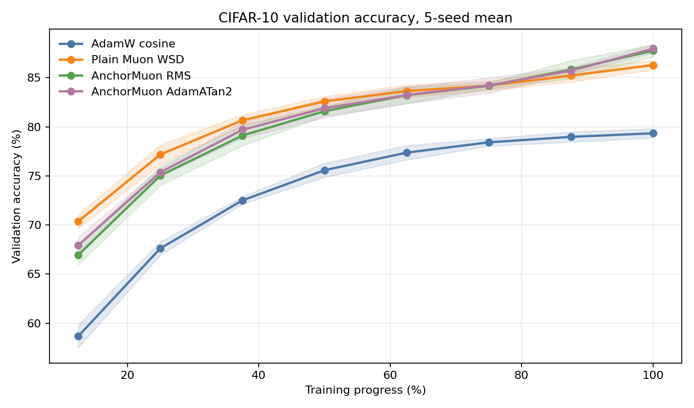

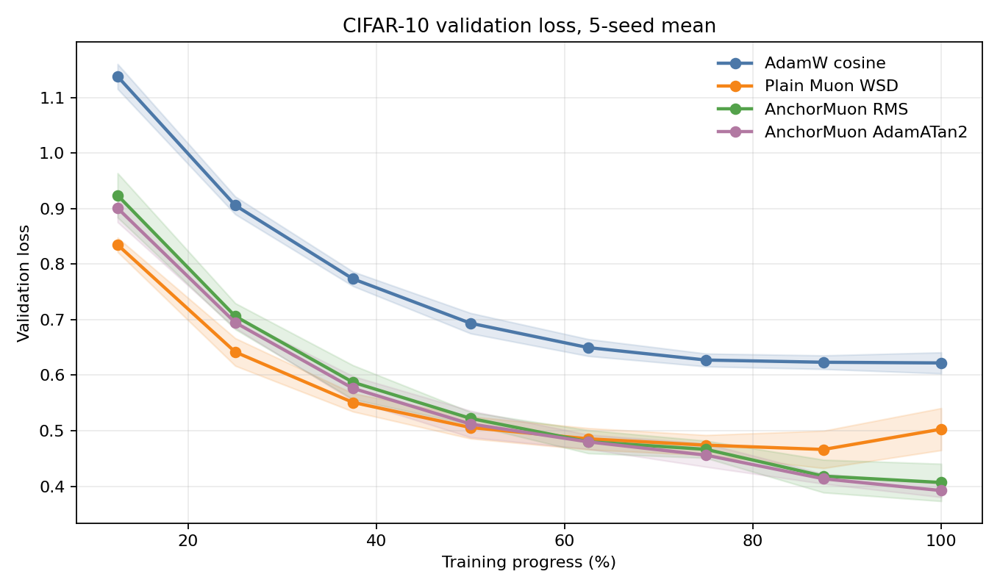

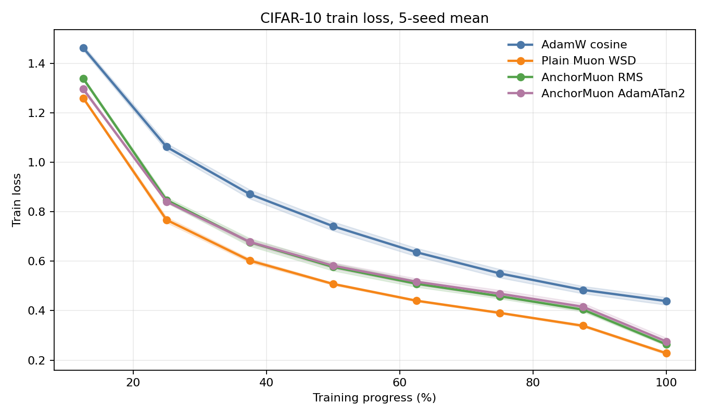

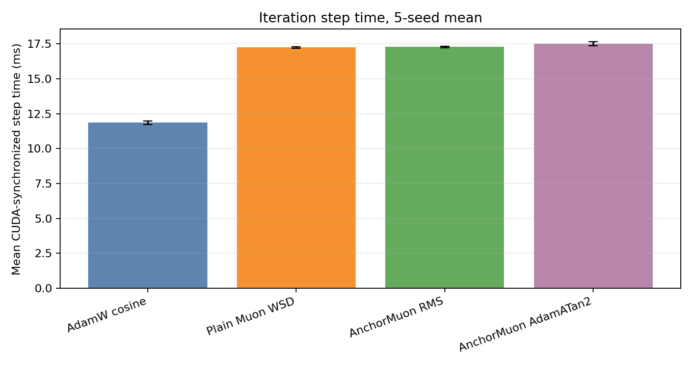

## FineWeb-Edu 50M LLM Longer Run

The better-data language-modeling check uses `HuggingFaceFW/fineweb-edu`,
configuration `sample-10BT`, streamed through Hugging Face datasets and cached
locally as disjoint UTF-8 byte slices. This is a stronger pretraining-style
corpus than WikiText-103. It is still byte-level, not BPE-tokenized, so these
numbers should be read as optimizer-transfer signals rather than standard LM
perplexities.

Protocol: `268,435,456` cached training bytes, `4,194,304` cached validation
bytes, decoder-only GPT with `10` layers, width `640`, `10` heads, context
`128`, byte vocab `256`, `49,424,640` trainable parameters, batch `32 x 128`,
BF16 autocast, WSD schedule with 100-step warmup, 10,000 training steps, 32
validation batches per evaluation point, and two RTX PRO 6000 Blackwell GPUs
scheduled one trial per GPU. AnchorMuon used the harder WikiText-selected
settings directly: `lr=0.0015`, `row_gamma=0.55`,
`soda_lambda_scale=0.01`, and `fallback=AdamATan2@0.5x`.

| Rank | Optimizer | Config | Final val loss | Final byte acc | Step time | Throughput |
|---:|---|---|---:|---:|---:|---:|
| 1 | Plain Muon | `lr=0.0012`, `wd=0.05` | 1.1696 | 64.56% | 16.89 ms | 242.5k byte/s |
| 2 | AnchorMuon | `lr=0.0015`, `row_gamma=0.55`, `soda=0.01`, `fallback=AdamATan2@0.5x` | 1.1791 | 64.34% | 15.11 ms | 271.1k byte/s |
| 3 | AdamW | `lr=0.0003`, `wd=0.05` | 1.1981 | 63.85% | 10.08 ms | 406.5k byte/s |
| 4 | AdamW-Atan2 | `lr=0.0003`, `wd=0.05` | 1.1991 | 63.78% | 10.20 ms | 401.4k byte/s |

Takeaway: better data changes the picture. The WikiText-tuned AnchorMuon
settings transfer well enough to beat AdamW and AdamW-Atan2, and AnchorMuon is
about 11% faster per step than plain Muon, but plain Muon has the best loss on
this longer FineWeb-Edu run. The next useful experiment is FineWeb-specific HPO
for AnchorMuon instead of assuming the WikiText settings are optimal.

Result bundle:
`workers/codex_noradam_confidence/results/finewebedu_llm50m_long_20260529/`.

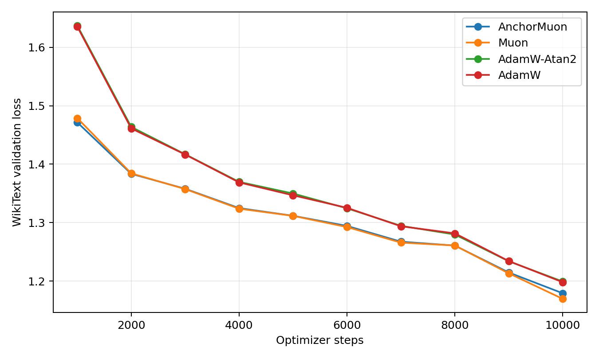

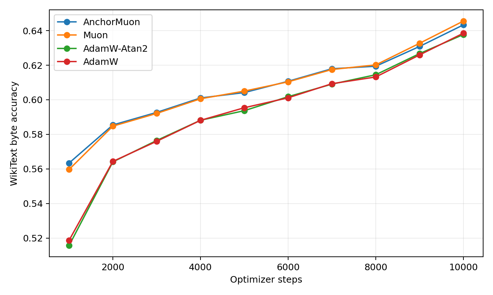

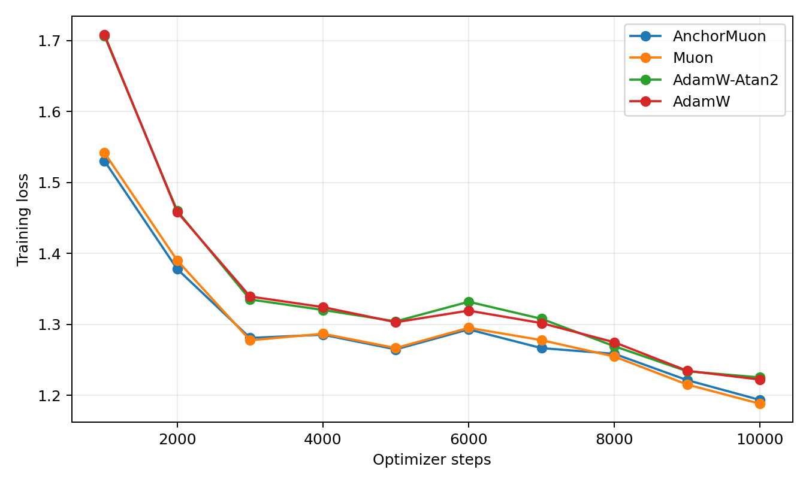

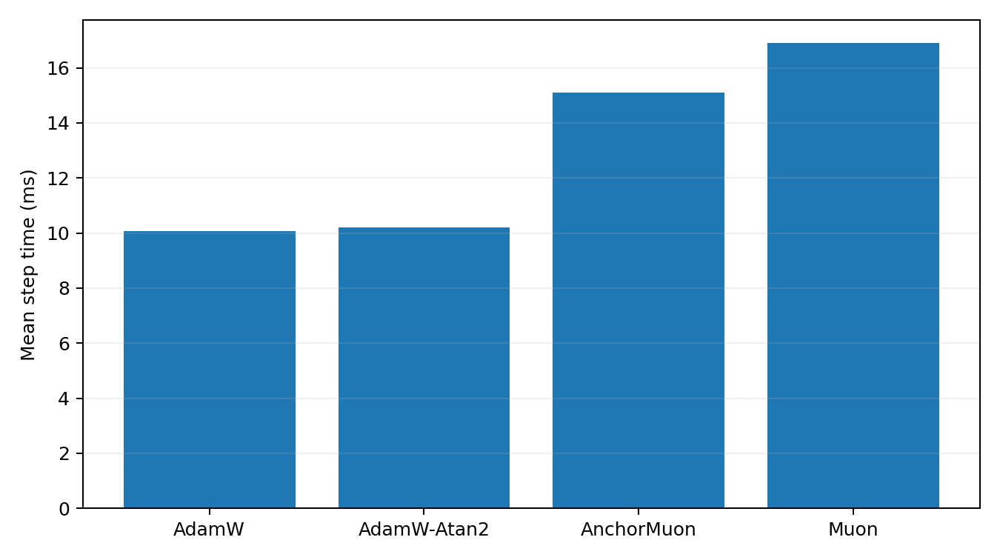

## WikiText-103 50M LLM Byte-Level Check

After the synthetic language-model proxy, I reran the comparison on actual
WikiText-103 raw text. The runner encodes the corpus as UTF-8 bytes, so this is
a real next-byte language-model workload, not a standard BPE/word-level
WikiText perplexity. It is still the better signal for optimizer transfer than
the deterministic synthetic motif stream.

Protocol: `wikitext-103-raw-v1`, `32,000,000` cached training bytes,
`1,148,008` validation bytes, decoder-only GPT with `10` layers, width `640`,
`10` heads, context `128`, byte vocab `256`, `49,424,640` trainable
parameters, batch `32 x 128`, BF16 autocast, WSD schedule with 20-step warmup,
and two RTX PRO 6000 Blackwell GPUs scheduled one trial per GPU. The
benchmark runner scales each optimizer group from its own initial LR, so
AnchorMuon `fallback_lr_mult` is respected.

The harder follow-up ran `213` HPO candidates for `1200` steps each with `16`
validation batches per evaluation point, then replayed the best candidate per
optimizer family for `1600` steps. This is still a bounded single-seed transfer
check, not a final language-modeling claim.

| Rank | Optimizer | Selected config | Final val loss | Final byte acc | Step time | Throughput |
|---:|---|---|---:|---:|---:|---:|
| 1 | AnchorMuon | `lr=0.0015`, `row_gamma=0.55`, `soda_lambda_scale=0.01`, `fallback=AdamATan2@0.5x` | 1.2473 | 63.06% | 15.32 ms | 267.3k byte/s |
| 2 | Plain Muon | `lr=0.0012`, `wd=0.05` | 1.2501 | 62.72% | 16.94 ms | 241.8k byte/s |
| 3 | AdamW-Atan2 | `lr=0.0003`, `wd=0.05` | 1.3552 | 60.03% | 10.42 ms | 392.9k byte/s |
| 4 | AdamW | `lr=0.0003`, `wd=0.05` | 1.3553 | 60.12% | 10.18 ms | 402.5k byte/s |

Takeaway: on real WikiText-103 bytes, tuned AnchorMuon does transfer much
better than the original synthetic proxy suggested. The harder HPO shifted the
LM starting point down to `lr=0.0015`, increased row-gamma to `0.55`, and
reduced SODA to `0.01`. AnchorMuon narrowly beats plain Muon on loss/accuracy
and is about 10% faster per step than plain Muon, while AdamW and AdamW-Atan2
remain materially faster per step but substantially worse in early loss at this
model/batch/step budget.

Result bundle:
`workers/codex_noradam_confidence/results/wikitext103_llm50m_harder_20260529/`.

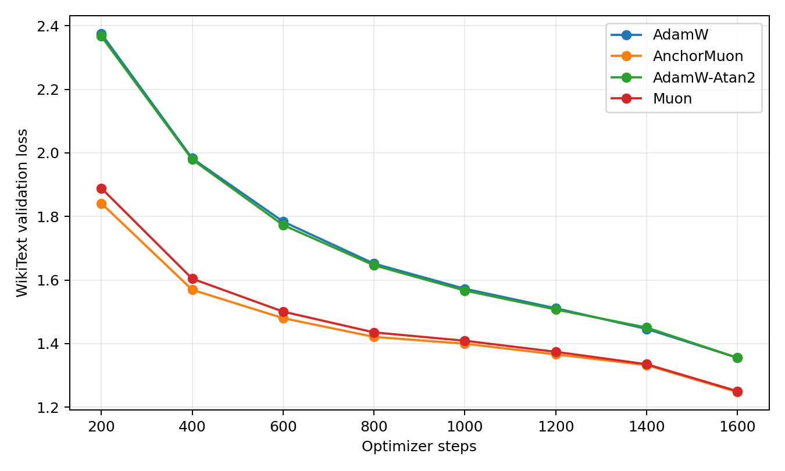

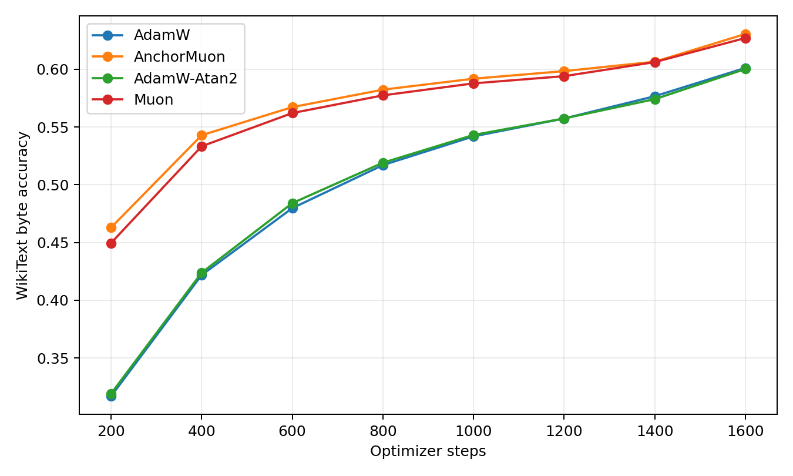

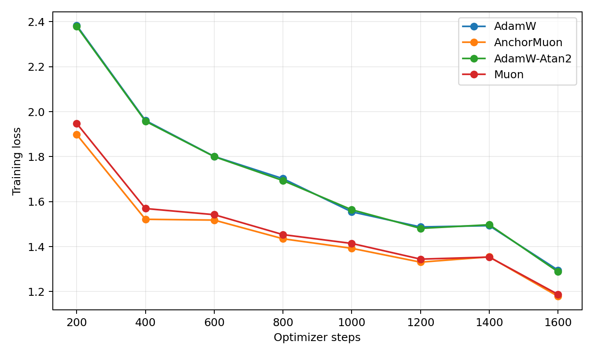


The previous 800-step coarse WikiText pass selected
`lr=0.00175`, `row_gamma=0.45`, `soda_lambda_scale=0.1`, and
`fallback=AdamATan2@0.5x`; it is retained in
`workers/codex_noradam_confidence/results/wikitext103_llm50m_20260529/`.

## Synthetic 50M LLM Proxy

This earlier local language-model proxy is retained only as historical context.
It trained a 51.9M parameter decoder-only GPT on a deterministic repeated-motif
token stream and validated on a held-out stream from the same motif bank. It is
useful as an optimizer smoke/proxy test, but the WikiText-103 result above is
the relevant real-data signal. The benchmark runner has since been fixed to
preserve per-group scheduled learning rates; do not use this older synthetic
table for fallback-LR conclusions.

Protocol: `10` layers, width `640`, `10` heads, context `128`, vocab `4096`,
batch `32 x 128`, BF16 autocast, 2 RTX PRO 6000 Blackwell GPUs with one trial
per GPU. The final reported pass used full-budget tuning: each candidate trained
for `800` steps, then the best run per optimizer family was replayed for another
`800` steps.

| Rank | Optimizer | Selected config | Final val loss | Final val acc | Step time | Throughput |
|---:|---|---|---:|---:|---:|---:|
| 1 | AdamW-Atan2 | `lr=0.0005`, `wd=0.05` | 0.3922 | 92.62% | 10.95 ms | 374.2k tok/s |
| 2 | AdamW | `lr=0.0005`, `wd=0.05` | 0.3924 | 92.58% | 10.78 ms | 380.0k tok/s |
| 3 | Muon | `lr=0.001`, `wd=0.05` | 0.3934 | 92.56% | 17.53 ms | 233.7k tok/s |
| 4 | AnchorMuon | `lr=0.001`, `row_gamma=0.25`, `fallback_lr_mult=0.5` | 0.4123 | 92.44% | 16.03 ms | 255.6k tok/s |

Takeaway: on this synthetic 50M LLM proxy, the CIFAR-winning AnchorMuon recipe
does not transfer as-is. AdamW-Atan2 has the best loss by a tiny margin, AdamW is
essentially tied while fastest, and plain Muon is close on loss but slower.

Result bundle:
`workers/codex_noradam_confidence/results/synthetic_llm50m_20260529/`.


The previous single-seed AdamATan2/AdamC fallback comparison is retained below
as historical context; its Atan2 win did not separate cleanly under the 5-seed
confirmation.

| Historical recipe | Schedule | Official test acc | Official test loss | Final val acc | Final val loss | Best val acc | Best val loss | Step time | Examples/sec |
|---|---|---:|---:|---:|---:|---:|---:|---:|---:|
| AnchorMuon + AdamATan2 fallback | WSD | 88.10% | 0.3996 | 88.52% | 0.3782 | 88.52% | 0.3782 | 17.51 ms | 29.2k |
| AnchorMuon RMS fallback, same-run control | WSD | 87.13% | 0.4405 | 88.00% | 0.4118 | 88.00% | 0.3856 | 16.07 ms | 31.9k |
| AnchorMuon + AdamC fallback | WSD | 87.24% | 0.4231 | 87.94% | 0.4164 | 87.94% | 0.4088 | 17.53 ms | 29.2k |
| AnchorMuon RMS fallback, previous schedule sweep | WSD | 87.67% | 0.4111 | 88.36% | 0.4005 | 88.36% | 0.3716 | 16.23 ms | 31.5k |
| AdamW baseline | cosine | 79.55% | 0.6240 | 79.62% | 0.6133 | 79.64% | 0.5998 | 11.39 ms | 45.0k |

The fallback comparison used CUDA-synchronized step timing, so its speed numbers
are most directly comparable to this latest confirmation. Older schedule-sweep
rows used CPU-launch timing.

Earlier schedule-sweep HPO selected `lr=0.012` for every AnchorMuon schedule:

| Schedule | Best 12-epoch HPO trial | LR | 12-epoch val loss | 12-epoch val acc | Step time |
|---|---|---:|---:|---:|---:|
| constant | `root_named_constant_lr0.012_rg0.35_pb0.9_nb0.93` | 0.012 | 0.6865 | 75.36% | 16.94 ms |
| cosine | `root_named_cosine_lr0.012_rg0.35_pb0.9_nb0.93` | 0.012 | 0.5946 | 79.30% | 17.09 ms |
| linear | `root_named_linear_lr0.012_rg0.35_pb0.9_nb0.93` | 0.012 | 0.5820 | 79.46% | 16.86 ms |
| WSD | `root_named_wsd_lr0.012_rg0.35_pb0.9_nb0.93` | 0.012 | 0.5632 | 80.08% | 16.06 ms |
| AdamW baseline | `adamw_cosine_lr0.004_wd0.001` | 0.004 | 0.9095 | 67.56% | 11.04 ms |

Result bundle:
`workers/codex_noradam_confidence/results/root_lr_schedule_sweep_20260529/`.
The final 50-epoch schedule-winner plots are in
`final50_schedule_winners/val_loss.png`, `val_acc.png`, and
`step_time_ms_bar.png`.

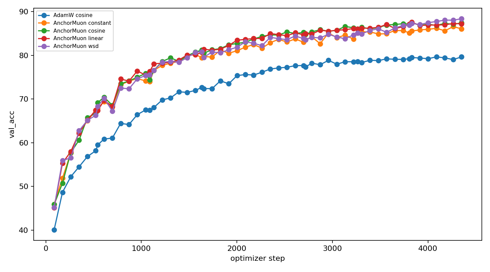

Fallback-mode follow-up:
`workers/codex_noradam_confidence/results/fallback_modes_cifar10_20260529/`.
This run did 12-epoch HPO for AdamATan2 and AdamC fallback modes, then replayed
the best run per fallback family for 50 epochs.

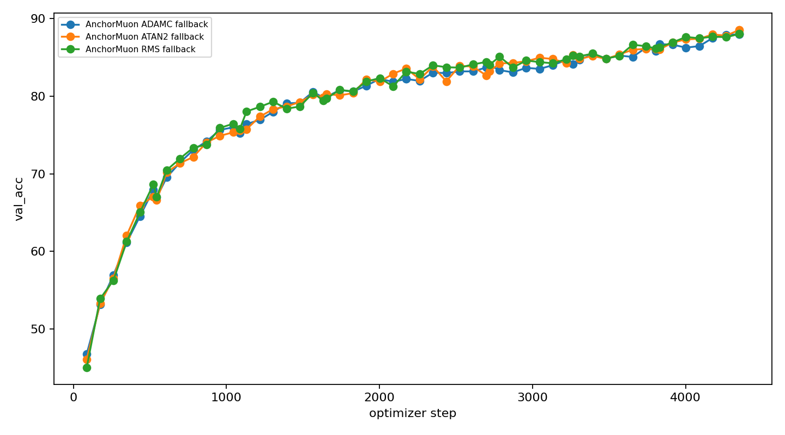

**Component-removal ablation note:** worker-research ablations tuned
component-removal families for 12 epochs, then replayed selected winners for 50
epochs on the same ViT-5 micro CIFAR-10 split. This was motivated by the fact
that SODA-like anchor effects can appear late. In the first single-seed run, the
no-SODA family won the 12-epoch HPO selector but fell behind by 50 epochs,
losing 0.69 official test points versus the full worker recipe. GramNS remained
essential; removing it lost 4.39 official test points versus the full worker
recipe.

A follow-up three-seed replay compared the close variants: full, `-PMuonEq`,
and `-NorMuon`. Full had the best mean official test accuracy, but only by a
small margin over `-PMuonEq`, while `-PMuonEq` was materially faster. This makes
PMuonEq questionable on value-for-speed in this worker harness, but not a clear
quality regression.

| Worker ablation | Official test acc | Best val acc | Step time | Examples/sec | Takeaway |
|---|---:|---:|---:|---:|---|
| AnchorMuon full | 84.94% +/- 0.10 | 85.95% +/- 0.02 | 20.06 ms | 25.5k | Best mean quality; PMuonEq gain is tiny. |
| AnchorMuon -PMuonEq | 84.83% +/- 0.37 | 85.80% +/- 0.44 | 18.04 ms | 28.4k | Nearly tied quality and about 11% faster. |
| AnchorMuon -NorMuon | 84.54% +/- 0.63 | 85.52% +/- 0.49 | 18.92 ms | 27.1k | Worse mean quality; NorMuon still looks useful. |

Full multi-seed report:
`workers/codex_noradam_confidence/results/component_ablation_multiseed_20260529/summary.md`.

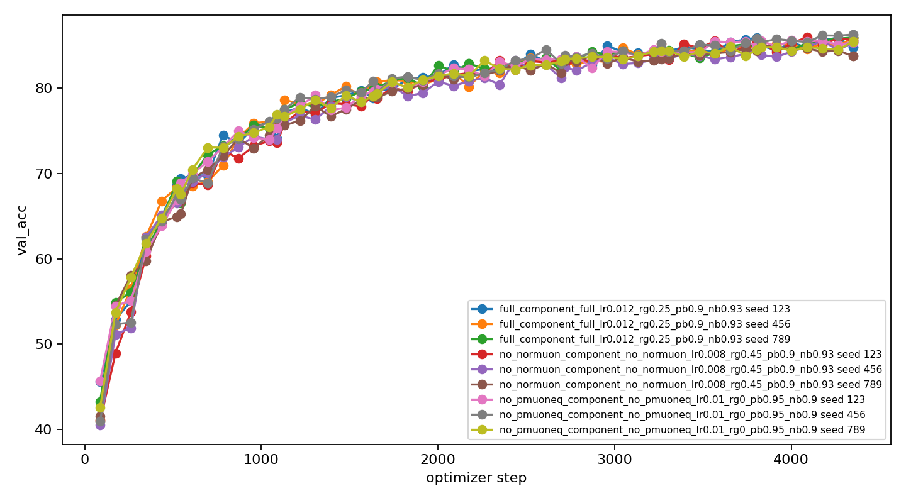

Earlier single-seed component-removal table:

| Worker ablation | Official test acc | Best val acc | Step time | Takeaway |
|---|---:|---:|---:|---|
| AnchorMuon -PMuonEq | 85.28% | 86.04% | 18.52 ms | Best single-seed worker replay; needs multi-seed/root validation before changing the shippable default. |
| AnchorMuon -NorMuon | 84.99% | 85.98% | 18.90 ms | Very close; best validation loss in this ablation. |
| AnchorMuon full | 84.88% | 85.96% | 20.16 ms | Reference worker recipe. |
| AnchorMuon -SODA | 84.19% | 84.70% | 18.66 ms | Looked better at 12 epochs, worse at 50 epochs. |
| AnchorMuon -GramNS | 80.49% | 80.40% | 16.59 ms | Faster, but large quality loss. |
| AdamW baseline | 79.55% | 79.64% | 11.56 ms | Fast per step, much worse accuracy. |

This ablation does not supersede the root `optimizer.py` recommendation above:
it uses the worker research optimizer path. It does set the next validation
target: replay the PMuonEq question through root `optimizer.py` before changing
the standalone default. Full single-seed report:
`workers/codex_noradam_confidence/results/component_ablation_50e_20260529/summary.md`.

**Previous three-seed direct root validation:** same ViT-5 micro CIFAR-10 split
and official test protocol, but using the earlier constant-LR direct root
recipe at `lr=8e-3` over seeds `123,456,789`.

| Recipe | Official test acc | Official test loss | Final val acc | Final val loss | Best val acc | Best val loss | Step time | Examples/sec |
|---|---:|---:|---:|---:|---:|---:|---:|---:|
| Root `optimizer.py` default | 84.94% | 0.4501 | 85.72% | 0.4286 | 86.03% | 0.4129 | 16.57 ms | 30.9k |

The strongest multi-seed evidence lives in `workers/codex_noradam_confidence`
and used the same core recipe in the research runner. That package is useful
for confidence intervals and ablation context:

| Recipe | Official test acc | Official test loss | Final val acc | Final val loss | Step time |
|---|---:|---:|---:|---:|---:|
| AnchorMuon + SODA + PMuonEq + GramNS + NorMuon | 84.77% +/- 0.65 | 0.4607 +/- 0.0196 | 84.97% +/- 0.35 | 0.4414 +/- 0.0228 | 19.95 ms |
| AnchorMuon + NorMuon + aspect scale | 84.55% +/- 0.40 | 0.4595 +/- 0.0074 | 85.25% +/- 0.32 | 0.4445 +/- 0.0130 | 19.92 ms |
| AdamW cosine baseline | 79.28% +/- 0.23 | 0.6338 +/- 0.0125 | 79.69% +/- 0.22 | 0.6180 +/- 0.0043 | 11.59 ms |

Use `workers/codex_noradam_confidence/ALGORITHM_RESULTS.md` for the full
self-contained algorithm description, hyperparameters, protocol, and caveats.
The runner also exposes a `--preset best_cifar10` preset containing the winning
configuration, the closest aspect-scaled near miss, and the AdamW baseline.

## Standalone Optimizer

The root [`optimizer.py`](optimizer.py) is the shippable single-file optimizer
for reuse in other projects. It exposes:

```python
from optimizer import AnchorMuon

optimizer = AnchorMuon(model)
print(optimizer.group_summary())
```

The root file implements only the focused winner: SODA anchor updates,
row-only PMuonEq, Gram Newton-Schulz, and NorMuon. It intentionally does not
include AMUSE, MiMuon, full PMuon, column PMuonEq, or aspect-scaling ablations.
The direct validation above used the normal public API, not a trainer-side
adapter. The param-group builder remains available for advanced custom routing,
but normal training code should not need to construct optimizer groups by hand.
Routing is based on effective tensor shape only: tensors with at least two
non-singleton dimensions go through the matrix path, and scalar/vector tensors
go through the fallback path. Names are retained only for `group_summary()` and
diagnostics. Sparse gradients are not supported; use dense embeddings or a
separate sparse optimizer for those parameters.

Trainer integration should be boring:

```python
optimizer = AnchorMuon(
    model,
    lr=8e-3,
    fallback_lr=None,  # defaults to lr
    fallback_mode="atan2",
    row_gamma=0.35,
    normuon_beta2=0.93,
)

# Learning-rate schedules live in the trainer, not inside AnchorMuon.
for group in optimizer.param_groups:
    group["lr"] = scheduled_lr
```

Do not scale gradients, override the matrix grouping to reproduce old ablation
paths, or subclass the optimizer for aspect/column-gamma behavior when testing
the root file. Those are research ablations, not the shippable root optimizer.

### Default Hyperparameters

The constructor defaults are the recommended starting recipe from the current
experiments:

| Parameter | Default | Start by tuning? | Notes |
|---|---:|---|---|
| `lr` | `8e-3` | Yes | Conservative starting LR consumed from the param group. For this ViT-5 CIFAR-10 harness, the latest 12-epoch HPO selected `0.014` for AdamATan2-fallback AnchorMuon with WSD. |
| `row_gamma` | `0.35` | Yes | Row-only PMuonEq scaling strength before GramNS. Try `0.25`, `0.35`, `0.45`. |
| `fallback_lr` | same as `lr` | Later | LR for scalar/vector/fallback tensors. Leave as `None` first. |
| `fallback_mode` | `"atan2"` | Later | Scalar/vector fallback update. AdamATan2 had the best mean validation loss/accuracy in the latest 5-seed CIFAR-10 replay and was tied with RMS within seed variance on official test accuracy. |
| `normuon_beta2` | `0.93` | Later | Row second-moment smoothing after GramNS. Try `0.90`, `0.93`, `0.95`. |
| `min_matrix_dim` | `2` | Rarely | Keeps tiny effective matrices out of the spectral path. |
| `momentum` | `0.95` | Usually no | Momentum for the matrix source update. |
| `pmuoneq_beta` | `0.90` | Usually no | EMA for row gradient-power estimates. |
| `fallback_betas` | `(0.9, 0.95)` | Usually no | Fallback moments. Both values are used by `"atan2"` and `"adamc"`; the first value is ignored by `"rms"`. |
| `fallback_weight_decay` | `0.0` | Usually no | Optional AdamC-style `lr^2 * weight_decay` decay for fallback tensors only. Leave at zero unless specifically testing AdamC decay. |
| `soda_lambda_scale`, `soda_lambda_power` | `1.0`, `1.0` | Usually no | SODA anchor schedule; changing this changes the regularizer. |
| `eps` values and `ns_compute_dtype` | internal defaults | No | Numerical and profiling knobs. |

The optimizer no longer has `matrix_lr`, `warmup_steps`, `base_lr`, or
`use_external_lr` knobs. Warmup, WSD, linear decay, cosine decay, and constant
LR are standard trainer-side schedules that update each param group's `lr`.

Practical tuning order: start with the defaults, tune `lr` and the trainer-side
schedule first, then tune `row_gamma`. In the latest schedule study, the useful
workflow was 12-epoch HPO over constant/cosine/linear/WSD schedules and LR
candidates, followed by a 50-epoch replay of the best config per schedule.
Only revisit `fallback_lr`/`fallback_mode`/`normuon_beta2` if the result is
close. On this CIFAR-10 harness, a 5-seed follow-up found
`fallback_mode="atan2"`, `lr=0.014`, and `fallback_lr=0.007` slightly improved
mean final validation accuracy/loss, while RMS fallback at `lr=0.012` slightly
improved mean official test accuracy. The default now follows the lower
validation-loss AdamATan2 recipe; use RMS as the fallback-path control if a new
workload is noisy or unstable.

## References

- SODA anchor regularization: [Optimistic Dual Averaging Unifies Modern Optimizers](https://arxiv.org/abs/2605.11172). AnchorMuon uses this as an always-on initialization-anchor pull instead of ordinary weight decay.
- Gram Newton-Schulz / polar update: [Dao-AILab gram-newton-schulz reference implementation](https://github.com/Dao-AILab/gram-newton-schulz/blob/main/gram_newton_schulz/gram_newton_schulz.py). AnchorMuon uses this family for matrix orthogonalization.
- NorMuon / HTMuon lineage: [HTMuon: Improving Muon via Heavy-Tailed Spectral Correction](https://arxiv.org/abs/2603.10067) and the [HTMuon reference code](https://github.com/TDCSZ327/HTmuon). AnchorMuon uses the post-Gram row-normalization idea, not the full HTMuon optimizer.
- PMuon lineage: the [PMuon track-3 implementation notes](https://github.com/zzp1012/modded-nanogpt/tree/pmuon-track3-3225/records/track_3_optimization/results/20260507_pmuon) motivated the pre-polar preconditioning idea. AnchorMuon implements only a cheap row-only PMuonEq approximation, not dense two-sided PMuon.
- WSD schedule context: [Understanding Warmup-Stable-Decay Learning Rates](https://arxiv.org/abs/2410.05192). WSD is implemented in the training harness, not in `optimizer.py`.
- AdamATan2 fallback context: [Scaling Exponents Across Parameterizations and Optimizers](https://arxiv.org/abs/2407.05872) by Everett et al. introduces the Adam-atan2 code change in Appendix C.5, replacing Adam's unbounded `m / sqrt(v)` update with `atan2(m, sqrt(v))` to reduce epsilon sensitivity. AnchorMuon uses this as the default only after matrix-direction construction and only on fallback tensors.
- AdamC fallback context: the optional fallback mode follows the AdamC-style
  vector update and supports `lr^2 * weight_decay` fallback decay. The default
  keeps this decay at zero so SODA remains the primary regularizer.
