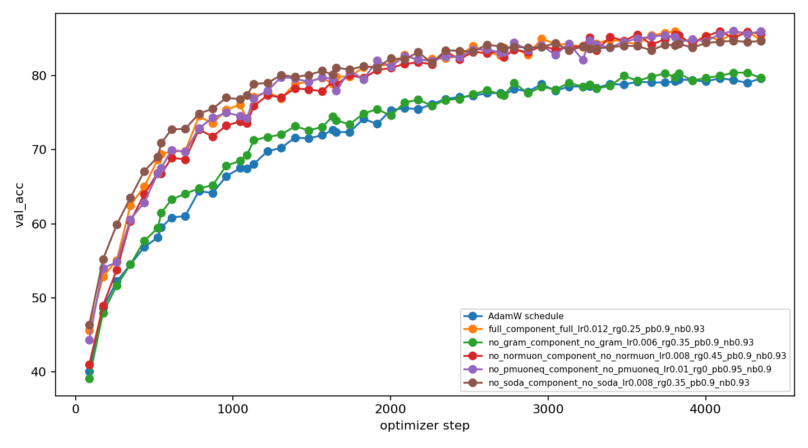
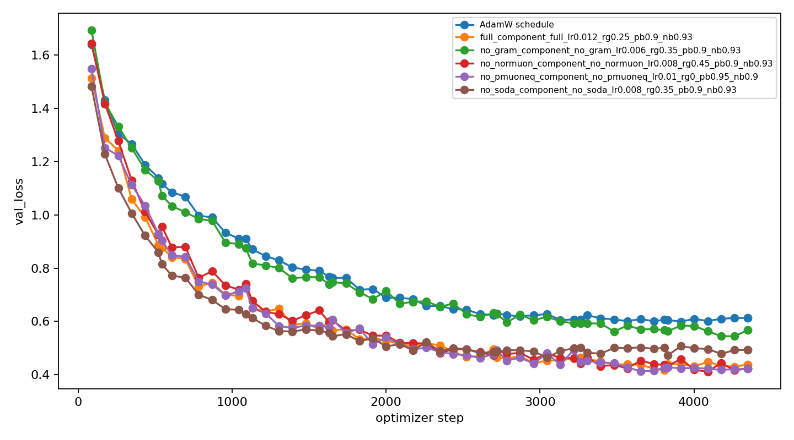
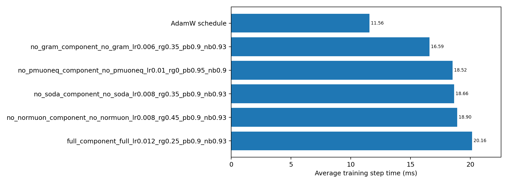

# AnchorMuon Component Ablation - 12e HPO + 50e Replay

Protocol: `vit5_micro` on CIFAR-10 with a deterministic 45k train / 5k validation split from the official training set, official 10k test evaluated only at the end of each selected 50-epoch replay, seed `123`, batch size 512, BF16 autocast, channels-last tensors, 16 dataloader workers, and two RTX PRO 6000 Blackwell GPUs scheduled one trial per GPU. The trainer used 80-step warmup plus WSD for AnchorMuon-family runs and cosine for AdamW.

The goal was to tune each component-removal family briefly, then replay the family winners for 50 epochs because SODA-like effects can appear late.

## 12-Epoch HPO Winners

| Family | HPO winner | 12e best val acc | 12e best val loss | Throughput |
|---|---|---:|---:|---:|
| AdamW baseline | `component_adamw_lr0.004_wd0.001` | 67.56% | 0.9095 | 42.2k ex/s |
| AnchorMuon full | `component_full_lr0.012_rg0.25_pb0.9_nb0.93` | 76.08% | 0.6967 | 25.3k ex/s |
| AnchorMuon -SODA | `component_no_soda_lr0.008_rg0.35_pb0.9_nb0.93` | 77.84% | 0.6213 | 25.5k ex/s |
| AnchorMuon -PMuonEq | `component_no_pmuoneq_lr0.01_rg0_pb0.95_nb0.9` | 76.26% | 0.6783 | 27.1k ex/s |
| AnchorMuon -GramNS | `component_no_gram_lr0.006_rg0.35_pb0.9_nb0.93` | 68.48% | 0.8908 | 29.6k ex/s |
| AnchorMuon -NorMuon | `component_no_normuon_lr0.008_rg0.45_pb0.9_nb0.93` | 75.24% | 0.7127 | 28.2k ex/s |

Short HPO preferred `-SODA`, but the 50-epoch replay did not: the no-SODA run overfit more and finished below the full recipe on validation and test. This is the main reason not to judge the SODA ablation from short runs only.

## 50-Epoch Replay

| Rank | Run | HPO-selected config | Final val loss | Best val loss | Final val acc | Best val acc | Test loss | Test acc | Step | Throughput |
|---:|---|---|---:|---:|---:|---:|---:|---:|---:|---:|
| 1 | AnchorMuon -PMuonEq | `no_pmuoneq_component_no_pmuoneq_lr0.01_rg0_pb0.95_nb0.9` | 0.4225 | 0.4129 | 85.98% | 86.04% | 0.4395 | 85.28% | 18.52 ms | 27.7k ex/s |
| 2 | AnchorMuon -NorMuon | `no_normuon_component_no_normuon_lr0.008_rg0.45_pb0.9_nb0.93` | 0.4237 | 0.4116 | 85.64% | 85.98% | 0.4460 | 84.99% | 18.90 ms | 27.1k ex/s |
| 3 | AnchorMuon full | `full_component_full_lr0.012_rg0.25_pb0.9_nb0.93` | 0.4385 | 0.4165 | 84.82% | 85.96% | 0.4451 | 84.88% | 20.16 ms | 25.4k ex/s |
| 4 | AnchorMuon -SODA | `no_soda_component_no_soda_lr0.008_rg0.35_pb0.9_nb0.93` | 0.4934 | 0.4648 | 84.66% | 84.70% | 0.5203 | 84.19% | 18.66 ms | 27.4k ex/s |
| 5 | AnchorMuon -GramNS | `no_gram_component_no_gram_lr0.006_rg0.35_pb0.9_nb0.93` | 0.5680 | 0.5444 | 79.66% | 80.40% | 0.5663 | 80.49% | 16.59 ms | 30.9k ex/s |
| 6 | AdamW baseline | `adamw_component_adamw_lr0.004_wd0.001` | 0.6133 | 0.5998 | 79.62% | 79.64% | 0.6240 | 79.55% | 11.56 ms | 44.3k ex/s |

Deltas versus the full tuned AnchorMuon replay:

| Run | Test acc delta | Best val acc delta | Interpretation |
|---|---:|---:|---|
| AnchorMuon -PMuonEq | +0.40 pp | +0.08 pp | Best single-seed result here; PMuonEq was not helpful in this ViT-5/CIFAR-10 replay. |
| AnchorMuon -NorMuon | +0.11 pp | +0.02 pp | Essentially tied with `-PMuonEq` on validation loss, slightly lower official test accuracy. |
| AnchorMuon full | +0.00 pp | +0.00 pp | Reference recipe selected from the family HPO. |
| AnchorMuon -SODA | -0.69 pp | -1.26 pp | Short-HPO winner, but worse at 50 epochs; SODA appears useful over the longer horizon. |
| AnchorMuon -GramNS | -4.39 pp | -5.56 pp | Large quality drop despite faster steps; GramNS is a core contributor. |
| AdamW baseline | -5.33 pp | -6.32 pp | Fastest per step, but much worse loss/accuracy. |

## Plots

## Conclusion

- Best single-seed 50-epoch replay: **AnchorMuon -PMuonEq** (`soda=all`, `pmuon_eq=False`, `use_gram=True`, `normuon=True`, `lr=0.01`, `pmuon_beta=0.95`, `normuon_beta=0.90`, WSD). It reached 86.04% best validation accuracy and 85.28% official test accuracy.
- Closest variant: **AnchorMuon -NorMuon**, with the best validation loss (0.4116) but slightly lower official test accuracy (84.99%).
- SODA should not be removed based on short HPO: the no-SODA family won at 12 epochs but fell behind by 50 epochs and lost 0.69 test points versus full AnchorMuon.
- GramNS is clearly important: removing it costs 4.39 official-test points versus full AnchorMuon even after LR tuning, although it is faster per step.
- Because this is single-seed and uses the worker research optimizer, the next validation step is a multi-seed replay of full vs `-PMuonEq` vs `-NorMuon`, then a root `optimizer.py` validation before changing the shippable default.

