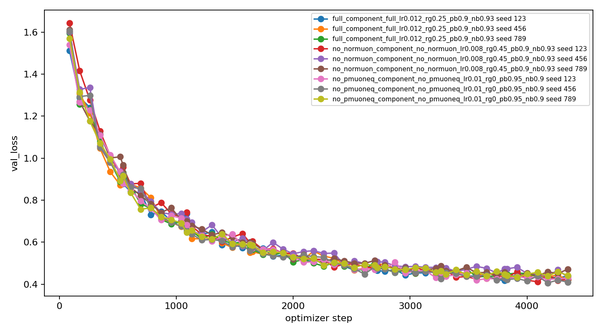
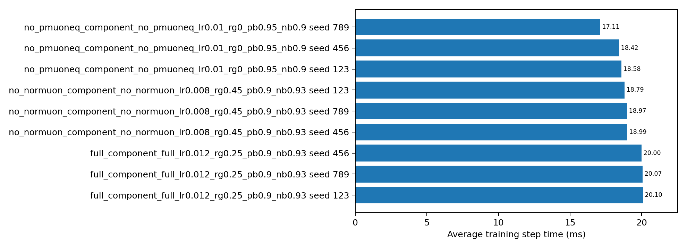

# AnchorMuon PMuonEq Multi-Seed Check

Protocol: `vit5_micro` on CIFAR-10 with a deterministic 45k train / 5k
validation split from the official training set, official 10k test evaluated
only at the end, batch size 512, BF16 autocast, channels-last tensors, 16
dataloader workers, and two RTX PRO 6000 Blackwell GPUs scheduled one trial per
GPU. Each family used the 12-epoch HPO winner from
`component_ablation_50e_20260529/hpo/best_by_family.json`, then ran a 50-epoch
replay over seeds `123,456,789`.

Command:

```bash
/home/catid/screen/.venv/bin/python workers/codex_noradam_confidence/experiments/run_cifar10_ablation.py \
  --preset component_ablation \
  --final-from-hpo workers/codex_noradam_confidence/results/component_ablation_50e_20260529/hpo/best_by_family.json \
  --only 'component_(full|no_pmuoneq|no_normuon)' \
  --seeds 123,456,789 \
  --final-epochs 50 \
  --eval-bins 8 \
  --train-subset 45000 \
  --val-source train_split \
  --train-val-size 5000 \
  --val-subset 5000 \
  --eval-test \
  --batch-size 512 \
  --num-workers 16 \
  --warmup-steps 80 \
  --lr-final-scale 0.1 \
  --wsd-decay-frac 0.2 \
  --output-dir workers/codex_noradam_confidence/results/component_ablation_multiseed_20260529 \
  --no-sync-step-timing
```

## Aggregate Results

Mean +/- sample standard deviation across three seeds:

| Family | HPO-selected config | Test acc | Test loss | Best val acc | Best val loss | Final val acc | Final val loss | Step | Throughput |
|---|---|---:|---:|---:|---:|---:|---:|---:|---:|
| AnchorMuon full | `lr=0.012,row_gamma=0.25,pmuon_beta=0.90,normuon_beta=0.93` | 84.94% +/- 0.10 | 0.4488 +/- 0.0117 | 85.95% +/- 0.02 | 0.4186 +/- 0.0019 | 85.57% +/- 0.65 | 0.4259 +/- 0.0109 | 20.06 ms +/- 0.05 | 25.5k +/- 0.1k ex/s |
| AnchorMuon -PMuonEq | `lr=0.010,pmuon_beta=0.95,normuon_beta=0.90` | 84.83% +/- 0.37 | 0.4508 +/- 0.0179 | 85.80% +/- 0.44 | 0.4193 +/- 0.0138 | 85.73% +/- 0.50 | 0.4264 +/- 0.0162 | 18.04 ms +/- 0.81 | 28.4k +/- 1.3k ex/s |
| AnchorMuon -NorMuon | `lr=0.008,row_gamma=0.45,pmuon_beta=0.90` | 84.54% +/- 0.63 | 0.4620 +/- 0.0268 | 85.52% +/- 0.49 | 0.4265 +/- 0.0130 | 84.92% +/- 1.00 | 0.4425 +/- 0.0256 | 18.92 ms +/- 0.11 | 27.1k +/- 0.2k ex/s |

## Per-Seed Test Accuracy

| Seed | Full | -PMuonEq | -NorMuon |
|---:|---:|---:|---:|
| 123 | 84.88% | 84.83% | 84.99% |
| 456 | 84.88% | 85.19% | 84.80% |
| 789 | 85.05% | 84.46% | 83.82% |

## Interpretation

- The multi-seed result does **not** confirm the single-seed impression that
  removing PMuonEq is a quality win. Full AnchorMuon is slightly ahead on mean
  official test accuracy and best validation loss.
- The PMuonEq quality edge is tiny: about +0.11 official-test percentage points
  over `-PMuonEq`, well inside the observed seed variation. It is not strong
  evidence that PMuonEq is worth keeping for this ViT-5/CIFAR-10 setting.
- The speed cost is real. `-PMuonEq` is roughly 11% faster by examples/sec and
  roughly 10% faster by step time in this worker harness.
- Removing NorMuon is worse on average than both full and `-PMuonEq`, so NorMuon
  still looks more useful than PMuonEq here.

Practical conclusion: keep the current root default unchanged until root
`optimizer.py` is validated directly, but treat PMuonEq as a questionable part
of the recipe. For speed-sensitive follow-up runs, `SODA + GramNS + NorMuon`
without PMuonEq is a credible candidate. For maximum quality, the full recipe
is still the best mean result from this multi-seed worker replay.

## Plots






