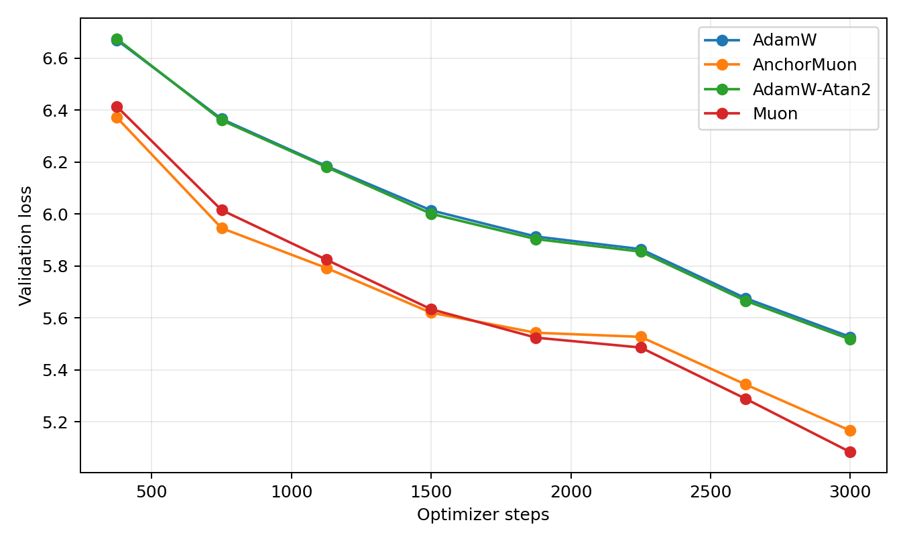
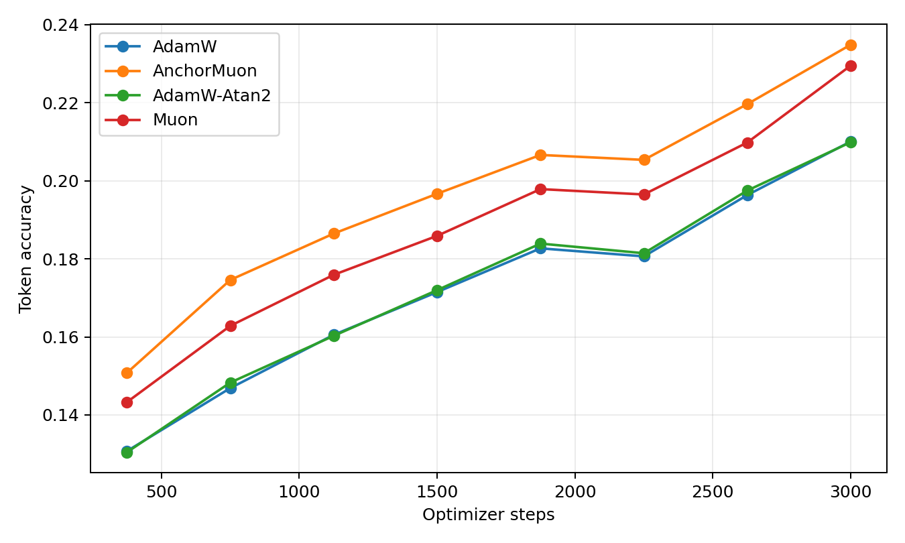
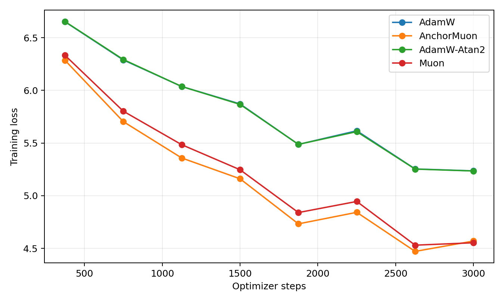
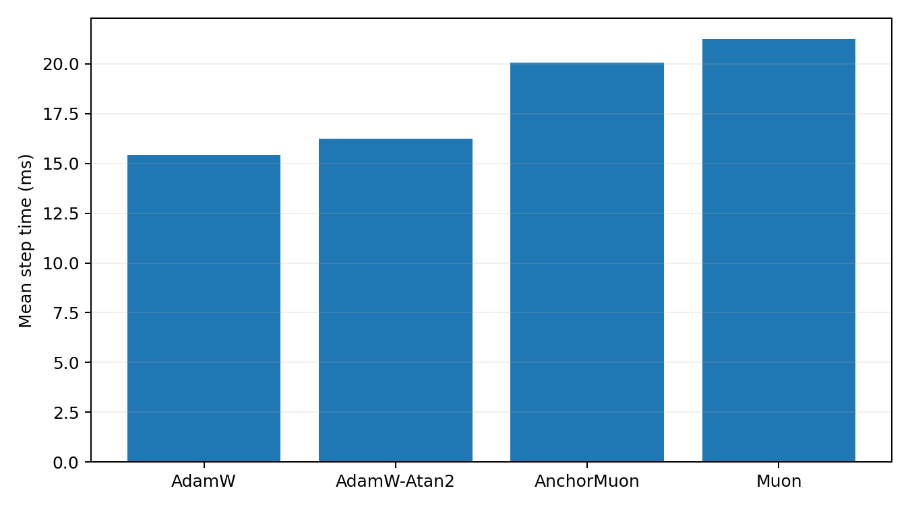
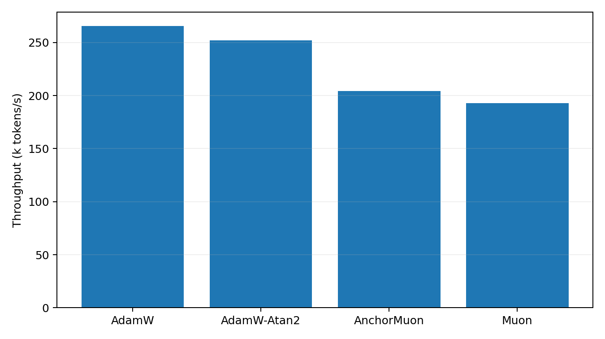

# Tokenized 50M LLM Optimizer Comparison

This benchmark uses real text tokenized with the Hugging Face `gpt2` tokenizer. It is the preferred language-model optimizer transfer check because embeddings, output head, and sequence statistics are closer to a normal BPE/SentencePiece pretraining setup than the older byte-level path.

## Setup

- Dataset: `HuggingFaceFW/fineweb-edu/sample-10BT:train [gpt2]`
- Tokenizer: `gpt2`
- Train tokens cached: 8,000,000
- Validation tokens cached: 524,288
- Model: decoder-only GPT, layers=8, width=512, heads=8, context=256, vocab=50,257
- Trainable parameters: 51045888
- Batch: 16 sequences x 256 tokens
- HPO: 600 steps per candidate, selected by best validation loss
- Final replay: 3000 steps per selected optimizer
- Validation estimate: 16 random batches per evaluation point
- GPUs: 2 visible, one trial per GPU

## Final Results

| Rank | Optimizer | Selected config | Final val loss | Best val loss | Final token acc | Step time | Throughput |
|---:|---|---|---:|---:|---:|---:|---:|
| 1 | Muon | lr=0.0014, wd=0.05 | 5.0843 | 5.0843 | 22.95% | 21.23 ms | 193.0k tok/s |
| 2 | AnchorMuon | lr=0.0014, wd=0.05, row_gamma=0.45, pmuon_beta=0.9, normuon_beta2=0.93, fallback=rms@1x, soda=0.003 | 5.1667 | 5.1667 | 23.49% | 20.06 ms | 204.2k tok/s |
| 3 | AdamW-Atan2 | lr=0.0005, wd=0.05 | 5.5179 | 5.5179 | 20.99% | 16.24 ms | 252.2k tok/s |
| 4 | AdamW | lr=0.0005, wd=0.05 | 5.5275 | 5.5275 | 21.01% | 15.43 ms | 265.4k tok/s |

## Plots

## HPO Candidates

| Family | Trial | LR | Best val loss | Final val loss | Step time |
|---|---|---:|---:|---:|---:|
| adamatan2 | `tok_adamatan2_lr0.0005` | 0.0005 | 6.4013 | 6.4013 | 16.25 ms |
| adamatan2 | `tok_adamatan2_lr0.0004` | 0.0004 | 6.4157 | 6.4157 | 16.22 ms |
| adamatan2 | `tok_adamatan2_lr0.0003` | 0.0003 | 6.4539 | 6.4539 | 16.19 ms |
| adamatan2 | `tok_adamatan2_lr0.0002` | 0.0002 | 6.5257 | 6.5257 | 16.15 ms |
| adamw | `tok_adamw_lr0.0005` | 0.0005 | 6.3984 | 6.3984 | 15.48 ms |
| adamw | `tok_adamw_lr0.0004` | 0.0004 | 6.4126 | 6.4126 | 15.46 ms |
| adamw | `tok_adamw_lr0.0003` | 0.0003 | 6.4478 | 6.4478 | 15.43 ms |
| adamw | `tok_adamw_lr0.0002` | 0.0002 | 6.5158 | 6.5158 | 15.40 ms |
| anchormuon | `tok_anchor_lr0.0014_rg0.45_soda0.003_flr1_rms` | 0.0014 | 5.9948 | 5.9948 | 20.45 ms |
| anchormuon | `tok_anchor_lr0.0014_rg0.55_soda0.001_flr1_rms` | 0.0014 | 5.9953 | 5.9953 | 20.49 ms |
| anchormuon | `tok_anchor_lr0.0014_rg0.45_soda0.001_flr1_rms` | 0.0014 | 5.9954 | 5.9954 | 20.47 ms |
| anchormuon | `tok_anchor_lr0.0014_rg0.55_soda0.003_flr1_rms` | 0.0014 | 5.9954 | 5.9954 | 20.52 ms |
| anchormuon | `tok_anchor_lr0.0014_rg0.55_soda0.01_flr1_rms` | 0.0014 | 5.9955 | 5.9955 | 20.44 ms |
| anchormuon | `tok_anchor_lr0.0014_rg0.45_soda0.01_flr1_rms` | 0.0014 | 5.9955 | 5.9955 | 20.58 ms |
| anchormuon | `tok_anchor_lr0.0014_rg0.25_soda0.003_flr1_rms` | 0.0014 | 5.9972 | 5.9972 | 20.46 ms |
| anchormuon | `tok_anchor_lr0.0014_rg0.25_soda0.01_flr1_rms` | 0.0014 | 5.9974 | 5.9974 | 20.45 ms |
| anchormuon | `tok_anchor_lr0.0014_rg0.25_soda0.001_flr1_rms` | 0.0014 | 5.9976 | 5.9976 | 20.47 ms |
| anchormuon | `tok_anchor_lr0.0014_rg0_soda0.001_flr1_rms` | 0.0014 | 5.9981 | 5.9981 | 20.35 ms |
| anchormuon | `tok_anchor_lr0.0014_rg0_soda0.003_flr1_rms` | 0.0014 | 5.9984 | 5.9984 | 20.43 ms |
| anchormuon | `tok_anchor_lr0.0014_rg0_soda0.01_flr1_rms` | 0.0014 | 5.9999 | 5.9999 | 20.52 ms |
| anchormuon | `tok_anchor_lr0.0014_rg0.25_soda0.001_flr0.5_atan2` | 0.0014 | 6.0071 | 6.0071 | 20.76 ms |
| anchormuon | `tok_anchor_lr0.0014_rg0.45_soda0.001_flr0.5_atan2` | 0.0014 | 6.0074 | 6.0074 | 20.66 ms |
| anchormuon | `tok_anchor_lr0.0014_rg0.45_soda0.01_flr0.5_atan2` | 0.0014 | 6.0077 | 6.0077 | 20.67 ms |
| anchormuon | `tok_anchor_lr0.0014_rg0.45_soda0.003_flr0.5_atan2` | 0.0014 | 6.0077 | 6.0077 | 20.66 ms |
| anchormuon | `tok_anchor_lr0.0014_rg0.25_soda0.003_flr0.5_atan2` | 0.0014 | 6.0080 | 6.0080 | 20.66 ms |
| anchormuon | `tok_anchor_lr0.0014_rg0.25_soda0.01_flr0.5_atan2` | 0.0014 | 6.0080 | 6.0080 | 20.67 ms |
| anchormuon | `tok_anchor_lr0.0014_rg0.55_soda0.01_flr0.5_atan2` | 0.0014 | 6.0082 | 6.0082 | 20.67 ms |
| anchormuon | `tok_anchor_lr0.0014_rg0.55_soda0.003_flr0.5_atan2` | 0.0014 | 6.0083 | 6.0083 | 20.77 ms |
| anchormuon | `tok_anchor_lr0.0014_rg0.55_soda0.001_flr0.5_atan2` | 0.0014 | 6.0085 | 6.0085 | 20.75 ms |
| anchormuon | `tok_anchor_lr0.0014_rg0_soda0.001_flr0.5_atan2` | 0.0014 | 6.0101 | 6.0101 | 20.79 ms |
| anchormuon | `tok_anchor_lr0.0014_rg0_soda0.003_flr0.5_atan2` | 0.0014 | 6.0105 | 6.0105 | 20.79 ms |
| anchormuon | `tok_anchor_lr0.0014_rg0_soda0.01_flr0.5_atan2` | 0.0014 | 6.0123 | 6.0123 | 20.67 ms |
| anchormuon | `tok_anchor_lr0.0012_rg0.55_soda0.001_flr1_rms` | 0.0012 | 6.0204 | 6.0204 | 20.45 ms |
| anchormuon | `tok_anchor_lr0.0012_rg0.45_soda0.003_flr1_rms` | 0.0012 | 6.0208 | 6.0208 | 20.51 ms |
| anchormuon | `tok_anchor_lr0.0012_rg0.45_soda0.001_flr1_rms` | 0.0012 | 6.0208 | 6.0208 | 20.46 ms |
| anchormuon | `tok_anchor_lr0.0012_rg0.55_soda0.003_flr1_rms` | 0.0012 | 6.0208 | 6.0208 | 20.46 ms |
| anchormuon | `tok_anchor_lr0.0012_rg0.55_soda0.01_flr1_rms` | 0.0012 | 6.0210 | 6.0210 | 20.44 ms |
| anchormuon | `tok_anchor_lr0.0012_rg0.45_soda0.01_flr1_rms` | 0.0012 | 6.0216 | 6.0216 | 20.48 ms |
| anchormuon | `tok_anchor_lr0.0012_rg0.25_soda0.001_flr1_rms` | 0.0012 | 6.0228 | 6.0228 | 20.56 ms |
| anchormuon | `tok_anchor_lr0.0012_rg0.25_soda0.003_flr1_rms` | 0.0012 | 6.0229 | 6.0229 | 20.52 ms |
| anchormuon | `tok_anchor_lr0.0012_rg0.25_soda0.01_flr1_rms` | 0.0012 | 6.0234 | 6.0234 | 20.47 ms |
| anchormuon | `tok_anchor_lr0.0012_rg0_soda0.001_flr1_rms` | 0.0012 | 6.0238 | 6.0238 | 20.56 ms |
| anchormuon | `tok_anchor_lr0.0012_rg0_soda0.003_flr1_rms` | 0.0012 | 6.0242 | 6.0242 | 20.47 ms |
| anchormuon | `tok_anchor_lr0.0012_rg0_soda0.01_flr1_rms` | 0.0012 | 6.0248 | 6.0248 | 20.47 ms |
| anchormuon | `tok_anchor_lr0.0012_rg0.55_soda0.003_flr0.5_atan2` | 0.0012 | 6.0367 | 6.0367 | 20.71 ms |
| anchormuon | `tok_anchor_lr0.0012_rg0.45_soda0.001_flr0.5_atan2` | 0.0012 | 6.0369 | 6.0369 | 20.66 ms |
| anchormuon | `tok_anchor_lr0.0012_rg0.55_soda0.001_flr0.5_atan2` | 0.0012 | 6.0371 | 6.0371 | 20.70 ms |
| anchormuon | `tok_anchor_lr0.0012_rg0.25_soda0.003_flr0.5_atan2` | 0.0012 | 6.0377 | 6.0377 | 20.75 ms |
| anchormuon | `tok_anchor_lr0.0012_rg0.55_soda0.01_flr0.5_atan2` | 0.0012 | 6.0378 | 6.0378 | 20.66 ms |
| anchormuon | `tok_anchor_lr0.0012_rg0.45_soda0.01_flr0.5_atan2` | 0.0012 | 6.0380 | 6.0380 | 20.77 ms |
| anchormuon | `tok_anchor_lr0.0012_rg0.45_soda0.003_flr0.5_atan2` | 0.0012 | 6.0381 | 6.0381 | 20.73 ms |
| anchormuon | `tok_anchor_lr0.0012_rg0.25_soda0.001_flr0.5_atan2` | 0.0012 | 6.0386 | 6.0386 | 20.69 ms |
| anchormuon | `tok_anchor_lr0.0012_rg0.25_soda0.01_flr0.5_atan2` | 0.0012 | 6.0392 | 6.0392 | 20.67 ms |
| anchormuon | `tok_anchor_lr0.0012_rg0_soda0.003_flr0.5_atan2` | 0.0012 | 6.0454 | 6.0454 | 20.75 ms |
| anchormuon | `tok_anchor_lr0.0012_rg0_soda0.01_flr0.5_atan2` | 0.0012 | 6.0461 | 6.0461 | 20.67 ms |
| anchormuon | `tok_anchor_lr0.0012_rg0_soda0.001_flr0.5_atan2` | 0.0012 | 6.0464 | 6.0464 | 20.67 ms |
| anchormuon | `tok_anchor_lr0.001_rg0.55_soda0.001_flr1_rms` | 0.001 | 6.0614 | 6.0614 | 20.47 ms |
| anchormuon | `tok_anchor_lr0.001_rg0.55_soda0.003_flr1_rms` | 0.001 | 6.0616 | 6.0616 | 20.48 ms |
| anchormuon | `tok_anchor_lr0.001_rg0.55_soda0.01_flr1_rms` | 0.001 | 6.0623 | 6.0623 | 20.55 ms |
| anchormuon | `tok_anchor_lr0.001_rg0.25_soda0.001_flr1_rms` | 0.001 | 6.0624 | 6.0624 | 20.55 ms |
| anchormuon | `tok_anchor_lr0.001_rg0.45_soda0.001_flr1_rms` | 0.001 | 6.0625 | 6.0625 | 20.52 ms |
| anchormuon | `tok_anchor_lr0.001_rg0.25_soda0.003_flr1_rms` | 0.001 | 6.0629 | 6.0629 | 20.56 ms |
| anchormuon | `tok_anchor_lr0.001_rg0.45_soda0.003_flr1_rms` | 0.001 | 6.0629 | 6.0629 | 20.61 ms |
| anchormuon | `tok_anchor_lr0.001_rg0.45_soda0.01_flr1_rms` | 0.001 | 6.0636 | 6.0636 | 20.53 ms |
| anchormuon | `tok_anchor_lr0.001_rg0.25_soda0.01_flr1_rms` | 0.001 | 6.0637 | 6.0637 | 20.58 ms |
| anchormuon | `tok_anchor_lr0.001_rg0_soda0.001_flr1_rms` | 0.001 | 6.0689 | 6.0689 | 20.52 ms |
| anchormuon | `tok_anchor_lr0.001_rg0_soda0.003_flr1_rms` | 0.001 | 6.0690 | 6.0690 | 20.53 ms |
| anchormuon | `tok_anchor_lr0.001_rg0_soda0.01_flr1_rms` | 0.001 | 6.0703 | 6.0703 | 20.55 ms |
| anchormuon | `tok_anchor_lr0.001_rg0.55_soda0.001_flr0.5_atan2` | 0.001 | 6.0778 | 6.0778 | 20.68 ms |
| anchormuon | `tok_anchor_lr0.001_rg0.55_soda0.003_flr0.5_atan2` | 0.001 | 6.0779 | 6.0779 | 20.80 ms |
| anchormuon | `tok_anchor_lr0.001_rg0.55_soda0.01_flr0.5_atan2` | 0.001 | 6.0787 | 6.0787 | 20.68 ms |
| anchormuon | `tok_anchor_lr0.001_rg0.45_soda0.001_flr0.5_atan2` | 0.001 | 6.0794 | 6.0794 | 20.73 ms |
| anchormuon | `tok_anchor_lr0.001_rg0.45_soda0.003_flr0.5_atan2` | 0.001 | 6.0800 | 6.0800 | 20.72 ms |
| anchormuon | `tok_anchor_lr0.001_rg0.25_soda0.001_flr0.5_atan2` | 0.001 | 6.0807 | 6.0807 | 20.72 ms |
| anchormuon | `tok_anchor_lr0.001_rg0.45_soda0.01_flr0.5_atan2` | 0.001 | 6.0810 | 6.0810 | 20.71 ms |
| anchormuon | `tok_anchor_lr0.001_rg0.25_soda0.003_flr0.5_atan2` | 0.001 | 6.0810 | 6.0810 | 20.72 ms |
| anchormuon | `tok_anchor_lr0.001_rg0.25_soda0.01_flr0.5_atan2` | 0.001 | 6.0819 | 6.0819 | 20.68 ms |
| anchormuon | `tok_anchor_lr0.001_rg0_soda0.001_flr0.5_atan2` | 0.001 | 6.0939 | 6.0939 | 20.80 ms |
| anchormuon | `tok_anchor_lr0.001_rg0_soda0.003_flr0.5_atan2` | 0.001 | 6.0942 | 6.0942 | 20.69 ms |
| anchormuon | `tok_anchor_lr0.001_rg0_soda0.01_flr0.5_atan2` | 0.001 | 6.0957 | 6.0957 | 20.74 ms |
| anchormuon | `tok_anchor_lr0.0008_rg0.55_soda0.003_flr1_rms` | 0.0008 | 6.1246 | 6.1246 | 20.47 ms |
| anchormuon | `tok_anchor_lr0.0008_rg0.55_soda0.001_flr1_rms` | 0.0008 | 6.1246 | 6.1246 | 20.45 ms |
| anchormuon | `tok_anchor_lr0.0008_rg0.55_soda0.01_flr1_rms` | 0.0008 | 6.1261 | 6.1261 | 20.46 ms |
| anchormuon | `tok_anchor_lr0.0008_rg0.45_soda0.001_flr1_rms` | 0.0008 | 6.1270 | 6.1270 | 20.45 ms |
| anchormuon | `tok_anchor_lr0.0008_rg0.45_soda0.003_flr1_rms` | 0.0008 | 6.1274 | 6.1274 | 20.52 ms |
| anchormuon | `tok_anchor_lr0.0008_rg0.45_soda0.01_flr1_rms` | 0.0008 | 6.1284 | 6.1284 | 20.46 ms |
| anchormuon | `tok_anchor_lr0.0008_rg0.25_soda0.001_flr1_rms` | 0.0008 | 6.1308 | 6.1308 | 20.40 ms |
| anchormuon | `tok_anchor_lr0.0008_rg0.25_soda0.003_flr1_rms` | 0.0008 | 6.1311 | 6.1311 | 20.49 ms |
| anchormuon | `tok_anchor_lr0.0008_rg0.25_soda0.01_flr1_rms` | 0.0008 | 6.1325 | 6.1325 | 20.45 ms |
| anchormuon | `tok_anchor_lr0.0008_rg0_soda0.001_flr1_rms` | 0.0008 | 6.1458 | 6.1458 | 20.33 ms |
| anchormuon | `tok_anchor_lr0.0008_rg0_soda0.003_flr1_rms` | 0.0008 | 6.1465 | 6.1465 | 20.37 ms |
| anchormuon | `tok_anchor_lr0.0008_rg0_soda0.01_flr1_rms` | 0.0008 | 6.1481 | 6.1481 | 20.45 ms |
| anchormuon | `tok_anchor_lr0.0008_rg0.55_soda0.001_flr0.5_atan2` | 0.0008 | 6.1493 | 6.1493 | 20.73 ms |
| anchormuon | `tok_anchor_lr0.0008_rg0.55_soda0.003_flr0.5_atan2` | 0.0008 | 6.1497 | 6.1497 | 20.76 ms |
| anchormuon | `tok_anchor_lr0.0008_rg0.55_soda0.01_flr0.5_atan2` | 0.0008 | 6.1514 | 6.1514 | 20.67 ms |
| anchormuon | `tok_anchor_lr0.0008_rg0.45_soda0.001_flr0.5_atan2` | 0.0008 | 6.1544 | 6.1544 | 20.66 ms |
| anchormuon | `tok_anchor_lr0.0008_rg0.45_soda0.003_flr0.5_atan2` | 0.0008 | 6.1546 | 6.1546 | 20.73 ms |
| anchormuon | `tok_anchor_lr0.0008_rg0.45_soda0.01_flr0.5_atan2` | 0.0008 | 6.1561 | 6.1561 | 20.73 ms |
| anchormuon | `tok_anchor_lr0.0008_rg0.25_soda0.001_flr0.5_atan2` | 0.0008 | 6.1604 | 6.1604 | 20.67 ms |
| anchormuon | `tok_anchor_lr0.0008_rg0.25_soda0.003_flr0.5_atan2` | 0.0008 | 6.1607 | 6.1607 | 20.65 ms |
| anchormuon | `tok_anchor_lr0.0008_rg0.25_soda0.01_flr0.5_atan2` | 0.0008 | 6.1624 | 6.1624 | 20.66 ms |
| anchormuon | `tok_anchor_lr0.0008_rg0_soda0.001_flr0.5_atan2` | 0.0008 | 6.1842 | 6.1842 | 20.64 ms |
| anchormuon | `tok_anchor_lr0.0008_rg0_soda0.003_flr0.5_atan2` | 0.0008 | 6.1848 | 6.1848 | 20.77 ms |
| anchormuon | `tok_anchor_lr0.0008_rg0_soda0.01_flr0.5_atan2` | 0.0008 | 6.1860 | 6.1860 | 20.74 ms |
| muon | `tok_muon_lr0.0014` | 0.0014 | 6.0349 | 6.0349 | 21.48 ms |
| muon | `tok_muon_lr0.0012` | 0.0012 | 6.0570 | 6.0570 | 21.43 ms |
| muon | `tok_muon_lr0.001` | 0.001 | 6.0768 | 6.0768 | 21.44 ms |
| muon | `tok_muon_lr0.0008` | 0.0008 | 6.1277 | 6.1277 | 21.44 ms |
