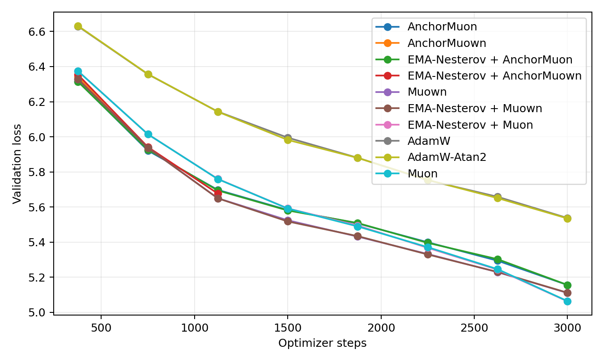
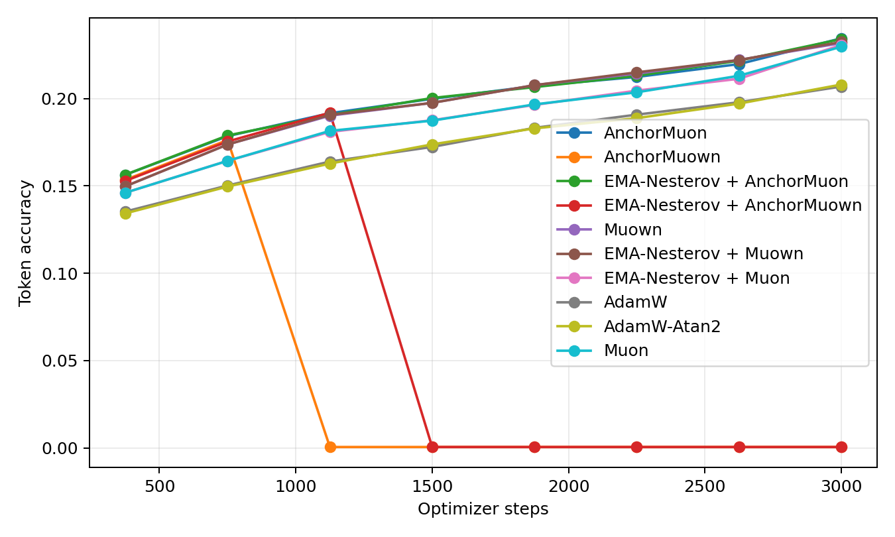
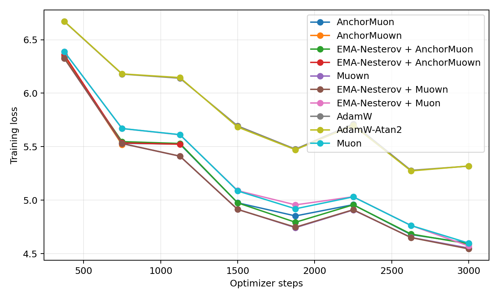
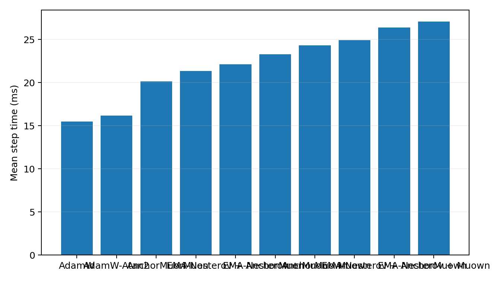
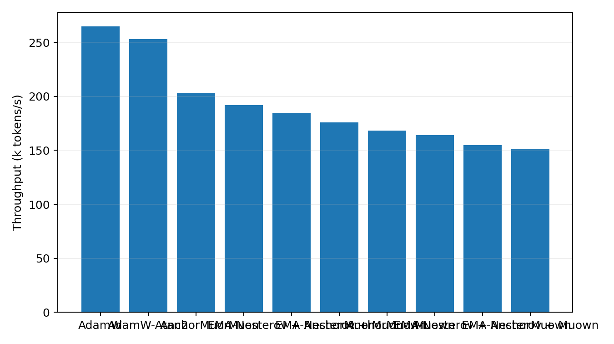

# Tokenized 50M LLM Optimizer Comparison

This benchmark uses real text tokenized with the Hugging Face `gpt2` tokenizer. It is the preferred language-model optimizer transfer check because embeddings, output head, and sequence statistics are closer to a normal BPE/SentencePiece pretraining setup than the older byte-level path.

## Setup

- Dataset: `HuggingFaceFW/fineweb-edu/sample-10BT:train [gpt2]`
- Tokenizer: `gpt2`
- Train tokens cached: 8,000,000
- Validation tokens cached: 524,288
- Model: decoder-only GPT, layers=8, width=512, heads=8, context=256, vocab=50,257
- Trainable parameters: 51045888
- Batch: 16 sequences x 256 tokens
- HPO: 600 steps per candidate, selected by best validation loss
- Final replay: 3000 steps per selected optimizer
- Validation estimate: 16 sequential batches per evaluation point
- Final extra validation: 128 sequential batches
- GPUs: 2 visible, one trial per GPU

## Final Results

| Rank | Optimizer | Selected config | Final val loss | Best val loss | Final token acc | Full val loss | Full token acc | Step time | Throughput |
|---:|---|---|---:|---:|---:|---:|---:|---:|---:|
| 1 | AnchorMuon | lr=0.0014, wd=0.05, row_gamma=0.25, pmuon_beta=0.9, normuon_beta2=0.93, fallback=rms@1x, soda=0.001 | 5.1557 | 5.1557 | 23.44% | 5.2119 | 23.16% | 20.15 ms | 203.2k tok/s |
| 2 | AnchorMuown | lr=0.0016, wd=0.05, row_gamma=0.25, pmuon_beta=0.9, normuon_beta2=0.93, fallback=rms@1x, soda=0.003, mag_lr=1x | nan | 5.9265 | 0.06% | nan | 0.04% | 24.32 ms | 168.4k tok/s |
| 3 | EMA-Nesterov + AnchorMuon | lr=0.0014, wd=0.05, row_gamma=0.45, pmuon_beta=0.9, normuon_beta2=0.93, fallback=rms@1x, soda=0.003, ema_beta=0.5, ema_gamma=0.995 | 5.1560 | 5.1560 | 23.40% | 5.2069 | 23.21% | 22.15 ms | 184.9k tok/s |
| 4 | EMA-Nesterov + AnchorMuown | lr=0.0014, wd=0.05, row_gamma=0.45, pmuon_beta=0.9, normuon_beta2=0.93, fallback=rms@1x, soda=0.003, mag_lr=1x, ema_beta=0.3, ema_gamma=0.995 | nan | 5.6765 | 0.06% | nan | 0.04% | 26.42 ms | 155.0k tok/s |
| 5 | EMA-Nesterov + Muon | lr=0.0014, wd=0.05, ema_beta=0.1, ema_gamma=0.995 | 5.0625 | 5.0625 | 23.07% | 5.1215 | 22.70% | 23.31 ms | 175.7k tok/s |
| 6 | Muon | lr=0.0014, wd=0.05 | 5.0640 | 5.0640 | 22.96% | 5.1187 | 22.73% | 21.36 ms | 191.8k tok/s |
| 7 | Muown | lr=0.0016, wd=0 | 5.1104 | 5.1104 | 23.17% | 5.1273 | 23.17% | 24.93 ms | 164.3k tok/s |
| 8 | EMA-Nesterov + Muown | lr=0.0016, wd=0, ema_beta=0.3, ema_gamma=0.99 | 5.1117 | 5.1117 | 23.24% | 5.1278 | 23.19% | 27.07 ms | 151.3k tok/s |
| 9 | AdamW-Atan2 | lr=0.0005, wd=0.05 | 5.5349 | 5.5349 | 20.80% | 5.5717 | 20.53% | 16.18 ms | 253.1k tok/s |
| 10 | AdamW | lr=0.0005, wd=0.05 | 5.5373 | 5.5373 | 20.69% | 5.5740 | 20.51% | 15.47 ms | 264.7k tok/s |

## Plots

## HPO Candidates

| Family | Trial | LR | Best val loss | Final val loss | Step time |
|---|---|---:|---:|---:|---:|
| adamatan2 | `tok_adamatan2_lr0.0005` | 0.0005 | 6.4115 | 6.4115 | 16.18 ms |
| adamatan2 | `tok_adamatan2_lr0.0004` | 0.0004 | 6.4249 | 6.4249 | 16.14 ms |
| adamatan2 | `tok_adamatan2_lr0.0003` | 0.0003 | 6.4638 | 6.4638 | 16.12 ms |
| adamatan2 | `tok_adamatan2_lr0.0002` | 0.0002 | 6.5352 | 6.5352 | 16.08 ms |
| adamw | `tok_adamw_lr0.0005` | 0.0005 | 6.4110 | 6.4110 | 15.45 ms |
| adamw | `tok_adamw_lr0.0004` | 0.0004 | 6.4193 | 6.4193 | 15.43 ms |
| adamw | `tok_adamw_lr0.0003` | 0.0003 | 6.4590 | 6.4590 | 15.40 ms |
| adamw | `tok_adamw_lr0.0002` | 0.0002 | 6.5298 | 6.5298 | 15.36 ms |
| anchormuon | `tok_anchor_lr0.0014_rg0.25_soda0.001_flr1_rms` | 0.0014 | 5.9940 | 5.9940 | 20.47 ms |
| anchormuon | `tok_anchor_lr0.0014_rg0.55_soda0.003_flr1_rms` | 0.0014 | 5.9948 | 5.9948 | 20.48 ms |
| anchormuon | `tok_anchor_lr0.0014_rg0.55_soda0.001_flr1_rms` | 0.0014 | 5.9951 | 5.9951 | 20.55 ms |
| anchormuon | `tok_anchor_lr0.0014_rg0_soda0.001_flr1_rms` | 0.0014 | 5.9952 | 5.9952 | 20.57 ms |
| anchormuon | `tok_anchor_lr0.0014_rg0_soda0.003_flr1_rms` | 0.0014 | 5.9955 | 5.9955 | 20.48 ms |
| anchormuon | `tok_anchor_lr0.0014_rg0.45_soda0.001_flr1_rms` | 0.0014 | 5.9957 | 5.9957 | 20.52 ms |
| anchormuon | `tok_anchor_lr0.0014_rg0.55_soda0.01_flr1_rms` | 0.0014 | 5.9957 | 5.9957 | 20.48 ms |
| anchormuon | `tok_anchor_lr0.0014_rg0.25_soda0.003_flr1_rms` | 0.0014 | 5.9959 | 5.9959 | 20.53 ms |
| anchormuon | `tok_anchor_lr0.0014_rg0.45_soda0.01_flr1_rms` | 0.0014 | 5.9962 | 5.9962 | 20.51 ms |
| anchormuon | `tok_anchor_lr0.0014_rg0.25_soda0.01_flr1_rms` | 0.0014 | 5.9963 | 5.9963 | 20.45 ms |
| anchormuon | `tok_anchor_lr0.0014_rg0.45_soda0.003_flr1_rms` | 0.0014 | 5.9966 | 5.9966 | 20.55 ms |
| anchormuon | `tok_anchor_lr0.0014_rg0_soda0.01_flr1_rms` | 0.0014 | 5.9970 | 5.9970 | 20.50 ms |
| anchormuon | `tok_anchor_lr0.0014_rg0.25_soda0.001_flr0.5_atan2` | 0.0014 | 6.0032 | 6.0032 | 20.71 ms |
| anchormuon | `tok_anchor_lr0.0014_rg0.25_soda0.01_flr0.5_atan2` | 0.0014 | 6.0044 | 6.0044 | 20.70 ms |
| anchormuon | `tok_anchor_lr0.0014_rg0_soda0.001_flr0.5_atan2` | 0.0014 | 6.0045 | 6.0045 | 20.74 ms |
| anchormuon | `tok_anchor_lr0.0014_rg0_soda0.01_flr0.5_atan2` | 0.0014 | 6.0050 | 6.0050 | 20.75 ms |
| anchormuon | `tok_anchor_lr0.0014_rg0.25_soda0.003_flr0.5_atan2` | 0.0014 | 6.0052 | 6.0052 | 20.74 ms |
| anchormuon | `tok_anchor_lr0.0014_rg0_soda0.003_flr0.5_atan2` | 0.0014 | 6.0054 | 6.0054 | 20.75 ms |
| anchormuon | `tok_anchor_lr0.0014_rg0.45_soda0.003_flr0.5_atan2` | 0.0014 | 6.0062 | 6.0062 | 20.76 ms |
| anchormuon | `tok_anchor_lr0.0014_rg0.45_soda0.01_flr0.5_atan2` | 0.0014 | 6.0065 | 6.0065 | 20.81 ms |
| anchormuon | `tok_anchor_lr0.0014_rg0.45_soda0.001_flr0.5_atan2` | 0.0014 | 6.0067 | 6.0067 | 20.72 ms |
| anchormuon | `tok_anchor_lr0.0014_rg0.55_soda0.003_flr0.5_atan2` | 0.0014 | 6.0071 | 6.0071 | 20.76 ms |
| anchormuon | `tok_anchor_lr0.0014_rg0.55_soda0.01_flr0.5_atan2` | 0.0014 | 6.0074 | 6.0074 | 20.74 ms |
| anchormuon | `tok_anchor_lr0.0014_rg0.55_soda0.001_flr0.5_atan2` | 0.0014 | 6.0077 | 6.0077 | 20.73 ms |
| anchormuon | `tok_anchor_lr0.0012_rg0_soda0.003_flr1_rms` | 0.0012 | 6.0174 | 6.0174 | 20.56 ms |
| anchormuon | `tok_anchor_lr0.0012_rg0_soda0.001_flr1_rms` | 0.0012 | 6.0179 | 6.0179 | 20.45 ms |
| anchormuon | `tok_anchor_lr0.0012_rg0.25_soda0.001_flr1_rms` | 0.0012 | 6.0184 | 6.0184 | 20.46 ms |
| anchormuon | `tok_anchor_lr0.0012_rg0.55_soda0.003_flr1_rms` | 0.0012 | 6.0185 | 6.0185 | 20.54 ms |
| anchormuon | `tok_anchor_lr0.0012_rg0_soda0.01_flr1_rms` | 0.0012 | 6.0187 | 6.0187 | 20.48 ms |
| anchormuon | `tok_anchor_lr0.0012_rg0.45_soda0.001_flr1_rms` | 0.0012 | 6.0188 | 6.0188 | 20.54 ms |
| anchormuon | `tok_anchor_lr0.0012_rg0.55_soda0.001_flr1_rms` | 0.0012 | 6.0189 | 6.0189 | 20.49 ms |
| anchormuon | `tok_anchor_lr0.0012_rg0.45_soda0.01_flr1_rms` | 0.0012 | 6.0191 | 6.0191 | 20.52 ms |
| anchormuon | `tok_anchor_lr0.0012_rg0.25_soda0.003_flr1_rms` | 0.0012 | 6.0194 | 6.0194 | 20.51 ms |
| anchormuon | `tok_anchor_lr0.0012_rg0.55_soda0.01_flr1_rms` | 0.0012 | 6.0196 | 6.0196 | 20.55 ms |
| anchormuon | `tok_anchor_lr0.0012_rg0.25_soda0.01_flr1_rms` | 0.0012 | 6.0197 | 6.0197 | 20.51 ms |
| anchormuon | `tok_anchor_lr0.0012_rg0.45_soda0.003_flr1_rms` | 0.0012 | 6.0199 | 6.0199 | 20.48 ms |
| anchormuon | `tok_anchor_lr0.0012_rg0.25_soda0.001_flr0.5_atan2` | 0.0012 | 6.0312 | 6.0312 | 20.82 ms |
| anchormuon | `tok_anchor_lr0.0012_rg0.25_soda0.003_flr0.5_atan2` | 0.0012 | 6.0318 | 6.0318 | 20.75 ms |
| anchormuon | `tok_anchor_lr0.0012_rg0.25_soda0.01_flr0.5_atan2` | 0.0012 | 6.0325 | 6.0325 | 20.73 ms |
| anchormuon | `tok_anchor_lr0.0012_rg0.45_soda0.01_flr0.5_atan2` | 0.0012 | 6.0326 | 6.0326 | 20.75 ms |
| anchormuon | `tok_anchor_lr0.0012_rg0.45_soda0.001_flr0.5_atan2` | 0.0012 | 6.0326 | 6.0326 | 20.78 ms |
| anchormuon | `tok_anchor_lr0.0012_rg0.45_soda0.003_flr0.5_atan2` | 0.0012 | 6.0330 | 6.0330 | 20.71 ms |
| anchormuon | `tok_anchor_lr0.0012_rg0.55_soda0.003_flr0.5_atan2` | 0.0012 | 6.0332 | 6.0332 | 20.82 ms |
| anchormuon | `tok_anchor_lr0.0012_rg0.55_soda0.001_flr0.5_atan2` | 0.0012 | 6.0333 | 6.0333 | 20.79 ms |
| anchormuon | `tok_anchor_lr0.0012_rg0_soda0.003_flr0.5_atan2` | 0.0012 | 6.0346 | 6.0346 | 20.76 ms |
| anchormuon | `tok_anchor_lr0.0012_rg0.55_soda0.01_flr0.5_atan2` | 0.0012 | 6.0346 | 6.0346 | 20.72 ms |
| anchormuon | `tok_anchor_lr0.0012_rg0_soda0.001_flr0.5_atan2` | 0.0012 | 6.0354 | 6.0354 | 20.78 ms |
| anchormuon | `tok_anchor_lr0.0012_rg0_soda0.01_flr0.5_atan2` | 0.0012 | 6.0364 | 6.0364 | 20.83 ms |
| anchormuon | `tok_anchor_lr0.001_rg0.55_soda0.001_flr1_rms` | 0.001 | 6.0614 | 6.0614 | 20.54 ms |
| anchormuon | `tok_anchor_lr0.001_rg0.55_soda0.003_flr1_rms` | 0.001 | 6.0619 | 6.0619 | 20.51 ms |
| anchormuon | `tok_anchor_lr0.001_rg0.55_soda0.01_flr1_rms` | 0.001 | 6.0625 | 6.0625 | 20.58 ms |
| anchormuon | `tok_anchor_lr0.001_rg0.45_soda0.003_flr1_rms` | 0.001 | 6.0629 | 6.0629 | 20.53 ms |
| anchormuon | `tok_anchor_lr0.001_rg0.45_soda0.001_flr1_rms` | 0.001 | 6.0630 | 6.0630 | 20.49 ms |
| anchormuon | `tok_anchor_lr0.001_rg0.25_soda0.003_flr1_rms` | 0.001 | 6.0633 | 6.0633 | 20.49 ms |
| anchormuon | `tok_anchor_lr0.001_rg0.25_soda0.001_flr1_rms` | 0.001 | 6.0634 | 6.0634 | 20.52 ms |
| anchormuon | `tok_anchor_lr0.001_rg0.45_soda0.01_flr1_rms` | 0.001 | 6.0641 | 6.0641 | 20.46 ms |
| anchormuon | `tok_anchor_lr0.001_rg0.25_soda0.01_flr1_rms` | 0.001 | 6.0650 | 6.0650 | 20.47 ms |
| anchormuon | `tok_anchor_lr0.001_rg0_soda0.003_flr1_rms` | 0.001 | 6.0707 | 6.0707 | 20.56 ms |
| anchormuon | `tok_anchor_lr0.001_rg0_soda0.001_flr1_rms` | 0.001 | 6.0710 | 6.0710 | 20.55 ms |
| anchormuon | `tok_anchor_lr0.001_rg0_soda0.01_flr1_rms` | 0.001 | 6.0717 | 6.0717 | 20.51 ms |
| anchormuon | `tok_anchor_lr0.001_rg0.55_soda0.001_flr0.5_atan2` | 0.001 | 6.0776 | 6.0776 | 20.80 ms |
| anchormuon | `tok_anchor_lr0.001_rg0.55_soda0.003_flr0.5_atan2` | 0.001 | 6.0780 | 6.0780 | 20.87 ms |
| anchormuon | `tok_anchor_lr0.001_rg0.55_soda0.01_flr0.5_atan2` | 0.001 | 6.0792 | 6.0792 | 20.71 ms |
| anchormuon | `tok_anchor_lr0.001_rg0.45_soda0.001_flr0.5_atan2` | 0.001 | 6.0796 | 6.0796 | 20.80 ms |
| anchormuon | `tok_anchor_lr0.001_rg0.45_soda0.003_flr0.5_atan2` | 0.001 | 6.0799 | 6.0799 | 20.72 ms |
| anchormuon | `tok_anchor_lr0.001_rg0.45_soda0.01_flr0.5_atan2` | 0.001 | 6.0819 | 6.0819 | 20.71 ms |
| anchormuon | `tok_anchor_lr0.001_rg0.25_soda0.001_flr0.5_atan2` | 0.001 | 6.0825 | 6.0825 | 20.72 ms |
| anchormuon | `tok_anchor_lr0.001_rg0.25_soda0.003_flr0.5_atan2` | 0.001 | 6.0833 | 6.0833 | 20.81 ms |
| anchormuon | `tok_anchor_lr0.001_rg0.25_soda0.01_flr0.5_atan2` | 0.001 | 6.0835 | 6.0835 | 20.70 ms |
| anchormuon | `tok_anchor_lr0.001_rg0_soda0.001_flr0.5_atan2` | 0.001 | 6.0954 | 6.0954 | 20.76 ms |
| anchormuon | `tok_anchor_lr0.001_rg0_soda0.003_flr0.5_atan2` | 0.001 | 6.0955 | 6.0955 | 20.80 ms |
| anchormuon | `tok_anchor_lr0.001_rg0_soda0.01_flr0.5_atan2` | 0.001 | 6.0970 | 6.0970 | 20.81 ms |
| anchormuon | `tok_anchor_lr0.0008_rg0.55_soda0.001_flr1_rms` | 0.0008 | 6.1353 | 6.1353 | 20.50 ms |
| anchormuon | `tok_anchor_lr0.0008_rg0.55_soda0.003_flr1_rms` | 0.0008 | 6.1357 | 6.1357 | 20.58 ms |
| anchormuon | `tok_anchor_lr0.0008_rg0.55_soda0.01_flr1_rms` | 0.0008 | 6.1372 | 6.1372 | 20.61 ms |
| anchormuon | `tok_anchor_lr0.0008_rg0.45_soda0.001_flr1_rms` | 0.0008 | 6.1381 | 6.1381 | 20.53 ms |
| anchormuon | `tok_anchor_lr0.0008_rg0.45_soda0.003_flr1_rms` | 0.0008 | 6.1386 | 6.1386 | 20.47 ms |
| anchormuon | `tok_anchor_lr0.0008_rg0.45_soda0.01_flr1_rms` | 0.0008 | 6.1396 | 6.1396 | 20.48 ms |
| anchormuon | `tok_anchor_lr0.0008_rg0.25_soda0.001_flr1_rms` | 0.0008 | 6.1404 | 6.1404 | 20.48 ms |
| anchormuon | `tok_anchor_lr0.0008_rg0.25_soda0.003_flr1_rms` | 0.0008 | 6.1410 | 6.1410 | 20.51 ms |
| anchormuon | `tok_anchor_lr0.0008_rg0.25_soda0.01_flr1_rms` | 0.0008 | 6.1428 | 6.1428 | 20.63 ms |
| anchormuon | `tok_anchor_lr0.0008_rg0_soda0.001_flr1_rms` | 0.0008 | 6.1561 | 6.1561 | 20.42 ms |
| anchormuon | `tok_anchor_lr0.0008_rg0_soda0.003_flr1_rms` | 0.0008 | 6.1562 | 6.1562 | 20.52 ms |
| anchormuon | `tok_anchor_lr0.0008_rg0_soda0.01_flr1_rms` | 0.0008 | 6.1581 | 6.1581 | 20.58 ms |
| anchormuon | `tok_anchor_lr0.0008_rg0.55_soda0.001_flr0.5_atan2` | 0.0008 | 6.1601 | 6.1601 | 20.81 ms |
| anchormuon | `tok_anchor_lr0.0008_rg0.55_soda0.003_flr0.5_atan2` | 0.0008 | 6.1610 | 6.1610 | 20.74 ms |
| anchormuon | `tok_anchor_lr0.0008_rg0.55_soda0.01_flr0.5_atan2` | 0.0008 | 6.1623 | 6.1623 | 20.76 ms |
| anchormuon | `tok_anchor_lr0.0008_rg0.45_soda0.001_flr0.5_atan2` | 0.0008 | 6.1635 | 6.1635 | 20.82 ms |
| anchormuon | `tok_anchor_lr0.0008_rg0.45_soda0.003_flr0.5_atan2` | 0.0008 | 6.1638 | 6.1638 | 20.72 ms |
| anchormuon | `tok_anchor_lr0.0008_rg0.45_soda0.01_flr0.5_atan2` | 0.0008 | 6.1654 | 6.1654 | 20.73 ms |
| anchormuon | `tok_anchor_lr0.0008_rg0.25_soda0.001_flr0.5_atan2` | 0.0008 | 6.1696 | 6.1696 | 20.70 ms |
| anchormuon | `tok_anchor_lr0.0008_rg0.25_soda0.003_flr0.5_atan2` | 0.0008 | 6.1700 | 6.1700 | 20.80 ms |
| anchormuon | `tok_anchor_lr0.0008_rg0.25_soda0.01_flr0.5_atan2` | 0.0008 | 6.1717 | 6.1717 | 20.74 ms |
| anchormuon | `tok_anchor_lr0.0008_rg0_soda0.001_flr0.5_atan2` | 0.0008 | 6.1904 | 6.1904 | 20.69 ms |
| anchormuon | `tok_anchor_lr0.0008_rg0_soda0.003_flr0.5_atan2` | 0.0008 | 6.1912 | 6.1912 | 20.72 ms |
| anchormuon | `tok_anchor_lr0.0008_rg0_soda0.01_flr0.5_atan2` | 0.0008 | 6.1926 | 6.1926 | 20.67 ms |
| anchormuown | `tok_anchormuown_lr0.0016_rg0.25_soda0.003_mag1_flr1_rms` | 0.0016 | 6.0178 | 6.0178 | 25.00 ms |
| anchormuown | `tok_anchormuown_lr0.0016_rg0.25_soda0.001_mag1_flr1_rms` | 0.0016 | 6.0189 | 6.0189 | 24.97 ms |
| anchormuown | `tok_anchormuown_lr0.0016_rg0.55_soda0.001_mag0.5_flr1_rms` | 0.0016 | 6.0196 | 6.0196 | 25.03 ms |
| anchormuown | `tok_anchormuown_lr0.0016_rg0.45_soda0.001_mag0.5_flr1_rms` | 0.0016 | 6.0197 | 6.0197 | 24.96 ms |
| anchormuown | `tok_anchormuown_lr0.0016_rg0.55_soda0.003_mag0.5_flr1_rms` | 0.0016 | 6.0197 | 6.0197 | 24.98 ms |
| anchormuown | `tok_anchormuown_lr0.0016_rg0.25_soda0.01_mag1_flr1_rms` | 0.0016 | 6.0199 | 6.0199 | 25.03 ms |
| anchormuown | `tok_anchormuown_lr0.0016_rg0.25_soda0.003_mag0.5_flr1_rms` | 0.0016 | 6.0203 | 6.0203 | 24.98 ms |
| anchormuown | `tok_anchormuown_lr0.0016_rg0.45_soda0.003_mag0.5_flr1_rms` | 0.0016 | 6.0204 | 6.0204 | 24.98 ms |
| anchormuown | `tok_anchormuown_lr0.0016_rg0.55_soda0.001_mag1_flr1_rms` | 0.0016 | 6.0207 | 6.0207 | 24.99 ms |
| anchormuown | `tok_anchormuown_lr0.0016_rg0.45_soda0.001_mag1_flr1_rms` | 0.0016 | 6.0209 | 6.0209 | 24.97 ms |
| anchormuown | `tok_anchormuown_lr0.0016_rg0.45_soda0.01_mag0.5_flr1_rms` | 0.0016 | 6.0209 | 6.0209 | 24.98 ms |
| anchormuown | `tok_anchormuown_lr0.0016_rg0.55_soda0.01_mag0.5_flr1_rms` | 0.0016 | 6.0213 | 6.0213 | 25.02 ms |
| anchormuown | `tok_anchormuown_lr0.0016_rg0.25_soda0.01_mag0.5_flr1_rms` | 0.0016 | 6.0217 | 6.0217 | 24.99 ms |
| anchormuown | `tok_anchormuown_lr0.0016_rg0.55_soda0.003_mag1_flr1_rms` | 0.0016 | 6.0218 | 6.0218 | 25.03 ms |
| anchormuown | `tok_anchormuown_lr0.0016_rg0.45_soda0.01_mag1_flr1_rms` | 0.0016 | 6.0220 | 6.0220 | 25.03 ms |
| anchormuown | `tok_anchormuown_lr0.0016_rg0.25_soda0.001_mag0.5_flr1_rms` | 0.0016 | 6.0220 | 6.0220 | 25.00 ms |
| anchormuown | `tok_anchormuown_lr0.0016_rg0.45_soda0.003_mag1_flr1_rms` | 0.0016 | 6.0223 | 6.0223 | 24.99 ms |
| anchormuown | `tok_anchormuown_lr0.0016_rg0.55_soda0.01_mag1_flr1_rms` | 0.0016 | 6.0236 | 6.0236 | 25.01 ms |
| anchormuown | `tok_anchormuown_lr0.0014_rg0.55_soda0.001_mag0.5_flr1_rms` | 0.0014 | 6.0309 | 6.0309 | 24.97 ms |
| anchormuown | `tok_anchormuown_lr0.0014_rg0.45_soda0.001_mag1_flr1_rms` | 0.0014 | 6.0315 | 6.0315 | 24.97 ms |
| anchormuown | `tok_anchormuown_lr0.0014_rg0.55_soda0.003_mag1_flr1_rms` | 0.0014 | 6.0317 | 6.0317 | 25.04 ms |
| anchormuown | `tok_anchormuown_lr0.0014_rg0.55_soda0.01_mag1_flr1_rms` | 0.0014 | 6.0317 | 6.0317 | 25.02 ms |
| anchormuown | `tok_anchormuown_lr0.0014_rg0.45_soda0.003_mag1_flr1_rms` | 0.0014 | 6.0318 | 6.0318 | 24.99 ms |
| anchormuown | `tok_anchormuown_lr0.0014_rg0.55_soda0.001_mag1_flr1_rms` | 0.0014 | 6.0321 | 6.0321 | 25.02 ms |
| anchormuown | `tok_anchormuown_lr0.0014_rg0.55_soda0.003_mag0.5_flr1_rms` | 0.0014 | 6.0323 | 6.0323 | 25.01 ms |
| anchormuown | `tok_anchormuown_lr0.0014_rg0.55_soda0.01_mag0.5_flr1_rms` | 0.0014 | 6.0330 | 6.0330 | 24.99 ms |
| anchormuown | `tok_anchormuown_lr0.0014_rg0.45_soda0.01_mag1_flr1_rms` | 0.0014 | 6.0333 | 6.0333 | 25.01 ms |
| anchormuown | `tok_anchormuown_lr0.0014_rg0.45_soda0.001_mag0.5_flr1_rms` | 0.0014 | 6.0336 | 6.0336 | 24.99 ms |
| anchormuown | `tok_anchormuown_lr0.0014_rg0.45_soda0.003_mag0.5_flr1_rms` | 0.0014 | 6.0339 | 6.0339 | 25.01 ms |
| anchormuown | `tok_anchormuown_lr0.0014_rg0.25_soda0.003_mag1_flr1_rms` | 0.0014 | 6.0344 | 6.0344 | 24.94 ms |
| anchormuown | `tok_anchormuown_lr0.0014_rg0.25_soda0.001_mag1_flr1_rms` | 0.0014 | 6.0349 | 6.0349 | 25.01 ms |
| anchormuown | `tok_anchormuown_lr0.0014_rg0.45_soda0.01_mag0.5_flr1_rms` | 0.0014 | 6.0352 | 6.0352 | 24.99 ms |
| anchormuown | `tok_anchormuown_lr0.0014_rg0.25_soda0.003_mag0.5_flr1_rms` | 0.0014 | 6.0353 | 6.0353 | 25.04 ms |
| anchormuown | `tok_anchormuown_lr0.0014_rg0.25_soda0.001_mag0.5_flr1_rms` | 0.0014 | 6.0354 | 6.0354 | 24.97 ms |
| anchormuown | `tok_anchormuown_lr0.0014_rg0.25_soda0.01_mag1_flr1_rms` | 0.0014 | 6.0356 | 6.0356 | 24.95 ms |
| anchormuown | `tok_anchormuown_lr0.0014_rg0.25_soda0.01_mag0.5_flr1_rms` | 0.0014 | 6.0365 | 6.0365 | 24.97 ms |
| anchormuown | `tok_anchormuown_lr0.0016_rg0.45_soda0.003_mag1_flr0.5_atan2` | 0.0016 | 6.0371 | 6.0371 | 25.29 ms |
| anchormuown | `tok_anchormuown_lr0.0016_rg0.45_soda0.001_mag1_flr0.5_atan2` | 0.0016 | 6.0372 | 6.0372 | 25.25 ms |
| anchormuown | `tok_anchormuown_lr0.0016_rg0.55_soda0.001_mag0.5_flr0.5_atan2` | 0.0016 | 6.0374 | 6.0374 | 25.28 ms |
| anchormuown | `tok_anchormuown_lr0.0016_rg0.55_soda0.003_mag1_flr0.5_atan2` | 0.0016 | 6.0378 | 6.0378 | 25.25 ms |
| anchormuown | `tok_anchormuown_lr0.0016_rg0.55_soda0.001_mag1_flr0.5_atan2` | 0.0016 | 6.0380 | 6.0380 | 25.21 ms |
| anchormuown | `tok_anchormuown_lr0.0016_rg0.55_soda0.003_mag0.5_flr0.5_atan2` | 0.0016 | 6.0387 | 6.0387 | 25.21 ms |
| anchormuown | `tok_anchormuown_lr0.0016_rg0.45_soda0.01_mag1_flr0.5_atan2` | 0.0016 | 6.0390 | 6.0390 | 25.32 ms |
| anchormuown | `tok_anchormuown_lr0.0016_rg0.55_soda0.01_mag0.5_flr0.5_atan2` | 0.0016 | 6.0391 | 6.0391 | 25.26 ms |
| anchormuown | `tok_anchormuown_lr0.0016_rg0.55_soda0.01_mag1_flr0.5_atan2` | 0.0016 | 6.0392 | 6.0392 | 25.25 ms |
| anchormuown | `tok_anchormuown_lr0.0016_rg0.45_soda0.001_mag0.5_flr0.5_atan2` | 0.0016 | 6.0392 | 6.0392 | 25.23 ms |
| anchormuown | `tok_anchormuown_lr0.0016_rg0.45_soda0.003_mag0.5_flr0.5_atan2` | 0.0016 | 6.0397 | 6.0397 | 25.23 ms |
| anchormuown | `tok_anchormuown_lr0.0016_rg0.45_soda0.01_mag0.5_flr0.5_atan2` | 0.0016 | 6.0399 | 6.0399 | 25.21 ms |
| anchormuown | `tok_anchormuown_lr0.0016_rg0.25_soda0.01_mag1_flr0.5_atan2` | 0.0016 | 6.0409 | 6.0409 | 25.33 ms |
| anchormuown | `tok_anchormuown_lr0.0016_rg0.25_soda0.003_mag1_flr0.5_atan2` | 0.0016 | 6.0410 | 6.0410 | 25.23 ms |
| anchormuown | `tok_anchormuown_lr0.0016_rg0.25_soda0.001_mag1_flr0.5_atan2` | 0.0016 | 6.0411 | 6.0411 | 25.22 ms |
| anchormuown | `tok_anchormuown_lr0.0016_rg0.25_soda0.003_mag0.5_flr0.5_atan2` | 0.0016 | 6.0418 | 6.0418 | 25.23 ms |
| anchormuown | `tok_anchormuown_lr0.0016_rg0.25_soda0.001_mag0.5_flr0.5_atan2` | 0.0016 | 6.0422 | 6.0422 | 25.27 ms |
| anchormuown | `tok_anchormuown_lr0.0016_rg0.25_soda0.01_mag0.5_flr0.5_atan2` | 0.0016 | 6.0434 | 6.0434 | 25.25 ms |
| anchormuown | `tok_anchormuown_lr0.0012_rg0.55_soda0.001_mag0.5_flr1_rms` | 0.0012 | 6.0469 | 6.0469 | 24.99 ms |
| anchormuown | `tok_anchormuown_lr0.0012_rg0.55_soda0.003_mag0.5_flr1_rms` | 0.0012 | 6.0472 | 6.0472 | 24.99 ms |
| anchormuown | `tok_anchormuown_lr0.0014_rg0.25_soda0.003_mag0.5_flr0.5_atan2` | 0.0014 | 6.0479 | 6.0479 | 25.29 ms |
| anchormuown | `tok_anchormuown_lr0.0012_rg0.55_soda0.01_mag0.5_flr1_rms` | 0.0012 | 6.0482 | 6.0482 | 24.99 ms |
| anchormuown | `tok_anchormuown_lr0.0014_rg0.55_soda0.001_mag1_flr0.5_atan2` | 0.0014 | 6.0482 | 6.0482 | 25.20 ms |
| anchormuown | `tok_anchormuown_lr0.0012_rg0.45_soda0.003_mag0.5_flr1_rms` | 0.0012 | 6.0482 | 6.0482 | 25.03 ms |
| anchormuown | `tok_anchormuown_lr0.0014_rg0.25_soda0.001_mag0.5_flr0.5_atan2` | 0.0014 | 6.0484 | 6.0484 | 25.27 ms |
| anchormuown | `tok_anchormuown_lr0.0014_rg0.55_soda0.001_mag0.5_flr0.5_atan2` | 0.0014 | 6.0484 | 6.0484 | 25.22 ms |
| anchormuown | `tok_anchormuown_lr0.0014_rg0.45_soda0.003_mag0.5_flr0.5_atan2` | 0.0014 | 6.0485 | 6.0485 | 25.26 ms |
| anchormuown | `tok_anchormuown_lr0.0014_rg0.45_soda0.001_mag0.5_flr0.5_atan2` | 0.0014 | 6.0485 | 6.0485 | 25.21 ms |
| anchormuown | `tok_anchormuown_lr0.0014_rg0.45_soda0.001_mag1_flr0.5_atan2` | 0.0014 | 6.0487 | 6.0487 | 25.20 ms |
| anchormuown | `tok_anchormuown_lr0.0014_rg0.25_soda0.01_mag0.5_flr0.5_atan2` | 0.0014 | 6.0488 | 6.0488 | 25.25 ms |
| anchormuown | `tok_anchormuown_lr0.0014_rg0.25_soda0.001_mag1_flr0.5_atan2` | 0.0014 | 6.0489 | 6.0489 | 25.27 ms |
| anchormuown | `tok_anchormuown_lr0.0014_rg0.55_soda0.003_mag1_flr0.5_atan2` | 0.0014 | 6.0490 | 6.0490 | 25.23 ms |
| anchormuown | `tok_anchormuown_lr0.0012_rg0.45_soda0.001_mag0.5_flr1_rms` | 0.0012 | 6.0491 | 6.0491 | 25.00 ms |
| anchormuown | `tok_anchormuown_lr0.0014_rg0.45_soda0.003_mag1_flr0.5_atan2` | 0.0014 | 6.0494 | 6.0494 | 25.28 ms |
| anchormuown | `tok_anchormuown_lr0.0012_rg0.45_soda0.01_mag0.5_flr1_rms` | 0.0012 | 6.0496 | 6.0496 | 24.97 ms |
| anchormuown | `tok_anchormuown_lr0.0014_rg0.55_soda0.003_mag0.5_flr0.5_atan2` | 0.0014 | 6.0496 | 6.0496 | 25.25 ms |
| anchormuown | `tok_anchormuown_lr0.0014_rg0.45_soda0.01_mag0.5_flr0.5_atan2` | 0.0014 | 6.0497 | 6.0497 | 25.19 ms |
| anchormuown | `tok_anchormuown_lr0.0014_rg0.55_soda0.01_mag0.5_flr0.5_atan2` | 0.0014 | 6.0497 | 6.0497 | 25.24 ms |
| anchormuown | `tok_anchormuown_lr0.0014_rg0.55_soda0.01_mag1_flr0.5_atan2` | 0.0014 | 6.0498 | 6.0498 | 25.27 ms |
| anchormuown | `tok_anchormuown_lr0.0014_rg0.25_soda0.003_mag1_flr0.5_atan2` | 0.0014 | 6.0502 | 6.0502 | 25.21 ms |
| anchormuown | `tok_anchormuown_lr0.0014_rg0.45_soda0.01_mag1_flr0.5_atan2` | 0.0014 | 6.0509 | 6.0509 | 25.22 ms |
| anchormuown | `tok_anchormuown_lr0.0014_rg0.25_soda0.01_mag1_flr0.5_atan2` | 0.0014 | 6.0511 | 6.0511 | 25.19 ms |
| anchormuown | `tok_anchormuown_lr0.0012_rg0.25_soda0.001_mag0.5_flr1_rms` | 0.0012 | 6.0512 | 6.0512 | 25.07 ms |
| anchormuown | `tok_anchormuown_lr0.0012_rg0.25_soda0.003_mag0.5_flr1_rms` | 0.0012 | 6.0517 | 6.0517 | 25.00 ms |
| anchormuown | `tok_anchormuown_lr0.0012_rg0.55_soda0.003_mag1_flr1_rms` | 0.0012 | 6.0525 | 6.0525 | 24.96 ms |
| anchormuown | `tok_anchormuown_lr0.0012_rg0.25_soda0.01_mag0.5_flr1_rms` | 0.0012 | 6.0526 | 6.0526 | 24.99 ms |
| anchormuown | `tok_anchormuown_lr0.0012_rg0.55_soda0.001_mag1_flr1_rms` | 0.0012 | 6.0532 | 6.0532 | 24.96 ms |
| anchormuown | `tok_anchormuown_lr0.0012_rg0.45_soda0.001_mag1_flr1_rms` | 0.0012 | 6.0536 | 6.0536 | 24.99 ms |
| anchormuown | `tok_anchormuown_lr0.0012_rg0.45_soda0.003_mag1_flr1_rms` | 0.0012 | 6.0538 | 6.0538 | 24.99 ms |
| anchormuown | `tok_anchormuown_lr0.0012_rg0.25_soda0.001_mag1_flr1_rms` | 0.0012 | 6.0539 | 6.0539 | 25.04 ms |
| anchormuown | `tok_anchormuown_lr0.0012_rg0.45_soda0.01_mag1_flr1_rms` | 0.0012 | 6.0541 | 6.0541 | 24.99 ms |
| anchormuown | `tok_anchormuown_lr0.0012_rg0.55_soda0.01_mag1_flr1_rms` | 0.0012 | 6.0546 | 6.0546 | 24.98 ms |
| anchormuown | `tok_anchormuown_lr0.0012_rg0.25_soda0.003_mag1_flr1_rms` | 0.0012 | 6.0555 | 6.0555 | 24.99 ms |
| anchormuown | `tok_anchormuown_lr0.0012_rg0.25_soda0.01_mag1_flr1_rms` | 0.0012 | 6.0558 | 6.0558 | 25.02 ms |
| anchormuown | `tok_anchormuown_lr0.0012_rg0.45_soda0.001_mag1_flr0.5_atan2` | 0.0012 | 6.0597 | 6.0597 | 25.25 ms |
| anchormuown | `tok_anchormuown_lr0.0012_rg0.55_soda0.001_mag1_flr0.5_atan2` | 0.0012 | 6.0607 | 6.0607 | 25.20 ms |
| anchormuown | `tok_anchormuown_lr0.0012_rg0.45_soda0.003_mag1_flr0.5_atan2` | 0.0012 | 6.0612 | 6.0612 | 25.27 ms |
| anchormuown | `tok_anchormuown_lr0.0012_rg0.45_soda0.01_mag1_flr0.5_atan2` | 0.0012 | 6.0614 | 6.0614 | 25.22 ms |
| anchormuown | `tok_anchormuown_lr0.0012_rg0.55_soda0.003_mag1_flr0.5_atan2` | 0.0012 | 6.0617 | 6.0617 | 25.23 ms |
| anchormuown | `tok_anchormuown_lr0.0012_rg0.55_soda0.01_mag1_flr0.5_atan2` | 0.0012 | 6.0622 | 6.0622 | 25.21 ms |
| anchormuown | `tok_anchormuown_lr0.0012_rg0.25_soda0.001_mag1_flr0.5_atan2` | 0.0012 | 6.0635 | 6.0635 | 25.26 ms |
| anchormuown | `tok_anchormuown_lr0.0012_rg0.25_soda0.003_mag1_flr0.5_atan2` | 0.0012 | 6.0635 | 6.0635 | 25.24 ms |
| anchormuown | `tok_anchormuown_lr0.0012_rg0.55_soda0.001_mag0.5_flr0.5_atan2` | 0.0012 | 6.0637 | 6.0637 | 25.23 ms |
| anchormuown | `tok_anchormuown_lr0.0012_rg0.55_soda0.003_mag0.5_flr0.5_atan2` | 0.0012 | 6.0639 | 6.0639 | 25.21 ms |
| anchormuown | `tok_anchormuown_lr0.0012_rg0.55_soda0.01_mag0.5_flr0.5_atan2` | 0.0012 | 6.0645 | 6.0645 | 25.27 ms |
| anchormuown | `tok_anchormuown_lr0.0012_rg0.25_soda0.01_mag1_flr0.5_atan2` | 0.0012 | 6.0647 | 6.0647 | 25.25 ms |
| anchormuown | `tok_anchormuown_lr0.0012_rg0.45_soda0.001_mag0.5_flr0.5_atan2` | 0.0012 | 6.0650 | 6.0650 | 25.26 ms |
| anchormuown | `tok_anchormuown_lr0.0012_rg0.45_soda0.003_mag0.5_flr0.5_atan2` | 0.0012 | 6.0657 | 6.0657 | 25.28 ms |
| anchormuown | `tok_anchormuown_lr0.0012_rg0.45_soda0.01_mag0.5_flr0.5_atan2` | 0.0012 | 6.0665 | 6.0665 | 25.22 ms |
| anchormuown | `tok_anchormuown_lr0.0012_rg0.25_soda0.003_mag0.5_flr0.5_atan2` | 0.0012 | 6.0686 | 6.0686 | 25.24 ms |
| anchormuown | `tok_anchormuown_lr0.0012_rg0.25_soda0.001_mag0.5_flr0.5_atan2` | 0.0012 | 6.0693 | 6.0693 | 25.27 ms |
| anchormuown | `tok_anchormuown_lr0.0012_rg0.25_soda0.01_mag0.5_flr0.5_atan2` | 0.0012 | 6.0707 | 6.0707 | 25.22 ms |
| anchormuown | `tok_anchormuown_lr0.001_rg0.55_soda0.003_mag0.5_flr1_rms` | 0.001 | 6.0792 | 6.0792 | 24.98 ms |
| anchormuown | `tok_anchormuown_lr0.001_rg0.55_soda0.001_mag0.5_flr1_rms` | 0.001 | 6.0793 | 6.0793 | 24.99 ms |
| anchormuown | `tok_anchormuown_lr0.001_rg0.55_soda0.003_mag1_flr1_rms` | 0.001 | 6.0797 | 6.0797 | 25.01 ms |
| anchormuown | `tok_anchormuown_lr0.001_rg0.55_soda0.001_mag1_flr1_rms` | 0.001 | 6.0797 | 6.0797 | 25.02 ms |
| anchormuown | `tok_anchormuown_lr0.001_rg0.45_soda0.001_mag0.5_flr1_rms` | 0.001 | 6.0805 | 6.0805 | 25.07 ms |
| anchormuown | `tok_anchormuown_lr0.001_rg0.55_soda0.01_mag1_flr1_rms` | 0.001 | 6.0806 | 6.0806 | 24.99 ms |
| anchormuown | `tok_anchormuown_lr0.001_rg0.55_soda0.01_mag0.5_flr1_rms` | 0.001 | 6.0806 | 6.0806 | 24.97 ms |
| anchormuown | `tok_anchormuown_lr0.001_rg0.45_soda0.003_mag0.5_flr1_rms` | 0.001 | 6.0809 | 6.0809 | 25.01 ms |
| anchormuown | `tok_anchormuown_lr0.001_rg0.45_soda0.001_mag1_flr1_rms` | 0.001 | 6.0813 | 6.0813 | 24.99 ms |
| anchormuown | `tok_anchormuown_lr0.001_rg0.45_soda0.003_mag1_flr1_rms` | 0.001 | 6.0816 | 6.0816 | 25.05 ms |
| anchormuown | `tok_anchormuown_lr0.001_rg0.45_soda0.01_mag0.5_flr1_rms` | 0.001 | 6.0820 | 6.0820 | 24.99 ms |
| anchormuown | `tok_anchormuown_lr0.001_rg0.45_soda0.01_mag1_flr1_rms` | 0.001 | 6.0823 | 6.0823 | 25.03 ms |
| anchormuown | `tok_anchormuown_lr0.001_rg0.25_soda0.001_mag0.5_flr1_rms` | 0.001 | 6.0840 | 6.0840 | 24.96 ms |
| anchormuown | `tok_anchormuown_lr0.001_rg0.25_soda0.003_mag0.5_flr1_rms` | 0.001 | 6.0845 | 6.0845 | 24.96 ms |
| anchormuown | `tok_anchormuown_lr0.001_rg0.25_soda0.01_mag0.5_flr1_rms` | 0.001 | 6.0854 | 6.0854 | 25.05 ms |
| anchormuown | `tok_anchormuown_lr0.001_rg0.25_soda0.001_mag1_flr1_rms` | 0.001 | 6.0867 | 6.0867 | 25.00 ms |
| anchormuown | `tok_anchormuown_lr0.001_rg0.25_soda0.003_mag1_flr1_rms` | 0.001 | 6.0871 | 6.0871 | 25.01 ms |
| anchormuown | `tok_anchormuown_lr0.001_rg0.25_soda0.01_mag1_flr1_rms` | 0.001 | 6.0878 | 6.0878 | 25.01 ms |
| anchormuown | `tok_anchormuown_lr0.001_rg0.55_soda0.003_mag1_flr0.5_atan2` | 0.001 | 6.0962 | 6.0962 | 25.24 ms |
| anchormuown | `tok_anchormuown_lr0.001_rg0.55_soda0.001_mag1_flr0.5_atan2` | 0.001 | 6.0963 | 6.0963 | 25.22 ms |
| anchormuown | `tok_anchormuown_lr0.001_rg0.55_soda0.01_mag1_flr0.5_atan2` | 0.001 | 6.0971 | 6.0971 | 25.25 ms |
| anchormuown | `tok_anchormuown_lr0.001_rg0.45_soda0.001_mag1_flr0.5_atan2` | 0.001 | 6.0977 | 6.0977 | 25.21 ms |
| anchormuown | `tok_anchormuown_lr0.001_rg0.45_soda0.003_mag1_flr0.5_atan2` | 0.001 | 6.0981 | 6.0981 | 25.32 ms |
| anchormuown | `tok_anchormuown_lr0.001_rg0.45_soda0.01_mag1_flr0.5_atan2` | 0.001 | 6.0986 | 6.0986 | 25.34 ms |
| anchormuown | `tok_anchormuown_lr0.001_rg0.55_soda0.003_mag0.5_flr0.5_atan2` | 0.001 | 6.1010 | 6.1010 | 25.22 ms |
| anchormuown | `tok_anchormuown_lr0.001_rg0.55_soda0.001_mag0.5_flr0.5_atan2` | 0.001 | 6.1014 | 6.1014 | 25.22 ms |
| anchormuown | `tok_anchormuown_lr0.001_rg0.25_soda0.001_mag1_flr0.5_atan2` | 0.001 | 6.1023 | 6.1023 | 25.24 ms |
| anchormuown | `tok_anchormuown_lr0.001_rg0.55_soda0.01_mag0.5_flr0.5_atan2` | 0.001 | 6.1025 | 6.1025 | 25.21 ms |
| anchormuown | `tok_anchormuown_lr0.001_rg0.25_soda0.003_mag1_flr0.5_atan2` | 0.001 | 6.1030 | 6.1030 | 25.27 ms |
| anchormuown | `tok_anchormuown_lr0.001_rg0.25_soda0.01_mag1_flr0.5_atan2` | 0.001 | 6.1033 | 6.1033 | 25.26 ms |
| anchormuown | `tok_anchormuown_lr0.001_rg0.45_soda0.001_mag0.5_flr0.5_atan2` | 0.001 | 6.1034 | 6.1034 | 25.34 ms |
| anchormuown | `tok_anchormuown_lr0.001_rg0.45_soda0.003_mag0.5_flr0.5_atan2` | 0.001 | 6.1037 | 6.1037 | 25.26 ms |
| anchormuown | `tok_anchormuown_lr0.001_rg0.45_soda0.01_mag0.5_flr0.5_atan2` | 0.001 | 6.1045 | 6.1045 | 25.26 ms |
| anchormuown | `tok_anchormuown_lr0.001_rg0.25_soda0.003_mag0.5_flr0.5_atan2` | 0.001 | 6.1095 | 6.1095 | 25.33 ms |
| anchormuown | `tok_anchormuown_lr0.001_rg0.25_soda0.001_mag0.5_flr0.5_atan2` | 0.001 | 6.1096 | 6.1096 | 25.25 ms |
| anchormuown | `tok_anchormuown_lr0.001_rg0.25_soda0.01_mag0.5_flr0.5_atan2` | 0.001 | 6.1103 | 6.1103 | 25.27 ms |
| ema_anchormuon | `tok_ema_anchor_lr0.0014_rg0.45_soda0.003_b0.5_g0.995` | 0.0014 | 5.9963 | 5.9963 | 22.64 ms |
| ema_anchormuon | `tok_ema_anchor_lr0.0014_rg0.45_soda0.003_b0.5_g0.99` | 0.0014 | 5.9963 | 5.9963 | 22.59 ms |
| ema_anchormuon | `tok_ema_anchor_lr0.0014_rg0.45_soda0.003_b0.1_g0.99` | 0.0014 | 5.9965 | 5.9965 | 22.51 ms |
| ema_anchormuon | `tok_ema_anchor_lr0.0014_rg0.45_soda0.003_b0.3_g0.995` | 0.0014 | 5.9965 | 5.9965 | 22.57 ms |
| ema_anchormuon | `tok_ema_anchor_lr0.0014_rg0.45_soda0.003_b0.3_g0.99` | 0.0014 | 5.9965 | 5.9965 | 22.47 ms |
| ema_anchormuon | `tok_ema_anchor_lr0.0014_rg0.45_soda0.003_b0.1_g0.995` | 0.0014 | 5.9966 | 5.9966 | 22.57 ms |
| ema_anchormuon | `tok_ema_anchor_lr0.0012_rg0.45_soda0.003_b0.1_g0.995` | 0.0012 | 6.0196 | 6.0196 | 22.53 ms |
| ema_anchormuon | `tok_ema_anchor_lr0.0012_rg0.45_soda0.003_b0.3_g0.99` | 0.0012 | 6.0197 | 6.0197 | 22.51 ms |
| ema_anchormuon | `tok_ema_anchor_lr0.0012_rg0.45_soda0.003_b0.5_g0.995` | 0.0012 | 6.0198 | 6.0198 | 22.56 ms |
| ema_anchormuon | `tok_ema_anchor_lr0.0012_rg0.45_soda0.003_b0.3_g0.995` | 0.0012 | 6.0199 | 6.0199 | 22.60 ms |
| ema_anchormuon | `tok_ema_anchor_lr0.0012_rg0.45_soda0.003_b0.1_g0.99` | 0.0012 | 6.0199 | 6.0199 | 22.53 ms |
| ema_anchormuon | `tok_ema_anchor_lr0.0012_rg0.45_soda0.003_b0.5_g0.99` | 0.0012 | 6.0199 | 6.0199 | 22.45 ms |
| ema_anchormuown | `tok_ema_anchormuown_lr0.0014_rg0.45_soda0.003_mag1_b0.3_g0.995` | 0.0014 | 6.0316 | 6.0316 | 27.03 ms |
| ema_anchormuown | `tok_ema_anchormuown_lr0.0014_rg0.45_soda0.003_mag1_b0.3_g0.99` | 0.0014 | 6.0318 | 6.0318 | 26.93 ms |
| ema_anchormuown | `tok_ema_anchormuown_lr0.0014_rg0.45_soda0.003_mag1_b0.1_g0.99` | 0.0014 | 6.0319 | 6.0319 | 26.94 ms |
| ema_anchormuown | `tok_ema_anchormuown_lr0.0014_rg0.45_soda0.003_mag1_b0.1_g0.995` | 0.0014 | 6.0320 | 6.0320 | 27.04 ms |
| ema_anchormuown | `tok_ema_anchormuown_lr0.0014_rg0.45_soda0.003_mag0.5_b0.3_g0.99` | 0.0014 | 6.0336 | 6.0336 | 26.92 ms |
| ema_anchormuown | `tok_ema_anchormuown_lr0.0014_rg0.45_soda0.003_mag0.5_b0.3_g0.995` | 0.0014 | 6.0338 | 6.0338 | 27.03 ms |
| ema_anchormuown | `tok_ema_anchormuown_lr0.0014_rg0.45_soda0.003_mag0.5_b0.1_g0.995` | 0.0014 | 6.0339 | 6.0339 | 27.01 ms |
| ema_anchormuown | `tok_ema_anchormuown_lr0.0014_rg0.45_soda0.003_mag0.5_b0.1_g0.99` | 0.0014 | 6.0340 | 6.0340 | 26.92 ms |
| ema_anchormuown | `tok_ema_anchormuown_lr0.0012_rg0.45_soda0.003_mag0.5_b0.1_g0.995` | 0.0012 | 6.0483 | 6.0483 | 27.17 ms |
| ema_anchormuown | `tok_ema_anchormuown_lr0.0012_rg0.45_soda0.003_mag0.5_b0.1_g0.99` | 0.0012 | 6.0483 | 6.0483 | 27.07 ms |
| ema_anchormuown | `tok_ema_anchormuown_lr0.0012_rg0.45_soda0.003_mag0.5_b0.3_g0.995` | 0.0012 | 6.0484 | 6.0484 | 27.04 ms |
| ema_anchormuown | `tok_ema_anchormuown_lr0.0012_rg0.45_soda0.003_mag0.5_b0.3_g0.99` | 0.0012 | 6.0485 | 6.0485 | 26.92 ms |
| ema_anchormuown | `tok_ema_anchormuown_lr0.0012_rg0.45_soda0.003_mag1_b0.1_g0.995` | 0.0012 | 6.0539 | 6.0539 | 27.02 ms |
| ema_anchormuown | `tok_ema_anchormuown_lr0.0012_rg0.45_soda0.003_mag1_b0.1_g0.99` | 0.0012 | 6.0540 | 6.0540 | 26.92 ms |
| ema_anchormuown | `tok_ema_anchormuown_lr0.0012_rg0.45_soda0.003_mag1_b0.3_g0.99` | 0.0012 | 6.0540 | 6.0540 | 26.93 ms |
| ema_anchormuown | `tok_ema_anchormuown_lr0.0012_rg0.45_soda0.003_mag1_b0.3_g0.995` | 0.0012 | 6.0541 | 6.0541 | 27.02 ms |
| ema_muon | `tok_ema_muon_lr0.0014_b0.1_g0.995` | 0.0014 | 6.0269 | 6.0269 | 23.56 ms |
| ema_muon | `tok_ema_muon_lr0.0014_b0.1_g0.99` | 0.0014 | 6.0270 | 6.0270 | 23.70 ms |
| ema_muon | `tok_ema_muon_lr0.0014_b0.3_g0.995` | 0.0014 | 6.0276 | 6.0276 | 23.56 ms |
| ema_muon | `tok_ema_muon_lr0.0014_b0.5_g0.995` | 0.0014 | 6.0279 | 6.0279 | 23.57 ms |
| ema_muon | `tok_ema_muon_lr0.0014_b0.5_g0.99` | 0.0014 | 6.0281 | 6.0281 | 23.69 ms |
| ema_muon | `tok_ema_muon_lr0.0014_b0.3_g0.99` | 0.0014 | 6.0284 | 6.0284 | 23.68 ms |
| ema_muon | `tok_ema_muon_lr0.0012_b0.5_g0.995` | 0.0012 | 6.0470 | 6.0470 | 23.56 ms |
| ema_muon | `tok_ema_muon_lr0.0012_b0.1_g0.995` | 0.0012 | 6.0471 | 6.0471 | 23.55 ms |
| ema_muon | `tok_ema_muon_lr0.0012_b0.1_g0.99` | 0.0012 | 6.0472 | 6.0472 | 23.56 ms |
| ema_muon | `tok_ema_muon_lr0.0012_b0.5_g0.99` | 0.0012 | 6.0472 | 6.0472 | 23.70 ms |
| ema_muon | `tok_ema_muon_lr0.0012_b0.3_g0.99` | 0.0012 | 6.0473 | 6.0473 | 23.55 ms |
| ema_muon | `tok_ema_muon_lr0.0012_b0.3_g0.995` | 0.0012 | 6.0474 | 6.0474 | 23.56 ms |
| ema_muown | `tok_ema_muown_lr0.0016_wd0_b0.3_g0.99` | 0.0016 | 6.0083 | 6.0083 | 27.23 ms |
| ema_muown | `tok_ema_muown_lr0.0016_wd0_b0.1_g0.99` | 0.0016 | 6.0084 | 6.0084 | 27.25 ms |
| ema_muown | `tok_ema_muown_lr0.0016_wd0_b0.1_g0.995` | 0.0016 | 6.0085 | 6.0085 | 27.35 ms |
| ema_muown | `tok_ema_muown_lr0.0016_wd0_b0.3_g0.995` | 0.0016 | 6.0088 | 6.0088 | 27.35 ms |
| ema_muown | `tok_ema_muown_lr0.0014_wd0_b0.3_g0.99` | 0.0014 | 6.0093 | 6.0093 | 27.24 ms |
| ema_muown | `tok_ema_muown_lr0.0014_wd0_b0.3_g0.995` | 0.0014 | 6.0095 | 6.0095 | 27.34 ms |
| ema_muown | `tok_ema_muown_lr0.0014_wd0_b0.1_g0.99` | 0.0014 | 6.0096 | 6.0096 | 27.25 ms |
| ema_muown | `tok_ema_muown_lr0.0014_wd0_b0.1_g0.995` | 0.0014 | 6.0096 | 6.0096 | 27.35 ms |
| ema_muown | `tok_ema_muown_lr0.0012_wd0_b0.1_g0.995` | 0.0012 | 6.0289 | 6.0289 | 27.21 ms |
| ema_muown | `tok_ema_muown_lr0.0012_wd0_b0.3_g0.995` | 0.0012 | 6.0290 | 6.0290 | 27.21 ms |
| ema_muown | `tok_ema_muown_lr0.0012_wd0_b0.3_g0.99` | 0.0012 | 6.0292 | 6.0292 | 27.34 ms |
| ema_muown | `tok_ema_muown_lr0.0012_wd0_b0.1_g0.99` | 0.0012 | 6.0294 | 6.0294 | 27.36 ms |
| ema_muown | `tok_ema_muown_lr0.0012_wd0.01_b0.3_g0.99` | 0.0012 | 6.0955 | 6.0955 | 27.74 ms |
| ema_muown | `tok_ema_muown_lr0.0012_wd0.01_b0.1_g0.99` | 0.0012 | 6.0958 | 6.0958 | 27.74 ms |
| ema_muown | `tok_ema_muown_lr0.0012_wd0.01_b0.1_g0.995` | 0.0012 | 6.0962 | 6.0962 | 27.60 ms |
| ema_muown | `tok_ema_muown_lr0.0012_wd0.01_b0.3_g0.995` | 0.0012 | 6.0962 | 6.0962 | 27.62 ms |
| ema_muown | `tok_ema_muown_lr0.0014_wd0.01_b0.1_g0.995` | 0.0014 | 6.1059 | 6.1059 | 27.74 ms |
| ema_muown | `tok_ema_muown_lr0.0014_wd0.01_b0.3_g0.99` | 0.0014 | 6.1061 | 6.1061 | 27.62 ms |
| ema_muown | `tok_ema_muown_lr0.0014_wd0.01_b0.1_g0.99` | 0.0014 | 6.1062 | 6.1062 | 27.62 ms |
| ema_muown | `tok_ema_muown_lr0.0014_wd0.01_b0.3_g0.995` | 0.0014 | 6.1066 | 6.1066 | 27.73 ms |
| ema_muown | `tok_ema_muown_lr0.0016_wd0.01_b0.1_g0.995` | 0.0016 | 6.1277 | 6.1277 | 27.74 ms |
| ema_muown | `tok_ema_muown_lr0.0016_wd0.01_b0.3_g0.995` | 0.0016 | 6.1293 | 6.1293 | 27.74 ms |
| ema_muown | `tok_ema_muown_lr0.0016_wd0.01_b0.1_g0.99` | 0.0016 | 6.1294 | 6.1294 | 27.63 ms |
| ema_muown | `tok_ema_muown_lr0.0016_wd0.01_b0.3_g0.99` | 0.0016 | 6.1326 | 6.1326 | 27.62 ms |
| muon | `tok_muon_lr0.0014` | 0.0014 | 6.0283 | 6.0283 | 21.40 ms |
| muon | `tok_muon_lr0.0012` | 0.0012 | 6.0470 | 6.0470 | 21.41 ms |
| muon | `tok_muon_lr0.001` | 0.001 | 6.0774 | 6.0774 | 21.37 ms |
| muon | `tok_muon_lr0.0008` | 0.0008 | 6.1261 | 6.1261 | 21.38 ms |
| muown | `tok_muown_lr0.0016_wd0` | 0.0016 | 6.0087 | 6.0087 | 25.21 ms |
| muown | `tok_muown_lr0.0014_wd0` | 0.0014 | 6.0095 | 6.0095 | 25.13 ms |
| muown | `tok_muown_lr0.0012_wd0` | 0.0012 | 6.0288 | 6.0288 | 25.14 ms |
| muown | `tok_muown_lr0.001_wd0` | 0.001 | 6.0672 | 6.0672 | 25.09 ms |
| muown | `tok_muown_lr0.0012_wd0.01` | 0.0012 | 6.0963 | 6.0963 | 25.51 ms |
| muown | `tok_muown_lr0.001_wd0.01` | 0.001 | 6.1004 | 6.1004 | 25.50 ms |
| muown | `tok_muown_lr0.0012_wd0.05` | 0.0012 | 6.1009 | 6.1009 | 25.57 ms |
| muown | `tok_muown_lr0.001_wd0.05` | 0.001 | 6.1029 | 6.1029 | 25.50 ms |
| muown | `tok_muown_lr0.0014_wd0.01` | 0.0014 | 6.1081 | 6.1081 | 25.59 ms |
| muown | `tok_muown_lr0.0014_wd0.05` | 0.0014 | 6.1091 | 6.1091 | 25.53 ms |
| muown | `tok_muown_lr0.0016_wd0.01` | 0.0016 | 6.1257 | 6.1257 | 25.54 ms |
| muown | `tok_muown_lr0.0016_wd0.05` | 0.0016 | 6.1341 | 6.1341 | 25.62 ms |
