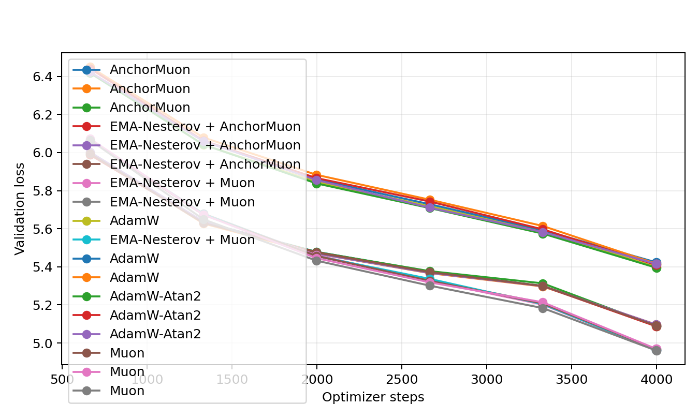
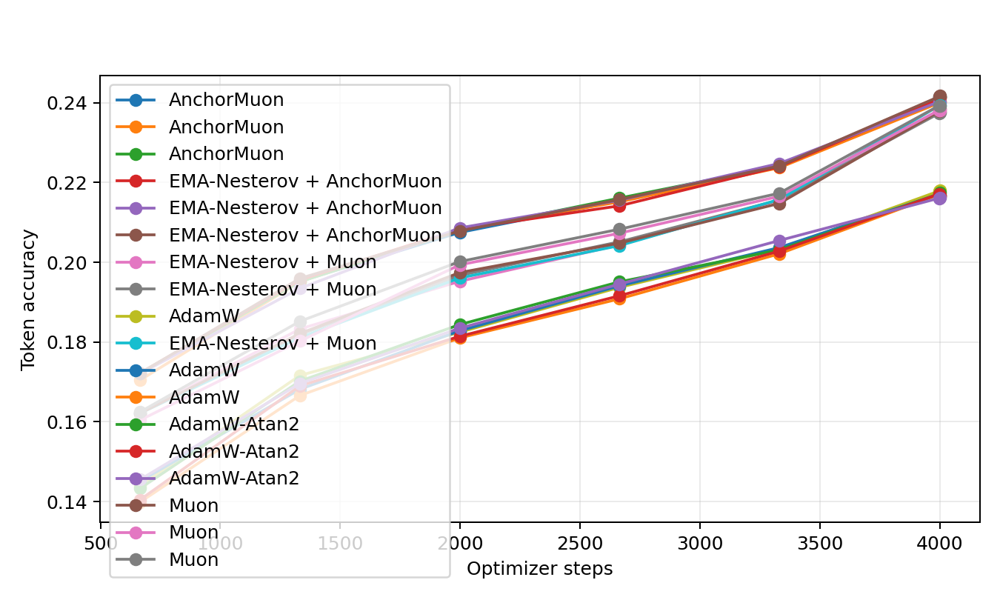
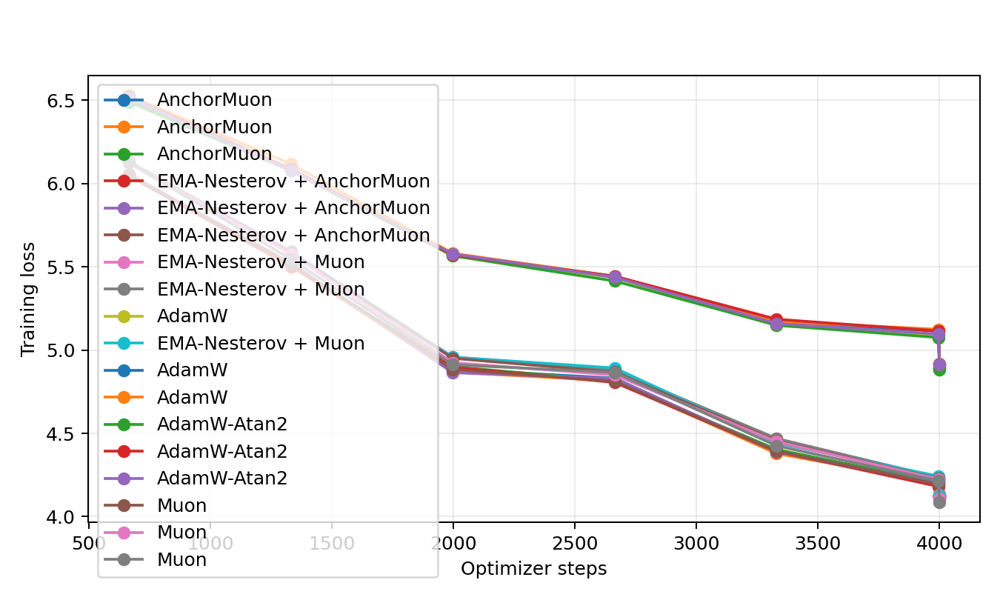
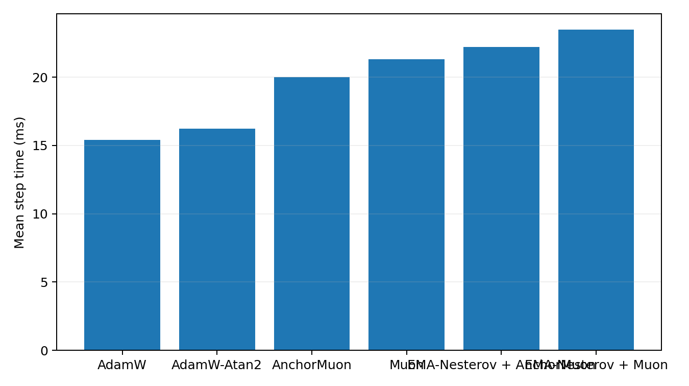
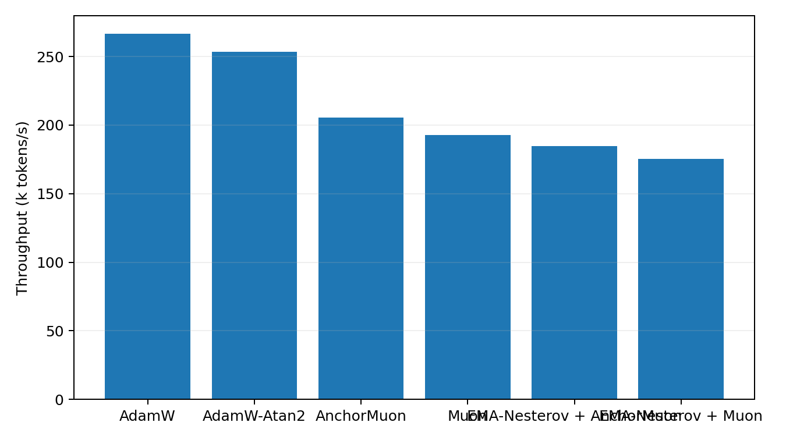

# Tokenized 50M LLM Optimizer Comparison

This benchmark uses real text tokenized with the Hugging Face `gpt2` tokenizer. It is the preferred language-model optimizer transfer check because embeddings, output head, and sequence statistics are closer to a normal BPE/SentencePiece pretraining setup than the older byte-level path.

## Setup

- Dataset: `HuggingFaceFW/fineweb-edu/sample-10BT:train [gpt2]`
- Tokenizer: `gpt2`
- Train tokens cached: 8,000,000
- Validation tokens cached: 524,288
- Model: decoder-only GPT, layers=8, width=512, heads=8, context=256, vocab=50,257
- Trainable parameters: 51045888
- Batch: 16 sequences x 256 tokens
- HPO: 600 steps per candidate, selected by best validation loss
- Final replay: 4000 steps per selected optimizer
- Validation estimate: 16 sequential batches per evaluation point
- Final extra validation: 128 sequential batches
- GPUs: 2 visible, one trial per GPU

## Final Results

| Rank | Optimizer | Selected config | Final val loss | Best val loss | Final token acc | Full val loss | Full token acc | Step time | Throughput |
|---:|---|---|---:|---:|---:|---:|---:|---:|---:|
| 1 | Muon | lr=0.0012, wd=0.05 | 4.9602 | 4.9602 | 23.92% | 5.0114 | 23.75% | 21.25 ms | 192.8k tok/s |
| 2 | EMA-Nesterov + Muon | lr=0.0016, wd=0.05, ema_beta=0.05, ema_gamma=0.995 | 4.9613 | 4.9613 | 23.94% | 5.0148 | 23.66% | 23.38 ms | 175.2k tok/s |
| 3 | EMA-Nesterov + Muon | lr=0.0016, wd=0.05, ema_beta=0.2, ema_gamma=0.995 | 4.9619 | 4.9619 | 23.77% | 5.0152 | 23.68% | 23.38 ms | 175.2k tok/s |
| 4 | EMA-Nesterov + Muon | lr=0.0016, wd=0.05, ema_beta=0.1, ema_gamma=0.995 | 4.9633 | 4.9633 | 23.76% | 5.0126 | 23.76% | 23.46 ms | 174.6k tok/s |
| 5 | Muon | lr=0.0016, wd=0.05 | 4.9668 | 4.9668 | 23.85% | 5.0145 | 23.72% | 21.25 ms | 192.8k tok/s |
| 6 | Muon | lr=0.0014, wd=0.05 | 4.9693 | 4.9693 | 23.81% | 5.0170 | 23.66% | 21.32 ms | 192.1k tok/s |
| 7 | EMA-Nesterov + AnchorMuon | lr=0.0016, wd=0.05, row_gamma=0, pmuon_beta=0.9, normuon_beta2=0.93, fallback=rms@1x, soda=0.0003, ema_beta=0.3, ema_gamma=0.995 | 5.0864 | 5.0864 | 24.15% | 5.1473 | 24.02% | 22.16 ms | 184.9k tok/s |
| 8 | AnchorMuon | lr=0.0016, wd=0.05, row_gamma=0, pmuon_beta=0.9, normuon_beta2=0.93, fallback=rms@1x, soda=0.0003 | 5.0883 | 5.0883 | 24.15% | 5.1453 | 24.02% | 19.94 ms | 205.4k tok/s |
| 9 | EMA-Nesterov + AnchorMuon | lr=0.0016, wd=0.05, row_gamma=0, pmuon_beta=0.9, normuon_beta2=0.93, fallback=rms@1x, soda=0.003, ema_beta=0.3, ema_gamma=0.995 | 5.0891 | 5.0891 | 24.17% | 5.1468 | 23.96% | 22.16 ms | 184.8k tok/s |
| 10 | AnchorMuon | lr=0.0016, wd=0.05, row_gamma=0.15, pmuon_beta=0.9, normuon_beta2=0.93, fallback=rms@1x, soda=0.003 | 5.0893 | 5.0893 | 24.15% | 5.1491 | 23.98% | 19.94 ms | 205.4k tok/s |
| 11 | EMA-Nesterov + AnchorMuon | lr=0.0016, wd=0.05, row_gamma=0.15, pmuon_beta=0.9, normuon_beta2=0.93, fallback=rms@1x, soda=0.0003, ema_beta=0.3, ema_gamma=0.995 | 5.0955 | 5.0955 | 24.01% | 5.1470 | 23.98% | 22.19 ms | 184.6k tok/s |
| 12 | AnchorMuon | lr=0.0016, wd=0.05, row_gamma=0.15, pmuon_beta=0.9, normuon_beta2=0.93, fallback=rms@1x, soda=0.001 | 5.0961 | 5.0961 | 24.03% | 5.1451 | 23.98% | 19.99 ms | 204.9k tok/s |
| 13 | AdamW-Atan2 | lr=0.0005, wd=0.05 | 5.3954 | 5.3954 | 21.74% | 5.4296 | 21.58% | 16.22 ms | 252.5k tok/s |
| 14 | AdamW | lr=0.0005, wd=0.05 | 5.4002 | 5.3998 | 21.80% | 5.4321 | 21.55% | 15.41 ms | 265.8k tok/s |
| 15 | AdamW-Atan2 | lr=0.0006, wd=0.05 | 5.4106 | 5.4102 | 21.68% | 5.4420 | 21.50% | 16.17 ms | 253.3k tok/s |
| 16 | AdamW-Atan2 | lr=0.0004, wd=0.05 | 5.4154 | 5.4154 | 21.62% | 5.4473 | 21.47% | 16.21 ms | 252.6k tok/s |
| 17 | AdamW | lr=0.0006, wd=0.05 | 5.4156 | 5.4156 | 21.65% | 5.4507 | 21.48% | 15.38 ms | 266.4k tok/s |
| 18 | AdamW | lr=0.0004, wd=0.05 | 5.4240 | 5.4238 | 21.68% | 5.4533 | 21.40% | 15.41 ms | 265.8k tok/s |

## Plots

## HPO Candidates

| Family | Trial | LR | Best val loss | Final val loss | Step time |
|---|---|---:|---:|---:|---:|
| adamatan2 | `ema_anchor_ref_adamatan2_lr0.0005` | 0.0005 | 6.4115 | 6.4115 | 16.15 ms |
| adamatan2 | `ema_anchor_ref_adamatan2_lr0.0006` | 0.0006 | 6.4168 | 6.4168 | 16.20 ms |
| adamatan2 | `ema_anchor_ref_adamatan2_lr0.0004` | 0.0004 | 6.4249 | 6.4249 | 16.14 ms |
| adamw | `ema_anchor_ref_adamw_lr0.0005` | 0.0005 | 6.4110 | 6.4110 | 15.42 ms |
| adamw | `ema_anchor_ref_adamw_lr0.0004` | 0.0004 | 6.4193 | 6.4193 | 15.45 ms |
| adamw | `ema_anchor_ref_adamw_lr0.0006` | 0.0006 | 6.4263 | 6.4263 | 15.48 ms |
| anchormuon | `ema_anchor_ref_anchor_lr0.0016_rg0.15_soda0.003_flr1_rms` | 0.0016 | 5.9782 | 5.9782 | 20.47 ms |
| anchormuon | `ema_anchor_ref_anchor_lr0.0016_rg0.15_soda0.001_flr1_rms` | 0.0016 | 5.9784 | 5.9784 | 20.43 ms |
| anchormuon | `ema_anchor_ref_anchor_lr0.0016_rg0_soda0.0003_flr1_rms` | 0.0016 | 5.9784 | 5.9784 | 20.44 ms |
| anchormuon | `ema_anchor_ref_anchor_lr0.0016_rg0.25_soda0.0003_flr1_rms` | 0.0016 | 5.9784 | 5.9784 | 20.41 ms |
| anchormuon | `ema_anchor_ref_anchor_lr0.0016_rg0.25_soda0.003_flr1_rms` | 0.0016 | 5.9785 | 5.9785 | 20.34 ms |
| anchormuon | `ema_anchor_ref_anchor_lr0.0016_rg0_soda0.003_flr1_rms` | 0.0016 | 5.9786 | 5.9786 | 20.44 ms |
| anchormuon | `ema_anchor_ref_anchor_lr0.0016_rg0.15_soda0.0003_flr1_rms` | 0.0016 | 5.9788 | 5.9788 | 20.41 ms |
| anchormuon | `ema_anchor_ref_anchor_lr0.0016_rg0.25_soda0.01_flr1_rms` | 0.0016 | 5.9793 | 5.9793 | 20.49 ms |
| anchormuon | `ema_anchor_ref_anchor_lr0.0016_rg0.25_soda0.001_flr1_rms` | 0.0016 | 5.9793 | 5.9793 | 20.59 ms |
| anchormuon | `ema_anchor_ref_anchor_lr0.0016_rg0_soda0.01_flr1_rms` | 0.0016 | 5.9794 | 5.9794 | 20.38 ms |
| anchormuon | `ema_anchor_ref_anchor_lr0.0016_rg0.15_soda0.01_flr1_rms` | 0.0016 | 5.9794 | 5.9794 | 20.35 ms |
| anchormuon | `ema_anchor_ref_anchor_lr0.0016_rg0_soda0.003_flr0.75_rms` | 0.0016 | 5.9799 | 5.9799 | 20.45 ms |
| anchormuon | `ema_anchor_ref_anchor_lr0.0016_rg0.35_soda0.01_flr1_rms` | 0.0016 | 5.9800 | 5.9800 | 20.46 ms |
| anchormuon | `ema_anchor_ref_anchor_lr0.0016_rg0.35_soda0.0003_flr1_rms` | 0.0016 | 5.9800 | 5.9800 | 20.48 ms |
| anchormuon | `ema_anchor_ref_anchor_lr0.0016_rg0_soda0.0003_flr0.75_rms` | 0.0016 | 5.9800 | 5.9800 | 20.46 ms |
| anchormuon | `ema_anchor_ref_anchor_lr0.0016_rg0.15_soda0.0003_flr0.75_rms` | 0.0016 | 5.9802 | 5.9802 | 20.45 ms |
| anchormuon | `ema_anchor_ref_anchor_lr0.0016_rg0_soda0.001_flr0.75_rms` | 0.0016 | 5.9803 | 5.9803 | 20.46 ms |
| anchormuon | `ema_anchor_ref_anchor_lr0.0016_rg0_soda0.001_flr1_rms` | 0.0016 | 5.9804 | 5.9804 | 20.35 ms |
| anchormuon | `ema_anchor_ref_anchor_lr0.0016_rg0.15_soda0.001_flr0.75_rms` | 0.0016 | 5.9807 | 5.9807 | 20.46 ms |
| anchormuon | `ema_anchor_ref_anchor_lr0.0016_rg0.35_soda0.003_flr1_rms` | 0.0016 | 5.9807 | 5.9807 | 20.50 ms |
| anchormuon | `ema_anchor_ref_anchor_lr0.0016_rg0.55_soda0.001_flr1_rms` | 0.0016 | 5.9808 | 5.9808 | 20.39 ms |
| anchormuon | `ema_anchor_ref_anchor_lr0.0016_rg0.45_soda0.003_flr1_rms` | 0.0016 | 5.9812 | 5.9812 | 20.52 ms |
| anchormuon | `ema_anchor_ref_anchor_lr0.0016_rg0.35_soda0.001_flr1_rms` | 0.0016 | 5.9814 | 5.9814 | 20.46 ms |
| anchormuon | `ema_anchor_ref_anchor_lr0.0016_rg0.15_soda0.003_flr0.75_rms` | 0.0016 | 5.9816 | 5.9816 | 20.40 ms |
| anchormuon | `ema_anchor_ref_anchor_lr0.0016_rg0.55_soda0.01_flr1_rms` | 0.0016 | 5.9817 | 5.9817 | 20.49 ms |
| anchormuon | `ema_anchor_ref_anchor_lr0.0016_rg0.55_soda0.0003_flr1_rms` | 0.0016 | 5.9818 | 5.9818 | 20.39 ms |
| anchormuon | `ema_anchor_ref_anchor_lr0.0016_rg0.15_soda0.01_flr0.75_rms` | 0.0016 | 5.9821 | 5.9821 | 20.47 ms |
| anchormuon | `ema_anchor_ref_anchor_lr0.0016_rg0.45_soda0.0003_flr1_rms` | 0.0016 | 5.9823 | 5.9823 | 20.47 ms |
| anchormuon | `ema_anchor_ref_anchor_lr0.0016_rg0.45_soda0.001_flr1_rms` | 0.0016 | 5.9825 | 5.9825 | 20.46 ms |
| anchormuon | `ema_anchor_ref_anchor_lr0.0016_rg0.55_soda0.003_flr1_rms` | 0.0016 | 5.9826 | 5.9826 | 20.45 ms |
| anchormuon | `ema_anchor_ref_anchor_lr0.0016_rg0.45_soda0.01_flr1_rms` | 0.0016 | 5.9827 | 5.9827 | 20.34 ms |
| anchormuon | `ema_anchor_ref_anchor_lr0.0016_rg0.25_soda0.0003_flr0.75_rms` | 0.0016 | 5.9828 | 5.9828 | 20.56 ms |
| anchormuon | `ema_anchor_ref_anchor_lr0.0016_rg0_soda0.01_flr0.75_rms` | 0.0016 | 5.9832 | 5.9832 | 20.54 ms |
| anchormuon | `ema_anchor_ref_anchor_lr0.0016_rg0.55_soda0.0003_flr0.75_rms` | 0.0016 | 5.9833 | 5.9833 | 20.53 ms |
| anchormuon | `ema_anchor_ref_anchor_lr0.0016_rg0.25_soda0.001_flr0.75_rms` | 0.0016 | 5.9840 | 5.9840 | 20.51 ms |
| anchormuon | `ema_anchor_ref_anchor_lr0.0016_rg0.25_soda0.01_flr0.75_rms` | 0.0016 | 5.9840 | 5.9840 | 20.45 ms |
| anchormuon | `ema_anchor_ref_anchor_lr0.0016_rg0.25_soda0.003_flr0.75_rms` | 0.0016 | 5.9841 | 5.9841 | 20.47 ms |
| anchormuon | `ema_anchor_ref_anchor_lr0.0016_rg0.35_soda0.0003_flr0.75_rms` | 0.0016 | 5.9842 | 5.9842 | 20.54 ms |
| anchormuon | `ema_anchor_ref_anchor_lr0.0016_rg0.55_soda0.001_flr0.75_rms` | 0.0016 | 5.9844 | 5.9844 | 20.55 ms |
| anchormuon | `ema_anchor_ref_anchor_lr0.0016_rg0.45_soda0.01_flr0.75_rms` | 0.0016 | 5.9846 | 5.9846 | 20.55 ms |
| anchormuon | `ema_anchor_ref_anchor_lr0.0016_rg0.35_soda0.003_flr0.75_rms` | 0.0016 | 5.9846 | 5.9846 | 20.47 ms |
| anchormuon | `ema_anchor_ref_anchor_lr0.0016_rg0.55_soda0.003_flr0.75_rms` | 0.0016 | 5.9847 | 5.9847 | 20.45 ms |
| anchormuon | `ema_anchor_ref_anchor_lr0.0016_rg0.45_soda0.003_flr0.75_rms` | 0.0016 | 5.9849 | 5.9849 | 20.43 ms |
| anchormuon | `ema_anchor_ref_anchor_lr0.0016_rg0.45_soda0.0003_flr0.75_rms` | 0.0016 | 5.9853 | 5.9853 | 20.47 ms |
| anchormuon | `ema_anchor_ref_anchor_lr0.0016_rg0.35_soda0.01_flr0.75_rms` | 0.0016 | 5.9855 | 5.9855 | 20.58 ms |
| anchormuon | `ema_anchor_ref_anchor_lr0.0016_rg0.55_soda0.01_flr0.75_rms` | 0.0016 | 5.9859 | 5.9859 | 20.34 ms |
| anchormuon | `ema_anchor_ref_anchor_lr0.0016_rg0.35_soda0.001_flr0.75_rms` | 0.0016 | 5.9869 | 5.9869 | 20.39 ms |
| anchormuon | `ema_anchor_ref_anchor_lr0.00145_rg0.15_soda0.01_flr1_rms` | 0.00145 | 5.9869 | 5.9869 | 20.42 ms |
| anchormuon | `ema_anchor_ref_anchor_lr0.0016_rg0_soda0.0003_flr0.5_atan2` | 0.0016 | 5.9871 | 5.9871 | 20.66 ms |
| anchormuon | `ema_anchor_ref_anchor_lr0.00145_rg0.25_soda0.003_flr1_rms` | 0.00145 | 5.9872 | 5.9872 | 20.45 ms |
| anchormuon | `ema_anchor_ref_anchor_lr0.0016_rg0.45_soda0.001_flr0.75_rms` | 0.0016 | 5.9873 | 5.9873 | 20.48 ms |
| anchormuon | `ema_anchor_ref_anchor_lr0.00145_rg0.25_soda0.0003_flr1_rms` | 0.00145 | 5.9877 | 5.9877 | 20.46 ms |
| anchormuon | `ema_anchor_ref_anchor_lr0.0016_rg0_soda0.001_flr0.5_atan2` | 0.0016 | 5.9880 | 5.9880 | 20.78 ms |
| anchormuon | `ema_anchor_ref_anchor_lr0.0016_rg0.35_soda0.01_flr0.5_atan2` | 0.0016 | 5.9885 | 5.9885 | 20.85 ms |
| anchormuon | `ema_anchor_ref_anchor_lr0.00145_rg0.15_soda0.001_flr1_rms` | 0.00145 | 5.9886 | 5.9886 | 20.32 ms |
| anchormuon | `ema_anchor_ref_anchor_lr0.00145_rg0.25_soda0.001_flr1_rms` | 0.00145 | 5.9887 | 5.9887 | 20.57 ms |
| anchormuon | `ema_anchor_ref_anchor_lr0.00145_rg0.25_soda0.01_flr1_rms` | 0.00145 | 5.9889 | 5.9889 | 20.45 ms |
| anchormuon | `ema_anchor_ref_anchor_lr0.00145_rg0.15_soda0.003_flr1_rms` | 0.00145 | 5.9889 | 5.9889 | 20.33 ms |
| anchormuon | `ema_anchor_ref_anchor_lr0.0016_rg0_soda0.003_flr0.5_atan2` | 0.0016 | 5.9890 | 5.9890 | 20.88 ms |
| anchormuon | `ema_anchor_ref_anchor_lr0.00145_rg0.45_soda0.001_flr1_rms` | 0.00145 | 5.9892 | 5.9892 | 20.44 ms |
| anchormuon | `ema_anchor_ref_anchor_lr0.0016_rg0_soda0.01_flr0.5_atan2` | 0.0016 | 5.9893 | 5.9893 | 20.77 ms |
| anchormuon | `ema_anchor_ref_anchor_lr0.00145_rg0.35_soda0.01_flr1_rms` | 0.00145 | 5.9893 | 5.9893 | 20.45 ms |
| anchormuon | `ema_anchor_ref_anchor_lr0.00145_rg0.45_soda0.003_flr1_rms` | 0.00145 | 5.9893 | 5.9893 | 20.44 ms |
| anchormuon | `ema_anchor_ref_anchor_lr0.00145_rg0.15_soda0.0003_flr1_rms` | 0.00145 | 5.9897 | 5.9897 | 20.47 ms |
| anchormuon | `ema_anchor_ref_anchor_lr0.0016_rg0.35_soda0.003_flr0.5_atan2` | 0.0016 | 5.9901 | 5.9901 | 20.79 ms |
| anchormuon | `ema_anchor_ref_anchor_lr0.00145_rg0_soda0.003_flr1_rms` | 0.00145 | 5.9902 | 5.9902 | 20.40 ms |
| anchormuon | `ema_anchor_ref_anchor_lr0.00145_rg0_soda0.0003_flr1_rms` | 0.00145 | 5.9903 | 5.9903 | 20.32 ms |
| anchormuon | `ema_anchor_ref_anchor_lr0.00145_rg0_soda0.01_flr1_rms` | 0.00145 | 5.9903 | 5.9903 | 20.34 ms |
| anchormuon | `ema_anchor_ref_anchor_lr0.00145_rg0.35_soda0.0003_flr1_rms` | 0.00145 | 5.9904 | 5.9904 | 20.44 ms |
| anchormuon | `ema_anchor_ref_anchor_lr0.0016_rg0.25_soda0.0003_flr0.5_atan2` | 0.0016 | 5.9905 | 5.9905 | 20.71 ms |
| anchormuon | `ema_anchor_ref_anchor_lr0.00145_rg0.35_soda0.001_flr1_rms` | 0.00145 | 5.9907 | 5.9907 | 20.48 ms |
| anchormuon | `ema_anchor_ref_anchor_lr0.00145_rg0.35_soda0.003_flr1_rms` | 0.00145 | 5.9907 | 5.9907 | 20.45 ms |
| anchormuon | `ema_anchor_ref_anchor_lr0.0016_rg0.25_soda0.003_flr0.5_atan2` | 0.0016 | 5.9909 | 5.9909 | 20.82 ms |
| anchormuon | `ema_anchor_ref_anchor_lr0.00145_rg0_soda0.001_flr1_rms` | 0.00145 | 5.9909 | 5.9909 | 20.43 ms |
| anchormuon | `ema_anchor_ref_anchor_lr0.0016_rg0.35_soda0.0003_flr0.5_atan2` | 0.0016 | 5.9911 | 5.9911 | 20.75 ms |
| anchormuon | `ema_anchor_ref_anchor_lr0.0016_rg0.15_soda0.01_flr0.5_atan2` | 0.0016 | 5.9912 | 5.9912 | 20.80 ms |
| anchormuon | `ema_anchor_ref_anchor_lr0.00145_rg0.55_soda0.003_flr1_rms` | 0.00145 | 5.9913 | 5.9913 | 20.37 ms |
| anchormuon | `ema_anchor_ref_anchor_lr0.00145_rg0.45_soda0.0003_flr1_rms` | 0.00145 | 5.9917 | 5.9917 | 20.51 ms |
| anchormuon | `ema_anchor_ref_anchor_lr0.0016_rg0.35_soda0.001_flr0.5_atan2` | 0.0016 | 5.9917 | 5.9917 | 20.89 ms |
| anchormuon | `ema_anchor_ref_anchor_lr0.00145_rg0.45_soda0.01_flr1_rms` | 0.00145 | 5.9918 | 5.9918 | 20.41 ms |
| anchormuon | `ema_anchor_ref_anchor_lr0.0016_rg0.45_soda0.001_flr0.5_atan2` | 0.0016 | 5.9921 | 5.9921 | 20.70 ms |
| anchormuon | `ema_anchor_ref_anchor_lr0.0016_rg0.15_soda0.003_flr0.5_atan2` | 0.0016 | 5.9923 | 5.9923 | 20.92 ms |
| anchormuon | `ema_anchor_ref_anchor_lr0.0016_rg0.55_soda0.001_flr0.5_atan2` | 0.0016 | 5.9924 | 5.9924 | 20.86 ms |
| anchormuon | `ema_anchor_ref_anchor_lr0.00145_rg0.25_soda0.0003_flr0.75_rms` | 0.00145 | 5.9924 | 5.9924 | 20.32 ms |
| anchormuon | `ema_anchor_ref_anchor_lr0.0016_rg0.45_soda0.0003_flr0.5_atan2` | 0.0016 | 5.9924 | 5.9924 | 20.88 ms |
| anchormuon | `ema_anchor_ref_anchor_lr0.0016_rg0.45_soda0.01_flr0.5_atan2` | 0.0016 | 5.9924 | 5.9924 | 20.78 ms |
| anchormuon | `ema_anchor_ref_anchor_lr0.0016_rg0.55_soda0.0003_flr0.5_atan2` | 0.0016 | 5.9924 | 5.9924 | 20.77 ms |
| anchormuon | `ema_anchor_ref_anchor_lr0.00145_rg0.15_soda0.0003_flr0.75_rms` | 0.00145 | 5.9927 | 5.9927 | 20.34 ms |
| anchormuon | `ema_anchor_ref_anchor_lr0.0016_rg0.25_soda0.001_flr0.5_atan2` | 0.0016 | 5.9927 | 5.9927 | 20.82 ms |
| anchormuon | `ema_anchor_ref_anchor_lr0.00145_rg0.55_soda0.01_flr1_rms` | 0.00145 | 5.9929 | 5.9929 | 20.37 ms |
| anchormuon | `ema_anchor_ref_anchor_lr0.00145_rg0.35_soda0.003_flr0.75_rms` | 0.00145 | 5.9930 | 5.9930 | 20.35 ms |
| anchormuon | `ema_anchor_ref_anchor_lr0.00145_rg0.25_soda0.003_flr0.75_rms` | 0.00145 | 5.9930 | 5.9930 | 20.44 ms |
| anchormuon | `ema_anchor_ref_anchor_lr0.00145_rg0.55_soda0.001_flr1_rms` | 0.00145 | 5.9931 | 5.9931 | 20.38 ms |
| anchormuon | `ema_anchor_ref_anchor_lr0.0016_rg0.15_soda0.0003_flr0.5_atan2` | 0.0016 | 5.9931 | 5.9931 | 20.79 ms |
| anchormuon | `ema_anchor_ref_anchor_lr0.00145_rg0.35_soda0.01_flr0.75_rms` | 0.00145 | 5.9932 | 5.9932 | 20.35 ms |
| anchormuon | `ema_anchor_ref_anchor_lr0.00145_rg0.15_soda0.003_flr0.75_rms` | 0.00145 | 5.9932 | 5.9932 | 20.51 ms |
| anchormuon | `ema_anchor_ref_anchor_lr0.00145_rg0_soda0.01_flr0.75_rms` | 0.00145 | 5.9933 | 5.9933 | 20.43 ms |
| anchormuon | `ema_anchor_ref_anchor_lr0.0016_rg0.25_soda0.01_flr0.5_atan2` | 0.0016 | 5.9933 | 5.9933 | 20.89 ms |
| anchormuon | `ema_anchor_ref_anchor_lr0.00145_rg0.35_soda0.001_flr0.75_rms` | 0.00145 | 5.9933 | 5.9933 | 20.39 ms |
| anchormuon | `ema_anchor_ref_anchor_lr0.00145_rg0.55_soda0.0003_flr1_rms` | 0.00145 | 5.9933 | 5.9933 | 20.36 ms |
| anchormuon | `ema_anchor_ref_anchor_lr0.00145_rg0.35_soda0.0003_flr0.75_rms` | 0.00145 | 5.9935 | 5.9935 | 20.46 ms |
| anchormuon | `ema_anchor_ref_anchor_lr0.0016_rg0.45_soda0.003_flr0.5_atan2` | 0.0016 | 5.9935 | 5.9935 | 20.94 ms |
| anchormuon | `ema_anchor_ref_anchor_lr0.00145_rg0.45_soda0.0003_flr0.75_rms` | 0.00145 | 5.9935 | 5.9935 | 20.45 ms |
| anchormuon | `ema_anchor_ref_anchor_lr0.00145_rg0.55_soda0.003_flr0.75_rms` | 0.00145 | 5.9936 | 5.9936 | 20.61 ms |
| anchormuon | `ema_anchor_ref_anchor_lr0.0016_rg0.15_soda0.001_flr0.5_atan2` | 0.0016 | 5.9938 | 5.9938 | 20.67 ms |
| anchormuon | `ema_anchor_ref_anchor_lr0.00145_rg0.45_soda0.003_flr0.75_rms` | 0.00145 | 5.9938 | 5.9938 | 20.55 ms |
| anchormuon | `ema_anchor_ref_anchor_lr0.00145_rg0_soda0.003_flr0.75_rms` | 0.00145 | 5.9939 | 5.9939 | 20.46 ms |
| anchormuon | `ema_anchor_ref_anchor_lr0.00145_rg0.15_soda0.001_flr0.75_rms` | 0.00145 | 5.9939 | 5.9939 | 20.49 ms |
| anchormuon | `ema_anchor_ref_anchor_lr0.00145_rg0_soda0.001_flr0.75_rms` | 0.00145 | 5.9940 | 5.9940 | 20.49 ms |
| anchormuon | `ema_anchor_ref_anchor_lr0.00145_rg0.25_soda0.001_flr0.75_rms` | 0.00145 | 5.9944 | 5.9944 | 20.35 ms |
| anchormuon | `ema_anchor_ref_anchor_lr0.00145_rg0.45_soda0.001_flr0.75_rms` | 0.00145 | 5.9945 | 5.9945 | 20.56 ms |
| anchormuon | `ema_anchor_ref_anchor_lr0.0016_rg0.55_soda0.01_flr0.5_atan2` | 0.0016 | 5.9945 | 5.9945 | 20.80 ms |
| anchormuon | `ema_anchor_ref_anchor_lr0.00145_rg0.25_soda0.01_flr0.75_rms` | 0.00145 | 5.9946 | 5.9946 | 20.48 ms |
| anchormuon | `ema_anchor_ref_anchor_lr0.00145_rg0.55_soda0.0003_flr0.75_rms` | 0.00145 | 5.9947 | 5.9947 | 20.50 ms |
| anchormuon | `ema_anchor_ref_anchor_lr0.00145_rg0.45_soda0.01_flr0.75_rms` | 0.00145 | 5.9951 | 5.9951 | 20.56 ms |
| anchormuon | `ema_anchor_ref_anchor_lr0.00145_rg0_soda0.0003_flr0.75_rms` | 0.00145 | 5.9951 | 5.9951 | 20.43 ms |
| anchormuon | `ema_anchor_ref_anchor_lr0.00145_rg0.15_soda0.01_flr0.75_rms` | 0.00145 | 5.9952 | 5.9952 | 20.56 ms |
| anchormuon | `ema_anchor_ref_anchor_lr0.00145_rg0.55_soda0.01_flr0.75_rms` | 0.00145 | 5.9954 | 5.9954 | 20.53 ms |
| anchormuon | `ema_anchor_ref_anchor_lr0.00145_rg0.55_soda0.001_flr0.75_rms` | 0.00145 | 5.9958 | 5.9958 | 20.50 ms |
| anchormuon | `ema_anchor_ref_anchor_lr0.0016_rg0.55_soda0.003_flr0.5_atan2` | 0.0016 | 5.9969 | 5.9969 | 20.68 ms |
| anchormuon | `ema_anchor_ref_anchor_lr0.00145_rg0.15_soda0.0003_flr0.5_atan2` | 0.00145 | 5.9986 | 5.9986 | 20.78 ms |
| anchormuon | `ema_anchor_ref_anchor_lr0.00145_rg0.15_soda0.003_flr0.5_atan2` | 0.00145 | 5.9987 | 5.9987 | 20.84 ms |
| anchormuon | `ema_anchor_ref_anchor_lr0.00145_rg0.15_soda0.001_flr0.5_atan2` | 0.00145 | 5.9991 | 5.9991 | 20.78 ms |
| anchormuon | `ema_anchor_ref_anchor_lr0.00145_rg0_soda0.0003_flr0.5_atan2` | 0.00145 | 5.9995 | 5.9995 | 20.82 ms |
| anchormuon | `ema_anchor_ref_anchor_lr0.00145_rg0_soda0.003_flr0.5_atan2` | 0.00145 | 5.9996 | 5.9996 | 20.84 ms |
| anchormuon | `ema_anchor_ref_anchor_lr0.00145_rg0.15_soda0.01_flr0.5_atan2` | 0.00145 | 5.9997 | 5.9997 | 20.71 ms |
| anchormuon | `ema_anchor_ref_anchor_lr0.00145_rg0.25_soda0.003_flr0.5_atan2` | 0.00145 | 6.0005 | 6.0005 | 20.80 ms |
| anchormuon | `ema_anchor_ref_anchor_lr0.00145_rg0_soda0.01_flr0.5_atan2` | 0.00145 | 6.0009 | 6.0009 | 20.71 ms |
| anchormuon | `ema_anchor_ref_anchor_lr0.00145_rg0_soda0.001_flr0.5_atan2` | 0.00145 | 6.0016 | 6.0016 | 20.81 ms |
| anchormuon | `ema_anchor_ref_anchor_lr0.00145_rg0.45_soda0.003_flr0.5_atan2` | 0.00145 | 6.0018 | 6.0018 | 20.85 ms |
| anchormuon | `ema_anchor_ref_anchor_lr0.00145_rg0.25_soda0.0003_flr0.5_atan2` | 0.00145 | 6.0019 | 6.0019 | 20.85 ms |
| anchormuon | `ema_anchor_ref_anchor_lr0.00145_rg0.25_soda0.01_flr0.5_atan2` | 0.00145 | 6.0023 | 6.0023 | 20.92 ms |
| anchormuon | `ema_anchor_ref_anchor_lr0.00145_rg0.55_soda0.0003_flr0.5_atan2` | 0.00145 | 6.0023 | 6.0023 | 20.79 ms |
| anchormuon | `ema_anchor_ref_anchor_lr0.00145_rg0.55_soda0.01_flr0.5_atan2` | 0.00145 | 6.0025 | 6.0025 | 20.79 ms |
| anchormuon | `ema_anchor_ref_anchor_lr0.00145_rg0.35_soda0.0003_flr0.5_atan2` | 0.00145 | 6.0027 | 6.0027 | 20.67 ms |
| anchormuon | `ema_anchor_ref_anchor_lr0.00145_rg0.25_soda0.001_flr0.5_atan2` | 0.00145 | 6.0027 | 6.0027 | 20.79 ms |
| anchormuon | `ema_anchor_ref_anchor_lr0.00145_rg0.45_soda0.0003_flr0.5_atan2` | 0.00145 | 6.0035 | 6.0035 | 20.77 ms |
| anchormuon | `ema_anchor_ref_anchor_lr0.00145_rg0.35_soda0.001_flr0.5_atan2` | 0.00145 | 6.0035 | 6.0035 | 20.82 ms |
| anchormuon | `ema_anchor_ref_anchor_lr0.00145_rg0.55_soda0.003_flr0.5_atan2` | 0.00145 | 6.0036 | 6.0036 | 20.95 ms |
| anchormuon | `ema_anchor_ref_anchor_lr0.00145_rg0.55_soda0.001_flr0.5_atan2` | 0.00145 | 6.0040 | 6.0040 | 20.77 ms |
| anchormuon | `ema_anchor_ref_anchor_lr0.00145_rg0.35_soda0.003_flr0.5_atan2` | 0.00145 | 6.0041 | 6.0041 | 20.83 ms |
| anchormuon | `ema_anchor_ref_anchor_lr0.00145_rg0.35_soda0.01_flr0.5_atan2` | 0.00145 | 6.0042 | 6.0042 | 20.79 ms |
| anchormuon | `ema_anchor_ref_anchor_lr0.00145_rg0.45_soda0.001_flr0.5_atan2` | 0.00145 | 6.0044 | 6.0044 | 20.79 ms |
| anchormuon | `ema_anchor_ref_anchor_lr0.00145_rg0.45_soda0.01_flr0.5_atan2` | 0.00145 | 6.0046 | 6.0046 | 20.81 ms |
| anchormuon | `ema_anchor_ref_anchor_lr0.0013_rg0.25_soda0.0003_flr1_rms` | 0.0013 | 6.0056 | 6.0056 | 20.39 ms |
| anchormuon | `ema_anchor_ref_anchor_lr0.0013_rg0.35_soda0.003_flr1_rms` | 0.0013 | 6.0057 | 6.0057 | 20.34 ms |
| anchormuon | `ema_anchor_ref_anchor_lr0.0013_rg0.15_soda0.001_flr1_rms` | 0.0013 | 6.0060 | 6.0060 | 20.34 ms |
| anchormuon | `ema_anchor_ref_anchor_lr0.0013_rg0.35_soda0.0003_flr1_rms` | 0.0013 | 6.0061 | 6.0061 | 20.48 ms |
| anchormuon | `ema_anchor_ref_anchor_lr0.0013_rg0.15_soda0.003_flr1_rms` | 0.0013 | 6.0062 | 6.0062 | 20.40 ms |
| anchormuon | `ema_anchor_ref_anchor_lr0.0013_rg0.15_soda0.01_flr1_rms` | 0.0013 | 6.0063 | 6.0063 | 20.33 ms |
| anchormuon | `ema_anchor_ref_anchor_lr0.0013_rg0.25_soda0.003_flr1_rms` | 0.0013 | 6.0064 | 6.0064 | 20.45 ms |
| anchormuon | `ema_anchor_ref_anchor_lr0.0013_rg0.35_soda0.003_flr0.75_rms` | 0.0013 | 6.0064 | 6.0064 | 20.59 ms |
| anchormuon | `ema_anchor_ref_anchor_lr0.0013_rg0.15_soda0.0003_flr1_rms` | 0.0013 | 6.0064 | 6.0064 | 20.58 ms |
| anchormuon | `ema_anchor_ref_anchor_lr0.0013_rg0.35_soda0.01_flr1_rms` | 0.0013 | 6.0064 | 6.0064 | 20.48 ms |
| anchormuon | `ema_anchor_ref_anchor_lr0.0013_rg0.25_soda0.0003_flr0.75_rms` | 0.0013 | 6.0064 | 6.0064 | 20.57 ms |
| anchormuon | `ema_anchor_ref_anchor_lr0.0013_rg0.25_soda0.001_flr1_rms` | 0.0013 | 6.0065 | 6.0065 | 20.38 ms |
| anchormuon | `ema_anchor_ref_anchor_lr0.0013_rg0.35_soda0.0003_flr0.75_rms` | 0.0013 | 6.0065 | 6.0065 | 20.38 ms |
| anchormuon | `ema_anchor_ref_anchor_lr0.0013_rg0.35_soda0.001_flr1_rms` | 0.0013 | 6.0066 | 6.0066 | 20.36 ms |
| anchormuon | `ema_anchor_ref_anchor_lr0.0013_rg0.15_soda0.0003_flr0.75_rms` | 0.0013 | 6.0067 | 6.0067 | 20.33 ms |
| anchormuon | `ema_anchor_ref_anchor_lr0.0013_rg0_soda0.0003_flr1_rms` | 0.0013 | 6.0067 | 6.0067 | 20.38 ms |
| anchormuon | `ema_anchor_ref_anchor_lr0.0013_rg0.25_soda0.001_flr0.75_rms` | 0.0013 | 6.0068 | 6.0068 | 20.53 ms |
| anchormuon | `ema_anchor_ref_anchor_lr0.0013_rg0.25_soda0.01_flr1_rms` | 0.0013 | 6.0068 | 6.0068 | 20.46 ms |
| anchormuon | `ema_anchor_ref_anchor_lr0.0013_rg0.15_soda0.001_flr0.75_rms` | 0.0013 | 6.0069 | 6.0069 | 20.49 ms |
| anchormuon | `ema_anchor_ref_anchor_lr0.0013_rg0_soda0.001_flr1_rms` | 0.0013 | 6.0070 | 6.0070 | 20.33 ms |
| anchormuon | `ema_anchor_ref_anchor_lr0.0013_rg0_soda0.01_flr1_rms` | 0.0013 | 6.0070 | 6.0070 | 20.52 ms |
| anchormuon | `ema_anchor_ref_anchor_lr0.0013_rg0.35_soda0.001_flr0.75_rms` | 0.0013 | 6.0070 | 6.0070 | 20.44 ms |
| anchormuon | `ema_anchor_ref_anchor_lr0.0013_rg0_soda0.003_flr1_rms` | 0.0013 | 6.0072 | 6.0072 | 20.40 ms |
| anchormuon | `ema_anchor_ref_anchor_lr0.0013_rg0.25_soda0.01_flr0.75_rms` | 0.0013 | 6.0072 | 6.0072 | 20.33 ms |
| anchormuon | `ema_anchor_ref_anchor_lr0.0013_rg0.35_soda0.01_flr0.75_rms` | 0.0013 | 6.0074 | 6.0074 | 20.45 ms |
| anchormuon | `ema_anchor_ref_anchor_lr0.0013_rg0.45_soda0.003_flr0.75_rms` | 0.0013 | 6.0074 | 6.0074 | 20.46 ms |
| anchormuon | `ema_anchor_ref_anchor_lr0.0013_rg0.25_soda0.003_flr0.75_rms` | 0.0013 | 6.0075 | 6.0075 | 20.45 ms |
| anchormuon | `ema_anchor_ref_anchor_lr0.0013_rg0.55_soda0.0003_flr0.75_rms` | 0.0013 | 6.0075 | 6.0075 | 20.45 ms |
| anchormuon | `ema_anchor_ref_anchor_lr0.0013_rg0.45_soda0.001_flr1_rms` | 0.0013 | 6.0075 | 6.0075 | 20.34 ms |
| anchormuon | `ema_anchor_ref_anchor_lr0.0013_rg0.15_soda0.01_flr0.75_rms` | 0.0013 | 6.0076 | 6.0076 | 20.58 ms |
| anchormuon | `ema_anchor_ref_anchor_lr0.0013_rg0.45_soda0.0003_flr0.75_rms` | 0.0013 | 6.0077 | 6.0077 | 20.42 ms |
| anchormuon | `ema_anchor_ref_anchor_lr0.0013_rg0.15_soda0.003_flr0.75_rms` | 0.0013 | 6.0078 | 6.0078 | 20.43 ms |
| anchormuon | `ema_anchor_ref_anchor_lr0.0013_rg0.45_soda0.001_flr0.75_rms` | 0.0013 | 6.0082 | 6.0082 | 20.60 ms |
| anchormuon | `ema_anchor_ref_anchor_lr0.0013_rg0.55_soda0.01_flr1_rms` | 0.0013 | 6.0084 | 6.0084 | 20.45 ms |
| anchormuon | `ema_anchor_ref_anchor_lr0.0013_rg0.45_soda0.0003_flr1_rms` | 0.0013 | 6.0085 | 6.0085 | 20.60 ms |
| anchormuon | `ema_anchor_ref_anchor_lr0.0013_rg0.45_soda0.003_flr1_rms` | 0.0013 | 6.0086 | 6.0086 | 20.44 ms |
| anchormuon | `ema_anchor_ref_anchor_lr0.0013_rg0.55_soda0.0003_flr1_rms` | 0.0013 | 6.0086 | 6.0086 | 20.33 ms |
| anchormuon | `ema_anchor_ref_anchor_lr0.0013_rg0.55_soda0.003_flr1_rms` | 0.0013 | 6.0087 | 6.0087 | 20.42 ms |
| anchormuon | `ema_anchor_ref_anchor_lr0.0013_rg0.55_soda0.01_flr0.75_rms` | 0.0013 | 6.0089 | 6.0089 | 20.45 ms |
| anchormuon | `ema_anchor_ref_anchor_lr0.0013_rg0.45_soda0.01_flr0.75_rms` | 0.0013 | 6.0090 | 6.0090 | 20.52 ms |
| anchormuon | `ema_anchor_ref_anchor_lr0.0013_rg0.55_soda0.001_flr1_rms` | 0.0013 | 6.0092 | 6.0092 | 20.39 ms |
| anchormuon | `ema_anchor_ref_anchor_lr0.0013_rg0.55_soda0.003_flr0.75_rms` | 0.0013 | 6.0095 | 6.0095 | 20.44 ms |
| anchormuon | `ema_anchor_ref_anchor_lr0.0013_rg0.45_soda0.01_flr1_rms` | 0.0013 | 6.0095 | 6.0095 | 20.34 ms |
| anchormuon | `ema_anchor_ref_anchor_lr0.0013_rg0_soda0.0003_flr0.75_rms` | 0.0013 | 6.0096 | 6.0096 | 20.43 ms |
| anchormuon | `ema_anchor_ref_anchor_lr0.0013_rg0_soda0.01_flr0.75_rms` | 0.0013 | 6.0097 | 6.0097 | 20.36 ms |
| anchormuon | `ema_anchor_ref_anchor_lr0.0013_rg0.55_soda0.001_flr0.75_rms` | 0.0013 | 6.0100 | 6.0100 | 20.51 ms |
| anchormuon | `ema_anchor_ref_anchor_lr0.0013_rg0_soda0.001_flr0.75_rms` | 0.0013 | 6.0106 | 6.0106 | 20.50 ms |
| anchormuon | `ema_anchor_ref_anchor_lr0.0013_rg0_soda0.003_flr0.75_rms` | 0.0013 | 6.0118 | 6.0118 | 20.57 ms |
| anchormuon | `ema_anchor_ref_anchor_lr0.0013_rg0.15_soda0.0003_flr0.5_atan2` | 0.0013 | 6.0135 | 6.0135 | 20.87 ms |
| anchormuon | `ema_anchor_ref_anchor_lr0.0013_rg0.25_soda0.0003_flr0.5_atan2` | 0.0013 | 6.0135 | 6.0135 | 20.78 ms |
| anchormuon | `ema_anchor_ref_anchor_lr0.0013_rg0.15_soda0.003_flr0.5_atan2` | 0.0013 | 6.0136 | 6.0136 | 20.88 ms |
| anchormuon | `ema_anchor_ref_anchor_lr0.0013_rg0.15_soda0.001_flr0.5_atan2` | 0.0013 | 6.0139 | 6.0139 | 20.86 ms |
| anchormuon | `ema_anchor_ref_anchor_lr0.0013_rg0.35_soda0.003_flr0.5_atan2` | 0.0013 | 6.0140 | 6.0140 | 20.82 ms |
| anchormuon | `ema_anchor_ref_anchor_lr0.0013_rg0.35_soda0.0003_flr0.5_atan2` | 0.0013 | 6.0141 | 6.0141 | 20.78 ms |
| anchormuon | `ema_anchor_ref_anchor_lr0.0013_rg0.35_soda0.001_flr0.5_atan2` | 0.0013 | 6.0145 | 6.0145 | 20.87 ms |
| anchormuon | `ema_anchor_ref_anchor_lr0.0013_rg0.15_soda0.01_flr0.5_atan2` | 0.0013 | 6.0146 | 6.0146 | 20.79 ms |
| anchormuon | `ema_anchor_ref_anchor_lr0.0013_rg0.35_soda0.01_flr0.5_atan2` | 0.0013 | 6.0149 | 6.0149 | 20.68 ms |
| anchormuon | `ema_anchor_ref_anchor_lr0.0013_rg0.55_soda0.0003_flr0.5_atan2` | 0.0013 | 6.0150 | 6.0150 | 20.81 ms |
| anchormuon | `ema_anchor_ref_anchor_lr0.0013_rg0.25_soda0.001_flr0.5_atan2` | 0.0013 | 6.0150 | 6.0150 | 20.88 ms |
| anchormuon | `ema_anchor_ref_anchor_lr0.0013_rg0.55_soda0.003_flr0.5_atan2` | 0.0013 | 6.0156 | 6.0156 | 20.84 ms |
| anchormuon | `ema_anchor_ref_anchor_lr0.0013_rg0.45_soda0.003_flr0.5_atan2` | 0.0013 | 6.0157 | 6.0157 | 20.77 ms |
| anchormuon | `ema_anchor_ref_anchor_lr0.0013_rg0.55_soda0.001_flr0.5_atan2` | 0.0013 | 6.0157 | 6.0157 | 20.83 ms |
| anchormuon | `ema_anchor_ref_anchor_lr0.0013_rg0.25_soda0.003_flr0.5_atan2` | 0.0013 | 6.0158 | 6.0158 | 20.66 ms |
| anchormuon | `ema_anchor_ref_anchor_lr0.0013_rg0.45_soda0.001_flr0.5_atan2` | 0.0013 | 6.0159 | 6.0159 | 20.80 ms |
| anchormuon | `ema_anchor_ref_anchor_lr0.0013_rg0.45_soda0.0003_flr0.5_atan2` | 0.0013 | 6.0160 | 6.0160 | 20.77 ms |
| anchormuon | `ema_anchor_ref_anchor_lr0.0013_rg0.25_soda0.01_flr0.5_atan2` | 0.0013 | 6.0160 | 6.0160 | 20.81 ms |
| anchormuon | `ema_anchor_ref_anchor_lr0.0013_rg0.55_soda0.01_flr0.5_atan2` | 0.0013 | 6.0161 | 6.0161 | 20.87 ms |
| anchormuon | `ema_anchor_ref_anchor_lr0.0013_rg0_soda0.003_flr0.5_atan2` | 0.0013 | 6.0166 | 6.0166 | 20.72 ms |
| anchormuon | `ema_anchor_ref_anchor_lr0.0013_rg0.45_soda0.01_flr0.5_atan2` | 0.0013 | 6.0167 | 6.0167 | 20.82 ms |
| anchormuon | `ema_anchor_ref_anchor_lr0.0013_rg0_soda0.0003_flr0.5_atan2` | 0.0013 | 6.0174 | 6.0174 | 20.80 ms |
| anchormuon | `ema_anchor_ref_anchor_lr0.0013_rg0_soda0.001_flr0.5_atan2` | 0.0013 | 6.0177 | 6.0177 | 20.78 ms |
| anchormuon | `ema_anchor_ref_anchor_lr0.0013_rg0_soda0.01_flr0.5_atan2` | 0.0013 | 6.0190 | 6.0190 | 20.85 ms |
| anchormuon | `ema_anchor_ref_anchor_lr0.00115_rg0_soda0.0003_flr1_rms` | 0.00115 | 6.0266 | 6.0266 | 20.48 ms |
| anchormuon | `ema_anchor_ref_anchor_lr0.00115_rg0_soda0.001_flr1_rms` | 0.00115 | 6.0270 | 6.0270 | 20.68 ms |
| anchormuon | `ema_anchor_ref_anchor_lr0.00115_rg0.25_soda0.001_flr1_rms` | 0.00115 | 6.0271 | 6.0271 | 20.60 ms |
| anchormuon | `ema_anchor_ref_anchor_lr0.00115_rg0.35_soda0.0003_flr1_rms` | 0.00115 | 6.0272 | 6.0272 | 20.82 ms |
| anchormuon | `ema_anchor_ref_anchor_lr0.00115_rg0_soda0.003_flr1_rms` | 0.00115 | 6.0273 | 6.0273 | 20.59 ms |
| anchormuon | `ema_anchor_ref_anchor_lr0.00115_rg0.55_soda0.0003_flr1_rms` | 0.00115 | 6.0274 | 6.0274 | 20.44 ms |
| anchormuon | `ema_anchor_ref_anchor_lr0.00115_rg0_soda0.01_flr1_rms` | 0.00115 | 6.0275 | 6.0275 | 20.67 ms |
| anchormuon | `ema_anchor_ref_anchor_lr0.00115_rg0.15_soda0.001_flr1_rms` | 0.00115 | 6.0278 | 6.0278 | 20.67 ms |
| anchormuon | `ema_anchor_ref_anchor_lr0.00115_rg0.25_soda0.003_flr1_rms` | 0.00115 | 6.0278 | 6.0278 | 20.81 ms |
| anchormuon | `ema_anchor_ref_anchor_lr0.00115_rg0.15_soda0.0003_flr1_rms` | 0.00115 | 6.0278 | 6.0278 | 20.65 ms |
| anchormuon | `ema_anchor_ref_anchor_lr0.00115_rg0.25_soda0.0003_flr1_rms` | 0.00115 | 6.0281 | 6.0281 | 20.71 ms |
| anchormuon | `ema_anchor_ref_anchor_lr0.00115_rg0.55_soda0.001_flr1_rms` | 0.00115 | 6.0281 | 6.0281 | 20.35 ms |
| anchormuon | `ema_anchor_ref_anchor_lr0.00115_rg0.45_soda0.003_flr1_rms` | 0.00115 | 6.0282 | 6.0282 | 20.35 ms |
| anchormuon | `ema_anchor_ref_anchor_lr0.00115_rg0.45_soda0.01_flr1_rms` | 0.00115 | 6.0282 | 6.0282 | 20.56 ms |
| anchormuon | `ema_anchor_ref_anchor_lr0.00115_rg0.35_soda0.001_flr1_rms` | 0.00115 | 6.0283 | 6.0283 | 20.53 ms |
| anchormuon | `ema_anchor_ref_anchor_lr0.00115_rg0.35_soda0.01_flr1_rms` | 0.00115 | 6.0284 | 6.0284 | 20.58 ms |
| anchormuon | `ema_anchor_ref_anchor_lr0.00115_rg0.35_soda0.003_flr1_rms` | 0.00115 | 6.0285 | 6.0285 | 20.50 ms |
| anchormuon | `ema_anchor_ref_anchor_lr0.00115_rg0.45_soda0.001_flr1_rms` | 0.00115 | 6.0286 | 6.0286 | 20.49 ms |
| anchormuon | `ema_anchor_ref_anchor_lr0.00115_rg0.55_soda0.003_flr1_rms` | 0.00115 | 6.0287 | 6.0287 | 20.35 ms |
| anchormuon | `ema_anchor_ref_anchor_lr0.00115_rg0.25_soda0.01_flr1_rms` | 0.00115 | 6.0288 | 6.0288 | 20.85 ms |
| anchormuon | `ema_anchor_ref_anchor_lr0.00115_rg0.15_soda0.003_flr1_rms` | 0.00115 | 6.0289 | 6.0289 | 20.60 ms |
| anchormuon | `ema_anchor_ref_anchor_lr0.00115_rg0.45_soda0.0003_flr1_rms` | 0.00115 | 6.0290 | 6.0290 | 20.37 ms |
| anchormuon | `ema_anchor_ref_anchor_lr0.00115_rg0.15_soda0.01_flr1_rms` | 0.00115 | 6.0295 | 6.0295 | 20.50 ms |
| anchormuon | `ema_anchor_ref_anchor_lr0.00115_rg0.55_soda0.01_flr1_rms` | 0.00115 | 6.0297 | 6.0297 | 20.34 ms |
| anchormuon | `ema_anchor_ref_anchor_lr0.00115_rg0.25_soda0.0003_flr0.75_rms` | 0.00115 | 6.0308 | 6.0308 | 20.59 ms |
| anchormuon | `ema_anchor_ref_anchor_lr0.00115_rg0.25_soda0.001_flr0.75_rms` | 0.00115 | 6.0309 | 6.0309 | 20.79 ms |
| anchormuon | `ema_anchor_ref_anchor_lr0.00115_rg0.35_soda0.001_flr0.75_rms` | 0.00115 | 6.0312 | 6.0312 | 20.57 ms |
| anchormuon | `ema_anchor_ref_anchor_lr0.00115_rg0.45_soda0.003_flr0.75_rms` | 0.00115 | 6.0312 | 6.0312 | 20.45 ms |
| anchormuon | `ema_anchor_ref_anchor_lr0.00115_rg0.35_soda0.0003_flr0.75_rms` | 0.00115 | 6.0312 | 6.0312 | 20.63 ms |
| anchormuon | `ema_anchor_ref_anchor_lr0.00115_rg0.25_soda0.003_flr0.75_rms` | 0.00115 | 6.0315 | 6.0315 | 20.64 ms |
| anchormuon | `ema_anchor_ref_anchor_lr0.00115_rg0.35_soda0.003_flr0.75_rms` | 0.00115 | 6.0316 | 6.0316 | 20.50 ms |
| anchormuon | `ema_anchor_ref_anchor_lr0.00115_rg0.25_soda0.01_flr0.75_rms` | 0.00115 | 6.0318 | 6.0318 | 21.08 ms |
| anchormuon | `ema_anchor_ref_anchor_lr0.00115_rg0.45_soda0.0003_flr0.75_rms` | 0.00115 | 6.0319 | 6.0319 | 20.60 ms |
| anchormuon | `ema_anchor_ref_anchor_lr0.00115_rg0.15_soda0.001_flr0.75_rms` | 0.00115 | 6.0321 | 6.0321 | 20.72 ms |
| anchormuon | `ema_anchor_ref_anchor_lr0.00115_rg0.35_soda0.01_flr0.75_rms` | 0.00115 | 6.0325 | 6.0325 | 20.54 ms |
| anchormuon | `ema_anchor_ref_anchor_lr0.00115_rg0.55_soda0.003_flr0.75_rms` | 0.00115 | 6.0326 | 6.0326 | 20.53 ms |
| anchormuon | `ema_anchor_ref_anchor_lr0.00115_rg0.45_soda0.001_flr0.75_rms` | 0.00115 | 6.0327 | 6.0327 | 20.42 ms |
| anchormuon | `ema_anchor_ref_anchor_lr0.00115_rg0.55_soda0.0003_flr0.75_rms` | 0.00115 | 6.0328 | 6.0328 | 20.53 ms |
| anchormuon | `ema_anchor_ref_anchor_lr0.00115_rg0.15_soda0.003_flr0.75_rms` | 0.00115 | 6.0328 | 6.0328 | 20.51 ms |
| anchormuon | `ema_anchor_ref_anchor_lr0.00115_rg0.55_soda0.01_flr0.75_rms` | 0.00115 | 6.0332 | 6.0332 | 20.51 ms |
| anchormuon | `ema_anchor_ref_anchor_lr0.00115_rg0.45_soda0.01_flr0.75_rms` | 0.00115 | 6.0333 | 6.0333 | 20.47 ms |
| anchormuon | `ema_anchor_ref_anchor_lr0.00115_rg0.15_soda0.0003_flr0.75_rms` | 0.00115 | 6.0333 | 6.0333 | 20.52 ms |
| anchormuon | `ema_anchor_ref_anchor_lr0.00115_rg0.55_soda0.001_flr0.75_rms` | 0.00115 | 6.0334 | 6.0334 | 20.45 ms |
| anchormuon | `ema_anchor_ref_anchor_lr0.00115_rg0.15_soda0.01_flr0.75_rms` | 0.00115 | 6.0335 | 6.0335 | 20.61 ms |
| anchormuon | `ema_anchor_ref_anchor_lr0.00115_rg0_soda0.001_flr0.75_rms` | 0.00115 | 6.0339 | 6.0339 | 20.60 ms |
| anchormuon | `ema_anchor_ref_anchor_lr0.00115_rg0_soda0.003_flr0.75_rms` | 0.00115 | 6.0340 | 6.0340 | 20.60 ms |
| anchormuon | `ema_anchor_ref_anchor_lr0.00115_rg0_soda0.0003_flr0.75_rms` | 0.00115 | 6.0345 | 6.0345 | 20.46 ms |
| anchormuon | `ema_anchor_ref_anchor_lr0.00115_rg0_soda0.01_flr0.75_rms` | 0.00115 | 6.0359 | 6.0359 | 20.51 ms |
| anchormuon | `ema_anchor_ref_anchor_lr0.00115_rg0.25_soda0.001_flr0.5_atan2` | 0.00115 | 6.0416 | 6.0416 | 20.85 ms |
| anchormuon | `ema_anchor_ref_anchor_lr0.00115_rg0.25_soda0.0003_flr0.5_atan2` | 0.00115 | 6.0418 | 6.0418 | 21.02 ms |
| anchormuon | `ema_anchor_ref_anchor_lr0.00115_rg0.55_soda0.0003_flr0.5_atan2` | 0.00115 | 6.0423 | 6.0423 | 20.79 ms |
| anchormuon | `ema_anchor_ref_anchor_lr0.00115_rg0.15_soda0.0003_flr0.5_atan2` | 0.00115 | 6.0426 | 6.0426 | 20.96 ms |
| anchormuon | `ema_anchor_ref_anchor_lr0.00115_rg0.55_soda0.001_flr0.5_atan2` | 0.00115 | 6.0426 | 6.0426 | 20.82 ms |
| anchormuon | `ema_anchor_ref_anchor_lr0.00115_rg0.35_soda0.001_flr0.5_atan2` | 0.00115 | 6.0428 | 6.0428 | 21.07 ms |
| anchormuon | `ema_anchor_ref_anchor_lr0.00115_rg0.25_soda0.003_flr0.5_atan2` | 0.00115 | 6.0428 | 6.0428 | 21.10 ms |
| anchormuon | `ema_anchor_ref_anchor_lr0.00115_rg0.55_soda0.01_flr0.5_atan2` | 0.00115 | 6.0429 | 6.0429 | 20.78 ms |
| anchormuon | `ema_anchor_ref_anchor_lr0.00115_rg0.55_soda0.003_flr0.5_atan2` | 0.00115 | 6.0429 | 6.0429 | 20.84 ms |
| anchormuon | `ema_anchor_ref_anchor_lr0.00115_rg0.45_soda0.001_flr0.5_atan2` | 0.00115 | 6.0431 | 6.0431 | 20.90 ms |
| anchormuon | `ema_anchor_ref_anchor_lr0.00115_rg0.15_soda0.001_flr0.5_atan2` | 0.00115 | 6.0432 | 6.0432 | 20.90 ms |
| anchormuon | `ema_anchor_ref_anchor_lr0.00115_rg0.35_soda0.0003_flr0.5_atan2` | 0.00115 | 6.0432 | 6.0432 | 20.81 ms |
| anchormuon | `ema_anchor_ref_anchor_lr0.00115_rg0.15_soda0.01_flr0.5_atan2` | 0.00115 | 6.0433 | 6.0433 | 20.93 ms |
| anchormuon | `ema_anchor_ref_anchor_lr0.00115_rg0.25_soda0.01_flr0.5_atan2` | 0.00115 | 6.0433 | 6.0433 | 21.33 ms |
| anchormuon | `ema_anchor_ref_anchor_lr0.00115_rg0.15_soda0.003_flr0.5_atan2` | 0.00115 | 6.0435 | 6.0435 | 20.96 ms |
| anchormuon | `ema_anchor_ref_anchor_lr0.00115_rg0.45_soda0.0003_flr0.5_atan2` | 0.00115 | 6.0437 | 6.0437 | 20.69 ms |
| anchormuon | `ema_anchor_ref_anchor_lr0.00115_rg0.35_soda0.003_flr0.5_atan2` | 0.00115 | 6.0438 | 6.0438 | 20.94 ms |
| anchormuon | `ema_anchor_ref_anchor_lr0.00115_rg0.45_soda0.01_flr0.5_atan2` | 0.00115 | 6.0440 | 6.0440 | 20.84 ms |
| anchormuon | `ema_anchor_ref_anchor_lr0.00115_rg0.45_soda0.003_flr0.5_atan2` | 0.00115 | 6.0441 | 6.0441 | 20.67 ms |
| anchormuon | `ema_anchor_ref_anchor_lr0.00115_rg0.35_soda0.01_flr0.5_atan2` | 0.00115 | 6.0447 | 6.0447 | 20.91 ms |
| anchormuon | `ema_anchor_ref_anchor_lr0.00115_rg0_soda0.0003_flr0.5_atan2` | 0.00115 | 6.0489 | 6.0489 | 20.80 ms |
| anchormuon | `ema_anchor_ref_anchor_lr0.00115_rg0_soda0.001_flr0.5_atan2` | 0.00115 | 6.0490 | 6.0490 | 20.98 ms |
| anchormuon | `ema_anchor_ref_anchor_lr0.00115_rg0_soda0.003_flr0.5_atan2` | 0.00115 | 6.0495 | 6.0495 | 20.94 ms |
| anchormuon | `ema_anchor_ref_anchor_lr0.00115_rg0_soda0.01_flr0.5_atan2` | 0.00115 | 6.0506 | 6.0506 | 20.86 ms |
| ema_anchormuon | `ema_anchor_base_lr0.0016_rg0_soda0.0003_flr1_rms_b0.3_g0.995_w0.2_r0.1` | 0.0016 | 5.9770 | 5.9770 | 22.66 ms |
| ema_anchormuon | `ema_anchor_base_lr0.0016_rg0.15_soda0.0003_flr1_rms_b0.3_g0.995_w0.2_r0.1` | 0.0016 | 5.9775 | 5.9775 | 22.53 ms |
| ema_anchormuon | `ema_anchor_base_lr0.0016_rg0_soda0.003_flr1_rms_b0.3_g0.995_w0.2_r0.1` | 0.0016 | 5.9778 | 5.9778 | 22.59 ms |
| ema_anchormuon | `ema_anchor_base_lr0.0016_rg0.15_soda0.001_flr1_rms_b0.3_g0.995_w0.2_r0.1` | 0.0016 | 5.9779 | 5.9779 | 22.61 ms |
| ema_anchormuon | `ema_anchor_base_lr0.0016_rg0.25_soda0.001_flr1_rms_b0.3_g0.995_w0.2_r0.1` | 0.0016 | 5.9784 | 5.9784 | 22.64 ms |
| ema_anchormuon | `ema_anchor_base_lr0.0016_rg0.15_soda0.01_flr1_rms_b0.3_g0.995_w0.2_r0.1` | 0.0016 | 5.9786 | 5.9786 | 22.54 ms |
| ema_anchormuon | `ema_anchor_base_lr0.0016_rg0.35_soda0.0003_flr1_rms_b0.3_g0.995_w0.2_r0.1` | 0.0016 | 5.9788 | 5.9788 | 22.58 ms |
| ema_anchormuon | `ema_anchor_base_lr0.0016_rg0_soda0.01_flr1_rms_b0.3_g0.995_w0.2_r0.1` | 0.0016 | 5.9788 | 5.9788 | 22.58 ms |
| ema_anchormuon | `ema_anchor_base_lr0.0016_rg0.15_soda0.003_flr1_rms_b0.3_g0.995_w0.2_r0.1` | 0.0016 | 5.9790 | 5.9790 | 22.65 ms |
| ema_anchormuon | `ema_anchor_base_lr0.0016_rg0_soda0.0003_flr0.75_rms_b0.3_g0.995_w0.2_r0.1` | 0.0016 | 5.9791 | 5.9791 | 22.65 ms |
| ema_anchormuon | `ema_anchor_base_lr0.0016_rg0.25_soda0.0003_flr1_rms_b0.3_g0.995_w0.2_r0.1` | 0.0016 | 5.9792 | 5.9792 | 22.55 ms |
| ema_anchormuon | `ema_anchor_base_lr0.0016_rg0_soda0.001_flr1_rms_b0.3_g0.995_w0.2_r0.1` | 0.0016 | 5.9794 | 5.9794 | 22.68 ms |
| ema_anchormuon | `ema_anchor_base_lr0.0016_rg0_soda0.001_flr0.75_rms_b0.3_g0.995_w0.2_r0.1` | 0.0016 | 5.9798 | 5.9798 | 22.53 ms |
| ema_anchormuon | `ema_anchor_base_lr0.0016_rg0.25_soda0.003_flr1_rms_b0.3_g0.995_w0.2_r0.1` | 0.0016 | 5.9799 | 5.9799 | 22.52 ms |
| ema_anchormuon | `ema_anchor_base_lr0.0016_rg0.15_soda0.001_flr0.75_rms_b0.3_g0.995_w0.2_r0.1` | 0.0016 | 5.9800 | 5.9800 | 22.64 ms |
| ema_anchormuon | `ema_anchor_base_lr0.0016_rg0.25_soda0.01_flr1_rms_b0.3_g0.995_w0.2_r0.1` | 0.0016 | 5.9803 | 5.9803 | 22.64 ms |
| ema_anchormuon | `ema_anchor_base_lr0.0016_rg0.35_soda0.01_flr1_rms_b0.3_g0.995_w0.2_r0.1` | 0.0016 | 5.9806 | 5.9806 | 22.53 ms |
| ema_anchormuon | `ema_anchor_base_lr0.0016_rg0.55_soda0.0003_flr1_rms_b0.3_g0.995_w0.2_r0.1` | 0.0016 | 5.9807 | 5.9807 | 22.59 ms |
| ema_anchormuon | `ema_anchor_base_lr0.0016_rg0.35_soda0.003_flr1_rms_b0.3_g0.995_w0.2_r0.1` | 0.0016 | 5.9808 | 5.9808 | 22.65 ms |
| ema_anchormuon | `ema_anchor_base_lr0.0016_rg0.15_soda0.0003_flr0.75_rms_b0.3_g0.995_w0.2_r0.1` | 0.0016 | 5.9808 | 5.9808 | 22.58 ms |
| ema_anchormuon | `ema_anchor_base_lr0.0016_rg0_soda0.003_flr0.75_rms_b0.3_g0.995_w0.2_r0.1` | 0.0016 | 5.9808 | 5.9808 | 22.51 ms |
| ema_anchormuon | `ema_anchor_base_lr0.0016_rg0.55_soda0.001_flr1_rms_b0.3_g0.995_w0.2_r0.1` | 0.0016 | 5.9811 | 5.9811 | 22.57 ms |
| ema_anchormuon | `ema_anchor_base_lr0.0016_rg0.45_soda0.0003_flr1_rms_b0.3_g0.995_w0.2_r0.1` | 0.0016 | 5.9812 | 5.9812 | 22.67 ms |
| ema_anchormuon | `ema_anchor_dyn_lr0.0016_rg0.35_soda0.003_flr0.75_rms_b0.7_g0.98_w0_r0` | 0.0016 | 5.9813 | 5.9813 | 22.64 ms |
| ema_anchormuon | `ema_anchor_base_lr0.0016_rg0.15_soda0.003_flr0.75_rms_b0.3_g0.995_w0.2_r0.1` | 0.0016 | 5.9815 | 5.9815 | 22.52 ms |
| ema_anchormuon | `ema_anchor_base_lr0.0016_rg0.45_soda0.003_flr1_rms_b0.3_g0.995_w0.2_r0.1` | 0.0016 | 5.9816 | 5.9816 | 22.72 ms |
| ema_anchormuon | `ema_anchor_dyn_lr0.0016_rg0.35_soda0.003_flr0.75_rms_b0.7_g0.99_w0_r0` | 0.0016 | 5.9817 | 5.9817 | 22.63 ms |
| ema_anchormuon | `ema_anchor_dyn_lr0.0016_rg0.35_soda0.003_flr0.75_rms_b0.1_g0.995_w0.1_r0.1` | 0.0016 | 5.9817 | 5.9817 | 22.57 ms |
| ema_anchormuon | `ema_anchor_dyn_lr0.0016_rg0.35_soda0.003_flr0.75_rms_b0.1_g0.995_w0.1_r0` | 0.0016 | 5.9818 | 5.9818 | 22.55 ms |
| ema_anchormuon | `ema_anchor_base_lr0.0016_rg0.15_soda0.01_flr0.75_rms_b0.3_g0.995_w0.2_r0.1` | 0.0016 | 5.9819 | 5.9819 | 22.57 ms |
| ema_anchormuon | `ema_anchor_base_lr0.0016_rg0.45_soda0.001_flr1_rms_b0.3_g0.995_w0.2_r0.1` | 0.0016 | 5.9821 | 5.9821 | 22.53 ms |
| ema_anchormuon | `ema_anchor_base_lr0.0016_rg0.55_soda0.01_flr1_rms_b0.3_g0.995_w0.2_r0.1` | 0.0016 | 5.9823 | 5.9823 | 22.77 ms |
| ema_anchormuon | `ema_anchor_dyn_lr0.0016_rg0.35_soda0.003_flr0.75_rms_b0.3_g0.9975_w0.1_r0` | 0.0016 | 5.9824 | 5.9824 | 22.71 ms |
| ema_anchormuon | `ema_anchor_dyn_lr0.0016_rg0.25_soda0.001_flr0.75_rms_b0.5_g0.9975_w0_r0` | 0.0016 | 5.9824 | 5.9824 | 22.67 ms |
| ema_anchormuon | `ema_anchor_dyn_lr0.0016_rg0.25_soda0.001_flr0.75_rms_b0.05_g0.9975_w0.1_r0.1` | 0.0016 | 5.9824 | 5.9824 | 22.49 ms |
| ema_anchormuon | `ema_anchor_dyn_lr0.0016_rg0.35_soda0.003_flr0.75_rms_b0.3_g0.9975_w0.1_r0.1` | 0.0016 | 5.9824 | 5.9824 | 22.45 ms |
| ema_anchormuon | `ema_anchor_dyn_lr0.0016_rg0.25_soda0.001_flr0.75_rms_b0.05_g0.9975_w0.1_r0` | 0.0016 | 5.9825 | 5.9825 | 22.66 ms |
| ema_anchormuon | `ema_anchor_base_lr0.0016_rg0.55_soda0.0003_flr0.75_rms_b0.3_g0.995_w0.2_r0.1` | 0.0016 | 5.9825 | 5.9825 | 22.53 ms |
| ema_anchormuon | `ema_anchor_dyn_lr0.0016_rg0.35_soda0.003_flr0.75_rms_b0.2_g0.9975_w0_r0` | 0.0016 | 5.9827 | 5.9827 | 22.54 ms |
| ema_anchormuon | `ema_anchor_dyn_lr0.0016_rg0.35_soda0.003_flr0.75_rms_b0.05_g0.98_w0_r0` | 0.0016 | 5.9828 | 5.9828 | 22.76 ms |
| ema_anchormuon | `ema_anchor_base_lr0.0016_rg0.35_soda0.001_flr1_rms_b0.3_g0.995_w0.2_r0.1` | 0.0016 | 5.9828 | 5.9828 | 22.62 ms |
| ema_anchormuon | `ema_anchor_dyn_lr0.0016_rg0.35_soda0.003_flr0.75_rms_b0.2_g0.98_w0.1_r0.1` | 0.0016 | 5.9828 | 5.9828 | 22.55 ms |
| ema_anchormuon | `ema_anchor_dyn_lr0.0016_rg0.35_soda0.003_flr0.75_rms_b0.2_g0.98_w0.1_r0` | 0.0016 | 5.9829 | 5.9829 | 22.53 ms |
| ema_anchormuon | `ema_anchor_base_lr0.0016_rg0.55_soda0.003_flr1_rms_b0.3_g0.995_w0.2_r0.1` | 0.0016 | 5.9830 | 5.9830 | 22.53 ms |
| ema_anchormuon | `ema_anchor_dyn_lr0.0016_rg0.35_soda0.003_flr0.75_rms_b0.7_g0.98_w0.2_r0.1` | 0.0016 | 5.9830 | 5.9830 | 22.39 ms |
| ema_anchormuon | `ema_anchor_dyn_lr0.0016_rg0.35_soda0.003_flr0.75_rms_b0.5_g0.9975_w0_r0` | 0.0016 | 5.9830 | 5.9830 | 22.53 ms |
| ema_anchormuon | `ema_anchor_dyn_lr0.0016_rg0.25_soda0.001_flr0.75_rms_b0.7_g0.98_w0_r0` | 0.0016 | 5.9830 | 5.9830 | 22.63 ms |
| ema_anchormuon | `ema_anchor_dyn_lr0.0016_rg0.35_soda0.003_flr0.75_rms_b0.7_g0.98_w0.1_r0` | 0.0016 | 5.9831 | 5.9831 | 22.56 ms |
| ema_anchormuon | `ema_anchor_dyn_lr0.0016_rg0.25_soda0.001_flr0.75_rms_b0.1_g0.98_w0.2_r0.1` | 0.0016 | 5.9832 | 5.9832 | 22.45 ms |
| ema_anchormuon | `ema_anchor_base_lr0.0016_rg0.45_soda0.01_flr1_rms_b0.3_g0.995_w0.2_r0.1` | 0.0016 | 5.9832 | 5.9832 | 22.54 ms |
| ema_anchormuon | `ema_anchor_base_lr0.0016_rg0.55_soda0.001_flr0.75_rms_b0.3_g0.995_w0.2_r0.1` | 0.0016 | 5.9832 | 5.9832 | 22.59 ms |
| ema_anchormuon | `ema_anchor_dyn_lr0.0016_rg0.35_soda0.003_flr0.75_rms_b0.7_g0.98_w0.1_r0.1` | 0.0016 | 5.9833 | 5.9833 | 22.61 ms |
| ema_anchormuon | `ema_anchor_dyn_lr0.0016_rg0.25_soda0.001_flr0.75_rms_b0.05_g0.995_w0_r0` | 0.0016 | 5.9833 | 5.9833 | 22.63 ms |
| ema_anchormuon | `ema_anchor_dyn_lr0.0016_rg0.35_soda0.003_flr0.75_rms_b0.5_g0.98_w0.2_r0.1` | 0.0016 | 5.9833 | 5.9833 | 22.39 ms |
| ema_anchormuon | `ema_anchor_dyn_lr0.0016_rg0.25_soda0.001_flr0.75_rms_b0.05_g0.98_w0.2_r0.1` | 0.0016 | 5.9834 | 5.9834 | 22.43 ms |
| ema_anchormuon | `ema_anchor_dyn_lr0.0016_rg0.35_soda0.003_flr0.75_rms_b0.3_g0.98_w0.3_r0.2` | 0.0016 | 5.9834 | 5.9834 | 22.39 ms |
| ema_anchormuon | `ema_anchor_dyn_lr0.0016_rg0.35_soda0.003_flr0.75_rms_b0.2_g0.99_w0.1_r0.1` | 0.0016 | 5.9834 | 5.9834 | 22.43 ms |
| ema_anchormuon | `ema_anchor_dyn_lr0.0016_rg0.35_soda0.003_flr0.75_rms_b0.2_g0.99_w0.1_r0` | 0.0016 | 5.9834 | 5.9834 | 22.64 ms |
| ema_anchormuon | `ema_anchor_dyn_lr0.0016_rg0.35_soda0.003_flr0.75_rms_b0.1_g0.995_w0_r0` | 0.0016 | 5.9834 | 5.9834 | 22.64 ms |
| ema_anchormuon | `ema_anchor_dyn_lr0.0016_rg0.25_soda0.001_flr0.75_rms_b0.5_g0.995_w0_r0` | 0.0016 | 5.9835 | 5.9835 | 22.66 ms |
| ema_anchormuon | `ema_anchor_base_lr0.0016_rg0_soda0.01_flr0.75_rms_b0.3_g0.995_w0.2_r0.1` | 0.0016 | 5.9835 | 5.9835 | 22.57 ms |
| ema_anchormuon | `ema_anchor_dyn_lr0.0016_rg0.35_soda0.003_flr0.75_rms_b0.05_g0.995_w0.1_r0.1` | 0.0016 | 5.9835 | 5.9835 | 22.58 ms |
| ema_anchormuon | `ema_anchor_dyn_lr0.0016_rg0.35_soda0.003_flr0.75_rms_b0.3_g0.9975_w0.2_r0.1` | 0.0016 | 5.9835 | 5.9835 | 22.52 ms |
| ema_anchormuon | `ema_anchor_dyn_lr0.0016_rg0.35_soda0.003_flr0.75_rms_b0.1_g0.98_w0_r0` | 0.0016 | 5.9836 | 5.9836 | 22.67 ms |
| ema_anchormuon | `ema_anchor_dyn_lr0.0016_rg0.25_soda0.001_flr0.75_rms_b0.3_g0.98_w0_r0` | 0.0016 | 5.9836 | 5.9836 | 22.63 ms |
| ema_anchormuon | `ema_anchor_dyn_lr0.0016_rg0.35_soda0.003_flr0.75_rms_b0.7_g0.98_w0.3_r0.2` | 0.0016 | 5.9836 | 5.9836 | 22.40 ms |
| ema_anchormuon | `ema_anchor_dyn_lr0.0016_rg0.25_soda0.001_flr0.75_rms_b0.3_g0.99_w0_r0` | 0.0016 | 5.9836 | 5.9836 | 22.55 ms |
| ema_anchormuon | `ema_anchor_dyn_lr0.0016_rg0.35_soda0.003_flr0.75_rms_b0.05_g0.995_w0.1_r0` | 0.0016 | 5.9836 | 5.9836 | 22.50 ms |
| ema_anchormuon | `ema_anchor_dyn_lr0.0016_rg0.35_soda0.003_flr0.75_rms_b0.3_g0.98_w0.1_r0.1` | 0.0016 | 5.9837 | 5.9837 | 22.55 ms |
| ema_anchormuon | `ema_anchor_base_lr0.0016_rg0.25_soda0.0003_flr0.75_rms_b0.3_g0.995_w0.2_r0.1` | 0.0016 | 5.9837 | 5.9837 | 22.65 ms |
| ema_anchormuon | `ema_anchor_dyn_lr0.0016_rg0.25_soda0.001_flr0.75_rms_b0.1_g0.995_w0_r0` | 0.0016 | 5.9837 | 5.9837 | 22.73 ms |
| ema_anchormuon | `ema_anchor_dyn_lr0.0016_rg0.35_soda0.003_flr0.75_rms_b0.3_g0.98_w0.1_r0` | 0.0016 | 5.9837 | 5.9837 | 22.49 ms |
| ema_anchormuon | `ema_anchor_dyn_lr0.0016_rg0.35_soda0.003_flr0.75_rms_b0.05_g0.995_w0_r0` | 0.0016 | 5.9837 | 5.9837 | 22.62 ms |
| ema_anchormuon | `ema_anchor_base_lr0.0016_rg0.35_soda0.0003_flr0.75_rms_b0.3_g0.995_w0.2_r0.1` | 0.0016 | 5.9837 | 5.9837 | 22.63 ms |
| ema_anchormuon | `ema_anchor_dyn_lr0.0016_rg0.25_soda0.001_flr0.75_rms_b0.1_g0.98_w0.3_r0.2` | 0.0016 | 5.9837 | 5.9837 | 22.46 ms |
| ema_anchormuon | `ema_anchor_dyn_lr0.0016_rg0.35_soda0.003_flr0.75_rms_b0.3_g0.98_w0.2_r0.1` | 0.0016 | 5.9837 | 5.9837 | 22.56 ms |
| ema_anchormuon | `ema_anchor_dyn_lr0.0016_rg0.35_soda0.003_flr0.75_rms_b0.3_g0.99_w0_r0` | 0.0016 | 5.9837 | 5.9837 | 22.66 ms |
| ema_anchormuon | `ema_anchor_dyn_lr0.0016_rg0.25_soda0.001_flr0.75_rms_b0.5_g0.98_w0_r0` | 0.0016 | 5.9838 | 5.9838 | 22.77 ms |
| ema_anchormuon | `ema_anchor_dyn_lr0.0016_rg0.35_soda0.003_flr0.75_rms_b0.2_g0.98_w0_r0` | 0.0016 | 5.9838 | 5.9838 | 22.73 ms |
| ema_anchormuon | `ema_anchor_dyn_lr0.0016_rg0.35_soda0.003_flr0.75_rms_b0.3_g0.99_w0.3_r0.2` | 0.0016 | 5.9838 | 5.9838 | 22.31 ms |
| ema_anchormuon | `ema_anchor_dyn_lr0.0016_rg0.25_soda0.001_flr0.75_rms_b0.1_g0.99_w0.2_r0.1` | 0.0016 | 5.9838 | 5.9838 | 22.55 ms |
| ema_anchormuon | `ema_anchor_dyn_lr0.0016_rg0.35_soda0.003_flr0.75_rms_b0.7_g0.9975_w0.3_r0.2` | 0.0016 | 5.9839 | 5.9839 | 22.27 ms |
| ema_anchormuon | `ema_anchor_dyn_lr0.0016_rg0.25_soda0.001_flr0.75_rms_b0.5_g0.9975_w0.3_r0.2` | 0.0016 | 5.9839 | 5.9839 | 22.35 ms |
| ema_anchormuon | `ema_anchor_dyn_lr0.0016_rg0.35_soda0.003_flr0.75_rms_b0.1_g0.98_w0.3_r0.2` | 0.0016 | 5.9839 | 5.9839 | 22.54 ms |
| ema_anchormuon | `ema_anchor_dyn_lr0.0016_rg0.25_soda0.001_flr0.75_rms_b0.05_g0.98_w0.3_r0.2` | 0.0016 | 5.9839 | 5.9839 | 22.42 ms |
| ema_anchormuon | `ema_anchor_dyn_lr0.0016_rg0.35_soda0.003_flr0.75_rms_b0.2_g0.98_w0.2_r0.1` | 0.0016 | 5.9839 | 5.9839 | 22.38 ms |
| ema_anchormuon | `ema_anchor_dyn_lr0.0016_rg0.25_soda0.001_flr0.75_rms_b0.7_g0.99_w0_r0` | 0.0016 | 5.9839 | 5.9839 | 22.52 ms |
| ema_anchormuon | `ema_anchor_dyn_lr0.0016_rg0.25_soda0.001_flr0.75_rms_b0.3_g0.9975_w0.3_r0.2` | 0.0016 | 5.9839 | 5.9839 | 22.33 ms |
| ema_anchormuon | `ema_anchor_dyn_lr0.0016_rg0.35_soda0.003_flr0.75_rms_b0.3_g0.995_w0_r0` | 0.0016 | 5.9839 | 5.9839 | 22.76 ms |
| ema_anchormuon | `ema_anchor_dyn_lr0.0016_rg0.35_soda0.003_flr0.75_rms_b0.7_g0.99_w0.3_r0.2` | 0.0016 | 5.9840 | 5.9840 | 22.31 ms |
| ema_anchormuon | `ema_anchor_dyn_lr0.0016_rg0.25_soda0.001_flr0.75_rms_b0.05_g0.995_w0.3_r0.2` | 0.0016 | 5.9840 | 5.9840 | 22.48 ms |
| ema_anchormuon | `ema_anchor_dyn_lr0.0016_rg0.25_soda0.001_flr0.75_rms_b0.5_g0.995_w0.3_r0.2` | 0.0016 | 5.9840 | 5.9840 | 22.49 ms |
| ema_anchormuon | `ema_anchor_dyn_lr0.0016_rg0.25_soda0.001_flr0.75_rms_b0.5_g0.98_w0.1_r0` | 0.0016 | 5.9840 | 5.9840 | 22.47 ms |
| ema_anchormuon | `ema_anchor_dyn_lr0.0016_rg0.35_soda0.003_flr0.75_rms_b0.1_g0.98_w0.2_r0.1` | 0.0016 | 5.9840 | 5.9840 | 22.40 ms |
| ema_anchormuon | `ema_anchor_dyn_lr0.0016_rg0.25_soda0.001_flr0.75_rms_b0.1_g0.9975_w0.3_r0.2` | 0.0016 | 5.9840 | 5.9840 | 22.30 ms |
| ema_anchormuon | `ema_anchor_dyn_lr0.0016_rg0.25_soda0.001_flr0.75_rms_b0.7_g0.9975_w0.3_r0.2` | 0.0016 | 5.9841 | 5.9841 | 22.35 ms |
| ema_anchormuon | `ema_anchor_dyn_lr0.0016_rg0.25_soda0.001_flr0.75_rms_b0.3_g0.98_w0.3_r0.2` | 0.0016 | 5.9841 | 5.9841 | 22.43 ms |
| ema_anchormuon | `ema_anchor_dyn_lr0.0016_rg0.25_soda0.001_flr0.75_rms_b0.2_g0.99_w0.3_r0.2` | 0.0016 | 5.9841 | 5.9841 | 22.30 ms |
| ema_anchormuon | `ema_anchor_dyn_lr0.0016_rg0.25_soda0.001_flr0.75_rms_b0.2_g0.98_w0.2_r0.1` | 0.0016 | 5.9841 | 5.9841 | 22.53 ms |
| ema_anchormuon | `ema_anchor_dyn_lr0.0016_rg0.35_soda0.003_flr0.75_rms_b0.2_g0.99_w0.3_r0.2` | 0.0016 | 5.9841 | 5.9841 | 22.43 ms |
| ema_anchormuon | `ema_anchor_dyn_lr0.0016_rg0.25_soda0.001_flr0.75_rms_b0.5_g0.98_w0.3_r0.2` | 0.0016 | 5.9841 | 5.9841 | 22.47 ms |
| ema_anchormuon | `ema_anchor_dyn_lr0.0016_rg0.35_soda0.003_flr0.75_rms_b0.7_g0.995_w0.1_r0` | 0.0016 | 5.9841 | 5.9841 | 22.49 ms |
| ema_anchormuon | `ema_anchor_dyn_lr0.0016_rg0.25_soda0.001_flr0.75_rms_b0.7_g0.9975_w0.2_r0.1` | 0.0016 | 5.9841 | 5.9841 | 22.50 ms |
| ema_anchormuon | `ema_anchor_dyn_lr0.0016_rg0.35_soda0.003_flr0.75_rms_b0.7_g0.99_w0.2_r0.1` | 0.0016 | 5.9841 | 5.9841 | 22.51 ms |
| ema_anchormuon | `ema_anchor_dyn_lr0.0016_rg0.35_soda0.003_flr0.75_rms_b0.5_g0.98_w0.3_r0.2` | 0.0016 | 5.9841 | 5.9841 | 22.41 ms |
| ema_anchormuon | `ema_anchor_dyn_lr0.0016_rg0.35_soda0.003_flr0.75_rms_b0.3_g0.99_w0.1_r0.1` | 0.0016 | 5.9841 | 5.9841 | 22.46 ms |
| ema_anchormuon | `ema_anchor_dyn_lr0.0016_rg0.35_soda0.003_flr0.75_rms_b0.7_g0.995_w0.1_r0.1` | 0.0016 | 5.9841 | 5.9841 | 22.70 ms |
| ema_anchormuon | `ema_anchor_dyn_lr0.0016_rg0.35_soda0.003_flr0.75_rms_b0.05_g0.98_w0.3_r0.2` | 0.0016 | 5.9842 | 5.9842 | 22.41 ms |
| ema_anchormuon | `ema_anchor_dyn_lr0.0016_rg0.25_soda0.001_flr0.75_rms_b0.5_g0.99_w0_r0` | 0.0016 | 5.9842 | 5.9842 | 22.51 ms |
| ema_anchormuon | `ema_anchor_dyn_lr0.0016_rg0.35_soda0.003_flr0.75_rms_b0.5_g0.995_w0.3_r0.2` | 0.0016 | 5.9842 | 5.9842 | 22.40 ms |
| ema_anchormuon | `ema_anchor_dyn_lr0.0016_rg0.25_soda0.001_flr0.75_rms_b0.5_g0.98_w0.1_r0.1` | 0.0016 | 5.9842 | 5.9842 | 22.71 ms |
| ema_anchormuon | `ema_anchor_dyn_lr0.0016_rg0.35_soda0.003_flr0.75_rms_b0.5_g0.99_w0.3_r0.2` | 0.0016 | 5.9842 | 5.9842 | 22.30 ms |
| ema_anchormuon | `ema_anchor_dyn_lr0.0016_rg0.35_soda0.003_flr0.75_rms_b0.3_g0.99_w0.1_r0` | 0.0016 | 5.9842 | 5.9842 | 22.66 ms |
| ema_anchormuon | `ema_anchor_dyn_lr0.0016_rg0.25_soda0.001_flr0.75_rms_b0.3_g0.995_w0_r0` | 0.0016 | 5.9842 | 5.9842 | 22.62 ms |
| ema_anchormuon | `ema_anchor_dyn_lr0.0016_rg0.35_soda0.003_flr0.75_rms_b0.3_g0.9975_w0.3_r0.2` | 0.0016 | 5.9842 | 5.9842 | 22.30 ms |
| ema_anchormuon | `ema_anchor_dyn_lr0.0016_rg0.35_soda0.003_flr0.75_rms_b0.3_g0.995_w0.3_r0.2` | 0.0016 | 5.9842 | 5.9842 | 22.40 ms |
| ema_anchormuon | `ema_anchor_dyn_lr0.0016_rg0.25_soda0.001_flr0.75_rms_b0.05_g0.99_w0.3_r0.2` | 0.0016 | 5.9843 | 5.9843 | 22.32 ms |
| ema_anchormuon | `ema_anchor_dyn_lr0.0016_rg0.35_soda0.003_flr0.75_rms_b0.05_g0.995_w0.2_r0.1` | 0.0016 | 5.9843 | 5.9843 | 22.44 ms |
| ema_anchormuon | `ema_anchor_dyn_lr0.0016_rg0.35_soda0.003_flr0.75_rms_b0.05_g0.9975_w0.2_r0.1` | 0.0016 | 5.9843 | 5.9843 | 22.63 ms |
| ema_anchormuon | `ema_anchor_dyn_lr0.0016_rg0.25_soda0.001_flr0.75_rms_b0.2_g0.995_w0.2_r0.1` | 0.0016 | 5.9843 | 5.9843 | 22.39 ms |
| ema_anchormuon | `ema_anchor_dyn_lr0.0016_rg0.35_soda0.003_flr0.75_rms_b0.05_g0.99_w0.1_r0.1` | 0.0016 | 5.9843 | 5.9843 | 22.44 ms |
| ema_anchormuon | `ema_anchor_dyn_lr0.0016_rg0.25_soda0.001_flr0.75_rms_b0.05_g0.98_w0_r0` | 0.0016 | 5.9843 | 5.9843 | 22.69 ms |
| ema_anchormuon | `ema_anchor_dyn_lr0.0016_rg0.35_soda0.003_flr0.75_rms_b0.2_g0.9975_w0.2_r0.1` | 0.0016 | 5.9843 | 5.9843 | 22.55 ms |
| ema_anchormuon | `ema_anchor_dyn_lr0.0016_rg0.35_soda0.003_flr0.75_rms_b0.5_g0.99_w0.1_r0` | 0.0016 | 5.9843 | 5.9843 | 22.58 ms |
| ema_anchormuon | `ema_anchor_dyn_lr0.0016_rg0.25_soda0.001_flr0.75_rms_b0.05_g0.9975_w0.3_r0.2` | 0.0016 | 5.9843 | 5.9843 | 22.37 ms |
| ema_anchormuon | `ema_anchor_dyn_lr0.0016_rg0.35_soda0.003_flr0.75_rms_b0.3_g0.995_w0.1_r0` | 0.0016 | 5.9843 | 5.9843 | 22.48 ms |
| ema_anchormuon | `ema_anchor_dyn_lr0.0016_rg0.25_soda0.001_flr0.75_rms_b0.7_g0.995_w0.2_r0.1` | 0.0016 | 5.9843 | 5.9843 | 22.43 ms |
| ema_anchormuon | `ema_anchor_dyn_lr0.0016_rg0.25_soda0.001_flr0.75_rms_b0.2_g0.9975_w0.3_r0.2` | 0.0016 | 5.9843 | 5.9843 | 22.47 ms |
| ema_anchormuon | `ema_anchor_dyn_lr0.0016_rg0.35_soda0.003_flr0.75_rms_b0.3_g0.995_w0.1_r0.1` | 0.0016 | 5.9843 | 5.9843 | 22.54 ms |
| ema_anchormuon | `ema_anchor_dyn_lr0.0016_rg0.35_soda0.003_flr0.75_rms_b0.2_g0.995_w0.2_r0.1` | 0.0016 | 5.9843 | 5.9843 | 22.38 ms |
| ema_anchormuon | `ema_anchor_dyn_lr0.0016_rg0.35_soda0.003_flr0.75_rms_b0.1_g0.9975_w0.2_r0.1` | 0.0016 | 5.9843 | 5.9843 | 22.53 ms |
| ema_anchormuon | `ema_anchor_dyn_lr0.0016_rg0.35_soda0.003_flr0.75_rms_b0.05_g0.9975_w0.3_r0.2` | 0.0016 | 5.9843 | 5.9843 | 22.34 ms |
| ema_anchormuon | `ema_anchor_dyn_lr0.0016_rg0.25_soda0.001_flr0.75_rms_b0.3_g0.99_w0.3_r0.2` | 0.0016 | 5.9844 | 5.9844 | 22.46 ms |
| ema_anchormuon | `ema_anchor_dyn_lr0.0016_rg0.25_soda0.001_flr0.75_rms_b0.5_g0.995_w0.1_r0` | 0.0016 | 5.9844 | 5.9844 | 22.50 ms |
| ema_anchormuon | `ema_anchor_dyn_lr0.0016_rg0.25_soda0.001_flr0.75_rms_b0.5_g0.995_w0.2_r0.1` | 0.0016 | 5.9844 | 5.9844 | 22.46 ms |
| ema_anchormuon | `ema_anchor_dyn_lr0.0016_rg0.35_soda0.003_flr0.75_rms_b0.2_g0.9975_w0.3_r0.2` | 0.0016 | 5.9844 | 5.9844 | 22.35 ms |
| ema_anchormuon | `ema_anchor_dyn_lr0.0016_rg0.35_soda0.003_flr0.75_rms_b0.5_g0.99_w0.1_r0.1` | 0.0016 | 5.9844 | 5.9844 | 22.47 ms |
| ema_anchormuon | `ema_anchor_dyn_lr0.0016_rg0.25_soda0.001_flr0.75_rms_b0.2_g0.99_w0.2_r0.1` | 0.0016 | 5.9844 | 5.9844 | 22.63 ms |
| ema_anchormuon | `ema_anchor_dyn_lr0.0016_rg0.35_soda0.003_flr0.75_rms_b0.5_g0.98_w0_r0` | 0.0016 | 5.9844 | 5.9844 | 22.79 ms |
| ema_anchormuon | `ema_anchor_dyn_lr0.0016_rg0.35_soda0.003_flr0.75_rms_b0.7_g0.995_w0.2_r0.1` | 0.0016 | 5.9844 | 5.9844 | 22.39 ms |
| ema_anchormuon | `ema_anchor_dyn_lr0.0016_rg0.35_soda0.003_flr0.75_rms_b0.1_g0.99_w0_r0` | 0.0016 | 5.9844 | 5.9844 | 22.59 ms |
| ema_anchormuon | `ema_anchor_dyn_lr0.0016_rg0.35_soda0.003_flr0.75_rms_b0.05_g0.99_w0.3_r0.2` | 0.0016 | 5.9844 | 5.9844 | 22.35 ms |
| ema_anchormuon | `ema_anchor_dyn_lr0.0016_rg0.25_soda0.001_flr0.75_rms_b0.5_g0.99_w0.3_r0.2` | 0.0016 | 5.9844 | 5.9844 | 22.43 ms |
| ema_anchormuon | `ema_anchor_dyn_lr0.0016_rg0.25_soda0.001_flr0.75_rms_b0.05_g0.99_w0.2_r0.1` | 0.0016 | 5.9844 | 5.9844 | 22.60 ms |
| ema_anchormuon | `ema_anchor_dyn_lr0.0016_rg0.35_soda0.003_flr0.75_rms_b0.3_g0.99_w0.2_r0.1` | 0.0016 | 5.9844 | 5.9844 | 22.50 ms |
| ema_anchormuon | `ema_anchor_dyn_lr0.0016_rg0.35_soda0.003_flr0.75_rms_b0.7_g0.995_w0_r0` | 0.0016 | 5.9844 | 5.9844 | 22.70 ms |
| ema_anchormuon | `ema_anchor_dyn_lr0.0016_rg0.35_soda0.003_flr0.75_rms_b0.05_g0.99_w0.1_r0` | 0.0016 | 5.9844 | 5.9844 | 22.70 ms |
| ema_anchormuon | `ema_anchor_dyn_lr0.0016_rg0.35_soda0.003_flr0.75_rms_b0.1_g0.98_w0.1_r0` | 0.0016 | 5.9844 | 5.9844 | 22.48 ms |
| ema_anchormuon | `ema_anchor_dyn_lr0.0016_rg0.25_soda0.001_flr0.75_rms_b0.7_g0.9975_w0_r0` | 0.0016 | 5.9845 | 5.9845 | 22.51 ms |
| ema_anchormuon | `ema_anchor_dyn_lr0.0016_rg0.25_soda0.001_flr0.75_rms_b0.2_g0.995_w0.3_r0.2` | 0.0016 | 5.9845 | 5.9845 | 22.45 ms |
| ema_anchormuon | `ema_anchor_dyn_lr0.0016_rg0.35_soda0.003_flr0.75_rms_b0.1_g0.9975_w0.3_r0.2` | 0.0016 | 5.9845 | 5.9845 | 22.34 ms |
| ema_anchormuon | `ema_anchor_dyn_lr0.0016_rg0.35_soda0.003_flr0.75_rms_b0.7_g0.995_w0.3_r0.2` | 0.0016 | 5.9845 | 5.9845 | 22.39 ms |
| ema_anchormuon | `ema_anchor_dyn_lr0.0016_rg0.25_soda0.001_flr0.75_rms_b0.7_g0.98_w0.3_r0.2` | 0.0016 | 5.9845 | 5.9845 | 22.42 ms |
| ema_anchormuon | `ema_anchor_dyn_lr0.0016_rg0.25_soda0.001_flr0.75_rms_b0.5_g0.995_w0.1_r0.1` | 0.0016 | 5.9845 | 5.9845 | 22.69 ms |
| ema_anchormuon | `ema_anchor_base_lr0.0016_rg0.45_soda0.003_flr0.75_rms_b0.3_g0.995_w0.2_r0.1` | 0.0016 | 5.9845 | 5.9845 | 22.51 ms |
| ema_anchormuon | `ema_anchor_dyn_lr0.0016_rg0.25_soda0.001_flr0.75_rms_b0.2_g0.98_w0.3_r0.2` | 0.0016 | 5.9845 | 5.9845 | 22.42 ms |
| ema_anchormuon | `ema_anchor_base_lr0.0016_rg0.25_soda0.003_flr0.75_rms_b0.3_g0.995_w0.2_r0.1` | 0.0016 | 5.9845 | 5.9845 | 22.63 ms |
| ema_anchormuon | `ema_anchor_dyn_lr0.0016_rg0.25_soda0.001_flr0.75_rms_b0.2_g0.99_w0_r0` | 0.0016 | 5.9845 | 5.9845 | 22.61 ms |
| ema_anchormuon | `ema_anchor_dyn_lr0.0016_rg0.25_soda0.001_flr0.75_rms_b0.3_g0.98_w0.2_r0.1` | 0.0016 | 5.9845 | 5.9845 | 22.40 ms |
| ema_anchormuon | `ema_anchor_dyn_lr0.0016_rg0.35_soda0.003_flr0.75_rms_b0.05_g0.98_w0.1_r0.1` | 0.0016 | 5.9845 | 5.9845 | 22.59 ms |
| ema_anchormuon | `ema_anchor_dyn_lr0.0016_rg0.35_soda0.003_flr0.75_rms_b0.05_g0.9975_w0.1_r0` | 0.0016 | 5.9845 | 5.9845 | 22.64 ms |
| ema_anchormuon | `ema_anchor_dyn_lr0.0016_rg0.35_soda0.003_flr0.75_rms_b0.2_g0.99_w0_r0` | 0.0016 | 5.9845 | 5.9845 | 22.57 ms |
| ema_anchormuon | `ema_anchor_dyn_lr0.0016_rg0.35_soda0.003_flr0.75_rms_b0.1_g0.98_w0.1_r0.1` | 0.0016 | 5.9846 | 5.9846 | 22.62 ms |
| ema_anchormuon | `ema_anchor_dyn_lr0.0016_rg0.35_soda0.003_flr0.75_rms_b0.05_g0.9975_w0.1_r0.1` | 0.0016 | 5.9846 | 5.9846 | 22.45 ms |
| ema_anchormuon | `ema_anchor_dyn_lr0.0016_rg0.35_soda0.003_flr0.75_rms_b0.5_g0.99_w0.2_r0.1` | 0.0016 | 5.9846 | 5.9846 | 22.60 ms |
| ema_anchormuon | `ema_anchor_dyn_lr0.0016_rg0.35_soda0.003_flr0.75_rms_b0.05_g0.98_w0.1_r0` | 0.0016 | 5.9846 | 5.9846 | 22.52 ms |
| ema_anchormuon | `ema_anchor_dyn_lr0.0016_rg0.35_soda0.003_flr0.75_rms_b0.5_g0.9975_w0.1_r0` | 0.0016 | 5.9846 | 5.9846 | 22.61 ms |
| ema_anchormuon | `ema_anchor_dyn_lr0.0016_rg0.25_soda0.001_flr0.75_rms_b0.3_g0.995_w0.1_r0.1` | 0.0016 | 5.9846 | 5.9846 | 22.54 ms |
| ema_anchormuon | `ema_anchor_dyn_lr0.0016_rg0.35_soda0.003_flr0.75_rms_b0.2_g0.995_w0.1_r0` | 0.0016 | 5.9846 | 5.9846 | 22.52 ms |
| ema_anchormuon | `ema_anchor_dyn_lr0.0016_rg0.25_soda0.001_flr0.75_rms_b0.7_g0.9975_w0.1_r0` | 0.0016 | 5.9846 | 5.9846 | 22.64 ms |
| ema_anchormuon | `ema_anchor_dyn_lr0.0016_rg0.25_soda0.001_flr0.75_rms_b0.5_g0.9975_w0.2_r0.1` | 0.0016 | 5.9846 | 5.9846 | 22.62 ms |
| ema_anchormuon | `ema_anchor_dyn_lr0.0016_rg0.25_soda0.001_flr0.75_rms_b0.3_g0.995_w0.1_r0` | 0.0016 | 5.9846 | 5.9846 | 22.53 ms |
| ema_anchormuon | `ema_anchor_dyn_lr0.0016_rg0.25_soda0.001_flr0.75_rms_b0.7_g0.995_w0.3_r0.2` | 0.0016 | 5.9846 | 5.9846 | 22.40 ms |
| ema_anchormuon | `ema_anchor_dyn_lr0.0016_rg0.25_soda0.001_flr0.75_rms_b0.3_g0.99_w0.2_r0.1` | 0.0016 | 5.9846 | 5.9846 | 22.48 ms |
| ema_anchormuon | `ema_anchor_dyn_lr0.0016_rg0.25_soda0.001_flr0.75_rms_b0.05_g0.9975_w0_r0` | 0.0016 | 5.9846 | 5.9846 | 22.66 ms |
| ema_anchormuon | `ema_anchor_dyn_lr0.0016_rg0.35_soda0.003_flr0.75_rms_b0.2_g0.98_w0.3_r0.2` | 0.0016 | 5.9846 | 5.9846 | 22.46 ms |
| ema_anchormuon | `ema_anchor_dyn_lr0.0016_rg0.35_soda0.003_flr0.75_rms_b0.5_g0.9975_w0.1_r0.1` | 0.0016 | 5.9846 | 5.9846 | 22.43 ms |
| ema_anchormuon | `ema_anchor_base_lr0.0016_rg0.25_soda0.01_flr0.75_rms_b0.3_g0.995_w0.2_r0.1` | 0.0016 | 5.9846 | 5.9846 | 22.53 ms |
| ema_anchormuon | `ema_anchor_dyn_lr0.0016_rg0.35_soda0.003_flr0.75_rms_b0.2_g0.995_w0.1_r0.1` | 0.0016 | 5.9846 | 5.9846 | 22.59 ms |
| ema_anchormuon | `ema_anchor_dyn_lr0.0016_rg0.35_soda0.003_flr0.75_rms_b0.7_g0.9975_w0_r0` | 0.0016 | 5.9846 | 5.9846 | 22.53 ms |
| ema_anchormuon | `ema_anchor_dyn_lr0.0016_rg0.35_soda0.003_flr0.75_rms_b0.5_g0.99_w0_r0` | 0.0016 | 5.9847 | 5.9847 | 22.52 ms |
| ema_anchormuon | `ema_anchor_dyn_lr0.0016_rg0.35_soda0.003_flr0.75_rms_b0.5_g0.995_w0.2_r0.1` | 0.0016 | 5.9847 | 5.9847 | 22.39 ms |
| ema_anchormuon | `ema_anchor_dyn_lr0.0016_rg0.35_soda0.003_flr0.75_rms_b0.2_g0.995_w0.3_r0.2` | 0.0016 | 5.9847 | 5.9847 | 22.40 ms |
| ema_anchormuon | `ema_anchor_dyn_lr0.0016_rg0.25_soda0.001_flr0.75_rms_b0.2_g0.995_w0_r0` | 0.0016 | 5.9847 | 5.9847 | 22.64 ms |
| ema_anchormuon | `ema_anchor_dyn_lr0.0016_rg0.35_soda0.003_flr0.75_rms_b0.1_g0.99_w0.2_r0.1` | 0.0016 | 5.9847 | 5.9847 | 22.48 ms |
| ema_anchormuon | `ema_anchor_dyn_lr0.0016_rg0.25_soda0.001_flr0.75_rms_b0.1_g0.995_w0.3_r0.2` | 0.0016 | 5.9847 | 5.9847 | 22.41 ms |
| ema_anchormuon | `ema_anchor_dyn_lr0.0016_rg0.35_soda0.003_flr0.75_rms_b0.5_g0.9975_w0.3_r0.2` | 0.0016 | 5.9847 | 5.9847 | 22.40 ms |
| ema_anchormuon | `ema_anchor_dyn_lr0.0016_rg0.25_soda0.001_flr0.75_rms_b0.3_g0.995_w0.3_r0.2` | 0.0016 | 5.9847 | 5.9847 | 22.41 ms |
| ema_anchormuon | `ema_anchor_dyn_lr0.0016_rg0.25_soda0.001_flr0.75_rms_b0.05_g0.995_w0.2_r0.1` | 0.0016 | 5.9847 | 5.9847 | 22.42 ms |
| ema_anchormuon | `ema_anchor_dyn_lr0.0016_rg0.25_soda0.001_flr0.75_rms_b0.2_g0.9975_w0.1_r0` | 0.0016 | 5.9847 | 5.9847 | 22.65 ms |
| ema_anchormuon | `ema_anchor_dyn_lr0.0016_rg0.25_soda0.001_flr0.75_rms_b0.7_g0.9975_w0.1_r0.1` | 0.0016 | 5.9847 | 5.9847 | 22.48 ms |
| ema_anchormuon | `ema_anchor_dyn_lr0.0016_rg0.35_soda0.003_flr0.75_rms_b0.2_g0.99_w0.2_r0.1` | 0.0016 | 5.9847 | 5.9847 | 22.48 ms |
| ema_anchormuon | `ema_anchor_dyn_lr0.0016_rg0.25_soda0.001_flr0.75_rms_b0.2_g0.9975_w0.1_r0.1` | 0.0016 | 5.9847 | 5.9847 | 22.50 ms |
| ema_anchormuon | `ema_anchor_dyn_lr0.0016_rg0.25_soda0.001_flr0.75_rms_b0.7_g0.995_w0_r0` | 0.0016 | 5.9848 | 5.9848 | 22.66 ms |
| ema_anchormuon | `ema_anchor_dyn_lr0.0016_rg0.35_soda0.003_flr0.75_rms_b0.7_g0.9975_w0.2_r0.1` | 0.0016 | 5.9848 | 5.9848 | 22.49 ms |
| ema_anchormuon | `ema_anchor_dyn_lr0.0016_rg0.35_soda0.003_flr0.75_rms_b0.1_g0.99_w0.3_r0.2` | 0.0016 | 5.9848 | 5.9848 | 22.30 ms |
| ema_anchormuon | `ema_anchor_dyn_lr0.0016_rg0.35_soda0.003_flr0.75_rms_b0.1_g0.9975_w0_r0` | 0.0016 | 5.9848 | 5.9848 | 22.56 ms |
| ema_anchormuon | `ema_anchor_dyn_lr0.0016_rg0.35_soda0.003_flr0.75_rms_b0.3_g0.98_w0_r0` | 0.0016 | 5.9848 | 5.9848 | 22.62 ms |
| ema_anchormuon | `ema_anchor_dyn_lr0.0016_rg0.35_soda0.003_flr0.75_rms_b0.2_g0.9975_w0.1_r0` | 0.0016 | 5.9848 | 5.9848 | 22.64 ms |
| ema_anchormuon | `ema_anchor_dyn_lr0.0016_rg0.25_soda0.001_flr0.75_rms_b0.1_g0.9975_w0.2_r0.1` | 0.0016 | 5.9848 | 5.9848 | 22.59 ms |
| ema_anchormuon | `ema_anchor_dyn_lr0.0016_rg0.25_soda0.001_flr0.75_rms_b0.1_g0.99_w0.3_r0.2` | 0.0016 | 5.9848 | 5.9848 | 22.34 ms |
| ema_anchormuon | `ema_anchor_dyn_lr0.0016_rg0.35_soda0.003_flr0.75_rms_b0.1_g0.99_w0.1_r0.1` | 0.0016 | 5.9848 | 5.9848 | 22.44 ms |
| ema_anchormuon | `ema_anchor_dyn_lr0.0016_rg0.35_soda0.003_flr0.75_rms_b0.1_g0.99_w0.1_r0` | 0.0016 | 5.9848 | 5.9848 | 22.66 ms |
| ema_anchormuon | `ema_anchor_dyn_lr0.0016_rg0.35_soda0.003_flr0.75_rms_b0.7_g0.9975_w0.1_r0.1` | 0.0016 | 5.9848 | 5.9848 | 22.48 ms |
| ema_anchormuon | `ema_anchor_dyn_lr0.0016_rg0.35_soda0.003_flr0.75_rms_b0.5_g0.995_w0_r0` | 0.0016 | 5.9849 | 5.9849 | 22.61 ms |
| ema_anchormuon | `ema_anchor_dyn_lr0.0016_rg0.25_soda0.001_flr0.75_rms_b0.05_g0.99_w0.1_r0` | 0.0016 | 5.9849 | 5.9849 | 22.61 ms |
| ema_anchormuon | `ema_anchor_dyn_lr0.0016_rg0.35_soda0.003_flr0.75_rms_b0.7_g0.9975_w0.1_r0` | 0.0016 | 5.9849 | 5.9849 | 22.70 ms |
| ema_anchormuon | `ema_anchor_dyn_lr0.0016_rg0.25_soda0.001_flr0.75_rms_b0.05_g0.99_w0.1_r0.1` | 0.0016 | 5.9849 | 5.9849 | 22.52 ms |
| ema_anchormuon | `ema_anchor_dyn_lr0.0016_rg0.35_soda0.003_flr0.75_rms_b0.2_g0.9975_w0.1_r0.1` | 0.0016 | 5.9849 | 5.9849 | 22.45 ms |
| ema_anchormuon | `ema_anchor_dyn_lr0.0016_rg0.35_soda0.003_flr0.75_rms_b0.1_g0.995_w0.2_r0.1` | 0.0016 | 5.9849 | 5.9849 | 22.39 ms |
| ema_anchormuon | `ema_anchor_dyn_lr0.0016_rg0.25_soda0.001_flr0.75_rms_b0.7_g0.99_w0.3_r0.2` | 0.0016 | 5.9849 | 5.9849 | 22.31 ms |
| ema_anchormuon | `ema_anchor_dyn_lr0.0016_rg0.35_soda0.003_flr0.75_rms_b0.1_g0.9975_w0.1_r0` | 0.0016 | 5.9849 | 5.9849 | 22.57 ms |
| ema_anchormuon | `ema_anchor_dyn_lr0.0016_rg0.35_soda0.003_flr0.75_rms_b0.05_g0.99_w0.2_r0.1` | 0.0016 | 5.9849 | 5.9849 | 22.64 ms |
| ema_anchormuon | `ema_anchor_dyn_lr0.0016_rg0.25_soda0.001_flr0.75_rms_b0.2_g0.995_w0.1_r0` | 0.0016 | 5.9850 | 5.9850 | 22.58 ms |
| ema_anchormuon | `ema_anchor_dyn_lr0.0016_rg0.25_soda0.001_flr0.75_rms_b0.5_g0.98_w0.2_r0.1` | 0.0016 | 5.9850 | 5.9850 | 22.40 ms |
| ema_anchormuon | `ema_anchor_dyn_lr0.0016_rg0.35_soda0.003_flr0.75_rms_b0.1_g0.9975_w0.1_r0.1` | 0.0016 | 5.9850 | 5.9850 | 22.42 ms |
| ema_anchormuon | `ema_anchor_dyn_lr0.0016_rg0.25_soda0.001_flr0.75_rms_b0.7_g0.99_w0.2_r0.1` | 0.0016 | 5.9850 | 5.9850 | 22.53 ms |
| ema_anchormuon | `ema_anchor_dyn_lr0.0016_rg0.25_soda0.001_flr0.75_rms_b0.3_g0.9975_w0_r0` | 0.0016 | 5.9850 | 5.9850 | 22.60 ms |
| ema_anchormuon | `ema_anchor_dyn_lr0.0016_rg0.25_soda0.001_flr0.75_rms_b0.2_g0.995_w0.1_r0.1` | 0.0016 | 5.9850 | 5.9850 | 22.58 ms |
| ema_anchormuon | `ema_anchor_dyn_lr0.0016_rg0.25_soda0.001_flr0.75_rms_b0.1_g0.9975_w0_r0` | 0.0016 | 5.9850 | 5.9850 | 22.61 ms |
| ema_anchormuon | `ema_anchor_dyn_lr0.0016_rg0.35_soda0.003_flr0.75_rms_b0.05_g0.98_w0.2_r0.1` | 0.0016 | 5.9850 | 5.9850 | 22.48 ms |
| ema_anchormuon | `ema_anchor_dyn_lr0.0016_rg0.25_soda0.001_flr0.75_rms_b0.7_g0.98_w0.1_r0` | 0.0016 | 5.9850 | 5.9850 | 22.51 ms |
| ema_anchormuon | `ema_anchor_dyn_lr0.0016_rg0.25_soda0.001_flr0.75_rms_b0.5_g0.9975_w0.1_r0.1` | 0.0016 | 5.9851 | 5.9851 | 22.43 ms |
| ema_anchormuon | `ema_anchor_dyn_lr0.0016_rg0.25_soda0.001_flr0.75_rms_b0.5_g0.9975_w0.1_r0` | 0.0016 | 5.9851 | 5.9851 | 22.60 ms |
| ema_anchormuon | `ema_anchor_dyn_lr0.0016_rg0.35_soda0.003_flr0.75_rms_b0.5_g0.98_w0.1_r0` | 0.0016 | 5.9851 | 5.9851 | 22.49 ms |
| ema_anchormuon | `ema_anchor_base_lr0.0016_rg0.35_soda0.01_flr0.75_rms_b0.3_g0.995_w0.2_r0.1` | 0.0016 | 5.9851 | 5.9851 | 22.64 ms |
| ema_anchormuon | `ema_anchor_dyn_lr0.0016_rg0.35_soda0.003_flr0.75_rms_b0.1_g0.995_w0.3_r0.2` | 0.0016 | 5.9851 | 5.9851 | 22.41 ms |
| ema_anchormuon | `ema_anchor_dyn_lr0.0016_rg0.25_soda0.001_flr0.75_rms_b0.5_g0.99_w0.1_r0` | 0.0016 | 5.9851 | 5.9851 | 22.74 ms |
| ema_anchormuon | `ema_anchor_dyn_lr0.0016_rg0.35_soda0.003_flr0.75_rms_b0.5_g0.98_w0.1_r0.1` | 0.0016 | 5.9851 | 5.9851 | 22.67 ms |
| ema_anchormuon | `ema_anchor_dyn_lr0.0016_rg0.35_soda0.003_flr0.75_rms_b0.5_g0.9975_w0.2_r0.1` | 0.0016 | 5.9851 | 5.9851 | 22.49 ms |
| ema_anchormuon | `ema_anchor_base_lr0.0016_rg0.35_soda0.001_flr0.75_rms_b0.3_g0.995_w0.2_r0.1` | 0.0016 | 5.9852 | 5.9852 | 22.58 ms |
| ema_anchormuon | `ema_anchor_dyn_lr0.0016_rg0.25_soda0.001_flr0.75_rms_b0.1_g0.995_w0.1_r0` | 0.0016 | 5.9852 | 5.9852 | 22.50 ms |
| ema_anchormuon | `ema_anchor_base_lr0.0016_rg0.45_soda0.01_flr0.75_rms_b0.3_g0.995_w0.2_r0.1` | 0.0016 | 5.9852 | 5.9852 | 22.53 ms |
| ema_anchormuon | `ema_anchor_dyn_lr0.0016_rg0.25_soda0.001_flr0.75_rms_b0.1_g0.99_w0.1_r0` | 0.0016 | 5.9852 | 5.9852 | 22.62 ms |
| ema_anchormuon | `ema_anchor_dyn_lr0.0016_rg0.25_soda0.001_flr0.75_rms_b0.3_g0.9975_w0.1_r0.1` | 0.0016 | 5.9852 | 5.9852 | 22.42 ms |
| ema_anchormuon | `ema_anchor_dyn_lr0.0016_rg0.25_soda0.001_flr0.75_rms_b0.1_g0.995_w0.1_r0.1` | 0.0016 | 5.9852 | 5.9852 | 22.59 ms |
| ema_anchormuon | `ema_anchor_dyn_lr0.0016_rg0.25_soda0.001_flr0.75_rms_b0.1_g0.99_w0.1_r0.1` | 0.0016 | 5.9852 | 5.9852 | 22.46 ms |
| ema_anchormuon | `ema_anchor_dyn_lr0.0016_rg0.25_soda0.001_flr0.75_rms_b0.3_g0.9975_w0.1_r0` | 0.0016 | 5.9852 | 5.9852 | 22.60 ms |
| ema_anchormuon | `ema_anchor_dyn_lr0.0016_rg0.35_soda0.003_flr0.75_rms_b0.05_g0.995_w0.3_r0.2` | 0.0016 | 5.9853 | 5.9853 | 22.43 ms |
| ema_anchormuon | `ema_anchor_dyn_lr0.0016_rg0.25_soda0.001_flr0.75_rms_b0.5_g0.99_w0.1_r0.1` | 0.0016 | 5.9853 | 5.9853 | 22.43 ms |
| ema_anchormuon | `ema_anchor_dyn_lr0.0016_rg0.25_soda0.001_flr0.75_rms_b0.7_g0.98_w0.2_r0.1` | 0.0016 | 5.9853 | 5.9853 | 22.44 ms |
| ema_anchormuon | `ema_anchor_dyn_lr0.0016_rg0.25_soda0.001_flr0.75_rms_b0.3_g0.9975_w0.2_r0.1` | 0.0016 | 5.9853 | 5.9853 | 22.54 ms |
| ema_anchormuon | `ema_anchor_dyn_lr0.0016_rg0.25_soda0.001_flr0.75_rms_b0.7_g0.98_w0.1_r0.1` | 0.0016 | 5.9853 | 5.9853 | 22.61 ms |
| ema_anchormuon | `ema_anchor_dyn_lr0.0016_rg0.25_soda0.001_flr0.75_rms_b0.05_g0.995_w0.1_r0` | 0.0016 | 5.9853 | 5.9853 | 22.52 ms |
| ema_anchormuon | `ema_anchor_dyn_lr0.0016_rg0.25_soda0.001_flr0.75_rms_b0.2_g0.99_w0.1_r0.1` | 0.0016 | 5.9853 | 5.9853 | 22.44 ms |
| ema_anchormuon | `ema_anchor_dyn_lr0.0016_rg0.35_soda0.003_flr0.75_rms_b0.05_g0.9975_w0_r0` | 0.0016 | 5.9853 | 5.9853 | 22.62 ms |
| ema_anchormuon | `ema_anchor_dyn_lr0.0016_rg0.25_soda0.001_flr0.75_rms_b0.1_g0.995_w0.2_r0.1` | 0.0016 | 5.9853 | 5.9853 | 22.42 ms |
| ema_anchormuon | `ema_anchor_dyn_lr0.0016_rg0.25_soda0.001_flr0.75_rms_b0.05_g0.995_w0.1_r0.1` | 0.0016 | 5.9853 | 5.9853 | 22.61 ms |
| ema_anchormuon | `ema_anchor_base_lr0.0016_rg0.55_soda0.01_flr0.75_rms_b0.3_g0.995_w0.2_r0.1` | 0.0016 | 5.9853 | 5.9853 | 22.62 ms |
| ema_anchormuon | `ema_anchor_dyn_lr0.0016_rg0.35_soda0.003_flr0.75_rms_b0.7_g0.99_w0.1_r0` | 0.0016 | 5.9853 | 5.9853 | 22.58 ms |
| ema_anchormuon | `ema_anchor_dyn_lr0.0016_rg0.25_soda0.001_flr0.75_rms_b0.2_g0.99_w0.1_r0` | 0.0016 | 5.9853 | 5.9853 | 22.59 ms |
| ema_anchormuon | `ema_anchor_dyn_lr0.0016_rg0.25_soda0.001_flr0.75_rms_b0.1_g0.99_w0_r0` | 0.0016 | 5.9854 | 5.9854 | 22.56 ms |
| ema_anchormuon | `ema_anchor_dyn_lr0.0016_rg0.25_soda0.001_flr0.75_rms_b0.05_g0.98_w0.1_r0` | 0.0016 | 5.9854 | 5.9854 | 22.50 ms |
| ema_anchormuon | `ema_anchor_dyn_lr0.0016_rg0.25_soda0.001_flr0.75_rms_b0.05_g0.98_w0.1_r0.1` | 0.0016 | 5.9854 | 5.9854 | 22.56 ms |
| ema_anchormuon | `ema_anchor_dyn_lr0.0016_rg0.25_soda0.001_flr0.75_rms_b0.05_g0.99_w0_r0` | 0.0016 | 5.9854 | 5.9854 | 22.53 ms |
| ema_anchormuon | `ema_anchor_base_lr0.0016_rg0.35_soda0.003_flr0.75_rms_b0.3_g0.995_w0.2_r0.1` | 0.0016 | 5.9854 | 5.9854 | 22.59 ms |
| ema_anchormuon | `ema_anchor_dyn_lr0.0016_rg0.35_soda0.003_flr0.75_rms_b0.3_g0.995_w0.2_r0.1` | 0.0016 | 5.9854 | 5.9854 | 22.44 ms |
| ema_anchormuon | `ema_anchor_dyn_lr0.0016_rg0.25_soda0.001_flr0.75_rms_b0.2_g0.9975_w0.2_r0.1` | 0.0016 | 5.9854 | 5.9854 | 22.58 ms |
| ema_anchormuon | `ema_anchor_dyn_lr0.0016_rg0.35_soda0.003_flr0.75_rms_b0.7_g0.99_w0.1_r0.1` | 0.0016 | 5.9854 | 5.9854 | 22.58 ms |
| ema_anchormuon | `ema_anchor_base_lr0.0016_rg0.25_soda0.001_flr0.75_rms_b0.3_g0.995_w0.2_r0.1` | 0.0016 | 5.9855 | 5.9855 | 22.59 ms |
| ema_anchormuon | `ema_anchor_dyn_lr0.0016_rg0.25_soda0.001_flr0.75_rms_b0.3_g0.995_w0.2_r0.1` | 0.0016 | 5.9855 | 5.9855 | 22.40 ms |
| ema_anchormuon | `ema_anchor_dyn_lr0.0016_rg0.35_soda0.003_flr0.75_rms_b0.5_g0.995_w0.1_r0` | 0.0016 | 5.9855 | 5.9855 | 22.52 ms |
| ema_anchormuon | `ema_anchor_dyn_lr0.0016_rg0.35_soda0.003_flr0.75_rms_b0.5_g0.995_w0.1_r0.1` | 0.0016 | 5.9855 | 5.9855 | 22.54 ms |
| ema_anchormuon | `ema_anchor_dyn_lr0.0016_rg0.35_soda0.003_flr0.75_rms_b0.05_g0.99_w0_r0` | 0.0016 | 5.9855 | 5.9855 | 22.53 ms |
| ema_anchormuon | `ema_anchor_dyn_lr0.0016_rg0.25_soda0.001_flr0.75_rms_b0.5_g0.99_w0.2_r0.1` | 0.0016 | 5.9856 | 5.9856 | 22.50 ms |
| ema_anchormuon | `ema_anchor_dyn_lr0.0016_rg0.35_soda0.003_flr0.75_rms_b0.3_g0.9975_w0_r0` | 0.0016 | 5.9856 | 5.9856 | 22.56 ms |
| ema_anchormuon | `ema_anchor_dyn_lr0.0016_rg0.25_soda0.001_flr0.75_rms_b0.7_g0.995_w0.1_r0` | 0.0016 | 5.9857 | 5.9857 | 22.53 ms |
| ema_anchormuon | `ema_anchor_dyn_lr0.0016_rg0.25_soda0.001_flr0.75_rms_b0.7_g0.995_w0.1_r0.1` | 0.0016 | 5.9857 | 5.9857 | 22.55 ms |
| ema_anchormuon | `ema_anchor_base_lr0.0016_rg0.55_soda0.003_flr0.75_rms_b0.3_g0.995_w0.2_r0.1` | 0.0016 | 5.9857 | 5.9857 | 22.77 ms |
| ema_anchormuon | `ema_anchor_dyn_lr0.0016_rg0.25_soda0.001_flr0.75_rms_b0.7_g0.99_w0.1_r0` | 0.0016 | 5.9857 | 5.9857 | 22.66 ms |
| ema_anchormuon | `ema_anchor_dyn_lr0.0016_rg0.25_soda0.001_flr0.75_rms_b0.3_g0.98_w0.1_r0` | 0.0016 | 5.9857 | 5.9857 | 22.50 ms |
| ema_anchormuon | `ema_anchor_dyn_lr0.0016_rg0.35_soda0.003_flr0.75_rms_b0.2_g0.995_w0_r0` | 0.0016 | 5.9858 | 5.9858 | 22.68 ms |
| ema_anchormuon | `ema_anchor_dyn_lr0.0016_rg0.25_soda0.001_flr0.75_rms_b0.3_g0.98_w0.1_r0.1` | 0.0016 | 5.9859 | 5.9859 | 22.64 ms |
| ema_anchormuon | `ema_anchor_dyn_lr0.0016_rg0.25_soda0.001_flr0.75_rms_b0.7_g0.99_w0.1_r0.1` | 0.0016 | 5.9859 | 5.9859 | 22.44 ms |
| ema_anchormuon | `ema_anchor_dyn_lr0.00145_rg0.25_soda0.001_flr1_rms_b0.7_g0.99_w0_r0` | 0.00145 | 5.9859 | 5.9859 | 22.55 ms |
| ema_anchormuon | `ema_anchor_dyn_lr0.00145_rg0.25_soda0.001_flr1_rms_b0.7_g0.98_w0_r0` | 0.00145 | 5.9859 | 5.9859 | 22.64 ms |
| ema_anchormuon | `ema_anchor_dyn_lr0.0016_rg0.25_soda0.001_flr0.75_rms_b0.1_g0.98_w0_r0` | 0.0016 | 5.9859 | 5.9859 | 22.76 ms |
| ema_anchormuon | `ema_anchor_base_lr0.0016_rg0.45_soda0.0003_flr0.75_rms_b0.3_g0.995_w0.2_r0.1` | 0.0016 | 5.9860 | 5.9860 | 22.52 ms |
| ema_anchormuon | `ema_anchor_dyn_lr0.0016_rg0.25_soda0.001_flr0.75_rms_b0.2_g0.98_w0_r0` | 0.0016 | 5.9861 | 5.9861 | 22.63 ms |
| ema_anchormuon | `ema_anchor_dyn_lr0.00145_rg0.25_soda0.001_flr1_rms_b0.2_g0.98_w0_r0` | 0.00145 | 5.9862 | 5.9862 | 22.64 ms |
| ema_anchormuon | `ema_anchor_dyn_lr0.0016_rg0.25_soda0.001_flr0.75_rms_b0.2_g0.9975_w0_r0` | 0.0016 | 5.9863 | 5.9863 | 22.56 ms |
| ema_anchormuon | `ema_anchor_dyn_lr0.0016_rg0.25_soda0.001_flr0.75_rms_b0.05_g0.9975_w0.2_r0.1` | 0.0016 | 5.9866 | 5.9866 | 22.62 ms |
| ema_anchormuon | `ema_anchor_dyn_lr0.0016_rg0.25_soda0.001_flr0.75_rms_b0.1_g0.98_w0.1_r0` | 0.0016 | 5.9866 | 5.9866 | 22.51 ms |
| ema_anchormuon | `ema_anchor_dyn_lr0.0016_rg0.25_soda0.001_flr0.75_rms_b0.1_g0.9975_w0.1_r0` | 0.0016 | 5.9866 | 5.9866 | 22.65 ms |
| ema_anchormuon | `ema_anchor_dyn_lr0.0016_rg0.25_soda0.001_flr0.75_rms_b0.1_g0.98_w0.1_r0.1` | 0.0016 | 5.9866 | 5.9866 | 22.58 ms |
| ema_anchormuon | `ema_anchor_dyn_lr0.0016_rg0.25_soda0.001_flr0.75_rms_b0.1_g0.9975_w0.1_r0.1` | 0.0016 | 5.9867 | 5.9867 | 22.50 ms |
| ema_anchormuon | `ema_anchor_base_lr0.0016_rg0.45_soda0.001_flr0.75_rms_b0.3_g0.995_w0.2_r0.1` | 0.0016 | 5.9868 | 5.9868 | 22.79 ms |
| ema_anchormuon | `ema_anchor_base_lr0.00145_rg0.15_soda0.01_flr1_rms_b0.3_g0.995_w0.2_r0.1` | 0.00145 | 5.9869 | 5.9869 | 22.58 ms |
| ema_anchormuon | `ema_anchor_base_lr0.00145_rg0.25_soda0.003_flr1_rms_b0.3_g0.995_w0.2_r0.1` | 0.00145 | 5.9870 | 5.9870 | 22.62 ms |
| ema_anchormuon | `ema_anchor_dyn_lr0.0016_rg0.25_soda0.001_flr0.75_rms_b0.2_g0.98_w0.1_r0` | 0.0016 | 5.9871 | 5.9871 | 22.57 ms |
| ema_anchormuon | `ema_anchor_dyn_lr0.00145_rg0.25_soda0.001_flr1_rms_b0.5_g0.995_w0.1_r0` | 0.00145 | 5.9871 | 5.9871 | 22.47 ms |
| ema_anchormuon | `ema_anchor_dyn_lr0.0016_rg0.25_soda0.001_flr0.75_rms_b0.2_g0.98_w0.1_r0.1` | 0.0016 | 5.9872 | 5.9872 | 22.63 ms |
| ema_anchormuon | `ema_anchor_dyn_lr0.00145_rg0.25_soda0.001_flr1_rms_b0.5_g0.995_w0.1_r0.1` | 0.00145 | 5.9872 | 5.9872 | 22.53 ms |
| ema_anchormuon | `ema_anchor_dyn_lr0.00145_rg0.25_soda0.001_flr1_rms_b0.7_g0.99_w0.1_r0` | 0.00145 | 5.9872 | 5.9872 | 22.65 ms |
| ema_anchormuon | `ema_anchor_dyn_lr0.00145_rg0.25_soda0.001_flr1_rms_b0.3_g0.99_w0_r0` | 0.00145 | 5.9873 | 5.9873 | 22.52 ms |
| ema_anchormuon | `ema_anchor_base_lr0.00145_rg0.25_soda0.0003_flr1_rms_b0.3_g0.995_w0.2_r0.1` | 0.00145 | 5.9873 | 5.9873 | 22.69 ms |
| ema_anchormuon | `ema_anchor_dyn_lr0.00145_rg0.25_soda0.001_flr1_rms_b0.1_g0.98_w0_r0` | 0.00145 | 5.9874 | 5.9874 | 22.69 ms |
| ema_anchormuon | `ema_anchor_dyn_lr0.00145_rg0.25_soda0.001_flr1_rms_b0.5_g0.98_w0.1_r0` | 0.00145 | 5.9874 | 5.9874 | 22.50 ms |
| ema_anchormuon | `ema_anchor_dyn_lr0.00145_rg0.25_soda0.001_flr1_rms_b0.7_g0.99_w0.1_r0.1` | 0.00145 | 5.9875 | 5.9875 | 22.42 ms |
| ema_anchormuon | `ema_anchor_dyn_lr0.00145_rg0.25_soda0.001_flr1_rms_b0.7_g0.98_w0.1_r0` | 0.00145 | 5.9875 | 5.9875 | 22.56 ms |
| ema_anchormuon | `ema_anchor_dyn_lr0.00145_rg0.25_soda0.001_flr1_rms_b0.7_g0.995_w0_r0` | 0.00145 | 5.9875 | 5.9875 | 22.62 ms |
| ema_anchormuon | `ema_anchor_dyn_lr0.00145_rg0.25_soda0.001_flr1_rms_b0.5_g0.9975_w0_r0` | 0.00145 | 5.9875 | 5.9875 | 22.55 ms |
| ema_anchormuon | `ema_anchor_dyn_lr0.0016_rg0.25_soda0.001_flr0.75_rms_b0.3_g0.99_w0.1_r0` | 0.0016 | 5.9876 | 5.9876 | 22.59 ms |
| ema_anchormuon | `ema_anchor_dyn_lr0.00145_rg0.25_soda0.001_flr1_rms_b0.5_g0.98_w0.1_r0.1` | 0.00145 | 5.9876 | 5.9876 | 22.54 ms |
| ema_anchormuon | `ema_anchor_dyn_lr0.00145_rg0.25_soda0.001_flr1_rms_b0.5_g0.9975_w0.2_r0.1` | 0.00145 | 5.9877 | 5.9877 | 22.49 ms |
| ema_anchormuon | `ema_anchor_dyn_lr0.0016_rg0.25_soda0.001_flr0.75_rms_b0.3_g0.99_w0.1_r0.1` | 0.0016 | 5.9877 | 5.9877 | 22.48 ms |
| ema_anchormuon | `ema_anchor_dyn_lr0.00145_rg0.25_soda0.001_flr1_rms_b0.7_g0.98_w0.1_r0.1` | 0.00145 | 5.9878 | 5.9878 | 22.56 ms |
| ema_anchormuon | `ema_anchor_dyn_lr0.00145_rg0.25_soda0.001_flr1_rms_b0.1_g0.995_w0_r0` | 0.00145 | 5.9878 | 5.9878 | 22.66 ms |
| ema_anchormuon | `ema_anchor_dyn_lr0.00145_rg0.45_soda0.003_flr1_rms_b0.7_g0.98_w0.2_r0.1` | 0.00145 | 5.9878 | 5.9878 | 22.52 ms |
| ema_anchormuon | `ema_anchor_dyn_lr0.00145_rg0.25_soda0.001_flr1_rms_b0.2_g0.99_w0_r0` | 0.00145 | 5.9879 | 5.9879 | 22.64 ms |
| ema_anchormuon | `ema_anchor_dyn_lr0.00145_rg0.25_soda0.001_flr1_rms_b0.7_g0.98_w0.2_r0.1` | 0.00145 | 5.9879 | 5.9879 | 22.42 ms |
| ema_anchormuon | `ema_anchor_dyn_lr0.00145_rg0.25_soda0.001_flr1_rms_b0.05_g0.995_w0_r0` | 0.00145 | 5.9879 | 5.9879 | 22.71 ms |
| ema_anchormuon | `ema_anchor_base_lr0.0016_rg0_soda0.0003_flr0.5_atan2_b0.3_g0.995_w0.2_r0.1` | 0.0016 | 5.9880 | 5.9880 | 22.94 ms |
| ema_anchormuon | `ema_anchor_dyn_lr0.00145_rg0.25_soda0.001_flr1_rms_b0.3_g0.995_w0.1_r0.1` | 0.00145 | 5.9880 | 5.9880 | 22.57 ms |
| ema_anchormuon | `ema_anchor_dyn_lr0.00145_rg0.25_soda0.001_flr1_rms_b0.5_g0.99_w0.2_r0.1` | 0.00145 | 5.9880 | 5.9880 | 22.51 ms |
| ema_anchormuon | `ema_anchor_dyn_lr0.00145_rg0.25_soda0.001_flr1_rms_b0.3_g0.995_w0.1_r0` | 0.00145 | 5.9880 | 5.9880 | 22.62 ms |
| ema_anchormuon | `ema_anchor_dyn_lr0.00145_rg0.25_soda0.001_flr1_rms_b0.3_g0.9975_w0.2_r0.1` | 0.00145 | 5.9880 | 5.9880 | 22.51 ms |
| ema_anchormuon | `ema_anchor_dyn_lr0.00145_rg0.25_soda0.001_flr1_rms_b0.3_g0.99_w0.2_r0.1` | 0.00145 | 5.9880 | 5.9880 | 22.52 ms |
| ema_anchormuon | `ema_anchor_dyn_lr0.00145_rg0.25_soda0.001_flr1_rms_b0.5_g0.99_w0_r0` | 0.00145 | 5.9880 | 5.9880 | 22.62 ms |
| ema_anchormuon | `ema_anchor_dyn_lr0.00145_rg0.25_soda0.001_flr1_rms_b0.2_g0.98_w0.2_r0.1` | 0.00145 | 5.9881 | 5.9881 | 22.40 ms |
| ema_anchormuon | `ema_anchor_dyn_lr0.00145_rg0.25_soda0.001_flr1_rms_b0.1_g0.99_w0_r0` | 0.00145 | 5.9881 | 5.9881 | 22.53 ms |
| ema_anchormuon | `ema_anchor_dyn_lr0.00145_rg0.25_soda0.001_flr1_rms_b0.2_g0.995_w0.1_r0.1` | 0.00145 | 5.9881 | 5.9881 | 22.59 ms |
| ema_anchormuon | `ema_anchor_dyn_lr0.00145_rg0.25_soda0.001_flr1_rms_b0.1_g0.9975_w0.2_r0.1` | 0.00145 | 5.9881 | 5.9881 | 22.49 ms |
| ema_anchormuon | `ema_anchor_dyn_lr0.00145_rg0.25_soda0.001_flr1_rms_b0.2_g0.995_w0_r0` | 0.00145 | 5.9881 | 5.9881 | 22.74 ms |
| ema_anchormuon | `ema_anchor_dyn_lr0.00145_rg0.45_soda0.003_flr1_rms_b0.5_g0.98_w0.2_r0.1` | 0.00145 | 5.9881 | 5.9881 | 22.53 ms |
| ema_anchormuon | `ema_anchor_dyn_lr0.00145_rg0.25_soda0.001_flr1_rms_b0.1_g0.995_w0.1_r0` | 0.00145 | 5.9881 | 5.9881 | 22.60 ms |
| ema_anchormuon | `ema_anchor_dyn_lr0.00145_rg0.25_soda0.001_flr1_rms_b0.2_g0.995_w0.1_r0` | 0.00145 | 5.9881 | 5.9881 | 22.54 ms |
| ema_anchormuon | `ema_anchor_dyn_lr0.00145_rg0.25_soda0.001_flr1_rms_b0.1_g0.98_w0.2_r0.1` | 0.00145 | 5.9882 | 5.9882 | 22.50 ms |
| ema_anchormuon | `ema_anchor_dyn_lr0.00145_rg0.25_soda0.001_flr1_rms_b0.3_g0.995_w0_r0` | 0.00145 | 5.9882 | 5.9882 | 22.74 ms |
| ema_anchormuon | `ema_anchor_dyn_lr0.00145_rg0.25_soda0.001_flr1_rms_b0.1_g0.995_w0.1_r0.1` | 0.00145 | 5.9882 | 5.9882 | 22.55 ms |
| ema_anchormuon | `ema_anchor_dyn_lr0.00145_rg0.45_soda0.003_flr1_rms_b0.7_g0.99_w0.2_r0.1` | 0.00145 | 5.9882 | 5.9882 | 22.53 ms |
| ema_anchormuon | `ema_anchor_base_lr0.0016_rg0_soda0.001_flr0.5_atan2_b0.3_g0.995_w0.2_r0.1` | 0.0016 | 5.9882 | 5.9882 | 22.98 ms |
| ema_anchormuon | `ema_anchor_dyn_lr0.00145_rg0.25_soda0.001_flr1_rms_b0.05_g0.9975_w0_r0` | 0.00145 | 5.9882 | 5.9882 | 22.57 ms |
| ema_anchormuon | `ema_anchor_dyn_lr0.00145_rg0.25_soda0.001_flr1_rms_b0.3_g0.98_w0_r0` | 0.00145 | 5.9882 | 5.9882 | 22.65 ms |
| ema_anchormuon | `ema_anchor_dyn_lr0.00145_rg0.25_soda0.001_flr1_rms_b0.2_g0.9975_w0_r0` | 0.00145 | 5.9882 | 5.9882 | 22.53 ms |
| ema_anchormuon | `ema_anchor_dyn_lr0.00145_rg0.25_soda0.001_flr1_rms_b0.5_g0.99_w0.1_r0.1` | 0.00145 | 5.9882 | 5.9882 | 22.43 ms |
| ema_anchormuon | `ema_anchor_dyn_lr0.00145_rg0.25_soda0.001_flr1_rms_b0.5_g0.99_w0.1_r0` | 0.00145 | 5.9883 | 5.9883 | 22.66 ms |
| ema_anchormuon | `ema_anchor_dyn_lr0.00145_rg0.45_soda0.003_flr1_rms_b0.5_g0.99_w0.1_r0` | 0.00145 | 5.9883 | 5.9883 | 22.59 ms |
| ema_anchormuon | `ema_anchor_dyn_lr0.00145_rg0.25_soda0.001_flr1_rms_b0.05_g0.9975_w0.2_r0.1` | 0.00145 | 5.9883 | 5.9883 | 22.49 ms |
| ema_anchormuon | `ema_anchor_dyn_lr0.00145_rg0.45_soda0.003_flr1_rms_b0.5_g0.99_w0.1_r0.1` | 0.00145 | 5.9883 | 5.9883 | 22.46 ms |
| ema_anchormuon | `ema_anchor_dyn_lr0.00145_rg0.25_soda0.001_flr1_rms_b0.7_g0.98_w0.3_r0.2` | 0.00145 | 5.9883 | 5.9883 | 22.39 ms |
| ema_anchormuon | `ema_anchor_dyn_lr0.00145_rg0.25_soda0.001_flr1_rms_b0.1_g0.995_w0.2_r0.1` | 0.00145 | 5.9884 | 5.9884 | 22.39 ms |
| ema_anchormuon | `ema_anchor_dyn_lr0.00145_rg0.45_soda0.003_flr1_rms_b0.1_g0.995_w0.2_r0.1` | 0.00145 | 5.9884 | 5.9884 | 22.43 ms |
| ema_anchormuon | `ema_anchor_dyn_lr0.00145_rg0.25_soda0.001_flr1_rms_b0.2_g0.9975_w0.1_r0` | 0.00145 | 5.9884 | 5.9884 | 22.66 ms |
| ema_anchormuon | `ema_anchor_dyn_lr0.00145_rg0.35_soda0.001_flr1_rms_b0.3_g0.98_w0_r0` | 0.00145 | 5.9884 | 5.9884 | 22.67 ms |
| ema_anchormuon | `ema_anchor_dyn_lr0.00145_rg0.25_soda0.001_flr1_rms_b0.3_g0.99_w0.1_r0` | 0.00145 | 5.9884 | 5.9884 | 22.58 ms |
| ema_anchormuon | `ema_anchor_dyn_lr0.00145_rg0.25_soda0.001_flr1_rms_b0.5_g0.98_w0_r0` | 0.00145 | 5.9884 | 5.9884 | 22.64 ms |
| ema_anchormuon | `ema_anchor_dyn_lr0.00145_rg0.25_soda0.001_flr1_rms_b0.5_g0.98_w0.2_r0.1` | 0.00145 | 5.9885 | 5.9885 | 22.55 ms |
| ema_anchormuon | `ema_anchor_dyn_lr0.00145_rg0.25_soda0.001_flr1_rms_b0.3_g0.99_w0.1_r0.1` | 0.00145 | 5.9885 | 5.9885 | 22.49 ms |
| ema_anchormuon | `ema_anchor_dyn_lr0.00145_rg0.45_soda0.003_flr1_rms_b0.7_g0.98_w0.3_r0.2` | 0.00145 | 5.9885 | 5.9885 | 22.43 ms |
| ema_anchormuon | `ema_anchor_dyn_lr0.00145_rg0.25_soda0.001_flr1_rms_b0.5_g0.9975_w0.1_r0.1` | 0.00145 | 5.9885 | 5.9885 | 22.57 ms |
| ema_anchormuon | `ema_anchor_dyn_lr0.00145_rg0.25_soda0.001_flr1_rms_b0.2_g0.9975_w0.1_r0.1` | 0.00145 | 5.9885 | 5.9885 | 22.44 ms |
| ema_anchormuon | `ema_anchor_dyn_lr0.00145_rg0.25_soda0.001_flr1_rms_b0.05_g0.98_w0_r0` | 0.00145 | 5.9885 | 5.9885 | 22.66 ms |
| ema_anchormuon | `ema_anchor_dyn_lr0.00145_rg0.25_soda0.001_flr1_rms_b0.1_g0.99_w0.2_r0.1` | 0.00145 | 5.9885 | 5.9885 | 22.49 ms |
| ema_anchormuon | `ema_anchor_dyn_lr0.00145_rg0.25_soda0.001_flr1_rms_b0.7_g0.9975_w0.2_r0.1` | 0.00145 | 5.9885 | 5.9885 | 22.49 ms |
| ema_anchormuon | `ema_anchor_dyn_lr0.00145_rg0.25_soda0.001_flr1_rms_b0.5_g0.9975_w0.1_r0` | 0.00145 | 5.9885 | 5.9885 | 22.57 ms |
| ema_anchormuon | `ema_anchor_dyn_lr0.00145_rg0.25_soda0.001_flr1_rms_b0.1_g0.9975_w0_r0` | 0.00145 | 5.9885 | 5.9885 | 22.57 ms |
| ema_anchormuon | `ema_anchor_dyn_lr0.00145_rg0.25_soda0.001_flr1_rms_b0.5_g0.99_w0.3_r0.2` | 0.00145 | 5.9885 | 5.9885 | 22.36 ms |
| ema_anchormuon | `ema_anchor_dyn_lr0.00145_rg0.25_soda0.001_flr1_rms_b0.5_g0.995_w0.3_r0.2` | 0.00145 | 5.9886 | 5.9886 | 22.44 ms |
| ema_anchormuon | `ema_anchor_dyn_lr0.00145_rg0.45_soda0.003_flr1_rms_b0.5_g0.99_w0.2_r0.1` | 0.00145 | 5.9886 | 5.9886 | 22.51 ms |
| ema_anchormuon | `ema_anchor_base_lr0.0016_rg0_soda0.01_flr0.5_atan2_b0.3_g0.995_w0.2_r0.1` | 0.0016 | 5.9886 | 5.9886 | 22.96 ms |
| ema_anchormuon | `ema_anchor_dyn_lr0.00145_rg0.25_soda0.001_flr1_rms_b0.2_g0.9975_w0.2_r0.1` | 0.00145 | 5.9886 | 5.9886 | 22.58 ms |
| ema_anchormuon | `ema_anchor_dyn_lr0.00145_rg0.25_soda0.001_flr1_rms_b0.7_g0.99_w0.3_r0.2` | 0.00145 | 5.9886 | 5.9886 | 22.31 ms |
| ema_anchormuon | `ema_anchor_dyn_lr0.00145_rg0.25_soda0.001_flr1_rms_b0.1_g0.9975_w0.1_r0` | 0.00145 | 5.9886 | 5.9886 | 22.66 ms |
| ema_anchormuon | `ema_anchor_dyn_lr0.00145_rg0.25_soda0.001_flr1_rms_b0.3_g0.98_w0.3_r0.2` | 0.00145 | 5.9886 | 5.9886 | 22.40 ms |
| ema_anchormuon | `ema_anchor_dyn_lr0.00145_rg0.25_soda0.001_flr1_rms_b0.3_g0.98_w0.1_r0` | 0.00145 | 5.9887 | 5.9887 | 22.49 ms |
| ema_anchormuon | `ema_anchor_dyn_lr0.00145_rg0.25_soda0.001_flr1_rms_b0.1_g0.9975_w0.1_r0.1` | 0.00145 | 5.9887 | 5.9887 | 22.50 ms |
| ema_anchormuon | `ema_anchor_dyn_lr0.00145_rg0.25_soda0.001_flr1_rms_b0.1_g0.99_w0.3_r0.2` | 0.00145 | 5.9887 | 5.9887 | 22.31 ms |
| ema_anchormuon | `ema_anchor_dyn_lr0.00145_rg0.25_soda0.001_flr1_rms_b0.7_g0.995_w0.2_r0.1` | 0.00145 | 5.9887 | 5.9887 | 22.39 ms |
| ema_anchormuon | `ema_anchor_base_lr0.00145_rg0.15_soda0.0003_flr1_rms_b0.3_g0.995_w0.2_r0.1` | 0.00145 | 5.9887 | 5.9887 | 22.66 ms |
| ema_anchormuon | `ema_anchor_dyn_lr0.00145_rg0.25_soda0.001_flr1_rms_b0.5_g0.98_w0.3_r0.2` | 0.00145 | 5.9887 | 5.9887 | 22.44 ms |
| ema_anchormuon | `ema_anchor_dyn_lr0.00145_rg0.25_soda0.001_flr1_rms_b0.05_g0.9975_w0.1_r0.1` | 0.00145 | 5.9887 | 5.9887 | 22.44 ms |
| ema_anchormuon | `ema_anchor_dyn_lr0.00145_rg0.45_soda0.003_flr1_rms_b0.5_g0.98_w0.3_r0.2` | 0.00145 | 5.9887 | 5.9887 | 22.43 ms |
| ema_anchormuon | `ema_anchor_dyn_lr0.00145_rg0.25_soda0.001_flr1_rms_b0.05_g0.9975_w0.1_r0` | 0.00145 | 5.9887 | 5.9887 | 22.61 ms |
| ema_anchormuon | `ema_anchor_dyn_lr0.00145_rg0.35_soda0.001_flr1_rms_b0.7_g0.98_w0.1_r0` | 0.00145 | 5.9887 | 5.9887 | 22.60 ms |
| ema_anchormuon | `ema_anchor_dyn_lr0.00145_rg0.45_soda0.003_flr1_rms_b0.1_g0.99_w0.2_r0.1` | 0.00145 | 5.9887 | 5.9887 | 22.51 ms |
| ema_anchormuon | `ema_anchor_dyn_lr0.00145_rg0.25_soda0.001_flr1_rms_b0.2_g0.99_w0.1_r0.1` | 0.00145 | 5.9887 | 5.9887 | 22.45 ms |
| ema_anchormuon | `ema_anchor_dyn_lr0.00145_rg0.25_soda0.001_flr1_rms_b0.3_g0.9975_w0.3_r0.2` | 0.00145 | 5.9888 | 5.9888 | 22.31 ms |
| ema_anchormuon | `ema_anchor_base_lr0.00145_rg0.15_soda0.003_flr1_rms_b0.3_g0.995_w0.2_r0.1` | 0.00145 | 5.9888 | 5.9888 | 22.55 ms |
| ema_anchormuon | `ema_anchor_dyn_lr0.00145_rg0.25_soda0.001_flr1_rms_b0.7_g0.99_w0.2_r0.1` | 0.00145 | 5.9888 | 5.9888 | 22.51 ms |
| ema_anchormuon | `ema_anchor_dyn_lr0.00145_rg0.25_soda0.001_flr1_rms_b0.2_g0.99_w0.1_r0` | 0.00145 | 5.9888 | 5.9888 | 22.58 ms |
| ema_anchormuon | `ema_anchor_dyn_lr0.00145_rg0.45_soda0.003_flr1_rms_b0.5_g0.98_w0_r0` | 0.00145 | 5.9888 | 5.9888 | 22.77 ms |
| ema_anchormuon | `ema_anchor_base_lr0.00145_rg0.25_soda0.01_flr1_rms_b0.3_g0.995_w0.2_r0.1` | 0.00145 | 5.9888 | 5.9888 | 22.63 ms |
| ema_anchormuon | `ema_anchor_dyn_lr0.00145_rg0.45_soda0.003_flr1_rms_b0.1_g0.9975_w0.2_r0.1` | 0.00145 | 5.9888 | 5.9888 | 22.54 ms |
| ema_anchormuon | `ema_anchor_dyn_lr0.00145_rg0.45_soda0.003_flr1_rms_b0.1_g0.99_w0.1_r0` | 0.00145 | 5.9888 | 5.9888 | 22.58 ms |
| ema_anchormuon | `ema_anchor_dyn_lr0.00145_rg0.45_soda0.003_flr1_rms_b0.1_g0.99_w0.1_r0.1` | 0.00145 | 5.9888 | 5.9888 | 22.50 ms |
| ema_anchormuon | `ema_anchor_dyn_lr0.00145_rg0.25_soda0.001_flr1_rms_b0.2_g0.995_w0.3_r0.2` | 0.00145 | 5.9888 | 5.9888 | 22.42 ms |
| ema_anchormuon | `ema_anchor_dyn_lr0.00145_rg0.25_soda0.001_flr1_rms_b0.7_g0.9975_w0_r0` | 0.00145 | 5.9888 | 5.9888 | 22.62 ms |
| ema_anchormuon | `ema_anchor_dyn_lr0.00145_rg0.25_soda0.001_flr1_rms_b0.3_g0.98_w0.2_r0.1` | 0.00145 | 5.9888 | 5.9888 | 22.43 ms |
| ema_anchormuon | `ema_anchor_dyn_lr0.00145_rg0.35_soda0.001_flr1_rms_b0.7_g0.98_w0.1_r0.1` | 0.00145 | 5.9888 | 5.9888 | 22.61 ms |
| ema_anchormuon | `ema_anchor_dyn_lr0.00145_rg0.25_soda0.001_flr1_rms_b0.05_g0.9975_w0.3_r0.2` | 0.00145 | 5.9889 | 5.9889 | 22.33 ms |
| ema_anchormuon | `ema_anchor_dyn_lr0.00145_rg0.25_soda0.001_flr1_rms_b0.2_g0.9975_w0.3_r0.2` | 0.00145 | 5.9889 | 5.9889 | 22.35 ms |
| ema_anchormuon | `ema_anchor_dyn_lr0.00145_rg0.25_soda0.001_flr1_rms_b0.3_g0.98_w0.1_r0.1` | 0.00145 | 5.9889 | 5.9889 | 22.65 ms |
| ema_anchormuon | `ema_anchor_dyn_lr0.00145_rg0.25_soda0.001_flr1_rms_b0.1_g0.99_w0.1_r0` | 0.00145 | 5.9889 | 5.9889 | 22.61 ms |
| ema_anchormuon | `ema_anchor_dyn_lr0.00145_rg0.45_soda0.003_flr1_rms_b0.5_g0.995_w0.1_r0` | 0.00145 | 5.9889 | 5.9889 | 22.52 ms |
| ema_anchormuon | `ema_anchor_base_lr0.00145_rg0.35_soda0.01_flr1_rms_b0.3_g0.995_w0.2_r0.1` | 0.00145 | 5.9889 | 5.9889 | 22.62 ms |
| ema_anchormuon | `ema_anchor_dyn_lr0.00145_rg0.25_soda0.001_flr1_rms_b0.1_g0.995_w0.3_r0.2` | 0.00145 | 5.9889 | 5.9889 | 22.40 ms |
| ema_anchormuon | `ema_anchor_dyn_lr0.00145_rg0.25_soda0.001_flr1_rms_b0.7_g0.9975_w0.1_r0` | 0.00145 | 5.9889 | 5.9889 | 22.60 ms |
| ema_anchormuon | `ema_anchor_dyn_lr0.00145_rg0.25_soda0.001_flr1_rms_b0.7_g0.9975_w0.3_r0.2` | 0.00145 | 5.9889 | 5.9889 | 22.32 ms |
| ema_anchormuon | `ema_anchor_dyn_lr0.00145_rg0.25_soda0.001_flr1_rms_b0.05_g0.99_w0.1_r0.1` | 0.00145 | 5.9889 | 5.9889 | 22.64 ms |
| ema_anchormuon | `ema_anchor_dyn_lr0.00145_rg0.45_soda0.003_flr1_rms_b0.5_g0.995_w0.1_r0.1` | 0.00145 | 5.9889 | 5.9889 | 22.62 ms |
| ema_anchormuon | `ema_anchor_dyn_lr0.00145_rg0.25_soda0.001_flr1_rms_b0.1_g0.99_w0.1_r0.1` | 0.00145 | 5.9889 | 5.9889 | 22.58 ms |
| ema_anchormuon | `ema_anchor_dyn_lr0.00145_rg0.25_soda0.001_flr1_rms_b0.05_g0.99_w0.3_r0.2` | 0.00145 | 5.9889 | 5.9889 | 22.30 ms |
| ema_anchormuon | `ema_anchor_dyn_lr0.00145_rg0.25_soda0.001_flr1_rms_b0.7_g0.9975_w0.1_r0.1` | 0.00145 | 5.9889 | 5.9889 | 22.45 ms |
| ema_anchormuon | `ema_anchor_dyn_lr0.00145_rg0.45_soda0.003_flr1_rms_b0.2_g0.99_w0.2_r0.1` | 0.00145 | 5.9889 | 5.9889 | 22.59 ms |
| ema_anchormuon | `ema_anchor_dyn_lr0.00145_rg0.25_soda0.001_flr1_rms_b0.2_g0.98_w0.1_r0` | 0.00145 | 5.9889 | 5.9889 | 22.49 ms |
| ema_anchormuon | `ema_anchor_dyn_lr0.00145_rg0.45_soda0.003_flr1_rms_b0.3_g0.99_w0_r0` | 0.00145 | 5.9889 | 5.9889 | 22.56 ms |
| ema_anchormuon | `ema_anchor_dyn_lr0.00145_rg0.25_soda0.001_flr1_rms_b0.05_g0.99_w0.1_r0` | 0.00145 | 5.9890 | 5.9890 | 22.62 ms |
| ema_anchormuon | `ema_anchor_dyn_lr0.00145_rg0.25_soda0.001_flr1_rms_b0.1_g0.98_w0.3_r0.2` | 0.00145 | 5.9890 | 5.9890 | 22.51 ms |
| ema_anchormuon | `ema_anchor_dyn_lr0.00145_rg0.25_soda0.001_flr1_rms_b0.2_g0.98_w0.1_r0.1` | 0.00145 | 5.9890 | 5.9890 | 22.57 ms |
| ema_anchormuon | `ema_anchor_dyn_lr0.00145_rg0.25_soda0.001_flr1_rms_b0.05_g0.99_w0.2_r0.1` | 0.00145 | 5.9890 | 5.9890 | 22.55 ms |
| ema_anchormuon | `ema_anchor_dyn_lr0.00145_rg0.25_soda0.001_flr1_rms_b0.05_g0.995_w0.2_r0.1` | 0.00145 | 5.9890 | 5.9890 | 22.40 ms |
| ema_anchormuon | `ema_anchor_base_lr0.00145_rg0.15_soda0.001_flr1_rms_b0.3_g0.995_w0.2_r0.1` | 0.00145 | 5.9890 | 5.9890 | 22.54 ms |
| ema_anchormuon | `ema_anchor_dyn_lr0.00145_rg0.25_soda0.001_flr1_rms_b0.2_g0.99_w0.2_r0.1` | 0.00145 | 5.9890 | 5.9890 | 22.49 ms |
| ema_anchormuon | `ema_anchor_dyn_lr0.00145_rg0.25_soda0.001_flr1_rms_b0.5_g0.9975_w0.3_r0.2` | 0.00145 | 5.9890 | 5.9890 | 22.41 ms |
| ema_anchormuon | `ema_anchor_dyn_lr0.00145_rg0.25_soda0.001_flr1_rms_b0.5_g0.995_w0_r0` | 0.00145 | 5.9890 | 5.9890 | 22.74 ms |
| ema_anchormuon | `ema_anchor_dyn_lr0.00145_rg0.35_soda0.001_flr1_rms_b0.7_g0.99_w0.2_r0.1` | 0.00145 | 5.9891 | 5.9891 | 22.51 ms |
| ema_anchormuon | `ema_anchor_dyn_lr0.00145_rg0.35_soda0.001_flr1_rms_b0.7_g0.98_w0_r0` | 0.00145 | 5.9891 | 5.9891 | 22.64 ms |
| ema_anchormuon | `ema_anchor_dyn_lr0.00145_rg0.25_soda0.001_flr1_rms_b0.7_g0.995_w0.1_r0` | 0.00145 | 5.9891 | 5.9891 | 22.52 ms |
| ema_anchormuon | `ema_anchor_dyn_lr0.00145_rg0.25_soda0.001_flr1_rms_b0.7_g0.995_w0.3_r0.2` | 0.00145 | 5.9891 | 5.9891 | 22.54 ms |
| ema_anchormuon | `ema_anchor_dyn_lr0.00145_rg0.35_soda0.001_flr1_rms_b0.5_g0.98_w0.2_r0.1` | 0.00145 | 5.9891 | 5.9891 | 22.50 ms |
| ema_anchormuon | `ema_anchor_dyn_lr0.00145_rg0.25_soda0.001_flr1_rms_b0.2_g0.995_w0.2_r0.1` | 0.00145 | 5.9891 | 5.9891 | 22.48 ms |
| ema_anchormuon | `ema_anchor_dyn_lr0.00145_rg0.45_soda0.003_flr1_rms_b0.2_g0.98_w0.3_r0.2` | 0.00145 | 5.9891 | 5.9891 | 22.48 ms |
| ema_anchormuon | `ema_anchor_dyn_lr0.00145_rg0.25_soda0.001_flr1_rms_b0.2_g0.98_w0.3_r0.2` | 0.00145 | 5.9891 | 5.9891 | 22.46 ms |
| ema_anchormuon | `ema_anchor_dyn_lr0.00145_rg0.35_soda0.001_flr1_rms_b0.7_g0.99_w0_r0` | 0.00145 | 5.9891 | 5.9891 | 22.57 ms |
| ema_anchormuon | `ema_anchor_dyn_lr0.00145_rg0.45_soda0.003_flr1_rms_b0.7_g0.9975_w0.2_r0.1` | 0.00145 | 5.9891 | 5.9891 | 22.52 ms |
| ema_anchormuon | `ema_anchor_dyn_lr0.00145_rg0.45_soda0.003_flr1_rms_b0.3_g0.98_w0.3_r0.2` | 0.00145 | 5.9891 | 5.9891 | 22.45 ms |
| ema_anchormuon | `ema_anchor_dyn_lr0.00145_rg0.25_soda0.001_flr1_rms_b0.5_g0.995_w0.2_r0.1` | 0.00145 | 5.9891 | 5.9891 | 22.47 ms |
| ema_anchormuon | `ema_anchor_dyn_lr0.00145_rg0.25_soda0.001_flr1_rms_b0.3_g0.9975_w0.1_r0.1` | 0.00145 | 5.9891 | 5.9891 | 22.53 ms |
| ema_anchormuon | `ema_anchor_dyn_lr0.00145_rg0.25_soda0.001_flr1_rms_b0.7_g0.995_w0.1_r0.1` | 0.00145 | 5.9891 | 5.9891 | 22.62 ms |
| ema_anchormuon | `ema_anchor_dyn_lr0.00145_rg0.45_soda0.003_flr1_rms_b0.7_g0.995_w0.2_r0.1` | 0.00145 | 5.9891 | 5.9891 | 22.53 ms |
| ema_anchormuon | `ema_anchor_dyn_lr0.00145_rg0.25_soda0.001_flr1_rms_b0.05_g0.98_w0.1_r0.1` | 0.00145 | 5.9891 | 5.9891 | 22.57 ms |
| ema_anchormuon | `ema_anchor_dyn_lr0.00145_rg0.25_soda0.001_flr1_rms_b0.3_g0.9975_w0_r0` | 0.00145 | 5.9892 | 5.9892 | 22.53 ms |
| ema_anchormuon | `ema_anchor_dyn_lr0.00145_rg0.25_soda0.001_flr1_rms_b0.3_g0.9975_w0.1_r0` | 0.00145 | 5.9892 | 5.9892 | 22.60 ms |
| ema_anchormuon | `ema_anchor_dyn_lr0.00145_rg0.45_soda0.003_flr1_rms_b0.7_g0.99_w0.3_r0.2` | 0.00145 | 5.9892 | 5.9892 | 22.34 ms |
| ema_anchormuon | `ema_anchor_dyn_lr0.00145_rg0.25_soda0.001_flr1_rms_b0.05_g0.98_w0.1_r0` | 0.00145 | 5.9892 | 5.9892 | 22.50 ms |
| ema_anchormuon | `ema_anchor_dyn_lr0.00145_rg0.25_soda0.001_flr1_rms_b0.1_g0.9975_w0.3_r0.2` | 0.00145 | 5.9892 | 5.9892 | 22.30 ms |
| ema_anchormuon | `ema_anchor_dyn_lr0.00145_rg0.25_soda0.001_flr1_rms_b0.05_g0.99_w0_r0` | 0.00145 | 5.9892 | 5.9892 | 22.63 ms |
| ema_anchormuon | `ema_anchor_dyn_lr0.00145_rg0.25_soda0.001_flr1_rms_b0.05_g0.98_w0.3_r0.2` | 0.00145 | 5.9892 | 5.9892 | 22.42 ms |
| ema_anchormuon | `ema_anchor_dyn_lr0.00145_rg0.25_soda0.001_flr1_rms_b0.05_g0.98_w0.2_r0.1` | 0.00145 | 5.9892 | 5.9892 | 22.49 ms |
| ema_anchormuon | `ema_anchor_dyn_lr0.00145_rg0.45_soda0.003_flr1_rms_b0.2_g0.9975_w0.2_r0.1` | 0.00145 | 5.9892 | 5.9892 | 22.53 ms |
| ema_anchormuon | `ema_anchor_dyn_lr0.00145_rg0.45_soda0.003_flr1_rms_b0.2_g0.98_w0.2_r0.1` | 0.00145 | 5.9892 | 5.9892 | 22.38 ms |
| ema_anchormuon | `ema_anchor_dyn_lr0.00145_rg0.35_soda0.001_flr1_rms_b0.5_g0.98_w0_r0` | 0.00145 | 5.9892 | 5.9892 | 22.66 ms |
| ema_anchormuon | `ema_anchor_dyn_lr0.00145_rg0.45_soda0.003_flr1_rms_b0.3_g0.995_w0.1_r0` | 0.00145 | 5.9893 | 5.9893 | 22.53 ms |
| ema_anchormuon | `ema_anchor_dyn_lr0.00145_rg0.45_soda0.003_flr1_rms_b0.3_g0.9975_w0.3_r0.2` | 0.00145 | 5.9893 | 5.9893 | 22.35 ms |
| ema_anchormuon | `ema_anchor_dyn_lr0.00145_rg0.45_soda0.003_flr1_rms_b0.3_g0.99_w0.2_r0.1` | 0.00145 | 5.9893 | 5.9893 | 22.52 ms |
| ema_anchormuon | `ema_anchor_base_lr0.0016_rg0_soda0.003_flr0.5_atan2_b0.3_g0.995_w0.2_r0.1` | 0.0016 | 5.9893 | 5.9893 | 22.95 ms |
| ema_anchormuon | `ema_anchor_dyn_lr0.00145_rg0.45_soda0.003_flr1_rms_b0.5_g0.99_w0.3_r0.2` | 0.00145 | 5.9893 | 5.9893 | 22.34 ms |
| ema_anchormuon | `ema_anchor_dyn_lr0.00145_rg0.25_soda0.001_flr1_rms_b0.3_g0.995_w0.3_r0.2` | 0.00145 | 5.9893 | 5.9893 | 22.40 ms |
| ema_anchormuon | `ema_anchor_dyn_lr0.00145_rg0.35_soda0.001_flr1_rms_b0.7_g0.98_w0.2_r0.1` | 0.00145 | 5.9893 | 5.9893 | 22.51 ms |
| ema_anchormuon | `ema_anchor_base_lr0.00145_rg0_soda0.0003_flr1_rms_b0.3_g0.995_w0.2_r0.1` | 0.00145 | 5.9893 | 5.9893 | 22.52 ms |
| ema_anchormuon | `ema_anchor_dyn_lr0.00145_rg0.25_soda0.001_flr1_rms_b0.3_g0.99_w0.3_r0.2` | 0.00145 | 5.9893 | 5.9893 | 22.34 ms |
| ema_anchormuon | `ema_anchor_dyn_lr0.00145_rg0.45_soda0.003_flr1_rms_b0.3_g0.98_w0.2_r0.1` | 0.00145 | 5.9893 | 5.9893 | 22.51 ms |
| ema_anchormuon | `ema_anchor_base_lr0.0016_rg0.35_soda0.01_flr0.5_atan2_b0.3_g0.995_w0.2_r0.1` | 0.0016 | 5.9893 | 5.9893 | 22.92 ms |
| ema_anchormuon | `ema_anchor_base_lr0.00145_rg0.25_soda0.001_flr1_rms_b0.3_g0.995_w0.2_r0.1` | 0.00145 | 5.9893 | 5.9893 | 22.62 ms |
| ema_anchormuon | `ema_anchor_dyn_lr0.00145_rg0.25_soda0.001_flr1_rms_b0.3_g0.995_w0.2_r0.1` | 0.00145 | 5.9893 | 5.9893 | 22.39 ms |
| ema_anchormuon | `ema_anchor_dyn_lr0.00145_rg0.45_soda0.003_flr1_rms_b0.3_g0.995_w0.1_r0.1` | 0.00145 | 5.9893 | 5.9893 | 22.67 ms |
| ema_anchormuon | `ema_anchor_dyn_lr0.00145_rg0.25_soda0.001_flr1_rms_b0.2_g0.99_w0.3_r0.2` | 0.00145 | 5.9893 | 5.9893 | 22.34 ms |
| ema_anchormuon | `ema_anchor_dyn_lr0.00145_rg0.45_soda0.003_flr1_rms_b0.2_g0.99_w0.3_r0.2` | 0.00145 | 5.9894 | 5.9894 | 22.47 ms |
| ema_anchormuon | `ema_anchor_dyn_lr0.00145_rg0.45_soda0.003_flr1_rms_b0.05_g0.99_w0.3_r0.2` | 0.00145 | 5.9894 | 5.9894 | 22.33 ms |
| ema_anchormuon | `ema_anchor_dyn_lr0.00145_rg0.25_soda0.001_flr1_rms_b0.05_g0.995_w0.3_r0.2` | 0.00145 | 5.9894 | 5.9894 | 22.43 ms |
| ema_anchormuon | `ema_anchor_dyn_lr0.00145_rg0.45_soda0.003_flr1_rms_b0.7_g0.98_w0.1_r0` | 0.00145 | 5.9894 | 5.9894 | 22.48 ms |
| ema_anchormuon | `ema_anchor_dyn_lr0.00145_rg0.45_soda0.003_flr1_rms_b0.1_g0.995_w0.3_r0.2` | 0.00145 | 5.9894 | 5.9894 | 22.44 ms |
| ema_anchormuon | `ema_anchor_dyn_lr0.00145_rg0.25_soda0.001_flr1_rms_b0.05_g0.995_w0.1_r0` | 0.00145 | 5.9894 | 5.9894 | 22.55 ms |
| ema_anchormuon | `ema_anchor_dyn_lr0.00145_rg0.45_soda0.003_flr1_rms_b0.2_g0.9975_w0.3_r0.2` | 0.00145 | 5.9894 | 5.9894 | 22.50 ms |
| ema_anchormuon | `ema_anchor_dyn_lr0.00145_rg0.45_soda0.003_flr1_rms_b0.7_g0.995_w0.3_r0.2` | 0.00145 | 5.9894 | 5.9894 | 22.46 ms |
| ema_anchormuon | `ema_anchor_dyn_lr0.00145_rg0.45_soda0.003_flr1_rms_b0.05_g0.9975_w0.3_r0.2` | 0.00145 | 5.9894 | 5.9894 | 22.35 ms |
| ema_anchormuon | `ema_anchor_dyn_lr0.00145_rg0.25_soda0.001_flr1_rms_b0.1_g0.98_w0.1_r0` | 0.00145 | 5.9894 | 5.9894 | 22.53 ms |
| ema_anchormuon | `ema_anchor_dyn_lr0.00145_rg0.45_soda0.003_flr1_rms_b0.3_g0.995_w0.3_r0.2` | 0.00145 | 5.9894 | 5.9894 | 22.42 ms |
| ema_anchormuon | `ema_anchor_base_lr0.0016_rg0.25_soda0.0003_flr0.5_atan2_b0.3_g0.995_w0.2_r0.1` | 0.0016 | 5.9894 | 5.9894 | 22.86 ms |
| ema_anchormuon | `ema_anchor_dyn_lr0.00145_rg0.35_soda0.001_flr1_rms_b0.1_g0.9975_w0_r0` | 0.00145 | 5.9894 | 5.9894 | 22.52 ms |
| ema_anchormuon | `ema_anchor_dyn_lr0.00145_rg0.25_soda0.001_flr1_rms_b0.1_g0.98_w0.1_r0.1` | 0.00145 | 5.9894 | 5.9894 | 22.57 ms |
| ema_anchormuon | `ema_anchor_dyn_lr0.00145_rg0.25_soda0.001_flr1_rms_b0.05_g0.995_w0.1_r0.1` | 0.00145 | 5.9894 | 5.9894 | 22.59 ms |
| ema_anchormuon | `ema_anchor_dyn_lr0.00145_rg0.45_soda0.003_flr1_rms_b0.2_g0.98_w0_r0` | 0.00145 | 5.9895 | 5.9895 | 22.69 ms |
| ema_anchormuon | `ema_anchor_dyn_lr0.00145_rg0.35_soda0.001_flr1_rms_b0.3_g0.98_w0.2_r0.1` | 0.00145 | 5.9895 | 5.9895 | 22.47 ms |
| ema_anchormuon | `ema_anchor_dyn_lr0.00145_rg0.45_soda0.003_flr1_rms_b0.5_g0.9975_w0.3_r0.2` | 0.00145 | 5.9895 | 5.9895 | 22.31 ms |
| ema_anchormuon | `ema_anchor_dyn_lr0.00145_rg0.45_soda0.003_flr1_rms_b0.5_g0.995_w0.2_r0.1` | 0.00145 | 5.9895 | 5.9895 | 22.47 ms |
| ema_anchormuon | `ema_anchor_dyn_lr0.00145_rg0.35_soda0.001_flr1_rms_b0.7_g0.9975_w0_r0` | 0.00145 | 5.9895 | 5.9895 | 22.61 ms |
| ema_anchormuon | `ema_anchor_base_lr0.00145_rg0.45_soda0.003_flr1_rms_b0.3_g0.995_w0.2_r0.1` | 0.00145 | 5.9895 | 5.9895 | 22.53 ms |
| ema_anchormuon | `ema_anchor_dyn_lr0.00145_rg0.45_soda0.003_flr1_rms_b0.3_g0.995_w0.2_r0.1` | 0.00145 | 5.9895 | 5.9895 | 22.44 ms |
| ema_anchormuon | `ema_anchor_dyn_lr0.00145_rg0.35_soda0.001_flr1_rms_b0.1_g0.98_w0.2_r0.1` | 0.00145 | 5.9895 | 5.9895 | 22.42 ms |
| ema_anchormuon | `ema_anchor_dyn_lr0.00145_rg0.45_soda0.003_flr1_rms_b0.5_g0.995_w0.3_r0.2` | 0.00145 | 5.9895 | 5.9895 | 22.40 ms |
| ema_anchormuon | `ema_anchor_dyn_lr0.00145_rg0.45_soda0.003_flr1_rms_b0.1_g0.9975_w0.3_r0.2` | 0.00145 | 5.9895 | 5.9895 | 22.35 ms |
| ema_anchormuon | `ema_anchor_dyn_lr0.00145_rg0.35_soda0.001_flr1_rms_b0.3_g0.98_w0.1_r0` | 0.00145 | 5.9895 | 5.9895 | 22.49 ms |
| ema_anchormuon | `ema_anchor_dyn_lr0.00145_rg0.45_soda0.003_flr1_rms_b0.5_g0.9975_w0.2_r0.1` | 0.00145 | 5.9895 | 5.9895 | 22.50 ms |
| ema_anchormuon | `ema_anchor_dyn_lr0.00145_rg0.45_soda0.003_flr1_rms_b0.7_g0.98_w0.1_r0.1` | 0.00145 | 5.9895 | 5.9895 | 22.62 ms |
| ema_anchormuon | `ema_anchor_dyn_lr0.00145_rg0.45_soda0.003_flr1_rms_b0.3_g0.9975_w0.2_r0.1` | 0.00145 | 5.9895 | 5.9895 | 22.51 ms |
| ema_anchormuon | `ema_anchor_dyn_lr0.00145_rg0.45_soda0.003_flr1_rms_b0.1_g0.99_w0.3_r0.2` | 0.00145 | 5.9896 | 5.9896 | 22.37 ms |
| ema_anchormuon | `ema_anchor_dyn_lr0.00145_rg0.45_soda0.003_flr1_rms_b0.7_g0.9975_w0.3_r0.2` | 0.00145 | 5.9896 | 5.9896 | 22.36 ms |
| ema_anchormuon | `ema_anchor_dyn_lr0.00145_rg0.35_soda0.001_flr1_rms_b0.2_g0.995_w0_r0` | 0.00145 | 5.9896 | 5.9896 | 22.70 ms |
| ema_anchormuon | `ema_anchor_dyn_lr0.00145_rg0.45_soda0.003_flr1_rms_b0.7_g0.995_w0.1_r0.1` | 0.00145 | 5.9896 | 5.9896 | 22.57 ms |
| ema_anchormuon | `ema_anchor_dyn_lr0.00145_rg0.45_soda0.003_flr1_rms_b0.7_g0.995_w0.1_r0` | 0.00145 | 5.9896 | 5.9896 | 22.60 ms |
| ema_anchormuon | `ema_anchor_dyn_lr0.00145_rg0.45_soda0.003_flr1_rms_b0.7_g0.99_w0.1_r0.1` | 0.00145 | 5.9896 | 5.9896 | 22.59 ms |
| ema_anchormuon | `ema_anchor_dyn_lr0.00145_rg0.45_soda0.003_flr1_rms_b0.1_g0.98_w0.2_r0.1` | 0.00145 | 5.9896 | 5.9896 | 22.47 ms |
| ema_anchormuon | `ema_anchor_base_lr0.00145_rg0_soda0.003_flr1_rms_b0.3_g0.995_w0.2_r0.1` | 0.00145 | 5.9896 | 5.9896 | 22.66 ms |
| ema_anchormuon | `ema_anchor_dyn_lr0.00145_rg0.45_soda0.003_flr1_rms_b0.7_g0.99_w0.1_r0` | 0.00145 | 5.9896 | 5.9896 | 22.66 ms |
| ema_anchormuon | `ema_anchor_dyn_lr0.00145_rg0.35_soda0.001_flr1_rms_b0.5_g0.995_w0.1_r0` | 0.00145 | 5.9897 | 5.9897 | 22.55 ms |
| ema_anchormuon | `ema_anchor_dyn_lr0.00145_rg0.45_soda0.003_flr1_rms_b0.7_g0.9975_w0_r0` | 0.00145 | 5.9897 | 5.9897 | 22.59 ms |
| ema_anchormuon | `ema_anchor_dyn_lr0.00145_rg0.35_soda0.001_flr1_rms_b0.3_g0.995_w0.1_r0` | 0.00145 | 5.9897 | 5.9897 | 22.48 ms |
| ema_anchormuon | `ema_anchor_dyn_lr0.00145_rg0.35_soda0.001_flr1_rms_b0.3_g0.99_w0.2_r0.1` | 0.00145 | 5.9897 | 5.9897 | 22.49 ms |
| ema_anchormuon | `ema_anchor_dyn_lr0.00145_rg0.35_soda0.001_flr1_rms_b0.3_g0.995_w0.1_r0.1` | 0.00145 | 5.9897 | 5.9897 | 22.55 ms |
| ema_anchormuon | `ema_anchor_dyn_lr0.00145_rg0.35_soda0.001_flr1_rms_b0.2_g0.99_w0_r0` | 0.00145 | 5.9897 | 5.9897 | 22.54 ms |
| ema_anchormuon | `ema_anchor_dyn_lr0.00145_rg0.45_soda0.003_flr1_rms_b0.3_g0.99_w0.3_r0.2` | 0.00145 | 5.9897 | 5.9897 | 22.32 ms |
| ema_anchormuon | `ema_anchor_dyn_lr0.00145_rg0.35_soda0.001_flr1_rms_b0.2_g0.9975_w0_r0` | 0.00145 | 5.9897 | 5.9897 | 22.70 ms |
| ema_anchormuon | `ema_anchor_dyn_lr0.00145_rg0.45_soda0.003_flr1_rms_b0.05_g0.995_w0.2_r0.1` | 0.00145 | 5.9897 | 5.9897 | 22.41 ms |
| ema_anchormuon | `ema_anchor_dyn_lr0.00145_rg0.35_soda0.001_flr1_rms_b0.3_g0.98_w0.1_r0.1` | 0.00145 | 5.9897 | 5.9897 | 22.54 ms |
| ema_anchormuon | `ema_anchor_dyn_lr0.00145_rg0.45_soda0.003_flr1_rms_b0.05_g0.9975_w0.1_r0` | 0.00145 | 5.9897 | 5.9897 | 22.61 ms |
| ema_anchormuon | `ema_anchor_dyn_lr0.00145_rg0.45_soda0.003_flr1_rms_b0.05_g0.9975_w0.1_r0.1` | 0.00145 | 5.9897 | 5.9897 | 22.45 ms |
| ema_anchormuon | `ema_anchor_dyn_lr0.00145_rg0.35_soda0.001_flr1_rms_b0.5_g0.995_w0.1_r0.1` | 0.00145 | 5.9897 | 5.9897 | 22.56 ms |
| ema_anchormuon | `ema_anchor_dyn_lr0.00145_rg0.45_soda0.003_flr1_rms_b0.1_g0.995_w0_r0` | 0.00145 | 5.9897 | 5.9897 | 22.64 ms |
| ema_anchormuon | `ema_anchor_dyn_lr0.00145_rg0.45_soda0.003_flr1_rms_b0.2_g0.995_w0.3_r0.2` | 0.00145 | 5.9897 | 5.9897 | 22.42 ms |
| ema_anchormuon | `ema_anchor_dyn_lr0.00145_rg0.35_soda0.001_flr1_rms_b0.05_g0.99_w0.1_r0` | 0.00145 | 5.9898 | 5.9898 | 22.59 ms |
| ema_anchormuon | `ema_anchor_base_lr0.00145_rg0.35_soda0.001_flr1_rms_b0.3_g0.995_w0.2_r0.1` | 0.00145 | 5.9898 | 5.9898 | 22.65 ms |
| ema_anchormuon | `ema_anchor_dyn_lr0.00145_rg0.35_soda0.001_flr1_rms_b0.3_g0.995_w0.2_r0.1` | 0.00145 | 5.9898 | 5.9898 | 22.40 ms |
| ema_anchormuon | `ema_anchor_dyn_lr0.00145_rg0.35_soda0.001_flr1_rms_b0.1_g0.98_w0_r0` | 0.00145 | 5.9898 | 5.9898 | 22.74 ms |
| ema_anchormuon | `ema_anchor_dyn_lr0.00145_rg0.45_soda0.003_flr1_rms_b0.05_g0.99_w0.1_r0` | 0.00145 | 5.9898 | 5.9898 | 22.67 ms |
| ema_anchormuon | `ema_anchor_dyn_lr0.00145_rg0.35_soda0.001_flr1_rms_b0.7_g0.995_w0.1_r0.1` | 0.00145 | 5.9898 | 5.9898 | 22.54 ms |
| ema_anchormuon | `ema_anchor_dyn_lr0.00145_rg0.35_soda0.001_flr1_rms_b0.05_g0.99_w0.1_r0.1` | 0.00145 | 5.9898 | 5.9898 | 22.52 ms |
| ema_anchormuon | `ema_anchor_dyn_lr0.00145_rg0.45_soda0.003_flr1_rms_b0.05_g0.98_w0.3_r0.2` | 0.00145 | 5.9898 | 5.9898 | 22.47 ms |
| ema_anchormuon | `ema_anchor_dyn_lr0.00145_rg0.35_soda0.001_flr1_rms_b0.05_g0.995_w0_r0` | 0.00145 | 5.9898 | 5.9898 | 22.73 ms |
| ema_anchormuon | `ema_anchor_dyn_lr0.00145_rg0.45_soda0.003_flr1_rms_b0.5_g0.9975_w0.1_r0` | 0.00145 | 5.9898 | 5.9898 | 22.61 ms |
| ema_anchormuon | `ema_anchor_dyn_lr0.00145_rg0.45_soda0.003_flr1_rms_b0.1_g0.98_w0.3_r0.2` | 0.00145 | 5.9898 | 5.9898 | 22.43 ms |
| ema_anchormuon | `ema_anchor_dyn_lr0.00145_rg0.35_soda0.001_flr1_rms_b0.2_g0.98_w0.1_r0` | 0.00145 | 5.9898 | 5.9898 | 22.51 ms |
| ema_anchormuon | `ema_anchor_dyn_lr0.00145_rg0.45_soda0.003_flr1_rms_b0.05_g0.995_w0.3_r0.2` | 0.00145 | 5.9898 | 5.9898 | 22.57 ms |
| ema_anchormuon | `ema_anchor_dyn_lr0.00145_rg0.45_soda0.003_flr1_rms_b0.2_g0.995_w0.2_r0.1` | 0.00145 | 5.9898 | 5.9898 | 22.45 ms |
| ema_anchormuon | `ema_anchor_dyn_lr0.00145_rg0.35_soda0.001_flr1_rms_b0.7_g0.995_w0.1_r0` | 0.00145 | 5.9898 | 5.9898 | 22.52 ms |
| ema_anchormuon | `ema_anchor_dyn_lr0.00145_rg0.45_soda0.003_flr1_rms_b0.3_g0.98_w0.1_r0.1` | 0.00145 | 5.9899 | 5.9899 | 22.63 ms |
| ema_anchormuon | `ema_anchor_dyn_lr0.00145_rg0.45_soda0.003_flr1_rms_b0.5_g0.9975_w0.1_r0.1` | 0.00145 | 5.9899 | 5.9899 | 22.56 ms |
| ema_anchormuon | `ema_anchor_dyn_lr0.00145_rg0.45_soda0.003_flr1_rms_b0.3_g0.98_w0.1_r0` | 0.00145 | 5.9899 | 5.9899 | 22.57 ms |
| ema_anchormuon | `ema_anchor_dyn_lr0.00145_rg0.45_soda0.003_flr1_rms_b0.05_g0.99_w0.1_r0.1` | 0.00145 | 5.9899 | 5.9899 | 22.58 ms |
| ema_anchormuon | `ema_anchor_base_lr0.00145_rg0.45_soda0.001_flr1_rms_b0.3_g0.995_w0.2_r0.1` | 0.00145 | 5.9899 | 5.9899 | 22.55 ms |
| ema_anchormuon | `ema_anchor_dyn_lr0.00145_rg0.45_soda0.003_flr1_rms_b0.05_g0.99_w0.2_r0.1` | 0.00145 | 5.9899 | 5.9899 | 22.51 ms |
| ema_anchormuon | `ema_anchor_dyn_lr0.00145_rg0.45_soda0.003_flr1_rms_b0.2_g0.98_w0.1_r0.1` | 0.00145 | 5.9899 | 5.9899 | 22.55 ms |
| ema_anchormuon | `ema_anchor_dyn_lr0.00145_rg0.45_soda0.003_flr1_rms_b0.2_g0.98_w0.1_r0` | 0.00145 | 5.9899 | 5.9899 | 22.49 ms |
| ema_anchormuon | `ema_anchor_dyn_lr0.00145_rg0.45_soda0.003_flr1_rms_b0.05_g0.98_w0.2_r0.1` | 0.00145 | 5.9899 | 5.9899 | 22.42 ms |
| ema_anchormuon | `ema_anchor_dyn_lr0.00145_rg0.35_soda0.001_flr1_rms_b0.05_g0.98_w0.1_r0.1` | 0.00145 | 5.9899 | 5.9899 | 22.61 ms |
| ema_anchormuon | `ema_anchor_dyn_lr0.00145_rg0.35_soda0.001_flr1_rms_b0.3_g0.99_w0_r0` | 0.00145 | 5.9899 | 5.9899 | 22.52 ms |
| ema_anchormuon | `ema_anchor_dyn_lr0.00145_rg0.35_soda0.001_flr1_rms_b0.05_g0.98_w0.1_r0` | 0.00145 | 5.9899 | 5.9899 | 22.48 ms |
| ema_anchormuon | `ema_anchor_dyn_lr0.00145_rg0.35_soda0.001_flr1_rms_b0.1_g0.99_w0_r0` | 0.00145 | 5.9899 | 5.9899 | 22.69 ms |
| ema_anchormuon | `ema_anchor_dyn_lr0.00145_rg0.35_soda0.001_flr1_rms_b0.2_g0.98_w0.1_r0.1` | 0.00145 | 5.9900 | 5.9900 | 22.66 ms |
| ema_anchormuon | `ema_anchor_dyn_lr0.00145_rg0.45_soda0.003_flr1_rms_b0.2_g0.995_w0_r0` | 0.00145 | 5.9900 | 5.9900 | 22.63 ms |
| ema_anchormuon | `ema_anchor_base_lr0.00145_rg0_soda0.01_flr1_rms_b0.3_g0.995_w0.2_r0.1` | 0.00145 | 5.9900 | 5.9900 | 22.69 ms |
| ema_anchormuon | `ema_anchor_dyn_lr0.00145_rg0.35_soda0.001_flr1_rms_b0.2_g0.99_w0.2_r0.1` | 0.00145 | 5.9900 | 5.9900 | 22.59 ms |
| ema_anchormuon | `ema_anchor_dyn_lr0.00145_rg0.45_soda0.003_flr1_rms_b0.05_g0.9975_w0.2_r0.1` | 0.00145 | 5.9900 | 5.9900 | 22.51 ms |
| ema_anchormuon | `ema_anchor_dyn_lr0.00145_rg0.35_soda0.001_flr1_rms_b0.5_g0.99_w0_r0` | 0.00145 | 5.9900 | 5.9900 | 22.55 ms |
| ema_anchormuon | `ema_anchor_dyn_lr0.00145_rg0.45_soda0.003_flr1_rms_b0.5_g0.98_w0.1_r0` | 0.00145 | 5.9900 | 5.9900 | 22.59 ms |
| ema_anchormuon | `ema_anchor_dyn_lr0.00145_rg0.45_soda0.003_flr1_rms_b0.7_g0.98_w0_r0` | 0.00145 | 5.9900 | 5.9900 | 22.65 ms |
| ema_anchormuon | `ema_anchor_dyn_lr0.00145_rg0.35_soda0.001_flr1_rms_b0.5_g0.99_w0.2_r0.1` | 0.00145 | 5.9900 | 5.9900 | 22.51 ms |
| ema_anchormuon | `ema_anchor_base_lr0.00145_rg0.35_soda0.003_flr1_rms_b0.3_g0.995_w0.2_r0.1` | 0.00145 | 5.9901 | 5.9901 | 22.71 ms |
| ema_anchormuon | `ema_anchor_dyn_lr0.00145_rg0.35_soda0.001_flr1_rms_b0.5_g0.98_w0.1_r0` | 0.00145 | 5.9901 | 5.9901 | 22.51 ms |
| ema_anchormuon | `ema_anchor_dyn_lr0.00145_rg0.45_soda0.003_flr1_rms_b0.5_g0.98_w0.1_r0.1` | 0.00145 | 5.9901 | 5.9901 | 22.56 ms |
| ema_anchormuon | `ema_anchor_dyn_lr0.00145_rg0.45_soda0.003_flr1_rms_b0.3_g0.9975_w0.1_r0.1` | 0.00145 | 5.9901 | 5.9901 | 22.45 ms |
| ema_anchormuon | `ema_anchor_dyn_lr0.00145_rg0.35_soda0.001_flr1_rms_b0.2_g0.99_w0.1_r0.1` | 0.00145 | 5.9901 | 5.9901 | 22.43 ms |
| ema_anchormuon | `ema_anchor_dyn_lr0.00145_rg0.45_soda0.003_flr1_rms_b0.3_g0.9975_w0.1_r0` | 0.00145 | 5.9901 | 5.9901 | 22.61 ms |
| ema_anchormuon | `ema_anchor_dyn_lr0.00145_rg0.35_soda0.001_flr1_rms_b0.2_g0.99_w0.1_r0` | 0.00145 | 5.9901 | 5.9901 | 22.58 ms |
| ema_anchormuon | `ema_anchor_dyn_lr0.00145_rg0.35_soda0.001_flr1_rms_b0.5_g0.99_w0.1_r0` | 0.00145 | 5.9901 | 5.9901 | 22.59 ms |
| ema_anchormuon | `ema_anchor_base_lr0.0016_rg0.35_soda0.0003_flr0.5_atan2_b0.3_g0.995_w0.2_r0.1` | 0.0016 | 5.9901 | 5.9901 | 22.90 ms |
| ema_anchormuon | `ema_anchor_dyn_lr0.00145_rg0.35_soda0.001_flr1_rms_b0.5_g0.9975_w0.1_r0` | 0.00145 | 5.9902 | 5.9902 | 22.67 ms |
| ema_anchormuon | `ema_anchor_dyn_lr0.00145_rg0.35_soda0.001_flr1_rms_b0.5_g0.98_w0.1_r0.1` | 0.00145 | 5.9902 | 5.9902 | 22.54 ms |
| ema_anchormuon | `ema_anchor_dyn_lr0.00145_rg0.35_soda0.001_flr1_rms_b0.5_g0.9975_w0.1_r0.1` | 0.00145 | 5.9902 | 5.9902 | 22.45 ms |
| ema_anchormuon | `ema_anchor_dyn_lr0.00145_rg0.45_soda0.003_flr1_rms_b0.3_g0.9975_w0_r0` | 0.00145 | 5.9902 | 5.9902 | 22.54 ms |
| ema_anchormuon | `ema_anchor_dyn_lr0.00145_rg0.35_soda0.001_flr1_rms_b0.7_g0.9975_w0.2_r0.1` | 0.00145 | 5.9902 | 5.9902 | 22.54 ms |
| ema_anchormuon | `ema_anchor_dyn_lr0.00145_rg0.45_soda0.003_flr1_rms_b0.05_g0.995_w0.1_r0` | 0.00145 | 5.9902 | 5.9902 | 22.50 ms |
| ema_anchormuon | `ema_anchor_dyn_lr0.00145_rg0.35_soda0.001_flr1_rms_b0.1_g0.9975_w0.2_r0.1` | 0.00145 | 5.9902 | 5.9902 | 22.68 ms |
| ema_anchormuon | `ema_anchor_dyn_lr0.00145_rg0.45_soda0.003_flr1_rms_b0.5_g0.995_w0_r0` | 0.00145 | 5.9902 | 5.9902 | 22.70 ms |
| ema_anchormuon | `ema_anchor_dyn_lr0.00145_rg0.35_soda0.001_flr1_rms_b0.1_g0.995_w0.1_r0` | 0.00145 | 5.9903 | 5.9903 | 22.48 ms |
| ema_anchormuon | `ema_anchor_dyn_lr0.00145_rg0.35_soda0.001_flr1_rms_b0.1_g0.995_w0.1_r0.1` | 0.00145 | 5.9903 | 5.9903 | 22.53 ms |
| ema_anchormuon | `ema_anchor_dyn_lr0.00145_rg0.45_soda0.003_flr1_rms_b0.2_g0.995_w0.1_r0.1` | 0.00145 | 5.9903 | 5.9903 | 22.55 ms |
| ema_anchormuon | `ema_anchor_dyn_lr0.00145_rg0.35_soda0.001_flr1_rms_b0.5_g0.99_w0.1_r0.1` | 0.00145 | 5.9903 | 5.9903 | 22.45 ms |
| ema_anchormuon | `ema_anchor_dyn_lr0.00145_rg0.45_soda0.003_flr1_rms_b0.05_g0.995_w0.1_r0.1` | 0.00145 | 5.9903 | 5.9903 | 22.63 ms |
| ema_anchormuon | `ema_anchor_dyn_lr0.00145_rg0.35_soda0.001_flr1_rms_b0.3_g0.99_w0.1_r0.1` | 0.00145 | 5.9903 | 5.9903 | 22.46 ms |
| ema_anchormuon | `ema_anchor_dyn_lr0.00145_rg0.45_soda0.003_flr1_rms_b0.2_g0.995_w0.1_r0` | 0.00145 | 5.9903 | 5.9903 | 22.50 ms |
| ema_anchormuon | `ema_anchor_dyn_lr0.00145_rg0.35_soda0.001_flr1_rms_b0.7_g0.9975_w0.1_r0.1` | 0.00145 | 5.9903 | 5.9903 | 22.47 ms |
| ema_anchormuon | `ema_anchor_dyn_lr0.00145_rg0.35_soda0.001_flr1_rms_b0.05_g0.99_w0.3_r0.2` | 0.00145 | 5.9903 | 5.9903 | 22.32 ms |
| ema_anchormuon | `ema_anchor_dyn_lr0.00145_rg0.45_soda0.003_flr1_rms_b0.1_g0.995_w0.1_r0` | 0.00145 | 5.9904 | 5.9904 | 22.57 ms |
| ema_anchormuon | `ema_anchor_dyn_lr0.00145_rg0.35_soda0.001_flr1_rms_b0.5_g0.995_w0_r0` | 0.00145 | 5.9904 | 5.9904 | 22.68 ms |
| ema_anchormuon | `ema_anchor_dyn_lr0.00145_rg0.35_soda0.001_flr1_rms_b0.5_g0.995_w0.2_r0.1` | 0.00145 | 5.9904 | 5.9904 | 22.49 ms |
| ema_anchormuon | `ema_anchor_dyn_lr0.00145_rg0.35_soda0.001_flr1_rms_b0.3_g0.99_w0.1_r0` | 0.00145 | 5.9904 | 5.9904 | 22.61 ms |
| ema_anchormuon | `ema_anchor_dyn_lr0.00145_rg0.45_soda0.003_flr1_rms_b0.1_g0.995_w0.1_r0.1` | 0.00145 | 5.9904 | 5.9904 | 22.64 ms |
| ema_anchormuon | `ema_anchor_dyn_lr0.00145_rg0.45_soda0.003_flr1_rms_b0.5_g0.9975_w0_r0` | 0.00145 | 5.9904 | 5.9904 | 22.54 ms |
| ema_anchormuon | `ema_anchor_dyn_lr0.00145_rg0.35_soda0.001_flr1_rms_b0.7_g0.9975_w0.1_r0` | 0.00145 | 5.9904 | 5.9904 | 22.63 ms |
| ema_anchormuon | `ema_anchor_dyn_lr0.00145_rg0.35_soda0.001_flr1_rms_b0.1_g0.99_w0.1_r0` | 0.00145 | 5.9904 | 5.9904 | 22.60 ms |
| ema_anchormuon | `ema_anchor_dyn_lr0.00145_rg0.35_soda0.001_flr1_rms_b0.2_g0.995_w0.1_r0.1` | 0.00145 | 5.9904 | 5.9904 | 22.55 ms |
| ema_anchormuon | `ema_anchor_dyn_lr0.00145_rg0.35_soda0.001_flr1_rms_b0.1_g0.99_w0.1_r0.1` | 0.00145 | 5.9904 | 5.9904 | 22.52 ms |
| ema_anchormuon | `ema_anchor_dyn_lr0.00145_rg0.35_soda0.001_flr1_rms_b0.5_g0.9975_w0_r0` | 0.00145 | 5.9904 | 5.9904 | 22.59 ms |
| ema_anchormuon | `ema_anchor_dyn_lr0.00145_rg0.35_soda0.001_flr1_rms_b0.7_g0.99_w0.3_r0.2` | 0.00145 | 5.9904 | 5.9904 | 22.33 ms |
| ema_anchormuon | `ema_anchor_dyn_lr0.00145_rg0.35_soda0.001_flr1_rms_b0.7_g0.98_w0.3_r0.2` | 0.00145 | 5.9904 | 5.9904 | 22.44 ms |
| ema_anchormuon | `ema_anchor_dyn_lr0.00145_rg0.45_soda0.003_flr1_rms_b0.2_g0.9975_w0.1_r0.1` | 0.00145 | 5.9905 | 5.9905 | 22.50 ms |
| ema_anchormuon | `ema_anchor_dyn_lr0.00145_rg0.35_soda0.001_flr1_rms_b0.05_g0.99_w0_r0` | 0.00145 | 5.9905 | 5.9905 | 22.52 ms |
| ema_anchormuon | `ema_anchor_dyn_lr0.00145_rg0.45_soda0.003_flr1_rms_b0.1_g0.99_w0_r0` | 0.00145 | 5.9905 | 5.9905 | 22.55 ms |
| ema_anchormuon | `ema_anchor_dyn_lr0.00145_rg0.35_soda0.001_flr1_rms_b0.2_g0.9975_w0.2_r0.1` | 0.00145 | 5.9905 | 5.9905 | 22.51 ms |
| ema_anchormuon | `ema_anchor_dyn_lr0.00145_rg0.35_soda0.001_flr1_rms_b0.05_g0.995_w0.2_r0.1` | 0.00145 | 5.9905 | 5.9905 | 22.57 ms |
| ema_anchormuon | `ema_anchor_dyn_lr0.00145_rg0.45_soda0.003_flr1_rms_b0.05_g0.99_w0_r0` | 0.00145 | 5.9905 | 5.9905 | 22.61 ms |
| ema_anchormuon | `ema_anchor_base_lr0.00145_rg0.45_soda0.0003_flr1_rms_b0.3_g0.995_w0.2_r0.1` | 0.00145 | 5.9905 | 5.9905 | 22.63 ms |
| ema_anchormuon | `ema_anchor_dyn_lr0.00145_rg0.35_soda0.001_flr1_rms_b0.7_g0.995_w0.2_r0.1` | 0.00145 | 5.9905 | 5.9905 | 22.42 ms |
| ema_anchormuon | `ema_anchor_dyn_lr0.00145_rg0.35_soda0.001_flr1_rms_b0.3_g0.9975_w0.2_r0.1` | 0.00145 | 5.9905 | 5.9905 | 22.59 ms |
| ema_anchormuon | `ema_anchor_dyn_lr0.00145_rg0.45_soda0.003_flr1_rms_b0.7_g0.9975_w0.1_r0.1` | 0.00145 | 5.9905 | 5.9905 | 22.47 ms |
| ema_anchormuon | `ema_anchor_dyn_lr0.00145_rg0.35_soda0.001_flr1_rms_b0.05_g0.98_w0.3_r0.2` | 0.00145 | 5.9905 | 5.9905 | 22.41 ms |
| ema_anchormuon | `ema_anchor_dyn_lr0.00145_rg0.45_soda0.003_flr1_rms_b0.7_g0.9975_w0.1_r0` | 0.00145 | 5.9905 | 5.9905 | 22.63 ms |
| ema_anchormuon | `ema_anchor_dyn_lr0.00145_rg0.35_soda0.001_flr1_rms_b0.05_g0.9975_w0.1_r0` | 0.00145 | 5.9905 | 5.9905 | 22.69 ms |
| ema_anchormuon | `ema_anchor_dyn_lr0.00145_rg0.35_soda0.001_flr1_rms_b0.2_g0.995_w0.1_r0` | 0.00145 | 5.9906 | 5.9906 | 22.49 ms |
| ema_anchormuon | `ema_anchor_dyn_lr0.00145_rg0.35_soda0.001_flr1_rms_b0.2_g0.9975_w0.1_r0.1` | 0.00145 | 5.9906 | 5.9906 | 22.50 ms |
| ema_anchormuon | `ema_anchor_dyn_lr0.00145_rg0.35_soda0.001_flr1_rms_b0.3_g0.9975_w0_r0` | 0.00145 | 5.9906 | 5.9906 | 22.59 ms |
| ema_anchormuon | `ema_anchor_dyn_lr0.00145_rg0.45_soda0.003_flr1_rms_b0.7_g0.99_w0_r0` | 0.00145 | 5.9906 | 5.9906 | 22.56 ms |
| ema_anchormuon | `ema_anchor_dyn_lr0.00145_rg0.35_soda0.001_flr1_rms_b0.05_g0.98_w0.2_r0.1` | 0.00145 | 5.9906 | 5.9906 | 22.40 ms |
| ema_anchormuon | `ema_anchor_dyn_lr0.00145_rg0.35_soda0.001_flr1_rms_b0.05_g0.99_w0.2_r0.1` | 0.00145 | 5.9906 | 5.9906 | 22.57 ms |
| ema_anchormuon | `ema_anchor_base_lr0.0016_rg0.35_soda0.003_flr0.5_atan2_b0.3_g0.995_w0.2_r0.1` | 0.0016 | 5.9906 | 5.9906 | 23.00 ms |
| ema_anchormuon | `ema_anchor_dyn_lr0.00145_rg0.45_soda0.003_flr1_rms_b0.05_g0.98_w0.1_r0` | 0.00145 | 5.9906 | 5.9906 | 22.51 ms |
| ema_anchormuon | `ema_anchor_dyn_lr0.00145_rg0.35_soda0.001_flr1_rms_b0.1_g0.99_w0.2_r0.1` | 0.00145 | 5.9906 | 5.9906 | 22.49 ms |
| ema_anchormuon | `ema_anchor_dyn_lr0.00145_rg0.35_soda0.001_flr1_rms_b0.2_g0.995_w0.2_r0.1` | 0.00145 | 5.9906 | 5.9906 | 22.39 ms |
| ema_anchormuon | `ema_anchor_dyn_lr0.00145_rg0.45_soda0.003_flr1_rms_b0.3_g0.99_w0.1_r0` | 0.00145 | 5.9906 | 5.9906 | 22.61 ms |
| ema_anchormuon | `ema_anchor_dyn_lr0.00145_rg0.35_soda0.001_flr1_rms_b0.3_g0.98_w0.3_r0.2` | 0.00145 | 5.9906 | 5.9906 | 22.46 ms |
| ema_anchormuon | `ema_anchor_dyn_lr0.00145_rg0.45_soda0.003_flr1_rms_b0.2_g0.9975_w0.1_r0` | 0.00145 | 5.9906 | 5.9906 | 22.60 ms |
| ema_anchormuon | `ema_anchor_dyn_lr0.00145_rg0.35_soda0.001_flr1_rms_b0.05_g0.9975_w0.3_r0.2` | 0.00145 | 5.9906 | 5.9906 | 22.37 ms |
| ema_anchormuon | `ema_anchor_dyn_lr0.00145_rg0.35_soda0.001_flr1_rms_b0.05_g0.9975_w0.1_r0.1` | 0.00145 | 5.9906 | 5.9906 | 22.43 ms |
| ema_anchormuon | `ema_anchor_dyn_lr0.00145_rg0.35_soda0.001_flr1_rms_b0.3_g0.99_w0.3_r0.2` | 0.00145 | 5.9906 | 5.9906 | 22.44 ms |
| ema_anchormuon | `ema_anchor_dyn_lr0.00145_rg0.35_soda0.001_flr1_rms_b0.2_g0.9975_w0.1_r0` | 0.00145 | 5.9906 | 5.9906 | 22.58 ms |
| ema_anchormuon | `ema_anchor_dyn_lr0.00145_rg0.35_soda0.001_flr1_rms_b0.2_g0.98_w0.3_r0.2` | 0.00145 | 5.9906 | 5.9906 | 22.46 ms |
| ema_anchormuon | `ema_anchor_dyn_lr0.00145_rg0.45_soda0.003_flr1_rms_b0.3_g0.99_w0.1_r0.1` | 0.00145 | 5.9906 | 5.9906 | 22.59 ms |
| ema_anchormuon | `ema_anchor_base_lr0.00145_rg0.35_soda0.0003_flr1_rms_b0.3_g0.995_w0.2_r0.1` | 0.00145 | 5.9906 | 5.9906 | 22.61 ms |
| ema_anchormuon | `ema_anchor_dyn_lr0.00145_rg0.35_soda0.001_flr1_rms_b0.5_g0.995_w0.3_r0.2` | 0.00145 | 5.9907 | 5.9907 | 22.43 ms |
| ema_anchormuon | `ema_anchor_dyn_lr0.00145_rg0.45_soda0.003_flr1_rms_b0.2_g0.9975_w0_r0` | 0.00145 | 5.9907 | 5.9907 | 22.56 ms |
| ema_anchormuon | `ema_anchor_dyn_lr0.00145_rg0.45_soda0.003_flr1_rms_b0.05_g0.98_w0.1_r0.1` | 0.00145 | 5.9907 | 5.9907 | 22.61 ms |
| ema_anchormuon | `ema_anchor_dyn_lr0.00145_rg0.35_soda0.001_flr1_rms_b0.1_g0.9975_w0.1_r0` | 0.00145 | 5.9907 | 5.9907 | 22.59 ms |
| ema_anchormuon | `ema_anchor_dyn_lr0.00145_rg0.35_soda0.001_flr1_rms_b0.3_g0.9975_w0.3_r0.2` | 0.00145 | 5.9907 | 5.9907 | 22.47 ms |
| ema_anchormuon | `ema_anchor_dyn_lr0.00145_rg0.35_soda0.001_flr1_rms_b0.1_g0.9975_w0.1_r0.1` | 0.00145 | 5.9907 | 5.9907 | 22.44 ms |
| ema_anchormuon | `ema_anchor_dyn_lr0.00145_rg0.35_soda0.001_flr1_rms_b0.05_g0.995_w0.1_r0.1` | 0.00145 | 5.9907 | 5.9907 | 22.58 ms |
| ema_anchormuon | `ema_anchor_dyn_lr0.00145_rg0.45_soda0.003_flr1_rms_b0.1_g0.98_w0.1_r0` | 0.00145 | 5.9908 | 5.9908 | 22.55 ms |
| ema_anchormuon | `ema_anchor_dyn_lr0.00145_rg0.35_soda0.001_flr1_rms_b0.1_g0.995_w0.3_r0.2` | 0.00145 | 5.9908 | 5.9908 | 22.50 ms |
| ema_anchormuon | `ema_anchor_dyn_lr0.00145_rg0.45_soda0.003_flr1_rms_b0.1_g0.98_w0.1_r0.1` | 0.00145 | 5.9908 | 5.9908 | 22.54 ms |
| ema_anchormuon | `ema_anchor_dyn_lr0.00145_rg0.35_soda0.001_flr1_rms_b0.2_g0.995_w0.3_r0.2` | 0.00145 | 5.9908 | 5.9908 | 22.45 ms |
| ema_anchormuon | `ema_anchor_dyn_lr0.00145_rg0.35_soda0.001_flr1_rms_b0.5_g0.98_w0.3_r0.2` | 0.00145 | 5.9908 | 5.9908 | 22.43 ms |
| ema_anchormuon | `ema_anchor_dyn_lr0.00145_rg0.35_soda0.001_flr1_rms_b0.2_g0.98_w0.2_r0.1` | 0.00145 | 5.9908 | 5.9908 | 22.44 ms |
| ema_anchormuon | `ema_anchor_dyn_lr0.00145_rg0.35_soda0.001_flr1_rms_b0.3_g0.9975_w0.1_r0.1` | 0.00145 | 5.9908 | 5.9908 | 22.48 ms |
| ema_anchormuon | `ema_anchor_dyn_lr0.00145_rg0.45_soda0.003_flr1_rms_b0.1_g0.9975_w0.1_r0` | 0.00145 | 5.9908 | 5.9908 | 22.59 ms |
| ema_anchormuon | `ema_anchor_dyn_lr0.00145_rg0.45_soda0.003_flr1_rms_b0.1_g0.9975_w0.1_r0.1` | 0.00145 | 5.9908 | 5.9908 | 22.48 ms |
| ema_anchormuon | `ema_anchor_dyn_lr0.00145_rg0.35_soda0.001_flr1_rms_b0.5_g0.9975_w0.2_r0.1` | 0.00145 | 5.9908 | 5.9908 | 22.66 ms |
| ema_anchormuon | `ema_anchor_dyn_lr0.00145_rg0.45_soda0.003_flr1_rms_b0.2_g0.99_w0_r0` | 0.00145 | 5.9909 | 5.9909 | 22.54 ms |
| ema_anchormuon | `ema_anchor_dyn_lr0.00145_rg0.35_soda0.001_flr1_rms_b0.5_g0.99_w0.3_r0.2` | 0.00145 | 5.9909 | 5.9909 | 22.35 ms |
| ema_anchormuon | `ema_anchor_dyn_lr0.00145_rg0.35_soda0.001_flr1_rms_b0.05_g0.995_w0.1_r0` | 0.00145 | 5.9909 | 5.9909 | 22.49 ms |
| ema_anchormuon | `ema_anchor_dyn_lr0.00145_rg0.45_soda0.003_flr1_rms_b0.05_g0.995_w0_r0` | 0.00145 | 5.9909 | 5.9909 | 22.71 ms |
| ema_anchormuon | `ema_anchor_dyn_lr0.00145_rg0.45_soda0.003_flr1_rms_b0.05_g0.9975_w0_r0` | 0.00145 | 5.9909 | 5.9909 | 22.60 ms |
| ema_anchormuon | `ema_anchor_dyn_lr0.00145_rg0.35_soda0.001_flr1_rms_b0.05_g0.9975_w0_r0` | 0.00145 | 5.9909 | 5.9909 | 22.56 ms |
| ema_anchormuon | `ema_anchor_dyn_lr0.00145_rg0.35_soda0.001_flr1_rms_b0.05_g0.9975_w0.2_r0.1` | 0.00145 | 5.9909 | 5.9909 | 22.54 ms |
| ema_anchormuon | `ema_anchor_dyn_lr0.00145_rg0.35_soda0.001_flr1_rms_b0.1_g0.99_w0.3_r0.2` | 0.00145 | 5.9909 | 5.9909 | 22.35 ms |
| ema_anchormuon | `ema_anchor_dyn_lr0.00145_rg0.35_soda0.001_flr1_rms_b0.1_g0.995_w0_r0` | 0.00145 | 5.9909 | 5.9909 | 22.62 ms |
| ema_anchormuon | `ema_anchor_dyn_lr0.00145_rg0.35_soda0.001_flr1_rms_b0.3_g0.9975_w0.1_r0` | 0.00145 | 5.9909 | 5.9909 | 22.66 ms |
| ema_anchormuon | `ema_anchor_dyn_lr0.00145_rg0.35_soda0.001_flr1_rms_b0.7_g0.99_w0.1_r0` | 0.00145 | 5.9909 | 5.9909 | 22.65 ms |
| ema_anchormuon | `ema_anchor_base_lr0.00145_rg0_soda0.001_flr1_rms_b0.3_g0.995_w0.2_r0.1` | 0.00145 | 5.9909 | 5.9909 | 22.66 ms |
| ema_anchormuon | `ema_anchor_dyn_lr0.00145_rg0.45_soda0.003_flr1_rms_b0.5_g0.99_w0_r0` | 0.00145 | 5.9910 | 5.9910 | 22.55 ms |
| ema_anchormuon | `ema_anchor_dyn_lr0.00145_rg0.35_soda0.001_flr1_rms_b0.1_g0.9975_w0.3_r0.2` | 0.00145 | 5.9910 | 5.9910 | 22.34 ms |
| ema_anchormuon | `ema_anchor_dyn_lr0.00145_rg0.35_soda0.001_flr1_rms_b0.1_g0.98_w0.3_r0.2` | 0.00145 | 5.9910 | 5.9910 | 22.50 ms |
| ema_anchormuon | `ema_anchor_dyn_lr0.00145_rg0.35_soda0.001_flr1_rms_b0.2_g0.99_w0.3_r0.2` | 0.00145 | 5.9910 | 5.9910 | 22.35 ms |
| ema_anchormuon | `ema_anchor_base_lr0.00145_rg0.45_soda0.01_flr1_rms_b0.3_g0.995_w0.2_r0.1` | 0.00145 | 5.9910 | 5.9910 | 22.55 ms |
| ema_anchormuon | `ema_anchor_dyn_lr0.00145_rg0.45_soda0.003_flr1_rms_b0.3_g0.98_w0_r0` | 0.00145 | 5.9910 | 5.9910 | 22.65 ms |
| ema_anchormuon | `ema_anchor_dyn_lr0.00145_rg0.35_soda0.001_flr1_rms_b0.3_g0.995_w0.3_r0.2` | 0.00145 | 5.9910 | 5.9910 | 22.54 ms |
| ema_anchormuon | `ema_anchor_dyn_lr0.00145_rg0.35_soda0.001_flr1_rms_b0.2_g0.9975_w0.3_r0.2` | 0.00145 | 5.9910 | 5.9910 | 22.34 ms |
| ema_anchormuon | `ema_anchor_dyn_lr0.00145_rg0.35_soda0.001_flr1_rms_b0.5_g0.9975_w0.3_r0.2` | 0.00145 | 5.9911 | 5.9911 | 22.30 ms |
| ema_anchormuon | `ema_anchor_dyn_lr0.00145_rg0.45_soda0.003_flr1_rms_b0.7_g0.995_w0_r0` | 0.00145 | 5.9911 | 5.9911 | 22.76 ms |
| ema_anchormuon | `ema_anchor_dyn_lr0.00145_rg0.35_soda0.001_flr1_rms_b0.05_g0.995_w0.3_r0.2` | 0.00145 | 5.9911 | 5.9911 | 22.41 ms |
| ema_anchormuon | `ema_anchor_dyn_lr0.00145_rg0.35_soda0.001_flr1_rms_b0.05_g0.98_w0_r0` | 0.00145 | 5.9911 | 5.9911 | 22.69 ms |
| ema_anchormuon | `ema_anchor_base_lr0.00145_rg0.55_soda0.003_flr1_rms_b0.3_g0.995_w0.2_r0.1` | 0.00145 | 5.9911 | 5.9911 | 22.53 ms |
| ema_anchormuon | `ema_anchor_dyn_lr0.00145_rg0.35_soda0.001_flr1_rms_b0.7_g0.995_w0.3_r0.2` | 0.00145 | 5.9911 | 5.9911 | 22.40 ms |
| ema_anchormuon | `ema_anchor_dyn_lr0.00145_rg0.35_soda0.001_flr1_rms_b0.7_g0.9975_w0.3_r0.2` | 0.00145 | 5.9911 | 5.9911 | 22.38 ms |
| ema_anchormuon | `ema_anchor_dyn_lr0.00145_rg0.35_soda0.001_flr1_rms_b0.7_g0.99_w0.1_r0.1` | 0.00145 | 5.9911 | 5.9911 | 22.45 ms |
| ema_anchormuon | `ema_anchor_dyn_lr0.00145_rg0.35_soda0.001_flr1_rms_b0.1_g0.98_w0.1_r0` | 0.00145 | 5.9912 | 5.9912 | 22.50 ms |
| ema_anchormuon | `ema_anchor_dyn_lr0.00145_rg0.35_soda0.001_flr1_rms_b0.1_g0.995_w0.2_r0.1` | 0.00145 | 5.9912 | 5.9912 | 22.44 ms |
| ema_anchormuon | `ema_anchor_dyn_lr0.00145_rg0.35_soda0.001_flr1_rms_b0.3_g0.995_w0_r0` | 0.00145 | 5.9912 | 5.9912 | 22.63 ms |
| ema_anchormuon | `ema_anchor_dyn_lr0.00145_rg0.35_soda0.001_flr1_rms_b0.1_g0.98_w0.1_r0.1` | 0.00145 | 5.9912 | 5.9912 | 22.56 ms |
| ema_anchormuon | `ema_anchor_dyn_lr0.00145_rg0.35_soda0.001_flr1_rms_b0.7_g0.995_w0_r0` | 0.00145 | 5.9912 | 5.9912 | 22.65 ms |
| ema_anchormuon | `ema_anchor_base_lr0.0016_rg0.35_soda0.001_flr0.5_atan2_b0.3_g0.995_w0.2_r0.1` | 0.0016 | 5.9914 | 5.9914 | 22.88 ms |
| ema_anchormuon | `ema_anchor_dyn_lr0.00145_rg0.45_soda0.003_flr1_rms_b0.3_g0.995_w0_r0` | 0.00145 | 5.9914 | 5.9914 | 22.63 ms |
| ema_anchormuon | `ema_anchor_dyn_lr0.00145_rg0.35_soda0.001_flr1_rms_b0.2_g0.98_w0_r0` | 0.00145 | 5.9914 | 5.9914 | 22.63 ms |
| ema_anchormuon | `ema_anchor_dyn_lr0.00145_rg0.45_soda0.003_flr1_rms_b0.2_g0.99_w0.1_r0.1` | 0.00145 | 5.9914 | 5.9914 | 22.47 ms |
| ema_anchormuon | `ema_anchor_dyn_lr0.00145_rg0.45_soda0.003_flr1_rms_b0.2_g0.99_w0.1_r0` | 0.00145 | 5.9914 | 5.9914 | 22.73 ms |
| ema_anchormuon | `ema_anchor_dyn_lr0.00145_rg0.45_soda0.003_flr1_rms_b0.1_g0.98_w0_r0` | 0.00145 | 5.9915 | 5.9915 | 22.63 ms |
| ema_anchormuon | `ema_anchor_dyn_lr0.00145_rg0.45_soda0.003_flr1_rms_b0.1_g0.9975_w0_r0` | 0.00145 | 5.9916 | 5.9916 | 22.57 ms |
| ema_anchormuon | `ema_anchor_base_lr0.0016_rg0.25_soda0.003_flr0.5_atan2_b0.3_g0.995_w0.2_r0.1` | 0.0016 | 5.9916 | 5.9916 | 23.02 ms |
| ema_anchormuon | `ema_anchor_base_lr0.0016_rg0.15_soda0.01_flr0.5_atan2_b0.3_g0.995_w0.2_r0.1` | 0.0016 | 5.9918 | 5.9918 | 22.96 ms |
| ema_anchormuon | `ema_anchor_base_lr0.0016_rg0.45_soda0.0003_flr0.5_atan2_b0.3_g0.995_w0.2_r0.1` | 0.0016 | 5.9919 | 5.9919 | 22.98 ms |
| ema_anchormuon | `ema_anchor_dyn_lr0.00145_rg0.45_soda0.003_flr1_rms_b0.05_g0.98_w0_r0` | 0.00145 | 5.9920 | 5.9920 | 22.75 ms |
| ema_anchormuon | `ema_anchor_base_lr0.00145_rg0.15_soda0.0003_flr0.75_rms_b0.3_g0.995_w0.2_r0.1` | 0.00145 | 5.9922 | 5.9922 | 22.69 ms |
| ema_anchormuon | `ema_anchor_base_lr0.00145_rg0.55_soda0.001_flr1_rms_b0.3_g0.995_w0.2_r0.1` | 0.00145 | 5.9923 | 5.9923 | 22.59 ms |
| ema_anchormuon | `ema_anchor_base_lr0.0016_rg0.55_soda0.001_flr0.5_atan2_b0.3_g0.995_w0.2_r0.1` | 0.0016 | 5.9923 | 5.9923 | 22.96 ms |
| ema_anchormuon | `ema_anchor_base_lr0.00145_rg0.25_soda0.0003_flr0.75_rms_b0.3_g0.995_w0.2_r0.1` | 0.00145 | 5.9924 | 5.9924 | 22.53 ms |
| ema_anchormuon | `ema_anchor_base_lr0.0016_rg0.25_soda0.01_flr0.5_atan2_b0.3_g0.995_w0.2_r0.1` | 0.0016 | 5.9925 | 5.9925 | 22.96 ms |
| ema_anchormuon | `ema_anchor_base_lr0.00145_rg0.55_soda0.0003_flr1_rms_b0.3_g0.995_w0.2_r0.1` | 0.00145 | 5.9925 | 5.9925 | 22.57 ms |
| ema_anchormuon | `ema_anchor_base_lr0.0016_rg0.45_soda0.001_flr0.5_atan2_b0.3_g0.995_w0.2_r0.1` | 0.0016 | 5.9925 | 5.9925 | 22.94 ms |
| ema_anchormuon | `ema_anchor_base_lr0.00145_rg0.35_soda0.003_flr0.75_rms_b0.3_g0.995_w0.2_r0.1` | 0.00145 | 5.9928 | 5.9928 | 22.55 ms |
| ema_anchormuon | `ema_anchor_base_lr0.0016_rg0.25_soda0.001_flr0.5_atan2_b0.3_g0.995_w0.2_r0.1` | 0.0016 | 5.9928 | 5.9928 | 23.14 ms |
| ema_anchormuon | `ema_anchor_base_lr0.00145_rg0.55_soda0.01_flr1_rms_b0.3_g0.995_w0.2_r0.1` | 0.00145 | 5.9930 | 5.9930 | 22.55 ms |
| ema_anchormuon | `ema_anchor_base_lr0.00145_rg0.35_soda0.0003_flr0.75_rms_b0.3_g0.995_w0.2_r0.1` | 0.00145 | 5.9931 | 5.9931 | 22.70 ms |
| ema_anchormuon | `ema_anchor_base_lr0.00145_rg0.15_soda0.003_flr0.75_rms_b0.3_g0.995_w0.2_r0.1` | 0.00145 | 5.9931 | 5.9931 | 22.54 ms |
| ema_anchormuon | `ema_anchor_base_lr0.00145_rg0.15_soda0.001_flr0.75_rms_b0.3_g0.995_w0.2_r0.1` | 0.00145 | 5.9931 | 5.9931 | 22.58 ms |
| ema_anchormuon | `ema_anchor_base_lr0.00145_rg0.45_soda0.0003_flr0.75_rms_b0.3_g0.995_w0.2_r0.1` | 0.00145 | 5.9932 | 5.9932 | 22.57 ms |
| ema_anchormuon | `ema_anchor_base_lr0.00145_rg0.35_soda0.01_flr0.75_rms_b0.3_g0.995_w0.2_r0.1` | 0.00145 | 5.9934 | 5.9934 | 22.52 ms |
| ema_anchormuon | `ema_anchor_base_lr0.00145_rg0_soda0.01_flr0.75_rms_b0.3_g0.995_w0.2_r0.1` | 0.00145 | 5.9934 | 5.9934 | 22.63 ms |
| ema_anchormuon | `ema_anchor_base_lr0.0016_rg0.45_soda0.003_flr0.5_atan2_b0.3_g0.995_w0.2_r0.1` | 0.0016 | 5.9934 | 5.9934 | 23.00 ms |
| ema_anchormuon | `ema_anchor_base_lr0.0016_rg0.15_soda0.0003_flr0.5_atan2_b0.3_g0.995_w0.2_r0.1` | 0.0016 | 5.9934 | 5.9934 | 23.03 ms |
| ema_anchormuon | `ema_anchor_base_lr0.0016_rg0.45_soda0.01_flr0.5_atan2_b0.3_g0.995_w0.2_r0.1` | 0.0016 | 5.9935 | 5.9935 | 23.06 ms |
| ema_anchormuon | `ema_anchor_base_lr0.00145_rg0.35_soda0.001_flr0.75_rms_b0.3_g0.995_w0.2_r0.1` | 0.00145 | 5.9935 | 5.9935 | 22.54 ms |
| ema_anchormuon | `ema_anchor_base_lr0.00145_rg0.25_soda0.003_flr0.75_rms_b0.3_g0.995_w0.2_r0.1` | 0.00145 | 5.9936 | 5.9936 | 22.51 ms |
| ema_anchormuon | `ema_anchor_base_lr0.0016_rg0.55_soda0.0003_flr0.5_atan2_b0.3_g0.995_w0.2_r0.1` | 0.0016 | 5.9936 | 5.9936 | 23.04 ms |
| ema_anchormuon | `ema_anchor_base_lr0.00145_rg0.55_soda0.0003_flr0.75_rms_b0.3_g0.995_w0.2_r0.1` | 0.00145 | 5.9937 | 5.9937 | 22.65 ms |
| ema_anchormuon | `ema_anchor_base_lr0.0016_rg0.15_soda0.003_flr0.5_atan2_b0.3_g0.995_w0.2_r0.1` | 0.0016 | 5.9940 | 5.9940 | 22.96 ms |
| ema_anchormuon | `ema_anchor_base_lr0.00145_rg0_soda0.001_flr0.75_rms_b0.3_g0.995_w0.2_r0.1` | 0.00145 | 5.9940 | 5.9940 | 22.51 ms |
| ema_anchormuon | `ema_anchor_base_lr0.00145_rg0.45_soda0.003_flr0.75_rms_b0.3_g0.995_w0.2_r0.1` | 0.00145 | 5.9941 | 5.9941 | 22.58 ms |
| ema_anchormuon | `ema_anchor_base_lr0.00145_rg0.25_soda0.01_flr0.75_rms_b0.3_g0.995_w0.2_r0.1` | 0.00145 | 5.9941 | 5.9941 | 22.54 ms |
| ema_anchormuon | `ema_anchor_base_lr0.00145_rg0_soda0.003_flr0.75_rms_b0.3_g0.995_w0.2_r0.1` | 0.00145 | 5.9941 | 5.9941 | 22.62 ms |
| ema_anchormuon | `ema_anchor_base_lr0.00145_rg0.55_soda0.003_flr0.75_rms_b0.3_g0.995_w0.2_r0.1` | 0.00145 | 5.9941 | 5.9941 | 22.52 ms |
| ema_anchormuon | `ema_anchor_base_lr0.00145_rg0.55_soda0.01_flr0.75_rms_b0.3_g0.995_w0.2_r0.1` | 0.00145 | 5.9942 | 5.9942 | 22.53 ms |
| ema_anchormuon | `ema_anchor_base_lr0.00145_rg0_soda0.0003_flr0.75_rms_b0.3_g0.995_w0.2_r0.1` | 0.00145 | 5.9942 | 5.9942 | 22.61 ms |
| ema_anchormuon | `ema_anchor_base_lr0.00145_rg0.45_soda0.001_flr0.75_rms_b0.3_g0.995_w0.2_r0.1` | 0.00145 | 5.9944 | 5.9944 | 22.52 ms |
| ema_anchormuon | `ema_anchor_base_lr0.0016_rg0.15_soda0.001_flr0.5_atan2_b0.3_g0.995_w0.2_r0.1` | 0.0016 | 5.9946 | 5.9946 | 22.86 ms |
| ema_anchormuon | `ema_anchor_base_lr0.00145_rg0.45_soda0.01_flr0.75_rms_b0.3_g0.995_w0.2_r0.1` | 0.00145 | 5.9946 | 5.9946 | 22.59 ms |
| ema_anchormuon | `ema_anchor_base_lr0.00145_rg0.25_soda0.001_flr0.75_rms_b0.3_g0.995_w0.2_r0.1` | 0.00145 | 5.9948 | 5.9948 | 22.65 ms |
| ema_anchormuon | `ema_anchor_base_lr0.0016_rg0.55_soda0.01_flr0.5_atan2_b0.3_g0.995_w0.2_r0.1` | 0.0016 | 5.9949 | 5.9949 | 22.91 ms |
| ema_anchormuon | `ema_anchor_base_lr0.00145_rg0.55_soda0.001_flr0.75_rms_b0.3_g0.995_w0.2_r0.1` | 0.00145 | 5.9949 | 5.9949 | 22.50 ms |
| ema_anchormuon | `ema_anchor_base_lr0.0016_rg0.55_soda0.003_flr0.5_atan2_b0.3_g0.995_w0.2_r0.1` | 0.0016 | 5.9953 | 5.9953 | 22.87 ms |
| ema_anchormuon | `ema_anchor_base_lr0.00145_rg0.15_soda0.01_flr0.75_rms_b0.3_g0.995_w0.2_r0.1` | 0.00145 | 5.9957 | 5.9957 | 22.72 ms |
| ema_anchormuon | `ema_anchor_base_lr0.00145_rg0.15_soda0.0003_flr0.5_atan2_b0.3_g0.995_w0.2_r0.1` | 0.00145 | 5.9977 | 5.9977 | 23.10 ms |
| ema_anchormuon | `ema_anchor_base_lr0.00145_rg0.15_soda0.001_flr0.5_atan2_b0.3_g0.995_w0.2_r0.1` | 0.00145 | 5.9983 | 5.9983 | 23.04 ms |
| ema_anchormuon | `ema_anchor_base_lr0.00145_rg0.15_soda0.003_flr0.5_atan2_b0.3_g0.995_w0.2_r0.1` | 0.00145 | 5.9985 | 5.9985 | 23.03 ms |
| ema_anchormuon | `ema_anchor_base_lr0.00145_rg0_soda0.0003_flr0.5_atan2_b0.3_g0.995_w0.2_r0.1` | 0.00145 | 5.9992 | 5.9992 | 22.97 ms |
| ema_anchormuon | `ema_anchor_base_lr0.00145_rg0_soda0.003_flr0.5_atan2_b0.3_g0.995_w0.2_r0.1` | 0.00145 | 5.9992 | 5.9992 | 22.95 ms |
| ema_anchormuon | `ema_anchor_base_lr0.00145_rg0.15_soda0.01_flr0.5_atan2_b0.3_g0.995_w0.2_r0.1` | 0.00145 | 6.0002 | 6.0002 | 22.85 ms |
| ema_anchormuon | `ema_anchor_base_lr0.00145_rg0.25_soda0.003_flr0.5_atan2_b0.3_g0.995_w0.2_r0.1` | 0.00145 | 6.0004 | 6.0004 | 22.95 ms |
| ema_anchormuon | `ema_anchor_base_lr0.00145_rg0_soda0.01_flr0.5_atan2_b0.3_g0.995_w0.2_r0.1` | 0.00145 | 6.0009 | 6.0009 | 22.91 ms |
| ema_anchormuon | `ema_anchor_base_lr0.00145_rg0_soda0.001_flr0.5_atan2_b0.3_g0.995_w0.2_r0.1` | 0.00145 | 6.0009 | 6.0009 | 23.01 ms |
| ema_anchormuon | `ema_anchor_base_lr0.00145_rg0.55_soda0.0003_flr0.5_atan2_b0.3_g0.995_w0.2_r0.1` | 0.00145 | 6.0018 | 6.0018 | 23.05 ms |
| ema_anchormuon | `ema_anchor_base_lr0.00145_rg0.45_soda0.003_flr0.5_atan2_b0.3_g0.995_w0.2_r0.1` | 0.00145 | 6.0020 | 6.0020 | 23.08 ms |
| ema_anchormuon | `ema_anchor_base_lr0.00145_rg0.35_soda0.0003_flr0.5_atan2_b0.3_g0.995_w0.2_r0.1` | 0.00145 | 6.0022 | 6.0022 | 22.91 ms |
| ema_anchormuon | `ema_anchor_base_lr0.00145_rg0.25_soda0.01_flr0.5_atan2_b0.3_g0.995_w0.2_r0.1` | 0.00145 | 6.0022 | 6.0022 | 22.97 ms |
| ema_anchormuon | `ema_anchor_base_lr0.00145_rg0.25_soda0.0003_flr0.5_atan2_b0.3_g0.995_w0.2_r0.1` | 0.00145 | 6.0024 | 6.0024 | 22.91 ms |
| ema_anchormuon | `ema_anchor_base_lr0.00145_rg0.35_soda0.001_flr0.5_atan2_b0.3_g0.995_w0.2_r0.1` | 0.00145 | 6.0027 | 6.0027 | 22.91 ms |
| ema_anchormuon | `ema_anchor_base_lr0.00145_rg0.55_soda0.01_flr0.5_atan2_b0.3_g0.995_w0.2_r0.1` | 0.00145 | 6.0028 | 6.0028 | 22.97 ms |
| ema_anchormuon | `ema_anchor_base_lr0.00145_rg0.25_soda0.001_flr0.5_atan2_b0.3_g0.995_w0.2_r0.1` | 0.00145 | 6.0028 | 6.0028 | 22.87 ms |
| ema_anchormuon | `ema_anchor_base_lr0.00145_rg0.55_soda0.003_flr0.5_atan2_b0.3_g0.995_w0.2_r0.1` | 0.00145 | 6.0031 | 6.0031 | 23.06 ms |
| ema_anchormuon | `ema_anchor_base_lr0.00145_rg0.35_soda0.003_flr0.5_atan2_b0.3_g0.995_w0.2_r0.1` | 0.00145 | 6.0037 | 6.0037 | 22.97 ms |
| ema_anchormuon | `ema_anchor_base_lr0.00145_rg0.45_soda0.0003_flr0.5_atan2_b0.3_g0.995_w0.2_r0.1` | 0.00145 | 6.0038 | 6.0038 | 23.01 ms |
| ema_anchormuon | `ema_anchor_base_lr0.00145_rg0.55_soda0.001_flr0.5_atan2_b0.3_g0.995_w0.2_r0.1` | 0.00145 | 6.0039 | 6.0039 | 22.98 ms |
| ema_anchormuon | `ema_anchor_base_lr0.00145_rg0.45_soda0.001_flr0.5_atan2_b0.3_g0.995_w0.2_r0.1` | 0.00145 | 6.0042 | 6.0042 | 22.96 ms |
| ema_anchormuon | `ema_anchor_base_lr0.00145_rg0.45_soda0.01_flr0.5_atan2_b0.3_g0.995_w0.2_r0.1` | 0.00145 | 6.0043 | 6.0043 | 22.97 ms |
| ema_anchormuon | `ema_anchor_base_lr0.00145_rg0.35_soda0.01_flr0.5_atan2_b0.3_g0.995_w0.2_r0.1` | 0.00145 | 6.0045 | 6.0045 | 23.00 ms |
| ema_anchormuon | `ema_anchor_dyn_lr0.0013_rg0.25_soda0.001_flr1_rms_b0.2_g0.99_w0_r0` | 0.0013 | 6.0052 | 6.0052 | 22.71 ms |
| ema_anchormuon | `ema_anchor_dyn_lr0.0013_rg0.25_soda0.001_flr1_rms_b0.1_g0.99_w0_r0` | 0.0013 | 6.0053 | 6.0053 | 22.69 ms |
| ema_anchormuon | `ema_anchor_dyn_lr0.0013_rg0.25_soda0.001_flr1_rms_b0.1_g0.995_w0_r0` | 0.0013 | 6.0053 | 6.0053 | 22.78 ms |
| ema_anchormuon | `ema_anchor_dyn_lr0.0013_rg0.25_soda0.001_flr1_rms_b0.5_g0.99_w0_r0` | 0.0013 | 6.0054 | 6.0054 | 22.56 ms |
| ema_anchormuon | `ema_anchor_dyn_lr0.0013_rg0.25_soda0.001_flr1_rms_b0.5_g0.98_w0_r0` | 0.0013 | 6.0054 | 6.0054 | 22.71 ms |
| ema_anchormuon | `ema_anchor_dyn_lr0.0013_rg0.25_soda0.001_flr1_rms_b0.7_g0.98_w0_r0` | 0.0013 | 6.0054 | 6.0054 | 22.68 ms |
| ema_anchormuon | `ema_anchor_dyn_lr0.0013_rg0.25_soda0.001_flr1_rms_b0.3_g0.99_w0.1_r0.1` | 0.0013 | 6.0055 | 6.0055 | 22.46 ms |
| ema_anchormuon | `ema_anchor_dyn_lr0.0013_rg0.25_soda0.001_flr1_rms_b0.3_g0.99_w0.1_r0` | 0.0013 | 6.0055 | 6.0055 | 22.60 ms |
| ema_anchormuon | `ema_anchor_base_lr0.0013_rg0.35_soda0.003_flr1_rms_b0.3_g0.995_w0.2_r0.1` | 0.0013 | 6.0056 | 6.0056 | 22.52 ms |
| ema_anchormuon | `ema_anchor_dyn_lr0.0013_rg0.25_soda0.001_flr1_rms_b0.7_g0.98_w0.1_r0` | 0.0013 | 6.0056 | 6.0056 | 22.53 ms |
| ema_anchormuon | `ema_anchor_dyn_lr0.0013_rg0.25_soda0.001_flr1_rms_b0.05_g0.98_w0_r0` | 0.0013 | 6.0056 | 6.0056 | 22.82 ms |
| ema_anchormuon | `ema_anchor_dyn_lr0.0013_rg0.25_soda0.001_flr1_rms_b0.1_g0.99_w0.2_r0.1` | 0.0013 | 6.0056 | 6.0056 | 22.65 ms |
| ema_anchormuon | `ema_anchor_dyn_lr0.0013_rg0.25_soda0.001_flr1_rms_b0.1_g0.9975_w0_r0` | 0.0013 | 6.0056 | 6.0056 | 22.66 ms |
| ema_anchormuon | `ema_anchor_base_lr0.0013_rg0.25_soda0.0003_flr1_rms_b0.3_g0.995_w0.2_r0.1` | 0.0013 | 6.0056 | 6.0056 | 22.54 ms |
| ema_anchormuon | `ema_anchor_dyn_lr0.0013_rg0.25_soda0.001_flr1_rms_b0.05_g0.99_w0_r0` | 0.0013 | 6.0056 | 6.0056 | 22.64 ms |
| ema_anchormuon | `ema_anchor_dyn_lr0.0013_rg0.25_soda0.001_flr1_rms_b0.3_g0.9975_w0_r0` | 0.0013 | 6.0057 | 6.0057 | 22.58 ms |
| ema_anchormuon | `ema_anchor_dyn_lr0.0013_rg0.25_soda0.001_flr1_rms_b0.7_g0.98_w0.1_r0.1` | 0.0013 | 6.0057 | 6.0057 | 22.57 ms |
| ema_anchormuon | `ema_anchor_dyn_lr0.0013_rg0.25_soda0.001_flr1_rms_b0.05_g0.98_w0.1_r0` | 0.0013 | 6.0057 | 6.0057 | 22.59 ms |
| ema_anchormuon | `ema_anchor_dyn_lr0.0013_rg0.25_soda0.001_flr1_rms_b0.7_g0.9975_w0.1_r0` | 0.0013 | 6.0057 | 6.0057 | 22.62 ms |
| ema_anchormuon | `ema_anchor_base_lr0.0013_rg0.15_soda0.003_flr1_rms_b0.3_g0.995_w0.2_r0.1` | 0.0013 | 6.0057 | 6.0057 | 22.53 ms |
| ema_anchormuon | `ema_anchor_dyn_lr0.0013_rg0.25_soda0.001_flr1_rms_b0.05_g0.98_w0.1_r0.1` | 0.0013 | 6.0058 | 6.0058 | 22.71 ms |
| ema_anchormuon | `ema_anchor_dyn_lr0.0013_rg0.25_soda0.001_flr1_rms_b0.7_g0.9975_w0.1_r0.1` | 0.0013 | 6.0058 | 6.0058 | 22.49 ms |
| ema_anchormuon | `ema_anchor_dyn_lr0.0013_rg0.25_soda0.001_flr1_rms_b0.7_g0.98_w0.2_r0.1` | 0.0013 | 6.0058 | 6.0058 | 22.54 ms |
| ema_anchormuon | `ema_anchor_dyn_lr0.0013_rg0.25_soda0.001_flr1_rms_b0.3_g0.995_w0.1_r0.1` | 0.0013 | 6.0058 | 6.0058 | 22.56 ms |
| ema_anchormuon | `ema_anchor_dyn_lr0.0013_rg0.25_soda0.001_flr1_rms_b0.3_g0.995_w0.1_r0` | 0.0013 | 6.0058 | 6.0058 | 22.47 ms |
| ema_anchormuon | `ema_anchor_dyn_lr0.0013_rg0.25_soda0.001_flr1_rms_b0.5_g0.9975_w0_r0` | 0.0013 | 6.0058 | 6.0058 | 22.68 ms |
| ema_anchormuon | `ema_anchor_dyn_lr0.0013_rg0.25_soda0.001_flr1_rms_b0.2_g0.9975_w0_r0` | 0.0013 | 6.0059 | 6.0059 | 22.70 ms |
| ema_anchormuon | `ema_anchor_base_lr0.0013_rg0.15_soda0.01_flr1_rms_b0.3_g0.995_w0.2_r0.1` | 0.0013 | 6.0059 | 6.0059 | 22.56 ms |
| ema_anchormuon | `ema_anchor_dyn_lr0.0013_rg0.25_soda0.001_flr1_rms_b0.1_g0.98_w0_r0` | 0.0013 | 6.0059 | 6.0059 | 22.78 ms |
| ema_anchormuon | `ema_anchor_base_lr0.0013_rg0.35_soda0.003_flr0.75_rms_b0.3_g0.995_w0.2_r0.1` | 0.0013 | 6.0059 | 6.0059 | 22.51 ms |
| ema_anchormuon | `ema_anchor_dyn_lr0.0013_rg0.25_soda0.001_flr1_rms_b0.7_g0.9975_w0_r0` | 0.0013 | 6.0059 | 6.0059 | 22.69 ms |
| ema_anchormuon | `ema_anchor_dyn_lr0.0013_rg0.25_soda0.001_flr1_rms_b0.5_g0.995_w0_r0` | 0.0013 | 6.0059 | 6.0059 | 22.69 ms |
| ema_anchormuon | `ema_anchor_dyn_lr0.0013_rg0.25_soda0.001_flr1_rms_b0.3_g0.98_w0.1_r0` | 0.0013 | 6.0060 | 6.0060 | 22.37 ms |
| ema_anchormuon | `ema_anchor_dyn_lr0.0013_rg0.25_soda0.001_flr1_rms_b0.3_g0.98_w0.2_r0.1` | 0.0013 | 6.0060 | 6.0060 | 22.35 ms |
| ema_anchormuon | `ema_anchor_dyn_lr0.0013_rg0.25_soda0.001_flr1_rms_b0.2_g0.98_w0_r0` | 0.0013 | 6.0060 | 6.0060 | 22.78 ms |
| ema_anchormuon | `ema_anchor_dyn_lr0.0013_rg0.25_soda0.001_flr1_rms_b0.7_g0.995_w0.1_r0.1` | 0.0013 | 6.0060 | 6.0060 | 22.62 ms |
| ema_anchormuon | `ema_anchor_base_lr0.0013_rg0.25_soda0.003_flr1_rms_b0.3_g0.995_w0.2_r0.1` | 0.0013 | 6.0060 | 6.0060 | 22.55 ms |
| ema_anchormuon | `ema_anchor_dyn_lr0.0013_rg0.25_soda0.001_flr1_rms_b0.3_g0.98_w0_r0` | 0.0013 | 6.0061 | 6.0061 | 22.47 ms |
| ema_anchormuon | `ema_anchor_base_lr0.0013_rg0.35_soda0.0003_flr1_rms_b0.3_g0.995_w0.2_r0.1` | 0.0013 | 6.0061 | 6.0061 | 22.71 ms |
| ema_anchormuon | `ema_anchor_dyn_lr0.0013_rg0.25_soda0.001_flr1_rms_b0.3_g0.995_w0_r0` | 0.0013 | 6.0061 | 6.0061 | 22.56 ms |
| ema_anchormuon | `ema_anchor_dyn_lr0.0013_rg0.25_soda0.001_flr1_rms_b0.5_g0.995_w0.3_r0.2` | 0.0013 | 6.0061 | 6.0061 | 22.44 ms |
| ema_anchormuon | `ema_anchor_dyn_lr0.0013_rg0.25_soda0.001_flr1_rms_b0.3_g0.98_w0.1_r0.1` | 0.0013 | 6.0061 | 6.0061 | 22.36 ms |
| ema_anchormuon | `ema_anchor_dyn_lr0.0013_rg0.25_soda0.001_flr1_rms_b0.05_g0.995_w0_r0` | 0.0013 | 6.0061 | 6.0061 | 22.82 ms |
| ema_anchormuon | `ema_anchor_dyn_lr0.0013_rg0.25_soda0.001_flr1_rms_b0.1_g0.995_w0.1_r0` | 0.0013 | 6.0061 | 6.0061 | 22.63 ms |
| ema_anchormuon | `ema_anchor_dyn_lr0.0013_rg0.25_soda0.001_flr1_rms_b0.7_g0.98_w0.3_r0.2` | 0.0013 | 6.0061 | 6.0061 | 22.57 ms |
| ema_anchormuon | `ema_anchor_dyn_lr0.0013_rg0.25_soda0.001_flr1_rms_b0.2_g0.98_w0.3_r0.2` | 0.0013 | 6.0061 | 6.0061 | 22.56 ms |
| ema_anchormuon | `ema_anchor_dyn_lr0.0013_rg0.25_soda0.001_flr1_rms_b0.5_g0.995_w0.2_r0.1` | 0.0013 | 6.0061 | 6.0061 | 22.41 ms |
| ema_anchormuon | `ema_anchor_dyn_lr0.0013_rg0.25_soda0.001_flr1_rms_b0.05_g0.9975_w0_r0` | 0.0013 | 6.0061 | 6.0061 | 22.78 ms |
| ema_anchormuon | `ema_anchor_dyn_lr0.0013_rg0.25_soda0.001_flr1_rms_b0.7_g0.995_w0.1_r0` | 0.0013 | 6.0062 | 6.0062 | 22.52 ms |
| ema_anchormuon | `ema_anchor_dyn_lr0.0013_rg0.25_soda0.001_flr1_rms_b0.1_g0.98_w0.3_r0.2` | 0.0013 | 6.0062 | 6.0062 | 22.58 ms |
| ema_anchormuon | `ema_anchor_dyn_lr0.0013_rg0.25_soda0.001_flr1_rms_b0.7_g0.99_w0.2_r0.1` | 0.0013 | 6.0062 | 6.0062 | 22.52 ms |
| ema_anchormuon | `ema_anchor_dyn_lr0.0013_rg0.25_soda0.001_flr1_rms_b0.7_g0.9975_w0.2_r0.1` | 0.0013 | 6.0062 | 6.0062 | 22.65 ms |
| ema_anchormuon | `ema_anchor_base_lr0.0013_rg0.15_soda0.001_flr1_rms_b0.3_g0.995_w0.2_r0.1` | 0.0013 | 6.0062 | 6.0062 | 22.61 ms |
| ema_anchormuon | `ema_anchor_dyn_lr0.0013_rg0.25_soda0.001_flr1_rms_b0.05_g0.995_w0.1_r0` | 0.0013 | 6.0062 | 6.0062 | 22.71 ms |
| ema_anchormuon | `ema_anchor_dyn_lr0.0013_rg0.25_soda0.001_flr1_rms_b0.2_g0.995_w0_r0` | 0.0013 | 6.0062 | 6.0062 | 22.79 ms |
| ema_anchormuon | `ema_anchor_base_lr0.0013_rg0_soda0.0003_flr1_rms_b0.3_g0.995_w0.2_r0.1` | 0.0013 | 6.0062 | 6.0062 | 22.69 ms |
| ema_anchormuon | `ema_anchor_dyn_lr0.0013_rg0.25_soda0.001_flr1_rms_b0.2_g0.9975_w0.3_r0.2` | 0.0013 | 6.0062 | 6.0062 | 22.27 ms |
| ema_anchormuon | `ema_anchor_dyn_lr0.0013_rg0.25_soda0.001_flr1_rms_b0.3_g0.995_w0.3_r0.2` | 0.0013 | 6.0062 | 6.0062 | 22.42 ms |
| ema_anchormuon | `ema_anchor_base_lr0.0013_rg0.35_soda0.001_flr1_rms_b0.3_g0.995_w0.2_r0.1` | 0.0013 | 6.0062 | 6.0062 | 22.52 ms |
| ema_anchormuon | `ema_anchor_dyn_lr0.0013_rg0.25_soda0.001_flr1_rms_b0.1_g0.995_w0.1_r0.1` | 0.0013 | 6.0062 | 6.0062 | 22.70 ms |
| ema_anchormuon | `ema_anchor_dyn_lr0.0013_rg0.25_soda0.001_flr1_rms_b0.1_g0.99_w0.3_r0.2` | 0.0013 | 6.0062 | 6.0062 | 22.50 ms |
| ema_anchormuon | `ema_anchor_dyn_lr0.0013_rg0.25_soda0.001_flr1_rms_b0.1_g0.98_w0.1_r0` | 0.0013 | 6.0063 | 6.0063 | 22.70 ms |
| ema_anchormuon | `ema_anchor_dyn_lr0.0013_rg0.25_soda0.001_flr1_rms_b0.2_g0.9975_w0.1_r0.1` | 0.0013 | 6.0063 | 6.0063 | 22.68 ms |
| ema_anchormuon | `ema_anchor_dyn_lr0.0013_rg0.25_soda0.001_flr1_rms_b0.05_g0.9975_w0.1_r0.1` | 0.0013 | 6.0063 | 6.0063 | 22.63 ms |
| ema_anchormuon | `ema_anchor_dyn_lr0.0013_rg0.25_soda0.001_flr1_rms_b0.05_g0.995_w0.1_r0.1` | 0.0013 | 6.0063 | 6.0063 | 22.70 ms |
| ema_anchormuon | `ema_anchor_base_lr0.0013_rg0.25_soda0.0003_flr0.75_rms_b0.3_g0.995_w0.2_r0.1` | 0.0013 | 6.0063 | 6.0063 | 22.70 ms |
| ema_anchormuon | `ema_anchor_dyn_lr0.0013_rg0.25_soda0.001_flr1_rms_b0.7_g0.99_w0.3_r0.2` | 0.0013 | 6.0063 | 6.0063 | 22.42 ms |
| ema_anchormuon | `ema_anchor_dyn_lr0.0013_rg0.25_soda0.001_flr1_rms_b0.3_g0.98_w0.3_r0.2` | 0.0013 | 6.0063 | 6.0063 | 22.39 ms |
| ema_anchormuon | `ema_anchor_base_lr0.0013_rg0.35_soda0.01_flr1_rms_b0.3_g0.995_w0.2_r0.1` | 0.0013 | 6.0063 | 6.0063 | 22.51 ms |
| ema_anchormuon | `ema_anchor_dyn_lr0.0013_rg0.25_soda0.001_flr1_rms_b0.1_g0.98_w0.1_r0.1` | 0.0013 | 6.0063 | 6.0063 | 22.80 ms |
| ema_anchormuon | `ema_anchor_dyn_lr0.0013_rg0.25_soda0.001_flr1_rms_b0.05_g0.98_w0.3_r0.2` | 0.0013 | 6.0063 | 6.0063 | 22.58 ms |
| ema_anchormuon | `ema_anchor_dyn_lr0.0013_rg0.25_soda0.001_flr1_rms_b0.5_g0.98_w0.3_r0.2` | 0.0013 | 6.0063 | 6.0063 | 22.45 ms |
| ema_anchormuon | `ema_anchor_dyn_lr0.0013_rg0.25_soda0.001_flr1_rms_b0.1_g0.995_w0.3_r0.2` | 0.0013 | 6.0063 | 6.0063 | 22.59 ms |
| ema_anchormuon | `ema_anchor_dyn_lr0.0013_rg0.25_soda0.001_flr1_rms_b0.2_g0.9975_w0.1_r0` | 0.0013 | 6.0063 | 6.0063 | 22.84 ms |
| ema_anchormuon | `ema_anchor_dyn_lr0.0013_rg0.25_soda0.001_flr1_rms_b0.3_g0.99_w0.3_r0.2` | 0.0013 | 6.0063 | 6.0063 | 22.31 ms |
| ema_anchormuon | `ema_anchor_dyn_lr0.0013_rg0.25_soda0.001_flr1_rms_b0.5_g0.98_w0.2_r0.1` | 0.0013 | 6.0063 | 6.0063 | 22.46 ms |
| ema_anchormuon | `ema_anchor_dyn_lr0.0013_rg0.25_soda0.001_flr1_rms_b0.2_g0.98_w0.1_r0.1` | 0.0013 | 6.0063 | 6.0063 | 22.84 ms |
| ema_anchormuon | `ema_anchor_dyn_lr0.0013_rg0.25_soda0.001_flr1_rms_b0.2_g0.98_w0.1_r0` | 0.0013 | 6.0064 | 6.0064 | 22.63 ms |
| ema_anchormuon | `ema_anchor_dyn_lr0.0013_rg0.25_soda0.001_flr1_rms_b0.7_g0.995_w0.3_r0.2` | 0.0013 | 6.0064 | 6.0064 | 22.45 ms |
| ema_anchormuon | `ema_anchor_dyn_lr0.0013_rg0.25_soda0.001_flr1_rms_b0.05_g0.9975_w0.1_r0` | 0.0013 | 6.0064 | 6.0064 | 22.88 ms |
| ema_anchormuon | `ema_anchor_dyn_lr0.0013_rg0.25_soda0.001_flr1_rms_b0.7_g0.99_w0_r0` | 0.0013 | 6.0064 | 6.0064 | 23.26 ms |
| ema_anchormuon | `ema_anchor_dyn_lr0.0013_rg0.25_soda0.001_flr1_rms_b0.05_g0.98_w0.2_r0.1` | 0.0013 | 6.0064 | 6.0064 | 22.54 ms |
| ema_anchormuon | `ema_anchor_dyn_lr0.0013_rg0.25_soda0.001_flr1_rms_b0.05_g0.995_w0.3_r0.2` | 0.0013 | 6.0064 | 6.0064 | 22.56 ms |
| ema_anchormuon | `ema_anchor_dyn_lr0.0013_rg0.25_soda0.001_flr1_rms_b0.5_g0.99_w0.1_r0` | 0.0013 | 6.0064 | 6.0064 | 22.63 ms |
| ema_anchormuon | `ema_anchor_dyn_lr0.0013_rg0.25_soda0.001_flr1_rms_b0.2_g0.99_w0.3_r0.2` | 0.0013 | 6.0064 | 6.0064 | 22.48 ms |
| ema_anchormuon | `ema_anchor_dyn_lr0.0013_rg0.25_soda0.001_flr1_rms_b0.05_g0.99_w0.3_r0.2` | 0.0013 | 6.0064 | 6.0064 | 22.51 ms |
| ema_anchormuon | `ema_anchor_dyn_lr0.0013_rg0.25_soda0.001_flr1_rms_b0.3_g0.9975_w0.3_r0.2` | 0.0013 | 6.0064 | 6.0064 | 22.33 ms |
| ema_anchormuon | `ema_anchor_base_lr0.0013_rg0.25_soda0.001_flr1_rms_b0.3_g0.995_w0.2_r0.1` | 0.0013 | 6.0064 | 6.0064 | 22.62 ms |
| ema_anchormuon | `ema_anchor_dyn_lr0.0013_rg0.25_soda0.001_flr1_rms_b0.3_g0.995_w0.2_r0.1` | 0.0013 | 6.0064 | 6.0064 | 22.50 ms |
| ema_anchormuon | `ema_anchor_dyn_lr0.0013_rg0.25_soda0.001_flr1_rms_b0.2_g0.995_w0.3_r0.2` | 0.0013 | 6.0064 | 6.0064 | 22.71 ms |
| ema_anchormuon | `ema_anchor_dyn_lr0.0013_rg0.25_soda0.001_flr1_rms_b0.1_g0.98_w0.2_r0.1` | 0.0013 | 6.0064 | 6.0064 | 22.55 ms |
| ema_anchormuon | `ema_anchor_dyn_lr0.0013_rg0.25_soda0.001_flr1_rms_b0.7_g0.99_w0.1_r0` | 0.0013 | 6.0064 | 6.0064 | 22.70 ms |
| ema_anchormuon | `ema_anchor_dyn_lr0.0013_rg0.25_soda0.001_flr1_rms_b0.5_g0.9975_w0.3_r0.2` | 0.0013 | 6.0065 | 6.0065 | 22.43 ms |
| ema_anchormuon | `ema_anchor_dyn_lr0.0013_rg0.25_soda0.001_flr1_rms_b0.05_g0.99_w0.2_r0.1` | 0.0013 | 6.0065 | 6.0065 | 22.71 ms |
| ema_anchormuon | `ema_anchor_dyn_lr0.0013_rg0.25_soda0.001_flr1_rms_b0.2_g0.99_w0.2_r0.1` | 0.0013 | 6.0065 | 6.0065 | 22.61 ms |
| ema_anchormuon | `ema_anchor_dyn_lr0.0013_rg0.25_soda0.001_flr1_rms_b0.7_g0.99_w0.1_r0.1` | 0.0013 | 6.0065 | 6.0065 | 22.51 ms |
| ema_anchormuon | `ema_anchor_dyn_lr0.0013_rg0.25_soda0.001_flr1_rms_b0.5_g0.99_w0.3_r0.2` | 0.0013 | 6.0065 | 6.0065 | 22.38 ms |
| ema_anchormuon | `ema_anchor_dyn_lr0.0013_rg0.25_soda0.001_flr1_rms_b0.05_g0.9975_w0.3_r0.2` | 0.0013 | 6.0065 | 6.0065 | 22.45 ms |
| ema_anchormuon | `ema_anchor_base_lr0.0013_rg0_soda0.01_flr1_rms_b0.3_g0.995_w0.2_r0.1` | 0.0013 | 6.0065 | 6.0065 | 22.77 ms |
| ema_anchormuon | `ema_anchor_dyn_lr0.0013_rg0.25_soda0.001_flr1_rms_b0.05_g0.995_w0.2_r0.1` | 0.0013 | 6.0065 | 6.0065 | 22.59 ms |
| ema_anchormuon | `ema_anchor_dyn_lr0.0013_rg0.25_soda0.001_flr1_rms_b0.2_g0.98_w0.2_r0.1` | 0.0013 | 6.0065 | 6.0065 | 22.59 ms |
| ema_anchormuon | `ema_anchor_dyn_lr0.0013_rg0.25_soda0.001_flr1_rms_b0.5_g0.98_w0.1_r0` | 0.0013 | 6.0065 | 6.0065 | 22.49 ms |
| ema_anchormuon | `ema_anchor_dyn_lr0.0013_rg0.25_soda0.001_flr1_rms_b0.1_g0.9975_w0.3_r0.2` | 0.0013 | 6.0065 | 6.0065 | 22.58 ms |
| ema_anchormuon | `ema_anchor_base_lr0.0013_rg0.35_soda0.0003_flr0.75_rms_b0.3_g0.995_w0.2_r0.1` | 0.0013 | 6.0065 | 6.0065 | 22.50 ms |
| ema_anchormuon | `ema_anchor_base_lr0.0013_rg0.25_soda0.001_flr0.75_rms_b0.3_g0.995_w0.2_r0.1` | 0.0013 | 6.0065 | 6.0065 | 22.58 ms |
| ema_anchormuon | `ema_anchor_dyn_lr0.0013_rg0.25_soda0.001_flr1_rms_b0.5_g0.9975_w0.2_r0.1` | 0.0013 | 6.0065 | 6.0065 | 22.53 ms |
| ema_anchormuon | `ema_anchor_dyn_lr0.0013_rg0.25_soda0.001_flr1_rms_b0.5_g0.995_w0.1_r0.1` | 0.0013 | 6.0065 | 6.0065 | 22.58 ms |
| ema_anchormuon | `ema_anchor_dyn_lr0.0013_rg0.25_soda0.001_flr1_rms_b0.5_g0.99_w0.2_r0.1` | 0.0013 | 6.0065 | 6.0065 | 22.58 ms |
| ema_anchormuon | `ema_anchor_dyn_lr0.0013_rg0.25_soda0.001_flr1_rms_b0.2_g0.995_w0.2_r0.1` | 0.0013 | 6.0065 | 6.0065 | 22.56 ms |
| ema_anchormuon | `ema_anchor_dyn_lr0.0013_rg0.25_soda0.001_flr1_rms_b0.5_g0.9975_w0.1_r0.1` | 0.0013 | 6.0065 | 6.0065 | 22.46 ms |
| ema_anchormuon | `ema_anchor_dyn_lr0.0013_rg0.25_soda0.001_flr1_rms_b0.5_g0.99_w0.1_r0.1` | 0.0013 | 6.0066 | 6.0066 | 22.49 ms |
| ema_anchormuon | `ema_anchor_dyn_lr0.0013_rg0.25_soda0.001_flr1_rms_b0.5_g0.98_w0.1_r0.1` | 0.0013 | 6.0066 | 6.0066 | 22.53 ms |
| ema_anchormuon | `ema_anchor_dyn_lr0.0013_rg0.25_soda0.001_flr1_rms_b0.5_g0.995_w0.1_r0` | 0.0013 | 6.0066 | 6.0066 | 22.59 ms |
| ema_anchormuon | `ema_anchor_dyn_lr0.0013_rg0.25_soda0.001_flr1_rms_b0.2_g0.9975_w0.2_r0.1` | 0.0013 | 6.0066 | 6.0066 | 22.70 ms |
| ema_anchormuon | `ema_anchor_dyn_lr0.0013_rg0.25_soda0.001_flr1_rms_b0.5_g0.9975_w0.1_r0` | 0.0013 | 6.0066 | 6.0066 | 22.63 ms |
| ema_anchormuon | `ema_anchor_dyn_lr0.0013_rg0.25_soda0.001_flr1_rms_b0.7_g0.9975_w0.3_r0.2` | 0.0013 | 6.0066 | 6.0066 | 22.36 ms |
| ema_anchormuon | `ema_anchor_dyn_lr0.0013_rg0.25_soda0.001_flr1_rms_b0.3_g0.9975_w0.2_r0.1` | 0.0013 | 6.0066 | 6.0066 | 22.53 ms |
| ema_anchormuon | `ema_anchor_dyn_lr0.0013_rg0.25_soda0.001_flr1_rms_b0.1_g0.995_w0.2_r0.1` | 0.0013 | 6.0066 | 6.0066 | 22.63 ms |
| ema_anchormuon | `ema_anchor_base_lr0.0013_rg0.15_soda0.0003_flr1_rms_b0.3_g0.995_w0.2_r0.1` | 0.0013 | 6.0066 | 6.0066 | 22.76 ms |
| ema_anchormuon | `ema_anchor_dyn_lr0.0013_rg0.25_soda0.001_flr1_rms_b0.2_g0.99_w0.1_r0.1` | 0.0013 | 6.0067 | 6.0067 | 22.59 ms |
| ema_anchormuon | `ema_anchor_dyn_lr0.0013_rg0.25_soda0.001_flr1_rms_b0.2_g0.99_w0.1_r0` | 0.0013 | 6.0067 | 6.0067 | 22.75 ms |
| ema_anchormuon | `ema_anchor_dyn_lr0.0013_rg0.25_soda0.001_flr1_rms_b0.2_g0.995_w0.1_r0.1` | 0.0013 | 6.0067 | 6.0067 | 22.70 ms |
| ema_anchormuon | `ema_anchor_dyn_lr0.0013_rg0.25_soda0.001_flr1_rms_b0.7_g0.995_w0.2_r0.1` | 0.0013 | 6.0067 | 6.0067 | 22.52 ms |
| ema_anchormuon | `ema_anchor_dyn_lr0.0013_rg0.25_soda0.001_flr1_rms_b0.2_g0.995_w0.1_r0` | 0.0013 | 6.0067 | 6.0067 | 22.64 ms |
| ema_anchormuon | `ema_anchor_dyn_lr0.0013_rg0.25_soda0.001_flr1_rms_b0.3_g0.99_w0.2_r0.1` | 0.0013 | 6.0067 | 6.0067 | 22.48 ms |
| ema_anchormuon | `ema_anchor_dyn_lr0.0013_rg0.25_soda0.001_flr1_rms_b0.1_g0.9975_w0.2_r0.1` | 0.0013 | 6.0068 | 6.0068 | 22.79 ms |
| ema_anchormuon | `ema_anchor_base_lr0.0013_rg0_soda0.003_flr1_rms_b0.3_g0.995_w0.2_r0.1` | 0.0013 | 6.0068 | 6.0068 | 22.59 ms |
| ema_anchormuon | `ema_anchor_dyn_lr0.0013_rg0.25_soda0.001_flr1_rms_b0.1_g0.99_w0.1_r0` | 0.0013 | 6.0068 | 6.0068 | 22.75 ms |
| ema_anchormuon | `ema_anchor_base_lr0.0013_rg0.25_soda0.01_flr1_rms_b0.3_g0.995_w0.2_r0.1` | 0.0013 | 6.0069 | 6.0069 | 22.70 ms |
| ema_anchormuon | `ema_anchor_base_lr0.0013_rg0_soda0.001_flr1_rms_b0.3_g0.995_w0.2_r0.1` | 0.0013 | 6.0069 | 6.0069 | 22.54 ms |
| ema_anchormuon | `ema_anchor_base_lr0.0013_rg0.15_soda0.0003_flr0.75_rms_b0.3_g0.995_w0.2_r0.1` | 0.0013 | 6.0069 | 6.0069 | 22.56 ms |
| ema_anchormuon | `ema_anchor_base_lr0.0013_rg0.35_soda0.001_flr0.75_rms_b0.3_g0.995_w0.2_r0.1` | 0.0013 | 6.0069 | 6.0069 | 22.55 ms |
| ema_anchormuon | `ema_anchor_dyn_lr0.0013_rg0.25_soda0.001_flr1_rms_b0.05_g0.99_w0.1_r0.1` | 0.0013 | 6.0069 | 6.0069 | 22.65 ms |
| ema_anchormuon | `ema_anchor_dyn_lr0.0013_rg0.25_soda0.001_flr1_rms_b0.05_g0.99_w0.1_r0` | 0.0013 | 6.0070 | 6.0070 | 22.72 ms |
| ema_anchormuon | `ema_anchor_dyn_lr0.0013_rg0.25_soda0.001_flr1_rms_b0.1_g0.99_w0.1_r0.1` | 0.0013 | 6.0070 | 6.0070 | 22.70 ms |
| ema_anchormuon | `ema_anchor_dyn_lr0.0013_rg0.25_soda0.001_flr1_rms_b0.1_g0.9975_w0.1_r0` | 0.0013 | 6.0070 | 6.0070 | 22.73 ms |
| ema_anchormuon | `ema_anchor_dyn_lr0.0013_rg0.25_soda0.001_flr1_rms_b0.05_g0.9975_w0.2_r0.1` | 0.0013 | 6.0070 | 6.0070 | 22.64 ms |
| ema_anchormuon | `ema_anchor_base_lr0.0013_rg0.15_soda0.001_flr0.75_rms_b0.3_g0.995_w0.2_r0.1` | 0.0013 | 6.0070 | 6.0070 | 22.54 ms |
| ema_anchormuon | `ema_anchor_dyn_lr0.0013_rg0.25_soda0.001_flr1_rms_b0.1_g0.9975_w0.1_r0.1` | 0.0013 | 6.0071 | 6.0071 | 22.61 ms |
| ema_anchormuon | `ema_anchor_dyn_lr0.0013_rg0.25_soda0.001_flr1_rms_b0.3_g0.99_w0_r0` | 0.0013 | 6.0071 | 6.0071 | 22.52 ms |
| ema_anchormuon | `ema_anchor_base_lr0.0013_rg0.35_soda0.01_flr0.75_rms_b0.3_g0.995_w0.2_r0.1` | 0.0013 | 6.0071 | 6.0071 | 22.72 ms |
| ema_anchormuon | `ema_anchor_dyn_lr0.0013_rg0.25_soda0.001_flr1_rms_b0.3_g0.9975_w0.1_r0` | 0.0013 | 6.0072 | 6.0072 | 22.63 ms |
| ema_anchormuon | `ema_anchor_dyn_lr0.0013_rg0.25_soda0.001_flr1_rms_b0.7_g0.995_w0_r0` | 0.0013 | 6.0072 | 6.0072 | 22.71 ms |
| ema_anchormuon | `ema_anchor_dyn_lr0.0013_rg0.25_soda0.001_flr1_rms_b0.3_g0.9975_w0.1_r0.1` | 0.0013 | 6.0073 | 6.0073 | 22.44 ms |
| ema_anchormuon | `ema_anchor_base_lr0.0013_rg0.25_soda0.01_flr0.75_rms_b0.3_g0.995_w0.2_r0.1` | 0.0013 | 6.0073 | 6.0073 | 22.59 ms |
| ema_anchormuon | `ema_anchor_base_lr0.0013_rg0.45_soda0.0003_flr0.75_rms_b0.3_g0.995_w0.2_r0.1` | 0.0013 | 6.0074 | 6.0074 | 22.53 ms |
| ema_anchormuon | `ema_anchor_base_lr0.0013_rg0.15_soda0.01_flr0.75_rms_b0.3_g0.995_w0.2_r0.1` | 0.0013 | 6.0074 | 6.0074 | 22.64 ms |
| ema_anchormuon | `ema_anchor_base_lr0.0013_rg0.55_soda0.0003_flr0.75_rms_b0.3_g0.995_w0.2_r0.1` | 0.0013 | 6.0075 | 6.0075 | 22.65 ms |
| ema_anchormuon | `ema_anchor_base_lr0.0013_rg0.45_soda0.001_flr1_rms_b0.3_g0.995_w0.2_r0.1` | 0.0013 | 6.0076 | 6.0076 | 22.59 ms |
| ema_anchormuon | `ema_anchor_base_lr0.0013_rg0.15_soda0.003_flr0.75_rms_b0.3_g0.995_w0.2_r0.1` | 0.0013 | 6.0076 | 6.0076 | 22.55 ms |
| ema_anchormuon | `ema_anchor_base_lr0.0013_rg0.25_soda0.003_flr0.75_rms_b0.3_g0.995_w0.2_r0.1` | 0.0013 | 6.0076 | 6.0076 | 22.73 ms |
| ema_anchormuon | `ema_anchor_base_lr0.0013_rg0.45_soda0.003_flr0.75_rms_b0.3_g0.995_w0.2_r0.1` | 0.0013 | 6.0076 | 6.0076 | 22.51 ms |
| ema_anchormuon | `ema_anchor_base_lr0.0013_rg0.45_soda0.001_flr0.75_rms_b0.3_g0.995_w0.2_r0.1` | 0.0013 | 6.0077 | 6.0077 | 22.57 ms |
| ema_anchormuon | `ema_anchor_base_lr0.0013_rg0.45_soda0.003_flr1_rms_b0.3_g0.995_w0.2_r0.1` | 0.0013 | 6.0079 | 6.0079 | 22.53 ms |
| ema_anchormuon | `ema_anchor_base_lr0.0013_rg0.55_soda0.003_flr1_rms_b0.3_g0.995_w0.2_r0.1` | 0.0013 | 6.0079 | 6.0079 | 22.52 ms |
| ema_anchormuon | `ema_anchor_base_lr0.0013_rg0.45_soda0.0003_flr1_rms_b0.3_g0.995_w0.2_r0.1` | 0.0013 | 6.0083 | 6.0083 | 22.70 ms |
| ema_anchormuon | `ema_anchor_base_lr0.0013_rg0.55_soda0.01_flr1_rms_b0.3_g0.995_w0.2_r0.1` | 0.0013 | 6.0084 | 6.0084 | 22.53 ms |
| ema_anchormuon | `ema_anchor_base_lr0.0013_rg0.55_soda0.001_flr1_rms_b0.3_g0.995_w0.2_r0.1` | 0.0013 | 6.0085 | 6.0085 | 22.53 ms |
| ema_anchormuon | `ema_anchor_base_lr0.0013_rg0.55_soda0.01_flr0.75_rms_b0.3_g0.995_w0.2_r0.1` | 0.0013 | 6.0088 | 6.0088 | 22.55 ms |
| ema_anchormuon | `ema_anchor_base_lr0.0013_rg0.45_soda0.01_flr1_rms_b0.3_g0.995_w0.2_r0.1` | 0.0013 | 6.0088 | 6.0088 | 22.62 ms |
| ema_anchormuon | `ema_anchor_base_lr0.0013_rg0.55_soda0.0003_flr1_rms_b0.3_g0.995_w0.2_r0.1` | 0.0013 | 6.0089 | 6.0089 | 22.68 ms |
| ema_anchormuon | `ema_anchor_base_lr0.0013_rg0.45_soda0.01_flr0.75_rms_b0.3_g0.995_w0.2_r0.1` | 0.0013 | 6.0091 | 6.0091 | 22.56 ms |
| ema_anchormuon | `ema_anchor_base_lr0.0013_rg0.55_soda0.003_flr0.75_rms_b0.3_g0.995_w0.2_r0.1` | 0.0013 | 6.0092 | 6.0092 | 22.60 ms |
| ema_anchormuon | `ema_anchor_base_lr0.0013_rg0_soda0.01_flr0.75_rms_b0.3_g0.995_w0.2_r0.1` | 0.0013 | 6.0095 | 6.0095 | 22.60 ms |
| ema_anchormuon | `ema_anchor_base_lr0.0013_rg0.55_soda0.001_flr0.75_rms_b0.3_g0.995_w0.2_r0.1` | 0.0013 | 6.0096 | 6.0096 | 22.62 ms |
| ema_anchormuon | `ema_anchor_base_lr0.0013_rg0_soda0.0003_flr0.75_rms_b0.3_g0.995_w0.2_r0.1` | 0.0013 | 6.0097 | 6.0097 | 22.60 ms |
| ema_anchormuon | `ema_anchor_base_lr0.0013_rg0_soda0.001_flr0.75_rms_b0.3_g0.995_w0.2_r0.1` | 0.0013 | 6.0110 | 6.0110 | 22.50 ms |
| ema_anchormuon | `ema_anchor_base_lr0.0013_rg0_soda0.003_flr0.75_rms_b0.3_g0.995_w0.2_r0.1` | 0.0013 | 6.0111 | 6.0111 | 22.66 ms |
| ema_anchormuon | `ema_anchor_base_lr0.0013_rg0.25_soda0.0003_flr0.5_atan2_b0.3_g0.995_w0.2_r0.1` | 0.0013 | 6.0132 | 6.0132 | 23.03 ms |
| ema_anchormuon | `ema_anchor_base_lr0.0013_rg0.15_soda0.003_flr0.5_atan2_b0.3_g0.995_w0.2_r0.1` | 0.0013 | 6.0136 | 6.0136 | 23.09 ms |
| ema_anchormuon | `ema_anchor_base_lr0.0013_rg0.15_soda0.0003_flr0.5_atan2_b0.3_g0.995_w0.2_r0.1` | 0.0013 | 6.0137 | 6.0137 | 22.97 ms |
| ema_anchormuon | `ema_anchor_base_lr0.0013_rg0.15_soda0.001_flr0.5_atan2_b0.3_g0.995_w0.2_r0.1` | 0.0013 | 6.0138 | 6.0138 | 22.96 ms |
| ema_anchormuon | `ema_anchor_base_lr0.0013_rg0.35_soda0.003_flr0.5_atan2_b0.3_g0.995_w0.2_r0.1` | 0.0013 | 6.0138 | 6.0138 | 22.96 ms |
| ema_anchormuon | `ema_anchor_base_lr0.0013_rg0.35_soda0.0003_flr0.5_atan2_b0.3_g0.995_w0.2_r0.1` | 0.0013 | 6.0141 | 6.0141 | 23.04 ms |
| ema_anchormuon | `ema_anchor_base_lr0.0013_rg0.35_soda0.001_flr0.5_atan2_b0.3_g0.995_w0.2_r0.1` | 0.0013 | 6.0145 | 6.0145 | 22.96 ms |
| ema_anchormuon | `ema_anchor_base_lr0.0013_rg0.35_soda0.01_flr0.5_atan2_b0.3_g0.995_w0.2_r0.1` | 0.0013 | 6.0148 | 6.0148 | 22.88 ms |
| ema_anchormuon | `ema_anchor_base_lr0.0013_rg0.25_soda0.001_flr0.5_atan2_b0.3_g0.995_w0.2_r0.1` | 0.0013 | 6.0150 | 6.0150 | 23.00 ms |
| ema_anchormuon | `ema_anchor_base_lr0.0013_rg0.15_soda0.01_flr0.5_atan2_b0.3_g0.995_w0.2_r0.1` | 0.0013 | 6.0150 | 6.0150 | 22.95 ms |
| ema_anchormuon | `ema_anchor_base_lr0.0013_rg0.55_soda0.0003_flr0.5_atan2_b0.3_g0.995_w0.2_r0.1` | 0.0013 | 6.0151 | 6.0151 | 22.97 ms |
| ema_anchormuon | `ema_anchor_base_lr0.0013_rg0.25_soda0.003_flr0.5_atan2_b0.3_g0.995_w0.2_r0.1` | 0.0013 | 6.0153 | 6.0153 | 22.87 ms |
| ema_anchormuon | `ema_anchor_base_lr0.0013_rg0.55_soda0.001_flr0.5_atan2_b0.3_g0.995_w0.2_r0.1` | 0.0013 | 6.0154 | 6.0154 | 23.00 ms |
| ema_anchormuon | `ema_anchor_base_lr0.0013_rg0.55_soda0.003_flr0.5_atan2_b0.3_g0.995_w0.2_r0.1` | 0.0013 | 6.0155 | 6.0155 | 23.04 ms |
| ema_anchormuon | `ema_anchor_base_lr0.0013_rg0.45_soda0.003_flr0.5_atan2_b0.3_g0.995_w0.2_r0.1` | 0.0013 | 6.0155 | 6.0155 | 22.96 ms |
| ema_anchormuon | `ema_anchor_base_lr0.0013_rg0.25_soda0.01_flr0.5_atan2_b0.3_g0.995_w0.2_r0.1` | 0.0013 | 6.0156 | 6.0156 | 22.89 ms |
| ema_anchormuon | `ema_anchor_base_lr0.0013_rg0.45_soda0.0003_flr0.5_atan2_b0.3_g0.995_w0.2_r0.1` | 0.0013 | 6.0157 | 6.0157 | 23.02 ms |
| ema_anchormuon | `ema_anchor_base_lr0.0013_rg0.45_soda0.001_flr0.5_atan2_b0.3_g0.995_w0.2_r0.1` | 0.0013 | 6.0160 | 6.0160 | 22.98 ms |
| ema_anchormuon | `ema_anchor_base_lr0.0013_rg0.55_soda0.01_flr0.5_atan2_b0.3_g0.995_w0.2_r0.1` | 0.0013 | 6.0161 | 6.0161 | 22.96 ms |
| ema_anchormuon | `ema_anchor_base_lr0.0013_rg0_soda0.003_flr0.5_atan2_b0.3_g0.995_w0.2_r0.1` | 0.0013 | 6.0164 | 6.0164 | 22.85 ms |
| ema_anchormuon | `ema_anchor_base_lr0.0013_rg0.45_soda0.01_flr0.5_atan2_b0.3_g0.995_w0.2_r0.1` | 0.0013 | 6.0167 | 6.0167 | 22.96 ms |
| ema_anchormuon | `ema_anchor_base_lr0.0013_rg0_soda0.0003_flr0.5_atan2_b0.3_g0.995_w0.2_r0.1` | 0.0013 | 6.0169 | 6.0169 | 22.98 ms |
| ema_anchormuon | `ema_anchor_base_lr0.0013_rg0_soda0.001_flr0.5_atan2_b0.3_g0.995_w0.2_r0.1` | 0.0013 | 6.0171 | 6.0171 | 22.97 ms |
| ema_anchormuon | `ema_anchor_base_lr0.0013_rg0_soda0.01_flr0.5_atan2_b0.3_g0.995_w0.2_r0.1` | 0.0013 | 6.0183 | 6.0183 | 22.86 ms |
| ema_anchormuon | `ema_anchor_base_lr0.00115_rg0_soda0.0003_flr1_rms_b0.3_g0.995_w0.2_r0.1` | 0.00115 | 6.0267 | 6.0267 | 22.64 ms |
| ema_anchormuon | `ema_anchor_base_lr0.00115_rg0_soda0.001_flr1_rms_b0.3_g0.995_w0.2_r0.1` | 0.00115 | 6.0268 | 6.0268 | 22.80 ms |
| ema_anchormuon | `ema_anchor_base_lr0.00115_rg0_soda0.003_flr1_rms_b0.3_g0.995_w0.2_r0.1` | 0.00115 | 6.0272 | 6.0272 | 22.78 ms |
| ema_anchormuon | `ema_anchor_base_lr0.00115_rg0.25_soda0.003_flr1_rms_b0.3_g0.995_w0.2_r0.1` | 0.00115 | 6.0273 | 6.0273 | 22.84 ms |
| ema_anchormuon | `ema_anchor_base_lr0.00115_rg0.55_soda0.0003_flr1_rms_b0.3_g0.995_w0.2_r0.1` | 0.00115 | 6.0273 | 6.0273 | 22.61 ms |
| ema_anchormuon | `ema_anchor_base_lr0.00115_rg0_soda0.01_flr1_rms_b0.3_g0.995_w0.2_r0.1` | 0.00115 | 6.0274 | 6.0274 | 22.77 ms |
| ema_anchormuon | `ema_anchor_base_lr0.00115_rg0.35_soda0.0003_flr1_rms_b0.3_g0.995_w0.2_r0.1` | 0.00115 | 6.0274 | 6.0274 | 22.75 ms |
| ema_anchormuon | `ema_anchor_base_lr0.00115_rg0.25_soda0.001_flr1_rms_b0.3_g0.995_w0.2_r0.1` | 0.00115 | 6.0275 | 6.0275 | 22.78 ms |
| ema_anchormuon | `ema_anchor_base_lr0.00115_rg0.15_soda0.001_flr1_rms_b0.3_g0.995_w0.2_r0.1` | 0.00115 | 6.0275 | 6.0275 | 22.75 ms |
| ema_anchormuon | `ema_anchor_base_lr0.00115_rg0.15_soda0.0003_flr1_rms_b0.3_g0.995_w0.2_r0.1` | 0.00115 | 6.0278 | 6.0278 | 22.74 ms |
| ema_anchormuon | `ema_anchor_base_lr0.00115_rg0.55_soda0.001_flr1_rms_b0.3_g0.995_w0.2_r0.1` | 0.00115 | 6.0279 | 6.0279 | 22.53 ms |
| ema_anchormuon | `ema_anchor_base_lr0.00115_rg0.35_soda0.003_flr1_rms_b0.3_g0.995_w0.2_r0.1` | 0.00115 | 6.0280 | 6.0280 | 22.57 ms |
| ema_anchormuon | `ema_anchor_base_lr0.00115_rg0.45_soda0.003_flr1_rms_b0.3_g0.995_w0.2_r0.1` | 0.00115 | 6.0283 | 6.0283 | 22.55 ms |
| ema_anchormuon | `ema_anchor_base_lr0.00115_rg0.35_soda0.01_flr1_rms_b0.3_g0.995_w0.2_r0.1` | 0.00115 | 6.0283 | 6.0283 | 22.72 ms |
| ema_anchormuon | `ema_anchor_base_lr0.00115_rg0.35_soda0.001_flr1_rms_b0.3_g0.995_w0.2_r0.1` | 0.00115 | 6.0283 | 6.0283 | 22.76 ms |
| ema_anchormuon | `ema_anchor_base_lr0.00115_rg0.25_soda0.01_flr1_rms_b0.3_g0.995_w0.2_r0.1` | 0.00115 | 6.0283 | 6.0283 | 23.12 ms |
| ema_anchormuon | `ema_anchor_base_lr0.00115_rg0.25_soda0.0003_flr1_rms_b0.3_g0.995_w0.2_r0.1` | 0.00115 | 6.0284 | 6.0284 | 22.83 ms |
| ema_anchormuon | `ema_anchor_base_lr0.00115_rg0.45_soda0.01_flr1_rms_b0.3_g0.995_w0.2_r0.1` | 0.00115 | 6.0285 | 6.0285 | 22.70 ms |
| ema_anchormuon | `ema_anchor_base_lr0.00115_rg0.55_soda0.003_flr1_rms_b0.3_g0.995_w0.2_r0.1` | 0.00115 | 6.0288 | 6.0288 | 22.54 ms |
| ema_anchormuon | `ema_anchor_base_lr0.00115_rg0.15_soda0.01_flr1_rms_b0.3_g0.995_w0.2_r0.1` | 0.00115 | 6.0288 | 6.0288 | 22.64 ms |
| ema_anchormuon | `ema_anchor_base_lr0.00115_rg0.45_soda0.0003_flr1_rms_b0.3_g0.995_w0.2_r0.1` | 0.00115 | 6.0289 | 6.0289 | 22.67 ms |
| ema_anchormuon | `ema_anchor_base_lr0.00115_rg0.45_soda0.001_flr1_rms_b0.3_g0.995_w0.2_r0.1` | 0.00115 | 6.0289 | 6.0289 | 22.78 ms |
| ema_anchormuon | `ema_anchor_base_lr0.00115_rg0.15_soda0.003_flr1_rms_b0.3_g0.995_w0.2_r0.1` | 0.00115 | 6.0289 | 6.0289 | 22.78 ms |
| ema_anchormuon | `ema_anchor_base_lr0.00115_rg0.55_soda0.01_flr1_rms_b0.3_g0.995_w0.2_r0.1` | 0.00115 | 6.0295 | 6.0295 | 22.57 ms |
| ema_anchormuon | `ema_anchor_base_lr0.00115_rg0.25_soda0.0003_flr0.75_rms_b0.3_g0.995_w0.2_r0.1` | 0.00115 | 6.0307 | 6.0307 | 22.81 ms |
| ema_anchormuon | `ema_anchor_base_lr0.00115_rg0.25_soda0.001_flr0.75_rms_b0.3_g0.995_w0.2_r0.1` | 0.00115 | 6.0311 | 6.0311 | 22.73 ms |
| ema_anchormuon | `ema_anchor_base_lr0.00115_rg0.35_soda0.001_flr0.75_rms_b0.3_g0.995_w0.2_r0.1` | 0.00115 | 6.0312 | 6.0312 | 22.78 ms |
| ema_anchormuon | `ema_anchor_base_lr0.00115_rg0.35_soda0.0003_flr0.75_rms_b0.3_g0.995_w0.2_r0.1` | 0.00115 | 6.0312 | 6.0312 | 22.72 ms |
| ema_anchormuon | `ema_anchor_base_lr0.00115_rg0.45_soda0.003_flr0.75_rms_b0.3_g0.995_w0.2_r0.1` | 0.00115 | 6.0314 | 6.0314 | 22.64 ms |
| ema_anchormuon | `ema_anchor_base_lr0.00115_rg0.35_soda0.003_flr0.75_rms_b0.3_g0.995_w0.2_r0.1` | 0.00115 | 6.0315 | 6.0315 | 22.78 ms |
| ema_anchormuon | `ema_anchor_base_lr0.00115_rg0.25_soda0.003_flr0.75_rms_b0.3_g0.995_w0.2_r0.1` | 0.00115 | 6.0317 | 6.0317 | 23.09 ms |
| ema_anchormuon | `ema_anchor_base_lr0.00115_rg0.45_soda0.0003_flr0.75_rms_b0.3_g0.995_w0.2_r0.1` | 0.00115 | 6.0318 | 6.0318 | 22.66 ms |
| ema_anchormuon | `ema_anchor_base_lr0.00115_rg0.15_soda0.001_flr0.75_rms_b0.3_g0.995_w0.2_r0.1` | 0.00115 | 6.0319 | 6.0319 | 22.88 ms |
| ema_anchormuon | `ema_anchor_base_lr0.00115_rg0.25_soda0.01_flr0.75_rms_b0.3_g0.995_w0.2_r0.1` | 0.00115 | 6.0321 | 6.0321 | 23.02 ms |
| ema_anchormuon | `ema_anchor_base_lr0.00115_rg0.45_soda0.001_flr0.75_rms_b0.3_g0.995_w0.2_r0.1` | 0.00115 | 6.0323 | 6.0323 | 22.54 ms |
| ema_anchormuon | `ema_anchor_base_lr0.00115_rg0.15_soda0.003_flr0.75_rms_b0.3_g0.995_w0.2_r0.1` | 0.00115 | 6.0323 | 6.0323 | 22.65 ms |
| ema_anchormuon | `ema_anchor_base_lr0.00115_rg0.55_soda0.001_flr0.75_rms_b0.3_g0.995_w0.2_r0.1` | 0.00115 | 6.0326 | 6.0326 | 22.57 ms |
| ema_anchormuon | `ema_anchor_base_lr0.00115_rg0.35_soda0.01_flr0.75_rms_b0.3_g0.995_w0.2_r0.1` | 0.00115 | 6.0327 | 6.0327 | 22.56 ms |
| ema_anchormuon | `ema_anchor_base_lr0.00115_rg0.55_soda0.0003_flr0.75_rms_b0.3_g0.995_w0.2_r0.1` | 0.00115 | 6.0328 | 6.0328 | 22.53 ms |
| ema_anchormuon | `ema_anchor_base_lr0.00115_rg0.45_soda0.01_flr0.75_rms_b0.3_g0.995_w0.2_r0.1` | 0.00115 | 6.0330 | 6.0330 | 22.51 ms |
| ema_anchormuon | `ema_anchor_base_lr0.00115_rg0.55_soda0.01_flr0.75_rms_b0.3_g0.995_w0.2_r0.1` | 0.00115 | 6.0330 | 6.0330 | 22.53 ms |
| ema_anchormuon | `ema_anchor_base_lr0.00115_rg0.55_soda0.003_flr0.75_rms_b0.3_g0.995_w0.2_r0.1` | 0.00115 | 6.0331 | 6.0331 | 22.53 ms |
| ema_anchormuon | `ema_anchor_base_lr0.00115_rg0.15_soda0.0003_flr0.75_rms_b0.3_g0.995_w0.2_r0.1` | 0.00115 | 6.0336 | 6.0336 | 22.64 ms |
| ema_anchormuon | `ema_anchor_base_lr0.00115_rg0.15_soda0.01_flr0.75_rms_b0.3_g0.995_w0.2_r0.1` | 0.00115 | 6.0338 | 6.0338 | 22.84 ms |
| ema_anchormuon | `ema_anchor_base_lr0.00115_rg0_soda0.001_flr0.75_rms_b0.3_g0.995_w0.2_r0.1` | 0.00115 | 6.0338 | 6.0338 | 22.73 ms |
| ema_anchormuon | `ema_anchor_base_lr0.00115_rg0_soda0.0003_flr0.75_rms_b0.3_g0.995_w0.2_r0.1` | 0.00115 | 6.0343 | 6.0343 | 22.70 ms |
| ema_anchormuon | `ema_anchor_base_lr0.00115_rg0_soda0.003_flr0.75_rms_b0.3_g0.995_w0.2_r0.1` | 0.00115 | 6.0344 | 6.0344 | 22.79 ms |
| ema_anchormuon | `ema_anchor_base_lr0.00115_rg0_soda0.01_flr0.75_rms_b0.3_g0.995_w0.2_r0.1` | 0.00115 | 6.0355 | 6.0355 | 22.85 ms |
| ema_anchormuon | `ema_anchor_base_lr0.00115_rg0.25_soda0.001_flr0.5_atan2_b0.3_g0.995_w0.2_r0.1` | 0.00115 | 6.0413 | 6.0413 | 23.20 ms |
| ema_anchormuon | `ema_anchor_base_lr0.00115_rg0.25_soda0.0003_flr0.5_atan2_b0.3_g0.995_w0.2_r0.1` | 0.00115 | 6.0417 | 6.0417 | 23.16 ms |
| ema_anchormuon | `ema_anchor_base_lr0.00115_rg0.15_soda0.0003_flr0.5_atan2_b0.3_g0.995_w0.2_r0.1` | 0.00115 | 6.0421 | 6.0421 | 23.19 ms |
| ema_anchormuon | `ema_anchor_base_lr0.00115_rg0.55_soda0.0003_flr0.5_atan2_b0.3_g0.995_w0.2_r0.1` | 0.00115 | 6.0422 | 6.0422 | 22.95 ms |
| ema_anchormuon | `ema_anchor_base_lr0.00115_rg0.55_soda0.001_flr0.5_atan2_b0.3_g0.995_w0.2_r0.1` | 0.00115 | 6.0423 | 6.0423 | 22.98 ms |
| ema_anchormuon | `ema_anchor_base_lr0.00115_rg0.25_soda0.003_flr0.5_atan2_b0.3_g0.995_w0.2_r0.1` | 0.00115 | 6.0425 | 6.0425 | 23.32 ms |
| ema_anchormuon | `ema_anchor_base_lr0.00115_rg0.15_soda0.001_flr0.5_atan2_b0.3_g0.995_w0.2_r0.1` | 0.00115 | 6.0427 | 6.0427 | 23.09 ms |
| ema_anchormuon | `ema_anchor_base_lr0.00115_rg0.25_soda0.01_flr0.5_atan2_b0.3_g0.995_w0.2_r0.1` | 0.00115 | 6.0428 | 6.0428 | 23.28 ms |
| ema_anchormuon | `ema_anchor_base_lr0.00115_rg0.55_soda0.01_flr0.5_atan2_b0.3_g0.995_w0.2_r0.1` | 0.00115 | 6.0430 | 6.0430 | 22.96 ms |
| ema_anchormuon | `ema_anchor_base_lr0.00115_rg0.55_soda0.003_flr0.5_atan2_b0.3_g0.995_w0.2_r0.1` | 0.00115 | 6.0430 | 6.0430 | 22.97 ms |
| ema_anchormuon | `ema_anchor_base_lr0.00115_rg0.15_soda0.003_flr0.5_atan2_b0.3_g0.995_w0.2_r0.1` | 0.00115 | 6.0431 | 6.0431 | 23.10 ms |
| ema_anchormuon | `ema_anchor_base_lr0.00115_rg0.45_soda0.001_flr0.5_atan2_b0.3_g0.995_w0.2_r0.1` | 0.00115 | 6.0431 | 6.0431 | 22.98 ms |
| ema_anchormuon | `ema_anchor_base_lr0.00115_rg0.45_soda0.0003_flr0.5_atan2_b0.3_g0.995_w0.2_r0.1` | 0.00115 | 6.0432 | 6.0432 | 22.91 ms |
| ema_anchormuon | `ema_anchor_base_lr0.00115_rg0.35_soda0.001_flr0.5_atan2_b0.3_g0.995_w0.2_r0.1` | 0.00115 | 6.0432 | 6.0432 | 23.09 ms |
| ema_anchormuon | `ema_anchor_base_lr0.00115_rg0.35_soda0.0003_flr0.5_atan2_b0.3_g0.995_w0.2_r0.1` | 0.00115 | 6.0433 | 6.0433 | 22.95 ms |
| ema_anchormuon | `ema_anchor_base_lr0.00115_rg0.15_soda0.01_flr0.5_atan2_b0.3_g0.995_w0.2_r0.1` | 0.00115 | 6.0436 | 6.0436 | 23.12 ms |
| ema_anchormuon | `ema_anchor_base_lr0.00115_rg0.45_soda0.01_flr0.5_atan2_b0.3_g0.995_w0.2_r0.1` | 0.00115 | 6.0438 | 6.0438 | 22.98 ms |
| ema_anchormuon | `ema_anchor_base_lr0.00115_rg0.45_soda0.003_flr0.5_atan2_b0.3_g0.995_w0.2_r0.1` | 0.00115 | 6.0438 | 6.0438 | 22.89 ms |
| ema_anchormuon | `ema_anchor_base_lr0.00115_rg0.35_soda0.003_flr0.5_atan2_b0.3_g0.995_w0.2_r0.1` | 0.00115 | 6.0440 | 6.0440 | 23.13 ms |
| ema_anchormuon | `ema_anchor_base_lr0.00115_rg0.35_soda0.01_flr0.5_atan2_b0.3_g0.995_w0.2_r0.1` | 0.00115 | 6.0446 | 6.0446 | 22.99 ms |
| ema_anchormuon | `ema_anchor_base_lr0.00115_rg0_soda0.001_flr0.5_atan2_b0.3_g0.995_w0.2_r0.1` | 0.00115 | 6.0485 | 6.0485 | 23.14 ms |
| ema_anchormuon | `ema_anchor_base_lr0.00115_rg0_soda0.003_flr0.5_atan2_b0.3_g0.995_w0.2_r0.1` | 0.00115 | 6.0495 | 6.0495 | 23.22 ms |
| ema_anchormuon | `ema_anchor_base_lr0.00115_rg0_soda0.0003_flr0.5_atan2_b0.3_g0.995_w0.2_r0.1` | 0.00115 | 6.0497 | 6.0497 | 23.20 ms |
| ema_anchormuon | `ema_anchor_base_lr0.00115_rg0_soda0.01_flr0.5_atan2_b0.3_g0.995_w0.2_r0.1` | 0.00115 | 6.0503 | 6.0503 | 23.00 ms |
| ema_muon | `ema_anchor_ref_ema_muon_lr0.0016_b0.2_g0.995` | 0.0016 | 6.0236 | 6.0236 | 23.70 ms |
| ema_muon | `ema_anchor_ref_ema_muon_lr0.0016_b0.1_g0.995` | 0.0016 | 6.0238 | 6.0238 | 23.63 ms |
| ema_muon | `ema_anchor_ref_ema_muon_lr0.0016_b0.05_g0.995` | 0.0016 | 6.0247 | 6.0247 | 23.67 ms |
| ema_muon | `ema_anchor_ref_ema_muon_lr0.0014_b0.05_g0.995` | 0.0014 | 6.0282 | 6.0282 | 23.61 ms |
| ema_muon | `ema_anchor_ref_ema_muon_lr0.0014_b0.1_g0.995` | 0.0014 | 6.0288 | 6.0288 | 23.95 ms |
| ema_muon | `ema_anchor_ref_ema_muon_lr0.0014_b0.2_g0.995` | 0.0014 | 6.0289 | 6.0289 | 23.68 ms |
| ema_muon | `ema_anchor_ref_ema_muon_lr0.0012_b0.1_g0.995` | 0.0012 | 6.0458 | 6.0458 | 23.55 ms |
| ema_muon | `ema_anchor_ref_ema_muon_lr0.0012_b0.2_g0.995` | 0.0012 | 6.0464 | 6.0464 | 23.57 ms |
| ema_muon | `ema_anchor_ref_ema_muon_lr0.0012_b0.05_g0.995` | 0.0012 | 6.0472 | 6.0472 | 23.53 ms |
| muon | `ema_anchor_ref_muon_lr0.0016` | 0.0016 | 6.0249 | 6.0249 | 21.53 ms |
| muon | `ema_anchor_ref_muon_lr0.0014` | 0.0014 | 6.0283 | 6.0283 | 21.52 ms |
| muon | `ema_anchor_ref_muon_lr0.0012` | 0.0012 | 6.0470 | 6.0470 | 21.41 ms |
