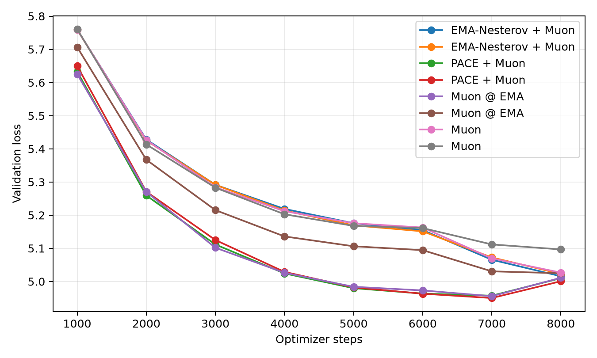
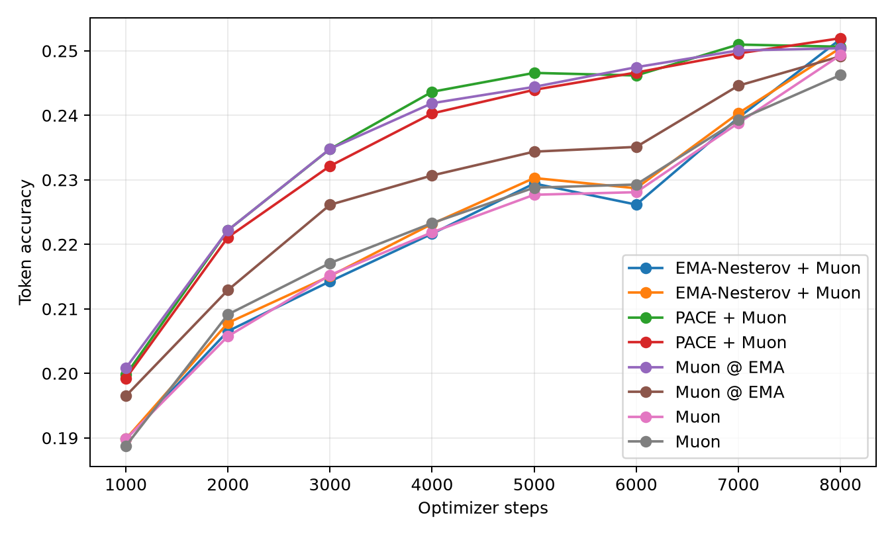
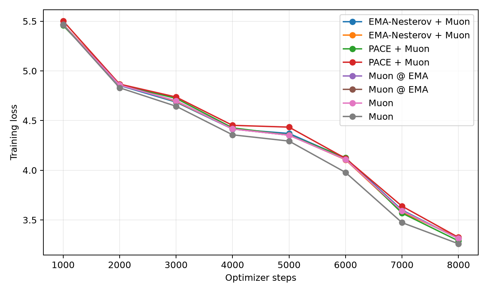
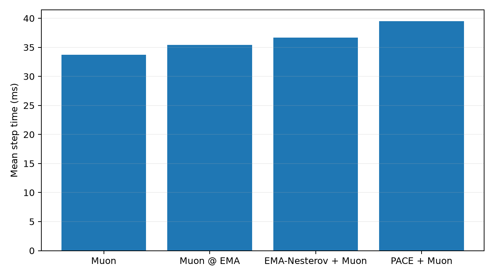
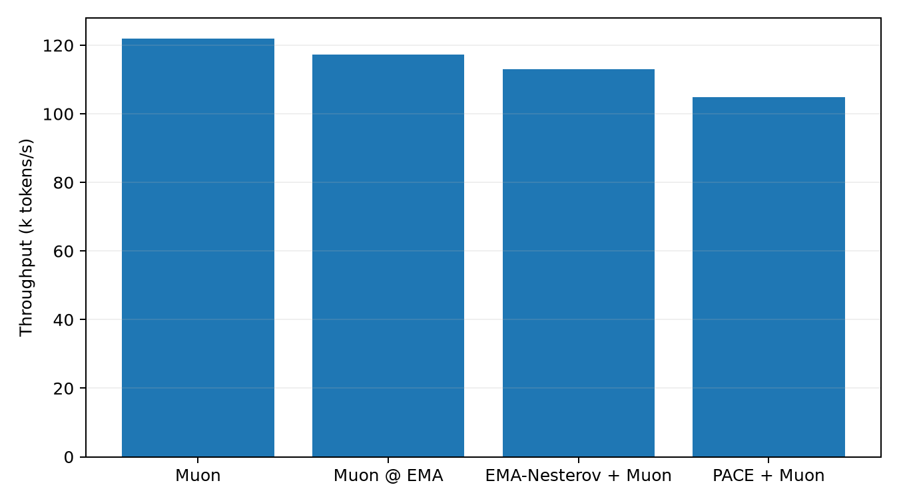

# Tokenized 50M LLM Optimizer Comparison

This benchmark uses real text tokenized with the Hugging Face `gpt2` tokenizer. It is the preferred language-model optimizer transfer check because embeddings, output head, and sequence statistics are closer to a normal BPE/SentencePiece pretraining setup than the older byte-level path.

## Setup

- Dataset: `HuggingFaceFW/fineweb-edu/sample-10BT:train [gpt2]`
- Tokenizer: `gpt2`
- Train tokens cached: 8,000,000
- Validation tokens cached: 524,288
- Model: decoder-only GPT, layers=10, width=640, heads=10, context=128, vocab=50,257
- Trainable parameters: 81425280
- Batch: 32 sequences x 128 tokens
- HPO: 600 steps per candidate, selected by best validation loss
- Final replay: 8000 steps per selected optimizer
- Validation estimate: 8 random batches per evaluation point
- Final extra validation: 256 random batches
- GPUs: 2 visible, one trial per GPU

## Final Results

| Rank | Optimizer | Selected config | Final val loss | Best val loss | Final token acc | Full val loss | Full token acc | Step time | Throughput |
|---:|---|---|---:|---:|---:|---:|---:|---:|---:|
| 1 | PACE + Muon | lr=0.0018, wd=0.05, pace_c=0.001, kappa=0.5 | 5.0007 | 4.9501 | 25.20% | 4.9997 | 24.88% | 39.48 ms | 103.8k tok/s |
| 2 | PACE + Muon | lr=0.0016, wd=0.05, pace_c=0.001, kappa=0.5 | 5.0100 | 4.9571 | 25.06% | 5.0045 | 24.94% | 39.04 ms | 104.9k tok/s |
| 3 | Muon @ EMA | lr=0.0016, wd=0.05, pace_c=0, kappa=0.5 | 5.0112 | 4.9557 | 25.04% | 5.0078 | 24.82% | 34.94 ms | 117.2k tok/s |
| 4 | EMA-Nesterov + Muon | lr=0.0016, wd=0.05, ema_beta=0.1, ema_gamma=0.995 | 5.0229 | 5.0229 | 25.04% | 5.0176 | 24.71% | 36.67 ms | 111.7k tok/s |
| 5 | EMA-Nesterov + Muon | lr=0.0016, wd=0.05, ema_beta=0.1, ema_gamma=0.99 | 5.0158 | 5.0158 | 25.18% | 5.0207 | 24.72% | 36.23 ms | 113.1k tok/s |
| 6 | Muon @ EMA | lr=0.0016, wd=0.05, pace_c=0, kappa=0.3 | 5.0248 | 5.0248 | 24.91% | 5.0214 | 24.71% | 35.40 ms | 115.7k tok/s |
| 7 | Muon | lr=0.0016, wd=0.05 | 5.0267 | 5.0267 | 24.93% | 5.0230 | 24.69% | 33.61 ms | 121.9k tok/s |
| 8 | Muon | lr=0.0016, wd=0 | 5.0966 | 5.0966 | 24.62% | 5.0880 | 24.38% | 33.73 ms | 121.4k tok/s |

## Plots

## HPO Candidates

| Family | Trial | LR | Best val loss | Final val loss | Step time |
|---|---|---:|---:|---:|---:|
| ema_muon | `fair_ema_muon_lr0.0016_wd0.05_b0.1_g0.99_w0.2_r0.1` | 0.0016 | 5.9014 | 5.9014 | 36.90 ms |
| ema_muon | `fair_ema_muon_lr0.0016_wd0.05_b0.1_g0.995_w0.2_r0.1` | 0.0016 | 5.9062 | 5.9062 | 36.91 ms |
| ema_muon | `fair_ema_muon_lr0.0016_wd0.05_b0.05_g0.995_w0.2_r0.1` | 0.0016 | 5.9087 | 5.9087 | 36.51 ms |
| ema_muon | `fair_ema_muon_lr0.0016_wd0_b0.1_g0.99_w0.2_r0.1` | 0.0016 | 5.9094 | 5.9094 | 36.18 ms |
| ema_muon | `fair_ema_muon_lr0.0016_wd0_b0.2_g0.995_w0.2_r0.1` | 0.0016 | 5.9094 | 5.9094 | 36.58 ms |
| ema_muon | `fair_ema_muon_lr0.0016_wd0.05_b0.2_g0.995_w0.2_r0.1` | 0.0016 | 5.9100 | 5.9100 | 36.50 ms |
| ema_muon | `fair_ema_muon_lr0.0016_wd0_b0.1_g0.995_w0.2_r0.1` | 0.0016 | 5.9119 | 5.9119 | 36.20 ms |
| ema_muon | `fair_ema_muon_lr0.0018_wd0_b0.2_g0.995_w0.2_r0.1` | 0.0018 | 5.9157 | 5.9157 | 36.58 ms |
| ema_muon | `fair_ema_muon_lr0.0016_wd0_b0.05_g0.995_w0.2_r0.1` | 0.0016 | 5.9164 | 5.9164 | 36.57 ms |
| ema_muon | `fair_ema_muon_lr0.0018_wd0_b0.1_g0.99_w0.2_r0.1` | 0.0018 | 5.9166 | 5.9166 | 36.19 ms |
| ema_muon | `fair_ema_muon_lr0.0018_wd0.05_b0.2_g0.995_w0.2_r0.1` | 0.0018 | 5.9170 | 5.9170 | 36.55 ms |
| ema_muon | `fair_ema_muon_lr0.0018_wd0.05_b0.1_g0.99_w0.2_r0.1` | 0.0018 | 5.9171 | 5.9171 | 36.91 ms |
| ema_muon | `fair_ema_muon_lr0.0014_wd0.05_b0.1_g0.995_w0.2_r0.1` | 0.0014 | 5.9185 | 5.9185 | 36.90 ms |
| ema_muon | `fair_ema_muon_lr0.0018_wd0_b0.05_g0.995_w0.2_r0.1` | 0.0018 | 5.9188 | 5.9188 | 36.58 ms |
| ema_muon | `fair_ema_muon_lr0.0014_wd0.05_b0.2_g0.995_w0.2_r0.1` | 0.0014 | 5.9192 | 5.9192 | 36.51 ms |
| ema_muon | `fair_ema_muon_lr0.0018_wd0.05_b0.05_g0.995_w0.2_r0.1` | 0.0018 | 5.9202 | 5.9202 | 36.51 ms |
| ema_muon | `fair_ema_muon_lr0.0018_wd0.05_b0.1_g0.995_w0.2_r0.1` | 0.0018 | 5.9202 | 5.9202 | 36.90 ms |
| ema_muon | `fair_ema_muon_lr0.0014_wd0_b0.1_g0.99_w0.2_r0.1` | 0.0014 | 5.9211 | 5.9211 | 36.12 ms |
| ema_muon | `fair_ema_muon_lr0.0018_wd0_b0.1_g0.995_w0.2_r0.1` | 0.0018 | 5.9227 | 5.9227 | 36.23 ms |
| ema_muon | `fair_ema_muon_lr0.0014_wd0_b0.05_g0.995_w0.2_r0.1` | 0.0014 | 5.9231 | 5.9231 | 36.57 ms |
| ema_muon | `fair_ema_muon_lr0.0014_wd0.05_b0.05_g0.995_w0.2_r0.1` | 0.0014 | 5.9235 | 5.9235 | 36.49 ms |
| ema_muon | `fair_ema_muon_lr0.0014_wd0.05_b0.1_g0.99_w0.2_r0.1` | 0.0014 | 5.9237 | 5.9237 | 36.90 ms |
| ema_muon | `fair_ema_muon_lr0.0014_wd0_b0.1_g0.995_w0.2_r0.1` | 0.0014 | 5.9240 | 5.9240 | 36.10 ms |
| ema_muon | `fair_ema_muon_lr0.0014_wd0_b0.2_g0.995_w0.2_r0.1` | 0.0014 | 5.9244 | 5.9244 | 36.57 ms |
| ema_muon | `fair_ema_muon_lr0.0012_wd0.05_b0.1_g0.995_w0.2_r0.1` | 0.0012 | 5.9370 | 5.9370 | 36.87 ms |
| ema_muon | `fair_ema_muon_lr0.0012_wd0.05_b0.05_g0.995_w0.2_r0.1` | 0.0012 | 5.9376 | 5.9376 | 36.38 ms |
| ema_muon | `fair_ema_muon_lr0.0012_wd0.05_b0.2_g0.995_w0.2_r0.1` | 0.0012 | 5.9376 | 5.9376 | 36.39 ms |
| ema_muon | `fair_ema_muon_lr0.0012_wd0.05_b0.1_g0.99_w0.2_r0.1` | 0.0012 | 5.9382 | 5.9382 | 36.89 ms |
| ema_muon | `fair_ema_muon_lr0.0012_wd0_b0.05_g0.995_w0.2_r0.1` | 0.0012 | 5.9388 | 5.9388 | 36.33 ms |
| ema_muon | `fair_ema_muon_lr0.0012_wd0_b0.1_g0.995_w0.2_r0.1` | 0.0012 | 5.9389 | 5.9389 | 35.99 ms |
| ema_muon | `fair_ema_muon_lr0.0012_wd0_b0.1_g0.99_w0.2_r0.1` | 0.0012 | 5.9390 | 5.9390 | 36.02 ms |
| ema_muon | `fair_ema_muon_lr0.0012_wd0_b0.2_g0.995_w0.2_r0.1` | 0.0012 | 5.9400 | 5.9400 | 36.42 ms |
| emaeval_muon | `fair_emaeval_muon_lr0.0016_wd0.05_k0.5` | 0.0016 | 5.9056 | 5.9056 | 35.60 ms |
| emaeval_muon | `fair_emaeval_muon_lr0.0016_wd0.05_k0.3` | 0.0016 | 5.9095 | 5.9095 | 35.25 ms |
| emaeval_muon | `fair_emaeval_muon_lr0.0016_wd0_k0.5` | 0.0016 | 5.9096 | 5.9096 | 34.91 ms |
| emaeval_muon | `fair_emaeval_muon_lr0.0016_wd0_k0.3` | 0.0016 | 5.9144 | 5.9144 | 35.28 ms |
| emaeval_muon | `fair_emaeval_muon_lr0.0018_wd0.05_k0.5` | 0.0018 | 5.9149 | 5.9149 | 35.59 ms |
| emaeval_muon | `fair_emaeval_muon_lr0.0018_wd0_k0.5` | 0.0018 | 5.9202 | 5.9202 | 34.97 ms |
| emaeval_muon | `fair_emaeval_muon_lr0.0018_wd0.05_k0.3` | 0.0018 | 5.9206 | 5.9206 | 35.25 ms |
| emaeval_muon | `fair_emaeval_muon_lr0.0014_wd0.05_k0.5` | 0.0014 | 5.9206 | 5.9206 | 35.59 ms |
| emaeval_muon | `fair_emaeval_muon_lr0.0014_wd0_k0.5` | 0.0014 | 5.9219 | 5.9219 | 34.82 ms |
| emaeval_muon | `fair_emaeval_muon_lr0.0014_wd0.05_k0.3` | 0.0014 | 5.9243 | 5.9243 | 35.23 ms |
| emaeval_muon | `fair_emaeval_muon_lr0.0018_wd0_k0.3` | 0.0018 | 5.9253 | 5.9253 | 35.29 ms |
| emaeval_muon | `fair_emaeval_muon_lr0.0014_wd0_k0.3` | 0.0014 | 5.9255 | 5.9255 | 35.27 ms |
| emaeval_muon | `fair_emaeval_muon_lr0.0012_wd0.05_k0.5` | 0.0012 | 5.9355 | 5.9355 | 35.55 ms |
| emaeval_muon | `fair_emaeval_muon_lr0.0012_wd0_k0.5` | 0.0012 | 5.9363 | 5.9363 | 34.67 ms |
| emaeval_muon | `fair_emaeval_muon_lr0.0012_wd0.05_k0.3` | 0.0012 | 5.9386 | 5.9386 | 35.08 ms |
| emaeval_muon | `fair_emaeval_muon_lr0.0012_wd0_k0.3` | 0.0012 | 5.9398 | 5.9398 | 34.95 ms |
| muon | `fair_muon_lr0.0016_wd0.05` | 0.0016 | 5.9075 | 5.9075 | 34.26 ms |
| muon | `fair_muon_lr0.0016_wd0` | 0.0016 | 5.9128 | 5.9128 | 33.59 ms |
| muon | `fair_muon_lr0.0018_wd0.05` | 0.0018 | 5.9182 | 5.9182 | 34.25 ms |
| muon | `fair_muon_lr0.0014_wd0.05` | 0.0014 | 5.9228 | 5.9228 | 34.25 ms |
| muon | `fair_muon_lr0.0018_wd0` | 0.0018 | 5.9235 | 5.9235 | 33.59 ms |
| muon | `fair_muon_lr0.0014_wd0` | 0.0014 | 5.9240 | 5.9240 | 33.53 ms |
| muon | `fair_muon_lr0.0012_wd0.05` | 0.0012 | 5.9369 | 5.9369 | 34.19 ms |
| muon | `fair_muon_lr0.0012_wd0` | 0.0012 | 5.9385 | 5.9385 | 33.39 ms |
| pace_muon | `fair_pace_muon_lr0.0016_wd0.05_c0.001_k0.5` | 0.0016 | 5.9128 | 5.9128 | 39.32 ms |
| pace_muon | `fair_pace_muon_lr0.0018_wd0.05_c0.001_k0.5` | 0.0018 | 5.9146 | 5.9146 | 39.33 ms |
| pace_muon | `fair_pace_muon_lr0.0016_wd0_c0.001_k0.5` | 0.0016 | 5.9176 | 5.9176 | 39.40 ms |
| pace_muon | `fair_pace_muon_lr0.0018_wd0_c0.001_k0.5` | 0.0018 | 5.9193 | 5.9193 | 39.41 ms |
| pace_muon | `fair_pace_muon_lr0.0016_wd0_c0.003_k0.5` | 0.0016 | 5.9279 | 5.9279 | 39.00 ms |
| pace_muon | `fair_pace_muon_lr0.0014_wd0.05_c0.001_k0.5` | 0.0014 | 5.9294 | 5.9294 | 39.31 ms |
| pace_muon | `fair_pace_muon_lr0.0014_wd0_c0.001_k0.5` | 0.0014 | 5.9304 | 5.9304 | 39.40 ms |
| pace_muon | `fair_pace_muon_lr0.0016_wd0_c0.003_k0.3` | 0.0016 | 5.9330 | 5.9330 | 39.40 ms |
| pace_muon | `fair_pace_muon_lr0.0016_wd0.05_c0.003_k0.3` | 0.0016 | 5.9339 | 5.9339 | 39.33 ms |
| pace_muon | `fair_pace_muon_lr0.0016_wd0.05_c0.003_k0.5` | 0.0016 | 5.9343 | 5.9343 | 39.72 ms |
| pace_muon | `fair_pace_muon_lr0.0018_wd0.05_c0.003_k0.5` | 0.0018 | 5.9348 | 5.9348 | 39.73 ms |
| pace_muon | `fair_pace_muon_lr0.0018_wd0.05_c0.003_k0.3` | 0.0018 | 5.9348 | 5.9348 | 39.33 ms |
| pace_muon | `fair_pace_muon_lr0.0018_wd0_c0.003_k0.5` | 0.0018 | 5.9366 | 5.9366 | 39.03 ms |
| pace_muon | `fair_pace_muon_lr0.0014_wd0_c0.003_k0.5` | 0.0014 | 5.9373 | 5.9373 | 38.94 ms |
| pace_muon | `fair_pace_muon_lr0.0018_wd0_c0.003_k0.3` | 0.0018 | 5.9385 | 5.9385 | 39.41 ms |
| pace_muon | `fair_pace_muon_lr0.0014_wd0.05_c0.003_k0.3` | 0.0014 | 5.9412 | 5.9412 | 39.32 ms |
| pace_muon | `fair_pace_muon_lr0.0014_wd0_c0.003_k0.3` | 0.0014 | 5.9413 | 5.9413 | 39.39 ms |
| pace_muon | `fair_pace_muon_lr0.0014_wd0.05_c0.003_k0.5` | 0.0014 | 5.9414 | 5.9414 | 39.71 ms |
| pace_muon | `fair_pace_muon_lr0.0012_wd0.05_c0.001_k0.5` | 0.0012 | 5.9428 | 5.9428 | 39.20 ms |
| pace_muon | `fair_pace_muon_lr0.0012_wd0_c0.001_k0.5` | 0.0012 | 5.9435 | 5.9435 | 39.26 ms |
| pace_muon | `fair_pace_muon_lr0.0012_wd0_c0.003_k0.5` | 0.0012 | 5.9546 | 5.9546 | 38.82 ms |
| pace_muon | `fair_pace_muon_lr0.0012_wd0.05_c0.003_k0.5` | 0.0012 | 5.9549 | 5.9549 | 39.70 ms |
| pace_muon | `fair_pace_muon_lr0.0012_wd0.05_c0.003_k0.3` | 0.0012 | 5.9557 | 5.9557 | 39.22 ms |
| pace_muon | `fair_pace_muon_lr0.0012_wd0_c0.003_k0.3` | 0.0012 | 5.9564 | 5.9564 | 39.30 ms |
| pace_muon | `fair_pace_muon_lr0.0016_wd0.05_c0.01_k0.5` | 0.0016 | 5.9660 | 5.9660 | 39.72 ms |
| pace_muon | `fair_pace_muon_lr0.0018_wd0.05_c0.01_k0.5` | 0.0018 | 5.9694 | 5.9694 | 39.71 ms |
| pace_muon | `fair_pace_muon_lr0.0014_wd0.05_c0.01_k0.5` | 0.0014 | 5.9724 | 5.9724 | 39.72 ms |
| pace_muon | `fair_pace_muon_lr0.0018_wd0_c0.01_k0.5` | 0.0018 | 5.9727 | 5.9727 | 39.01 ms |
| pace_muon | `fair_pace_muon_lr0.0016_wd0_c0.01_k0.5` | 0.0016 | 5.9732 | 5.9732 | 39.01 ms |
| pace_muon | `fair_pace_muon_lr0.0014_wd0_c0.01_k0.5` | 0.0014 | 5.9744 | 5.9744 | 38.97 ms |
| pace_muon | `fair_pace_muon_lr0.0012_wd0_c0.01_k0.5` | 0.0012 | 5.9791 | 5.9791 | 38.84 ms |
| pace_muon | `fair_pace_muon_lr0.0012_wd0.05_c0.01_k0.5` | 0.0012 | 5.9806 | 5.9806 | 39.69 ms |
