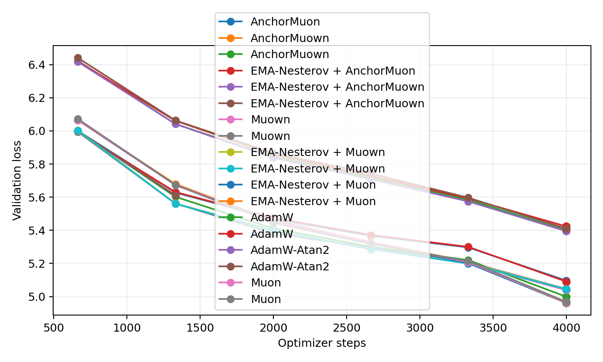
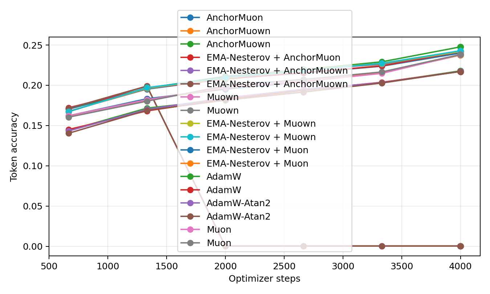
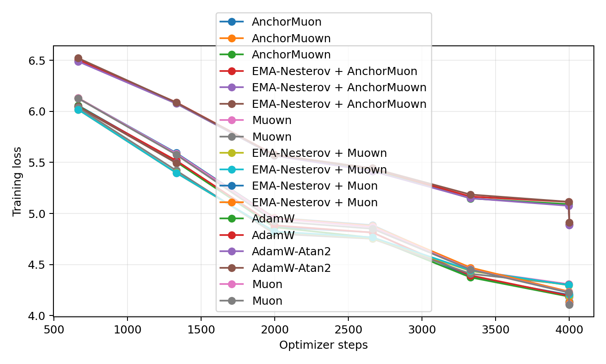
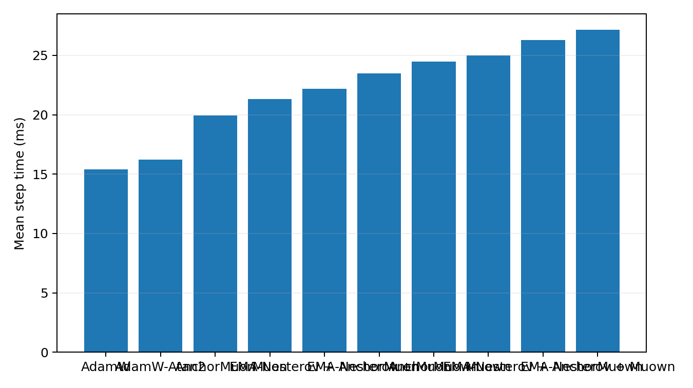
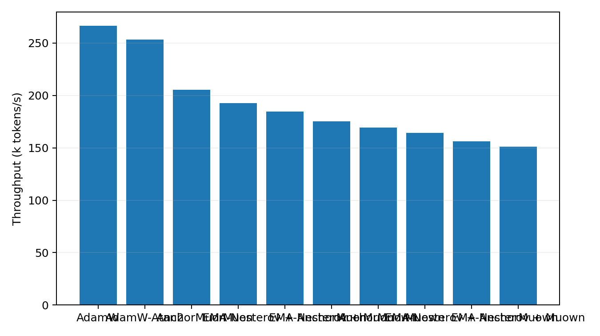

# Tokenized 50M LLM Optimizer Comparison

This benchmark uses real text tokenized with the Hugging Face `gpt2` tokenizer. It is the preferred language-model optimizer transfer check because embeddings, output head, and sequence statistics are closer to a normal BPE/SentencePiece pretraining setup than the older byte-level path.

## Setup

- Dataset: `HuggingFaceFW/fineweb-edu/sample-10BT:train [gpt2]`
- Tokenizer: `gpt2`
- Train tokens cached: 8,000,000
- Validation tokens cached: 524,288
- Model: decoder-only GPT, layers=8, width=512, heads=8, context=256, vocab=50,257
- Trainable parameters: 51045888
- Batch: 16 sequences x 256 tokens
- HPO: 600 steps per candidate, selected by best validation loss
- Final replay: 4000 steps per selected optimizer
- Validation estimate: 16 sequential batches per evaluation point
- Final extra validation: 128 sequential batches
- GPUs: 2 visible, one trial per GPU

## Final Results

| Rank | Optimizer | Selected config | Final val loss | Best val loss | Final token acc | Full val loss | Full token acc | Step time | Throughput |
|---:|---|---|---:|---:|---:|---:|---:|---:|---:|
| 1 | EMA-Nesterov + Muon | lr=0.0016, wd=0.05, ema_beta=0.1, ema_gamma=0.995 | 4.9633 | 4.9633 | 23.76% | 5.0126 | 23.76% | 23.46 ms | 174.6k tok/s |
| 2 | Muon | lr=0.0016, wd=0.05 | 4.9668 | 4.9668 | 23.85% | 5.0145 | 23.72% | 21.25 ms | 192.8k tok/s |
| 3 | EMA-Nesterov + Muon | lr=0.0016, wd=0.05, ema_beta=0.2, ema_gamma=0.995 | 4.9619 | 4.9619 | 23.77% | 5.0152 | 23.68% | 23.38 ms | 175.2k tok/s |
| 4 | Muon | lr=0.0014, wd=0.05 | 4.9693 | 4.9693 | 23.81% | 5.0170 | 23.66% | 21.32 ms | 192.1k tok/s |
| 5 | AnchorMuown | lr=0.0016, wd=0.05, row_gamma=0.15, pmuon_beta=0.9, normuon_beta2=0.93, fallback=rms@1x, soda=0.001, mag_lr=0.5x | 4.9997 | 4.9997 | 24.76% | 5.0500 | 24.68% | 24.48 ms | 167.4k tok/s |
| 6 | Muown | lr=0.0016, wd=0 | 5.0386 | 5.0386 | 24.18% | 5.0574 | 24.11% | 24.90 ms | 164.5k tok/s |
| 7 | Muown | lr=0.0014, wd=0 | 5.0459 | 5.0459 | 24.15% | 5.0581 | 24.03% | 24.98 ms | 164.0k tok/s |
| 8 | EMA-Nesterov + Muown | lr=0.0016, wd=0, ema_beta=0.1, ema_gamma=0.995 | 5.0451 | 5.0451 | 24.16% | 5.0585 | 24.13% | 27.07 ms | 151.3k tok/s |
| 9 | EMA-Nesterov + Muown | lr=0.0016, wd=0, ema_beta=0.3, ema_gamma=0.99 | 5.0446 | 5.0446 | 24.28% | 5.0586 | 24.12% | 27.14 ms | 150.9k tok/s |
| 10 | AnchorMuon | lr=0.0016, wd=0.05, row_gamma=0.15, pmuon_beta=0.9, normuon_beta2=0.93, fallback=rms@1x, soda=0.001 | 5.0961 | 5.0961 | 24.03% | 5.1451 | 23.98% | 19.94 ms | 205.5k tok/s |
| 11 | EMA-Nesterov + AnchorMuon | lr=0.0016, wd=0.05, row_gamma=0, pmuon_beta=0.9, normuon_beta2=0.93, fallback=rms@1x, soda=0.003, ema_beta=0.3, ema_gamma=0.995 | 5.0891 | 5.0891 | 24.17% | 5.1468 | 23.96% | 22.18 ms | 184.7k tok/s |
| 12 | AdamW-Atan2 | lr=0.0005, wd=0.05 | 5.3954 | 5.3954 | 21.74% | 5.4296 | 21.58% | 16.17 ms | 253.2k tok/s |
| 13 | AdamW | lr=0.0005, wd=0.05 | 5.4002 | 5.3998 | 21.80% | 5.4321 | 21.55% | 15.38 ms | 266.3k tok/s |
| 14 | AdamW-Atan2 | lr=0.0006, wd=0.05 | 5.4106 | 5.4102 | 21.68% | 5.4420 | 21.50% | 16.21 ms | 252.7k tok/s |
| 15 | AdamW | lr=0.0004, wd=0.05 | 5.4240 | 5.4238 | 21.68% | 5.4533 | 21.40% | 15.41 ms | 265.8k tok/s |
| 16 | AnchorMuown | lr=0.0016, wd=0.05, row_gamma=0.15, pmuon_beta=0.9, normuon_beta2=0.93, fallback=rms@1x, soda=0.001, mag_lr=1x | nan | 5.6107 | 0.06% | nan | 0.04% | 24.16 ms | 169.5k tok/s |
| 17 | EMA-Nesterov + AnchorMuown | lr=0.0016, wd=0.05, row_gamma=0.15, pmuon_beta=0.9, normuon_beta2=0.93, fallback=rms@1x, soda=0.001, mag_lr=1x, ema_beta=0.3, ema_gamma=0.995 | nan | 5.6101 | 0.06% | nan | 0.04% | 26.23 ms | 156.2k tok/s |
| 18 | EMA-Nesterov + AnchorMuown | lr=0.0016, wd=0.05, row_gamma=0.15, pmuon_beta=0.9, normuon_beta2=0.93, fallback=rms@1x, soda=0.001, mag_lr=1x, ema_beta=0.1, ema_gamma=0.995 | nan | 5.6110 | 0.06% | nan | 0.04% | 26.31 ms | 155.7k tok/s |

## Plots

## HPO Candidates

| Family | Trial | LR | Best val loss | Final val loss | Step time |
|---|---|---:|---:|---:|---:|
| adamatan2 | `fineweb_adamatan2_lr0.0005` | 0.0005 | 6.4115 | 6.4115 | 16.17 ms |
| adamatan2 | `fineweb_adamatan2_lr0.0006` | 0.0006 | 6.4168 | 6.4168 | 16.22 ms |
| adamatan2 | `fineweb_adamatan2_lr0.0004` | 0.0004 | 6.4249 | 6.4249 | 16.14 ms |
| adamw | `fineweb_adamw_lr0.0005` | 0.0005 | 6.4110 | 6.4110 | 15.43 ms |
| adamw | `fineweb_adamw_lr0.0004` | 0.0004 | 6.4193 | 6.4193 | 15.42 ms |
| adamw | `fineweb_adamw_lr0.0006` | 0.0006 | 6.4263 | 6.4263 | 15.46 ms |
| anchormuon | `muown_ref_anchor_lr0.0016_rg0.15_soda0.001_flr1_rms` | 0.0016 | 5.9784 | 5.9784 | 20.29 ms |
| anchormuown | `fineweb_anchormuown_lr0.0016_rg0.15_soda0.001_mag1_flr1_rms` | 0.0016 | 6.0186 | 6.0186 | 24.85 ms |
| anchormuown | `fineweb_anchormuown_lr0.0016_rg0.15_soda0.001_mag0.5_flr1_rms` | 0.0016 | 6.0218 | 6.0218 | 24.91 ms |
| anchormuown | `fineweb_anchormuown_lr0.0016_rg0.25_soda0.001_mag1_flr0.75_rms` | 0.0016 | 6.0228 | 6.0228 | 24.90 ms |
| anchormuown | `fineweb_anchormuown_lr0.0016_rg0.25_soda0.003_mag1_flr0.75_rms` | 0.0016 | 6.0235 | 6.0235 | 24.82 ms |
| anchormuown | `fineweb_anchormuown_lr0.0016_rg0.15_soda0.001_mag0.25_flr1_rms` | 0.0016 | 6.0236 | 6.0236 | 24.83 ms |
| anchormuown | `fineweb_anchormuown_lr0.0016_rg0_soda0.003_mag0.5_flr1_rms` | 0.0016 | 6.0250 | 6.0250 | 24.90 ms |
| anchormuown | `fineweb_anchormuown_lr0.0016_rg0.25_soda0.003_mag0.5_flr0.75_rms` | 0.0016 | 6.0256 | 6.0256 | 24.86 ms |
| anchormuown | `fineweb_anchormuown_lr0.0016_rg0_soda0.003_mag1_flr1_rms` | 0.0016 | 6.0259 | 6.0259 | 24.80 ms |
| anchormuown | `fineweb_anchormuown_lr0.0016_rg0_soda0.003_mag0.25_flr1_rms` | 0.0016 | 6.0259 | 6.0259 | 24.83 ms |
| anchormuown | `fineweb_anchormuown_lr0.0016_rg0.25_soda0.001_mag0.5_flr0.75_rms` | 0.0016 | 6.0275 | 6.0275 | 24.81 ms |
| anchormuown | `fineweb_anchormuown_lr0.0016_rg0.25_soda0.003_mag0.25_flr0.75_rms` | 0.0016 | 6.0280 | 6.0280 | 24.82 ms |
| anchormuown | `fineweb_anchormuown_lr0.0016_rg0.25_soda0.001_mag0.25_flr0.75_rms` | 0.0016 | 6.0281 | 6.0281 | 24.93 ms |
| anchormuown | `fineweb_anchormuown_lr0.00145_rg0.15_soda0.001_mag0.25_flr1_rms` | 0.00145 | 6.0283 | 6.0283 | 24.89 ms |
| anchormuown | `fineweb_anchormuown_lr0.00145_rg0.15_soda0.001_mag0.5_flr1_rms` | 0.00145 | 6.0310 | 6.0310 | 24.82 ms |
| anchormuown | `fineweb_anchormuown_lr0.00145_rg0_soda0.003_mag0.25_flr1_rms` | 0.00145 | 6.0312 | 6.0312 | 24.88 ms |
| anchormuown | `fineweb_anchormuown_lr0.00145_rg0_soda0.003_mag0.5_flr1_rms` | 0.00145 | 6.0313 | 6.0313 | 24.81 ms |
| anchormuown | `fineweb_anchormuown_lr0.00145_rg0.15_soda0.001_mag1_flr1_rms` | 0.00145 | 6.0343 | 6.0343 | 24.94 ms |
| anchormuown | `fineweb_anchormuown_lr0.00145_rg0_soda0.003_mag1_flr1_rms` | 0.00145 | 6.0352 | 6.0352 | 24.89 ms |
| anchormuown | `fineweb_anchormuown_lr0.0013_rg0_soda0.003_mag0.5_flr1_rms` | 0.0013 | 6.0471 | 6.0471 | 24.86 ms |
| anchormuown | `fineweb_anchormuown_lr0.0013_rg0_soda0.003_mag0.25_flr1_rms` | 0.0013 | 6.0495 | 6.0495 | 24.85 ms |
| anchormuown | `fineweb_anchormuown_lr0.0013_rg0_soda0.003_mag1_flr1_rms` | 0.0013 | 6.0509 | 6.0509 | 24.77 ms |
| ema_anchormuon | `muown_ref_ema_anchor_lr0.0016_rg0_soda0.003_flr1_rms_b0.3_g0.995_w0.2_r0.1` | 0.0016 | 5.9778 | 5.9778 | 22.37 ms |
| ema_anchormuown | `fineweb_ema_anchormuown_lr0.0016_rg0.15_soda0.001_mag1_flr1_rms_b0.3_g0.995_w0.2_r0.1` | 0.0016 | 6.0184 | 6.0184 | 26.97 ms |
| ema_anchormuown | `fineweb_ema_anchormuown_lr0.0016_rg0.15_soda0.001_mag1_flr1_rms_b0.1_g0.995_w0.2_r0.1` | 0.0016 | 6.0186 | 6.0186 | 27.03 ms |
| ema_anchormuown | `fineweb_ema_anchormuown_lr0.0016_rg0.15_soda0.001_mag0.5_flr1_rms_b0.1_g0.995_w0.2_r0.1` | 0.0016 | 6.0216 | 6.0216 | 26.99 ms |
| ema_anchormuown | `fineweb_ema_anchormuown_lr0.0016_rg0.15_soda0.001_mag0.5_flr1_rms_b0.3_g0.995_w0.2_r0.1` | 0.0016 | 6.0221 | 6.0221 | 27.05 ms |
| ema_anchormuown | `fineweb_ema_anchormuown_lr0.0016_rg0.15_soda0.001_mag0.25_flr1_rms_b0.3_g0.995_w0.2_r0.1` | 0.0016 | 6.0230 | 6.0230 | 26.97 ms |
| ema_anchormuown | `fineweb_ema_anchormuown_lr0.0016_rg0.25_soda0.001_mag1_flr0.75_rms_b0.1_g0.995_w0.2_r0.1` | 0.0016 | 6.0232 | 6.0232 | 26.96 ms |
| ema_anchormuown | `fineweb_ema_anchormuown_lr0.0016_rg0.25_soda0.003_mag1_flr0.75_rms_b0.1_g0.995_w0.2_r0.1` | 0.0016 | 6.0235 | 6.0235 | 27.03 ms |
| ema_anchormuown | `fineweb_ema_anchormuown_lr0.0016_rg0.15_soda0.001_mag0.25_flr1_rms_b0.1_g0.995_w0.2_r0.1` | 0.0016 | 6.0235 | 6.0235 | 27.04 ms |
| ema_anchormuown | `fineweb_ema_anchormuown_lr0.0016_rg0.25_soda0.001_mag1_flr0.75_rms_b0.3_g0.995_w0.2_r0.1` | 0.0016 | 6.0236 | 6.0236 | 27.02 ms |
| ema_anchormuown | `fineweb_ema_anchormuown_lr0.0016_rg0.25_soda0.003_mag1_flr0.75_rms_b0.3_g0.995_w0.2_r0.1` | 0.0016 | 6.0242 | 6.0242 | 26.92 ms |
| ema_anchormuown | `fineweb_ema_anchormuown_lr0.0016_rg0_soda0.003_mag0.5_flr1_rms_b0.1_g0.995_w0.2_r0.1` | 0.0016 | 6.0246 | 6.0246 | 26.92 ms |
| ema_anchormuown | `fineweb_ema_anchormuown_lr0.0016_rg0_soda0.003_mag0.5_flr1_rms_b0.3_g0.995_w0.2_r0.1` | 0.0016 | 6.0251 | 6.0251 | 27.02 ms |
| ema_anchormuown | `fineweb_ema_anchormuown_lr0.0016_rg0_soda0.003_mag1_flr1_rms_b0.3_g0.995_w0.2_r0.1` | 0.0016 | 6.0257 | 6.0257 | 26.95 ms |
| ema_anchormuown | `fineweb_ema_anchormuown_lr0.0016_rg0_soda0.003_mag1_flr1_rms_b0.1_g0.995_w0.2_r0.1` | 0.0016 | 6.0258 | 6.0258 | 27.02 ms |
| ema_anchormuown | `fineweb_ema_anchormuown_lr0.0016_rg0.25_soda0.003_mag0.5_flr0.75_rms_b0.1_g0.995_w0.2_r0.1` | 0.0016 | 6.0259 | 6.0259 | 26.94 ms |
| ema_anchormuown | `fineweb_ema_anchormuown_lr0.0016_rg0.25_soda0.003_mag0.5_flr0.75_rms_b0.3_g0.995_w0.2_r0.1` | 0.0016 | 6.0260 | 6.0260 | 27.01 ms |
| ema_anchormuown | `fineweb_ema_anchormuown_lr0.0016_rg0_soda0.003_mag0.25_flr1_rms_b0.1_g0.995_w0.2_r0.1` | 0.0016 | 6.0264 | 6.0264 | 27.00 ms |
| ema_anchormuown | `fineweb_ema_anchormuown_lr0.0016_rg0_soda0.003_mag0.25_flr1_rms_b0.3_g0.995_w0.2_r0.1` | 0.0016 | 6.0265 | 6.0265 | 26.96 ms |
| ema_anchormuown | `fineweb_ema_anchormuown_lr0.0016_rg0.25_soda0.001_mag0.5_flr0.75_rms_b0.3_g0.995_w0.2_r0.1` | 0.0016 | 6.0265 | 6.0265 | 26.97 ms |
| ema_anchormuown | `fineweb_ema_anchormuown_lr0.0016_rg0.25_soda0.001_mag0.5_flr0.75_rms_b0.1_g0.995_w0.2_r0.1` | 0.0016 | 6.0266 | 6.0266 | 27.02 ms |
| ema_anchormuown | `fineweb_ema_anchormuown_lr0.0016_rg0.25_soda0.003_mag0.25_flr0.75_rms_b0.1_g0.995_w0.2_r0.1` | 0.0016 | 6.0276 | 6.0276 | 27.02 ms |
| ema_anchormuown | `fineweb_ema_anchormuown_lr0.0016_rg0.25_soda0.001_mag0.25_flr0.75_rms_b0.1_g0.995_w0.2_r0.1` | 0.0016 | 6.0281 | 6.0281 | 26.95 ms |
| ema_anchormuown | `fineweb_ema_anchormuown_lr0.00145_rg0.15_soda0.001_mag0.25_flr1_rms_b0.1_g0.995_w0.2_r0.1` | 0.00145 | 6.0282 | 6.0282 | 26.99 ms |
| ema_anchormuown | `fineweb_ema_anchormuown_lr0.0016_rg0.25_soda0.003_mag0.25_flr0.75_rms_b0.3_g0.995_w0.2_r0.1` | 0.0016 | 6.0282 | 6.0282 | 26.95 ms |
| ema_anchormuown | `fineweb_ema_anchormuown_lr0.00145_rg0.15_soda0.001_mag0.25_flr1_rms_b0.3_g0.995_w0.2_r0.1` | 0.00145 | 6.0283 | 6.0283 | 27.06 ms |
| ema_anchormuown | `fineweb_ema_anchormuown_lr0.0016_rg0.25_soda0.001_mag0.25_flr0.75_rms_b0.3_g0.995_w0.2_r0.1` | 0.0016 | 6.0287 | 6.0287 | 27.00 ms |
| ema_anchormuown | `fineweb_ema_anchormuown_lr0.00145_rg0_soda0.003_mag0.5_flr1_rms_b0.1_g0.995_w0.2_r0.1` | 0.00145 | 6.0308 | 6.0308 | 27.02 ms |
| ema_anchormuown | `fineweb_ema_anchormuown_lr0.00145_rg0_soda0.003_mag0.5_flr1_rms_b0.3_g0.995_w0.2_r0.1` | 0.00145 | 6.0311 | 6.0311 | 26.96 ms |
| ema_anchormuown | `fineweb_ema_anchormuown_lr0.00145_rg0.15_soda0.001_mag0.5_flr1_rms_b0.1_g0.995_w0.2_r0.1` | 0.00145 | 6.0312 | 6.0312 | 27.05 ms |
| ema_anchormuown | `fineweb_ema_anchormuown_lr0.00145_rg0_soda0.003_mag0.25_flr1_rms_b0.1_g0.995_w0.2_r0.1` | 0.00145 | 6.0312 | 6.0312 | 26.93 ms |
| ema_anchormuown | `fineweb_ema_anchormuown_lr0.00145_rg0_soda0.003_mag0.25_flr1_rms_b0.3_g0.995_w0.2_r0.1` | 0.00145 | 6.0312 | 6.0312 | 27.03 ms |
| ema_anchormuown | `fineweb_ema_anchormuown_lr0.00145_rg0.15_soda0.001_mag0.5_flr1_rms_b0.3_g0.995_w0.2_r0.1` | 0.00145 | 6.0314 | 6.0314 | 26.97 ms |
| ema_anchormuown | `fineweb_ema_anchormuown_lr0.00145_rg0.15_soda0.001_mag1_flr1_rms_b0.3_g0.995_w0.2_r0.1` | 0.00145 | 6.0341 | 6.0341 | 27.05 ms |
| ema_anchormuown | `fineweb_ema_anchormuown_lr0.00145_rg0.15_soda0.001_mag1_flr1_rms_b0.1_g0.995_w0.2_r0.1` | 0.00145 | 6.0342 | 6.0342 | 27.00 ms |
| ema_anchormuown | `fineweb_ema_anchormuown_lr0.00145_rg0_soda0.003_mag1_flr1_rms_b0.1_g0.995_w0.2_r0.1` | 0.00145 | 6.0356 | 6.0356 | 26.94 ms |
| ema_anchormuown | `fineweb_ema_anchormuown_lr0.00145_rg0_soda0.003_mag1_flr1_rms_b0.3_g0.995_w0.2_r0.1` | 0.00145 | 6.0356 | 6.0356 | 27.03 ms |
| ema_anchormuown | `fineweb_ema_anchormuown_lr0.0013_rg0_soda0.003_mag0.5_flr1_rms_b0.1_g0.995_w0.2_r0.1` | 0.0013 | 6.0471 | 6.0471 | 26.95 ms |
| ema_anchormuown | `fineweb_ema_anchormuown_lr0.0013_rg0_soda0.003_mag0.5_flr1_rms_b0.3_g0.995_w0.2_r0.1` | 0.0013 | 6.0474 | 6.0474 | 27.02 ms |
| ema_anchormuown | `fineweb_ema_anchormuown_lr0.0013_rg0_soda0.003_mag0.25_flr1_rms_b0.3_g0.995_w0.2_r0.1` | 0.0013 | 6.0491 | 6.0491 | 26.93 ms |
| ema_anchormuown | `fineweb_ema_anchormuown_lr0.0013_rg0_soda0.003_mag0.25_flr1_rms_b0.1_g0.995_w0.2_r0.1` | 0.0013 | 6.0494 | 6.0494 | 27.05 ms |
| ema_anchormuown | `fineweb_ema_anchormuown_lr0.0013_rg0_soda0.003_mag1_flr1_rms_b0.3_g0.995_w0.2_r0.1` | 0.0013 | 6.0509 | 6.0509 | 26.93 ms |
| ema_anchormuown | `fineweb_ema_anchormuown_lr0.0013_rg0_soda0.003_mag1_flr1_rms_b0.1_g0.995_w0.2_r0.1` | 0.0013 | 6.0510 | 6.0510 | 27.01 ms |
| ema_muon | `fineweb_ema_muon_lr0.0016_b0.2_g0.995_w0.2_r0.1` | 0.0016 | 6.0236 | 6.0236 | 23.68 ms |
| ema_muon | `fineweb_ema_muon_lr0.0016_b0.1_g0.995_w0.2_r0.1` | 0.0016 | 6.0238 | 6.0238 | 23.62 ms |
| ema_muon | `fineweb_ema_muon_lr0.0016_b0.05_g0.995_w0.2_r0.1` | 0.0016 | 6.0247 | 6.0247 | 23.66 ms |
| ema_muon | `fineweb_ema_muon_lr0.0014_b0.05_g0.995_w0.2_r0.1` | 0.0014 | 6.0282 | 6.0282 | 23.61 ms |
| ema_muon | `fineweb_ema_muon_lr0.0014_b0.1_g0.995_w0.2_r0.1` | 0.0014 | 6.0288 | 6.0288 | 23.62 ms |
| ema_muon | `fineweb_ema_muon_lr0.0014_b0.2_g0.995_w0.2_r0.1` | 0.0014 | 6.0289 | 6.0289 | 23.64 ms |
| ema_muon | `fineweb_ema_muon_lr0.0012_b0.1_g0.995_w0.2_r0.1` | 0.0012 | 6.0458 | 6.0458 | 23.58 ms |
| ema_muon | `fineweb_ema_muon_lr0.0012_b0.2_g0.995_w0.2_r0.1` | 0.0012 | 6.0464 | 6.0464 | 23.59 ms |
| ema_muon | `fineweb_ema_muon_lr0.0012_b0.05_g0.995_w0.2_r0.1` | 0.0012 | 6.0472 | 6.0472 | 23.57 ms |
| ema_muown | `fineweb_ema_muown_lr0.0016_wd0_b0.1_g0.995_w0.2_r0.1` | 0.0016 | 6.0077 | 6.0077 | 27.42 ms |
| ema_muown | `fineweb_ema_muown_lr0.0016_wd0_b0.3_g0.99_w0.2_r0.1` | 0.0016 | 6.0081 | 6.0081 | 27.32 ms |
| ema_muown | `fineweb_ema_muown_lr0.0016_wd0_b0.2_g0.995_w0.2_r0.1` | 0.0016 | 6.0085 | 6.0085 | 27.42 ms |
| ema_muown | `fineweb_ema_muown_lr0.0016_wd0_b0.05_g0.995_w0.2_r0.1` | 0.0016 | 6.0085 | 6.0085 | 27.42 ms |
| ema_muown | `fineweb_ema_muown_lr0.0016_wd0_b0.3_g0.995_w0.2_r0.1` | 0.0016 | 6.0085 | 6.0085 | 27.42 ms |
| ema_muown | `fineweb_ema_muown_lr0.0016_wd0_b0.05_g0.99_w0.2_r0.1` | 0.0016 | 6.0086 | 6.0086 | 27.32 ms |
| ema_muown | `fineweb_ema_muown_lr0.0016_wd0_b0.2_g0.99_w0.2_r0.1` | 0.0016 | 6.0086 | 6.0086 | 27.32 ms |
| ema_muown | `fineweb_ema_muown_lr0.0016_wd0_b0.1_g0.99_w0.2_r0.1` | 0.0016 | 6.0087 | 6.0087 | 27.32 ms |
| ema_muown | `fineweb_ema_muown_lr0.0013_wd0_b0.05_g0.995_w0.2_r0.1` | 0.0013 | 6.0122 | 6.0122 | 27.43 ms |
| ema_muown | `fineweb_ema_muown_lr0.0013_wd0_b0.2_g0.995_w0.2_r0.1` | 0.0013 | 6.0126 | 6.0126 | 27.42 ms |
| ema_muown | `fineweb_ema_muown_lr0.0013_wd0_b0.3_g0.99_w0.2_r0.1` | 0.0013 | 6.0126 | 6.0126 | 27.31 ms |
| ema_muown | `fineweb_ema_muown_lr0.0013_wd0_b0.1_g0.995_w0.2_r0.1` | 0.0013 | 6.0127 | 6.0127 | 27.43 ms |
| ema_muown | `fineweb_ema_muown_lr0.0013_wd0_b0.2_g0.99_w0.2_r0.1` | 0.0013 | 6.0127 | 6.0127 | 27.31 ms |
| ema_muown | `fineweb_ema_muown_lr0.0013_wd0_b0.1_g0.99_w0.2_r0.1` | 0.0013 | 6.0128 | 6.0128 | 27.31 ms |
| ema_muown | `fineweb_ema_muown_lr0.0013_wd0_b0.3_g0.995_w0.2_r0.1` | 0.0013 | 6.0130 | 6.0130 | 27.44 ms |
| ema_muown | `fineweb_ema_muown_lr0.0013_wd0_b0.05_g0.99_w0.2_r0.1` | 0.0013 | 6.0130 | 6.0130 | 27.32 ms |
| ema_muown | `fineweb_ema_muown_lr0.0011_wd0_b0.2_g0.99_w0.2_r0.1` | 0.0011 | 6.0465 | 6.0465 | 27.31 ms |
| ema_muown | `fineweb_ema_muown_lr0.0011_wd0_b0.1_g0.99_w0.2_r0.1` | 0.0011 | 6.0467 | 6.0467 | 27.31 ms |
| ema_muown | `fineweb_ema_muown_lr0.0011_wd0_b0.05_g0.99_w0.2_r0.1` | 0.0011 | 6.0467 | 6.0467 | 27.31 ms |
| ema_muown | `fineweb_ema_muown_lr0.0011_wd0_b0.05_g0.995_w0.2_r0.1` | 0.0011 | 6.0467 | 6.0467 | 27.43 ms |
| ema_muown | `fineweb_ema_muown_lr0.0011_wd0_b0.3_g0.995_w0.2_r0.1` | 0.0011 | 6.0467 | 6.0467 | 27.42 ms |
| ema_muown | `fineweb_ema_muown_lr0.0011_wd0_b0.2_g0.995_w0.2_r0.1` | 0.0011 | 6.0469 | 6.0469 | 27.42 ms |
| ema_muown | `fineweb_ema_muown_lr0.0011_wd0_b0.3_g0.99_w0.2_r0.1` | 0.0011 | 6.0470 | 6.0470 | 27.30 ms |
| ema_muown | `fineweb_ema_muown_lr0.0011_wd0_b0.1_g0.995_w0.2_r0.1` | 0.0011 | 6.0472 | 6.0472 | 27.42 ms |
| ema_muown | `fineweb_ema_muown_lr0.0009_wd0_b0.2_g0.99_w0.2_r0.1` | 0.0009 | 6.0840 | 6.0840 | 27.30 ms |
| ema_muown | `fineweb_ema_muown_lr0.0009_wd0_b0.2_g0.995_w0.2_r0.1` | 0.0009 | 6.0840 | 6.0840 | 27.42 ms |
| ema_muown | `fineweb_ema_muown_lr0.0009_wd0_b0.05_g0.995_w0.2_r0.1` | 0.0009 | 6.0841 | 6.0841 | 27.45 ms |
| ema_muown | `fineweb_ema_muown_lr0.0009_wd0_b0.3_g0.995_w0.2_r0.1` | 0.0009 | 6.0841 | 6.0841 | 27.42 ms |
| ema_muown | `fineweb_ema_muown_lr0.0009_wd0_b0.1_g0.995_w0.2_r0.1` | 0.0009 | 6.0841 | 6.0841 | 27.43 ms |
| ema_muown | `fineweb_ema_muown_lr0.0009_wd0_b0.3_g0.99_w0.2_r0.1` | 0.0009 | 6.0841 | 6.0841 | 27.30 ms |
| ema_muown | `fineweb_ema_muown_lr0.0009_wd0_b0.1_g0.99_w0.2_r0.1` | 0.0009 | 6.0842 | 6.0842 | 27.31 ms |
| ema_muown | `fineweb_ema_muown_lr0.0009_wd0_b0.05_g0.99_w0.2_r0.1` | 0.0009 | 6.0845 | 6.0845 | 27.31 ms |
| ema_muown | `fineweb_ema_muown_lr0.0011_wd0.01_b0.05_g0.99_w0.2_r0.1` | 0.0011 | 6.0915 | 6.0915 | 27.70 ms |
| ema_muown | `fineweb_ema_muown_lr0.0011_wd0.01_b0.2_g0.99_w0.2_r0.1` | 0.0011 | 6.0918 | 6.0918 | 27.70 ms |
| ema_muown | `fineweb_ema_muown_lr0.0011_wd0.01_b0.05_g0.995_w0.2_r0.1` | 0.0011 | 6.0918 | 6.0918 | 27.82 ms |
| ema_muown | `fineweb_ema_muown_lr0.0011_wd0.01_b0.3_g0.99_w0.2_r0.1` | 0.0011 | 6.0921 | 6.0921 | 27.69 ms |
| ema_muown | `fineweb_ema_muown_lr0.0011_wd0.01_b0.2_g0.995_w0.2_r0.1` | 0.0011 | 6.0925 | 6.0925 | 27.83 ms |
| ema_muown | `fineweb_ema_muown_lr0.0011_wd0.01_b0.1_g0.99_w0.2_r0.1` | 0.0011 | 6.0926 | 6.0926 | 27.70 ms |
| ema_muown | `fineweb_ema_muown_lr0.0011_wd0.01_b0.3_g0.995_w0.2_r0.1` | 0.0011 | 6.0926 | 6.0926 | 27.81 ms |
| ema_muown | `fineweb_ema_muown_lr0.0011_wd0.05_b0.3_g0.99_w0.2_r0.1` | 0.0011 | 6.0928 | 6.0928 | 27.71 ms |
| ema_muown | `fineweb_ema_muown_lr0.0011_wd0.01_b0.1_g0.995_w0.2_r0.1` | 0.0011 | 6.0929 | 6.0929 | 27.82 ms |
| ema_muown | `fineweb_ema_muown_lr0.0011_wd0.05_b0.2_g0.99_w0.2_r0.1` | 0.0011 | 6.0932 | 6.0932 | 27.70 ms |
| ema_muown | `fineweb_ema_muown_lr0.0011_wd0.05_b0.1_g0.995_w0.2_r0.1` | 0.0011 | 6.0934 | 6.0934 | 27.82 ms |
| ema_muown | `fineweb_ema_muown_lr0.0011_wd0.05_b0.05_g0.99_w0.2_r0.1` | 0.0011 | 6.0935 | 6.0935 | 27.71 ms |
| ema_muown | `fineweb_ema_muown_lr0.0011_wd0.05_b0.1_g0.99_w0.2_r0.1` | 0.0011 | 6.0937 | 6.0937 | 27.70 ms |
| ema_muown | `fineweb_ema_muown_lr0.0011_wd0.05_b0.05_g0.995_w0.2_r0.1` | 0.0011 | 6.0937 | 6.0937 | 27.82 ms |
| ema_muown | `fineweb_ema_muown_lr0.0011_wd0.05_b0.3_g0.995_w0.2_r0.1` | 0.0011 | 6.0941 | 6.0941 | 27.81 ms |
| ema_muown | `fineweb_ema_muown_lr0.0011_wd0.05_b0.2_g0.995_w0.2_r0.1` | 0.0011 | 6.0943 | 6.0943 | 27.82 ms |
| ema_muown | `fineweb_ema_muown_lr0.0013_wd0.01_b0.05_g0.99_w0.2_r0.1` | 0.0013 | 6.0986 | 6.0986 | 27.70 ms |
| ema_muown | `fineweb_ema_muown_lr0.0013_wd0.01_b0.1_g0.99_w0.2_r0.1` | 0.0013 | 6.0992 | 6.0992 | 27.71 ms |
| ema_muown | `fineweb_ema_muown_lr0.0013_wd0.01_b0.3_g0.995_w0.2_r0.1` | 0.0013 | 6.0994 | 6.0994 | 27.83 ms |
| ema_muown | `fineweb_ema_muown_lr0.0013_wd0.01_b0.2_g0.995_w0.2_r0.1` | 0.0013 | 6.0996 | 6.0996 | 27.83 ms |
| ema_muown | `fineweb_ema_muown_lr0.0013_wd0.01_b0.2_g0.99_w0.2_r0.1` | 0.0013 | 6.0997 | 6.0997 | 27.71 ms |
| ema_muown | `fineweb_ema_muown_lr0.0013_wd0.01_b0.1_g0.995_w0.2_r0.1` | 0.0013 | 6.1000 | 6.1000 | 27.82 ms |
| ema_muown | `fineweb_ema_muown_lr0.0013_wd0.01_b0.05_g0.995_w0.2_r0.1` | 0.0013 | 6.1006 | 6.1006 | 27.83 ms |
| ema_muown | `fineweb_ema_muown_lr0.0013_wd0.01_b0.3_g0.99_w0.2_r0.1` | 0.0013 | 6.1011 | 6.1011 | 27.71 ms |
| ema_muown | `fineweb_ema_muown_lr0.0013_wd0.05_b0.3_g0.99_w0.2_r0.1` | 0.0013 | 6.1019 | 6.1019 | 27.72 ms |
| ema_muown | `fineweb_ema_muown_lr0.0013_wd0.05_b0.05_g0.99_w0.2_r0.1` | 0.0013 | 6.1037 | 6.1037 | 27.71 ms |
| ema_muown | `fineweb_ema_muown_lr0.0013_wd0.05_b0.3_g0.995_w0.2_r0.1` | 0.0013 | 6.1040 | 6.1040 | 27.84 ms |
| ema_muown | `fineweb_ema_muown_lr0.0013_wd0.05_b0.2_g0.995_w0.2_r0.1` | 0.0013 | 6.1048 | 6.1048 | 27.83 ms |
| ema_muown | `fineweb_ema_muown_lr0.0013_wd0.05_b0.1_g0.995_w0.2_r0.1` | 0.0013 | 6.1049 | 6.1049 | 27.82 ms |
| ema_muown | `fineweb_ema_muown_lr0.0013_wd0.05_b0.05_g0.995_w0.2_r0.1` | 0.0013 | 6.1049 | 6.1049 | 27.81 ms |
| ema_muown | `fineweb_ema_muown_lr0.0013_wd0.05_b0.2_g0.99_w0.2_r0.1` | 0.0013 | 6.1051 | 6.1051 | 27.71 ms |
| ema_muown | `fineweb_ema_muown_lr0.0013_wd0.05_b0.1_g0.99_w0.2_r0.1` | 0.0013 | 6.1051 | 6.1051 | 27.72 ms |
| ema_muown | `fineweb_ema_muown_lr0.0009_wd0.01_b0.05_g0.99_w0.2_r0.1` | 0.0009 | 6.1106 | 6.1106 | 27.69 ms |
| ema_muown | `fineweb_ema_muown_lr0.0009_wd0.01_b0.1_g0.99_w0.2_r0.1` | 0.0009 | 6.1107 | 6.1107 | 27.72 ms |
| ema_muown | `fineweb_ema_muown_lr0.0009_wd0.01_b0.3_g0.995_w0.2_r0.1` | 0.0009 | 6.1108 | 6.1108 | 27.83 ms |
| ema_muown | `fineweb_ema_muown_lr0.0009_wd0.01_b0.2_g0.995_w0.2_r0.1` | 0.0009 | 6.1109 | 6.1109 | 27.83 ms |
| ema_muown | `fineweb_ema_muown_lr0.0009_wd0.01_b0.05_g0.995_w0.2_r0.1` | 0.0009 | 6.1109 | 6.1109 | 27.82 ms |
| ema_muown | `fineweb_ema_muown_lr0.0009_wd0.01_b0.2_g0.99_w0.2_r0.1` | 0.0009 | 6.1110 | 6.1110 | 27.69 ms |
| ema_muown | `fineweb_ema_muown_lr0.0009_wd0.01_b0.3_g0.99_w0.2_r0.1` | 0.0009 | 6.1110 | 6.1110 | 27.69 ms |
| ema_muown | `fineweb_ema_muown_lr0.0009_wd0.01_b0.1_g0.995_w0.2_r0.1` | 0.0009 | 6.1110 | 6.1110 | 27.81 ms |
| ema_muown | `fineweb_ema_muown_lr0.0009_wd0.05_b0.05_g0.995_w0.2_r0.1` | 0.0009 | 6.1136 | 6.1136 | 27.83 ms |
| ema_muown | `fineweb_ema_muown_lr0.0009_wd0.05_b0.2_g0.99_w0.2_r0.1` | 0.0009 | 6.1139 | 6.1139 | 27.69 ms |
| ema_muown | `fineweb_ema_muown_lr0.0009_wd0.05_b0.05_g0.99_w0.2_r0.1` | 0.0009 | 6.1139 | 6.1139 | 27.70 ms |
| ema_muown | `fineweb_ema_muown_lr0.0009_wd0.05_b0.3_g0.995_w0.2_r0.1` | 0.0009 | 6.1140 | 6.1140 | 27.81 ms |
| ema_muown | `fineweb_ema_muown_lr0.0009_wd0.05_b0.2_g0.995_w0.2_r0.1` | 0.0009 | 6.1140 | 6.1140 | 27.82 ms |
| ema_muown | `fineweb_ema_muown_lr0.0009_wd0.05_b0.1_g0.995_w0.2_r0.1` | 0.0009 | 6.1140 | 6.1140 | 27.82 ms |
| ema_muown | `fineweb_ema_muown_lr0.0009_wd0.05_b0.3_g0.99_w0.2_r0.1` | 0.0009 | 6.1140 | 6.1140 | 27.71 ms |
| ema_muown | `fineweb_ema_muown_lr0.0009_wd0.05_b0.1_g0.99_w0.2_r0.1` | 0.0009 | 6.1144 | 6.1144 | 27.70 ms |
| ema_muown | `fineweb_ema_muown_lr0.0016_wd0.01_b0.05_g0.99_w0.2_r0.1` | 0.0016 | 6.1291 | 6.1291 | 27.70 ms |
| ema_muown | `fineweb_ema_muown_lr0.0016_wd0.01_b0.1_g0.995_w0.2_r0.1` | 0.0016 | 6.1293 | 6.1293 | 27.84 ms |
| ema_muown | `fineweb_ema_muown_lr0.0016_wd0.01_b0.2_g0.99_w0.2_r0.1` | 0.0016 | 6.1304 | 6.1304 | 27.71 ms |
| ema_muown | `fineweb_ema_muown_lr0.0016_wd0.01_b0.2_g0.995_w0.2_r0.1` | 0.0016 | 6.1321 | 6.1321 | 27.83 ms |
| ema_muown | `fineweb_ema_muown_lr0.0016_wd0.01_b0.05_g0.995_w0.2_r0.1` | 0.0016 | 6.1321 | 6.1321 | 27.82 ms |
| ema_muown | `fineweb_ema_muown_lr0.0016_wd0.01_b0.3_g0.995_w0.2_r0.1` | 0.0016 | 6.1325 | 6.1325 | 27.82 ms |
| ema_muown | `fineweb_ema_muown_lr0.0016_wd0.01_b0.3_g0.99_w0.2_r0.1` | 0.0016 | 6.1333 | 6.1333 | 27.71 ms |
| ema_muown | `fineweb_ema_muown_lr0.0016_wd0.01_b0.1_g0.99_w0.2_r0.1` | 0.0016 | 6.1342 | 6.1342 | 27.71 ms |
| ema_muown | `fineweb_ema_muown_lr0.0016_wd0.05_b0.3_g0.99_w0.2_r0.1` | 0.0016 | 6.1343 | 6.1343 | 27.72 ms |
| ema_muown | `fineweb_ema_muown_lr0.0016_wd0.05_b0.3_g0.995_w0.2_r0.1` | 0.0016 | 6.1360 | 6.1360 | 27.83 ms |
| ema_muown | `fineweb_ema_muown_lr0.0016_wd0.05_b0.2_g0.995_w0.2_r0.1` | 0.0016 | 6.1369 | 6.1369 | 27.84 ms |
| ema_muown | `fineweb_ema_muown_lr0.0016_wd0.05_b0.2_g0.99_w0.2_r0.1` | 0.0016 | 6.1378 | 6.1378 | 27.72 ms |
| ema_muown | `fineweb_ema_muown_lr0.0016_wd0.05_b0.05_g0.995_w0.2_r0.1` | 0.0016 | 6.1379 | 6.1379 | 27.83 ms |
| ema_muown | `fineweb_ema_muown_lr0.0016_wd0.05_b0.05_g0.99_w0.2_r0.1` | 0.0016 | 6.1381 | 6.1381 | 27.71 ms |
| ema_muown | `fineweb_ema_muown_lr0.0016_wd0.05_b0.1_g0.99_w0.2_r0.1` | 0.0016 | 6.1395 | 6.1395 | 27.71 ms |
| ema_muown | `fineweb_ema_muown_lr0.0016_wd0.05_b0.1_g0.995_w0.2_r0.1` | 0.0016 | 6.1405 | 6.1405 | 27.82 ms |
| muon | `fineweb_muon_lr0.0016` | 0.0016 | 6.0249 | 6.0249 | 21.48 ms |
| muon | `fineweb_muon_lr0.0014` | 0.0014 | 6.0283 | 6.0283 | 21.44 ms |
| muon | `fineweb_muon_lr0.0012` | 0.0012 | 6.0470 | 6.0470 | 21.40 ms |
| muown | `fineweb_muown_lr0.0016_wd0` | 0.0016 | 6.0087 | 6.0087 | 25.21 ms |
| muown | `fineweb_muown_lr0.0014_wd0` | 0.0014 | 6.0095 | 6.0095 | 25.28 ms |
| muown | `fineweb_muown_lr0.0019_wd0` | 0.0019 | 6.0112 | 6.0112 | 25.29 ms |
| muown | `fineweb_muown_lr0.0012_wd0` | 0.0012 | 6.0288 | 6.0288 | 25.18 ms |
| muown | `fineweb_muown_lr0.001_wd0` | 0.001 | 6.0672 | 6.0672 | 25.26 ms |
| muown | `fineweb_muown_lr0.0012_wd0.01` | 0.0012 | 6.0963 | 6.0963 | 25.67 ms |
| muown | `fineweb_muown_lr0.001_wd0.01` | 0.001 | 6.1004 | 6.1004 | 25.59 ms |
| muown | `fineweb_muown_lr0.0012_wd0.05` | 0.0012 | 6.1009 | 6.1009 | 25.58 ms |
| muown | `fineweb_muown_lr0.001_wd0.05` | 0.001 | 6.1029 | 6.1029 | 25.66 ms |
| muown | `fineweb_muown_lr0.0014_wd0.01` | 0.0014 | 6.1081 | 6.1081 | 25.58 ms |
| muown | `fineweb_muown_lr0.0014_wd0.05` | 0.0014 | 6.1091 | 6.1091 | 25.68 ms |
| muown | `fineweb_muown_lr0.0008_wd0` | 0.0008 | 6.1123 | 6.1123 | 25.17 ms |
| muown | `fineweb_muown_lr0.0016_wd0.01` | 0.0016 | 6.1257 | 6.1257 | 25.69 ms |
| muown | `fineweb_muown_lr0.0008_wd0.01` | 0.0008 | 6.1289 | 6.1289 | 25.64 ms |
| muown | `fineweb_muown_lr0.0008_wd0.05` | 0.0008 | 6.1303 | 6.1303 | 25.57 ms |
| muown | `fineweb_muown_lr0.0016_wd0.05` | 0.0016 | 6.1341 | 6.1341 | 25.58 ms |
| muown | `fineweb_muown_lr0.0019_wd0.01` | 0.0019 | 6.1714 | 6.1714 | 25.59 ms |
| muown | `fineweb_muown_lr0.0019_wd0.05` | 0.0019 | 6.1859 | 6.1859 | 25.70 ms |
