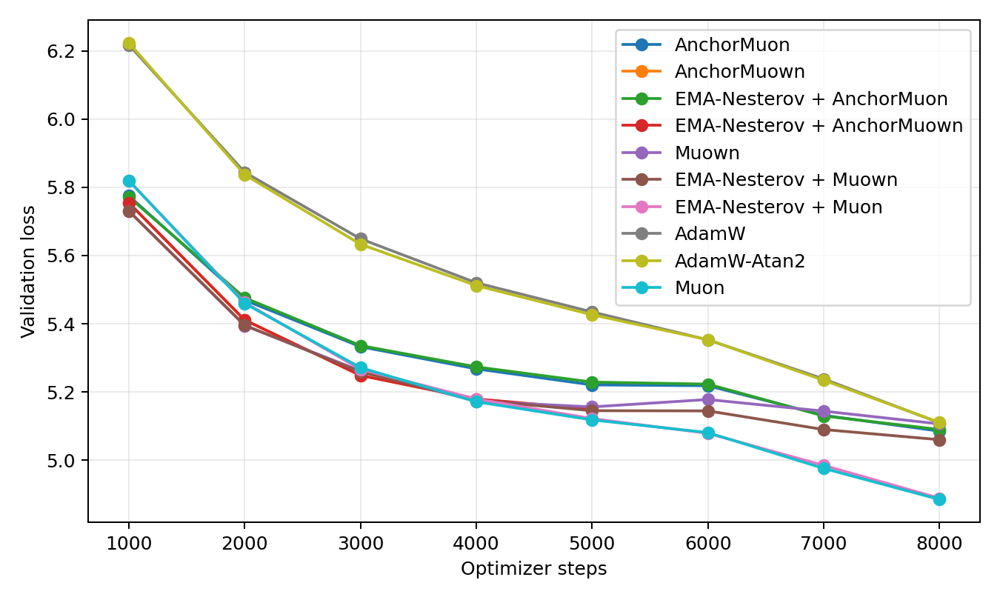
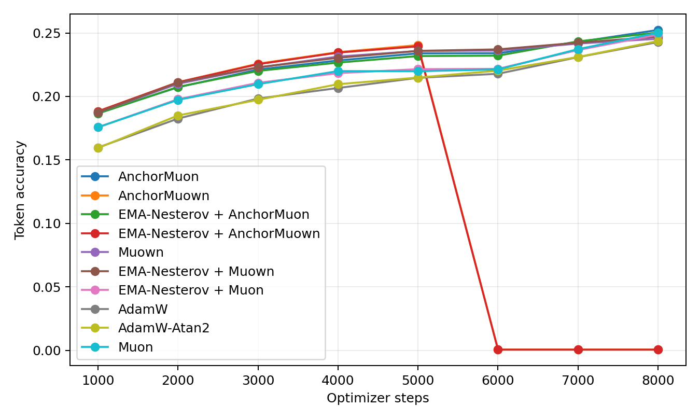
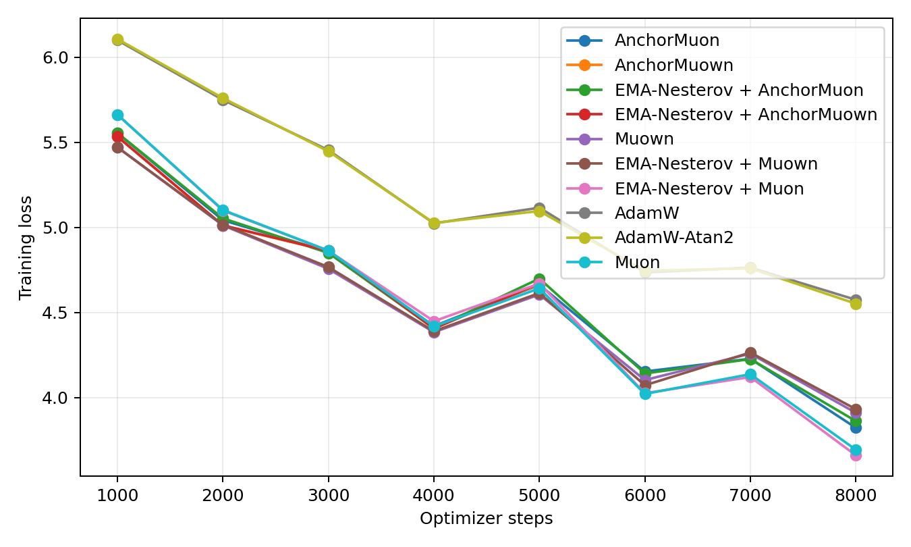
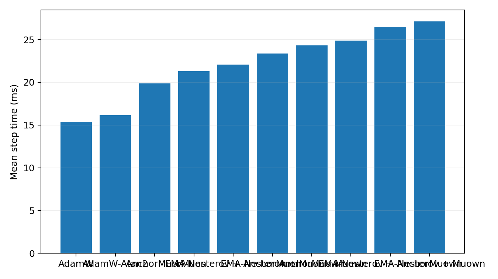
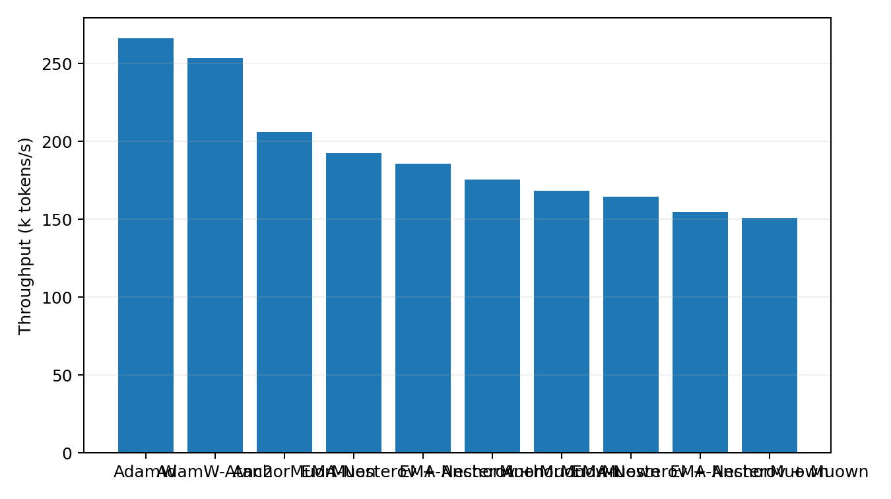

# Tokenized 50M LLM Optimizer Comparison

This benchmark uses real text tokenized with the Hugging Face `gpt2` tokenizer. It is the preferred language-model optimizer transfer check because embeddings, output head, and sequence statistics are closer to a normal BPE/SentencePiece pretraining setup than the older byte-level path.

## Setup

- Dataset: `HuggingFaceFW/fineweb-edu/sample-10BT:train [gpt2]`
- Tokenizer: `gpt2`
- Train tokens cached: 8,000,000
- Validation tokens cached: 524,288
- Model: decoder-only GPT, layers=8, width=512, heads=8, context=256, vocab=50,257
- Trainable parameters: 51045888
- Batch: 16 sequences x 256 tokens
- HPO: skipped; selected from prior hpo_summary.csv
- Final replay: 8000 steps per selected optimizer
- Validation estimate: 16 sequential batches per evaluation point
- Final extra validation: 256 sequential batches
- GPUs: 2 visible, one trial per GPU

## Final Results

| Rank | Optimizer | Selected config | Final val loss | Best val loss | Final token acc | Full val loss | Full token acc | Step time | Throughput |
|---:|---|---|---:|---:|---:|---:|---:|---:|---:|
| 1 | Muon | lr=0.0016, wd=0.05 | 4.8848 | 4.8848 | 25.01% | 4.9570 | 24.79% | 21.27 ms | 192.6k tok/s |
| 2 | EMA-Nesterov + Muon | lr=0.0016, wd=0.05, ema_beta=0.1, ema_gamma=0.995 | 4.8886 | 4.8886 | 24.87% | 4.9585 | 24.82% | 23.34 ms | 175.5k tok/s |
| 3 | EMA-Nesterov + Muown | lr=0.0016, wd=0, ema_beta=0.1, ema_gamma=0.995 | 5.0600 | 5.0600 | 24.71% | 5.0936 | 24.52% | 27.10 ms | 151.1k tok/s |
| 4 | Muown | lr=0.0016, wd=0 | 5.1063 | 5.1063 | 24.54% | 5.1003 | 24.51% | 24.89 ms | 164.6k tok/s |
| 5 | AdamW-Atan2 | lr=0.0005, wd=0.05 | 5.1107 | 5.1107 | 24.36% | 5.1509 | 24.24% | 16.15 ms | 253.6k tok/s |
| 6 | AdamW | lr=0.0005, wd=0.05 | 5.1095 | 5.1095 | 24.28% | 5.1510 | 24.22% | 15.39 ms | 266.1k tok/s |
| 7 | AnchorMuon | lr=0.0016, wd=0.05, row_gamma=0.15, pmuon_beta=0.9, normuon_beta2=0.93, fallback=rms@1x, soda=0.001 | 5.0852 | 5.0852 | 25.23% | 5.1607 | 24.91% | 19.86 ms | 206.2k tok/s |
| 8 | EMA-Nesterov + AnchorMuon | lr=0.0016, wd=0.05, row_gamma=0, pmuon_beta=0.9, normuon_beta2=0.93, fallback=rms@1x, soda=0.003, ema_beta=0.3, ema_gamma=0.995 | 5.0899 | 5.0899 | 25.03% | 5.1684 | 24.81% | 22.06 ms | 185.7k tok/s |
| 9 | AnchorMuown | lr=0.0016, wd=0.05, row_gamma=0.15, pmuon_beta=0.9, normuon_beta2=0.93, fallback=rms@1x, soda=0.001, mag_lr=0.5x | nan | 5.1478 | 0.06% | nan | 0.04% | 24.29 ms | 168.6k tok/s |
| 10 | EMA-Nesterov + AnchorMuown | lr=0.0016, wd=0.05, row_gamma=0.15, pmuon_beta=0.9, normuon_beta2=0.93, fallback=rms@1x, soda=0.001, mag_lr=0.5x, ema_beta=0.1, ema_gamma=0.995 | nan | 5.1498 | 0.06% | nan | 0.04% | 26.47 ms | 154.7k tok/s |

## Plots

## HPO Candidates

| Family | Trial | LR | Best val loss | Final val loss | Step time |
|---|---|---:|---:|---:|---:|
| adamatan2 | `fineweb_adamatan2_lr0.0005` | 0.0005 | 6.4115 | 6.4115 | 16.17 ms |
| adamw | `fineweb_adamw_lr0.0005` | 0.0005 | 6.4110 | 6.4110 | 15.43 ms |
| anchormuon | `muown_ref_anchor_lr0.0016_rg0.15_soda0.001_flr1_rms` | 0.0016 | 5.9784 | 5.9784 | 20.29 ms |
| anchormuown | `fineweb_anchormuown_lr0.0016_rg0.15_soda0.001_mag0.5_flr1_rms` | 0.0016 | 6.0218 | 6.0218 | 24.91 ms |
| ema_anchormuon | `muown_ref_ema_anchor_lr0.0016_rg0_soda0.003_flr1_rms_b0.3_g0.995_w0.2_r0.1` | 0.0016 | 5.9778 | 5.9778 | 22.37 ms |
| ema_anchormuown | `fineweb_ema_anchormuown_lr0.0016_rg0.15_soda0.001_mag0.5_flr1_rms_b0.1_g0.995_w0.2_r0.1` | 0.0016 | 6.0216 | 6.0216 | 26.99 ms |
| ema_muon | `fineweb_ema_muon_lr0.0016_b0.1_g0.995_w0.2_r0.1` | 0.0016 | 6.0238 | 6.0238 | 23.62 ms |
| ema_muown | `fineweb_ema_muown_lr0.0016_wd0_b0.1_g0.995_w0.2_r0.1` | 0.0016 | 6.0077 | 6.0077 | 27.42 ms |
| muon | `fineweb_muon_lr0.0016` | 0.0016 | 6.0249 | 6.0249 | 21.48 ms |
| muown | `fineweb_muown_lr0.0016_wd0` | 0.0016 | 6.0087 | 6.0087 | 25.21 ms |
