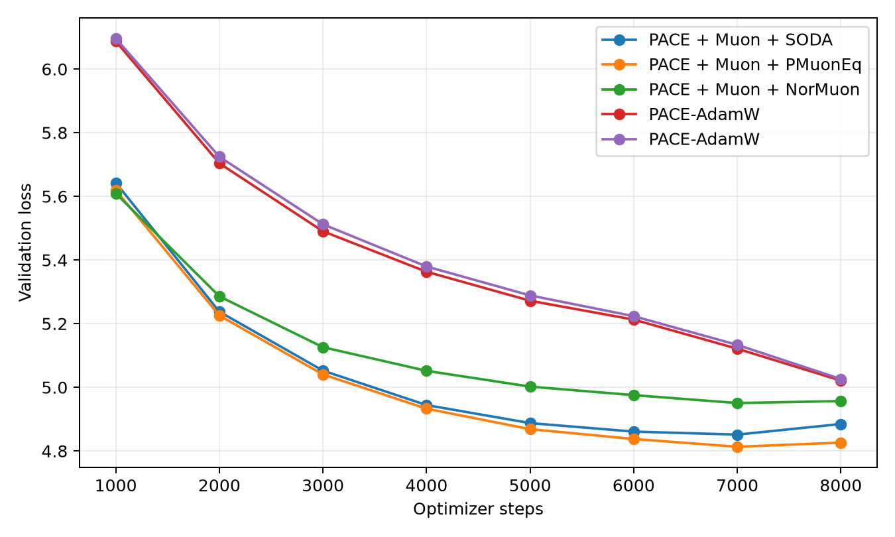
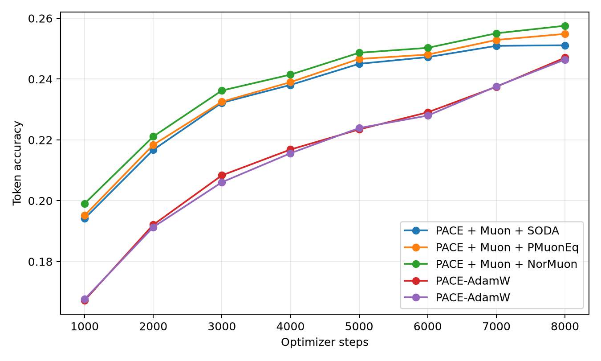
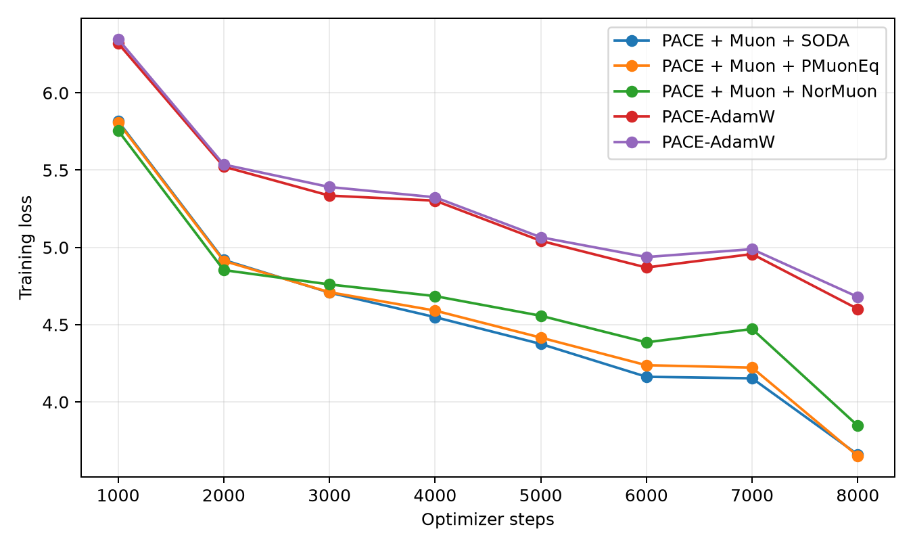
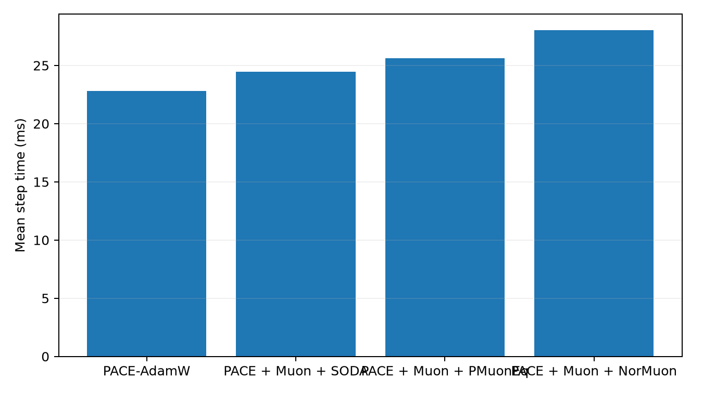
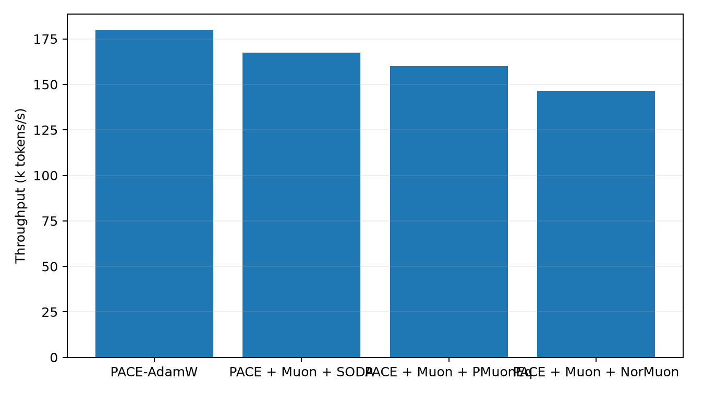

# Tokenized 50M LLM Optimizer Comparison

This benchmark uses real text tokenized with the Hugging Face `gpt2` tokenizer. It is the preferred language-model optimizer transfer check because embeddings, output head, and sequence statistics are closer to a normal BPE/SentencePiece pretraining setup than the older byte-level path.

## Setup

- Dataset: `HuggingFaceFW/fineweb-edu/sample-10BT:train [gpt2]`
- Tokenizer: `gpt2`
- Train tokens cached: 8,000,000
- Validation tokens cached: 524,288
- Model: decoder-only GPT, layers=8, width=512, heads=8, context=256, vocab=50,257
- Trainable parameters: 51045888
- Batch: 16 sequences x 256 tokens
- HPO: skipped; selected from prior hpo_summary.csv
- Final replay: 8000 steps per selected optimizer
- Validation estimate: 16 sequential batches per evaluation point
- Final extra validation: 256 sequential batches
- GPUs: 2 visible, one trial per GPU

## Final Results

| Rank | Optimizer | Selected config | Final val loss | Best val loss | Final token acc | Full val loss | Full token acc | Step time | Throughput |
|---:|---|---|---:|---:|---:|---:|---:|---:|---:|
| 1 | PACE + Muon + PMuonEq | lr=0.0016, wd=0.05, row_gamma=0.35, pmuon_beta=0.9, pace_c=0, kappa=0.5 | 4.8263 | 4.8132 | 25.49% | 4.8871 | 25.77% | 25.60 ms | 160.0k tok/s |
| 2 | PACE + Muon + SODA | lr=0.0016, wd=0.05, soda=0.001, pace_c=0, kappa=0.5 | 4.8846 | 4.8514 | 25.11% | 4.9425 | 25.37% | 24.45 ms | 167.6k tok/s |
| 3 | PACE + Muon + NorMuon | lr=0.0016, wd=0.05, normuon_beta2=0.93, pace_c=0, kappa=0.5 | 4.9568 | 4.9506 | 25.75% | 5.0228 | 26.05% | 28.02 ms | 146.2k tok/s |
| 4 | PACE-AdamW | lr=0.0005, wd=0.05, pace_c=0.003, kappa=0.3 | 5.0211 | 5.0211 | 24.70% | 5.0903 | 25.03% | 22.81 ms | 179.6k tok/s |
| 5 | PACE-AdamW | lr=0.0006, wd=0.05, pace_c=0.003, kappa=0.3 | 5.0260 | 5.0260 | 24.64% | 5.0962 | 24.99% | 22.80 ms | 179.7k tok/s |

## Plots

## HPO Candidates

| Family | Trial | LR | Best val loss | Final val loss | Step time |
|---|---|---:|---:|---:|---:|
| pace_adamw | `pace_adamw_lr0.0005_c0.003_k0.3_paperc` | 0.0005 | 1.0000 | nan | n/a |
| pace_adamw | `pace_adamw_lr0.0006_c0.003_k0.3_paperc` | 0.0006 | 1.1000 | nan | n/a |
| pace_muon_normuon | `normuon_emaeval_lr0.0016_nb0.93_k0.5` | 0.0016 | 1.0000 | nan | n/a |
| pace_muon_pmuoneq | `pmuoneq_emaeval_lr0.0016_rg0.35_k0.5` | 0.0016 | 1.0000 | nan | n/a |
| pace_muon_soda | `soda_emaeval_lr0.0016_soda0.001_k0.5` | 0.0016 | 1.0000 | nan | n/a |
