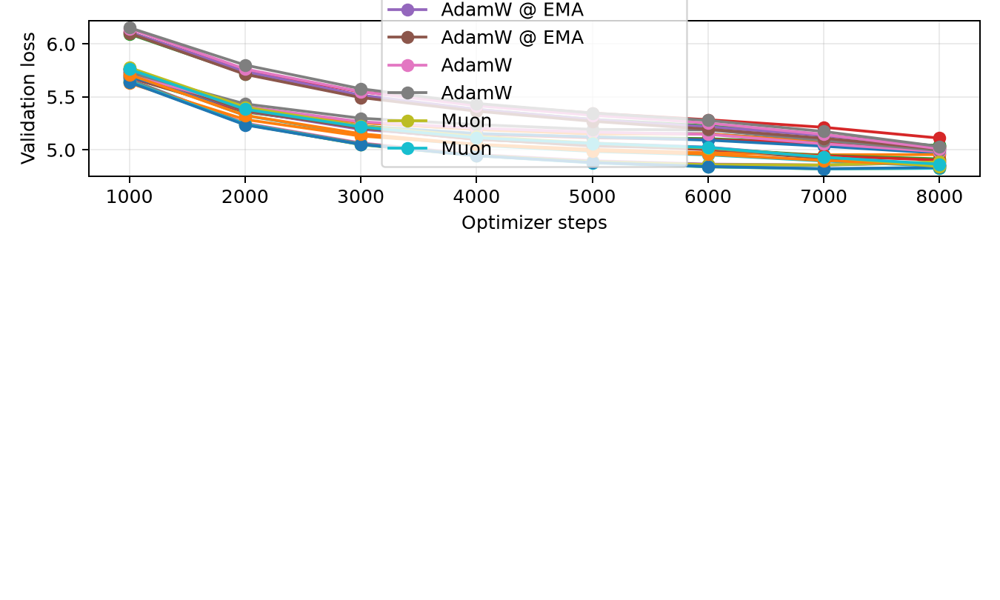
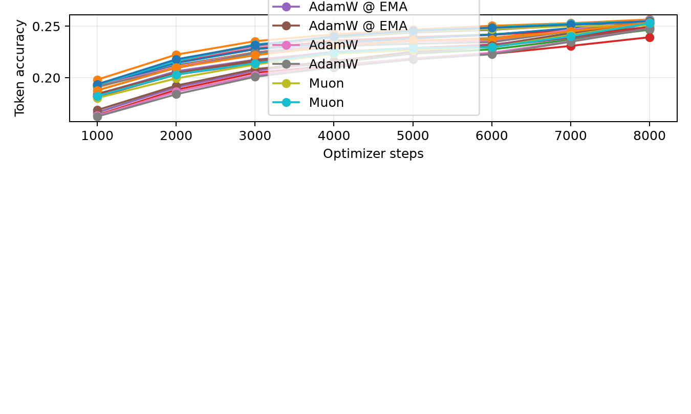
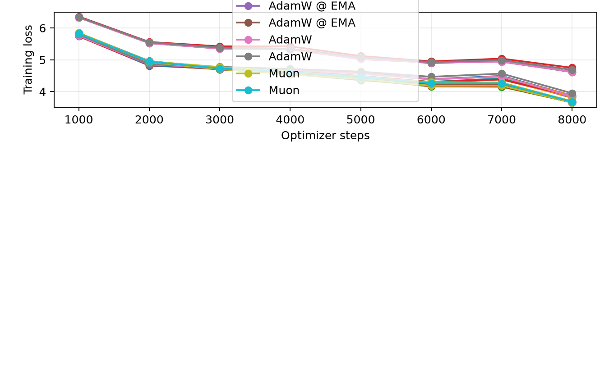
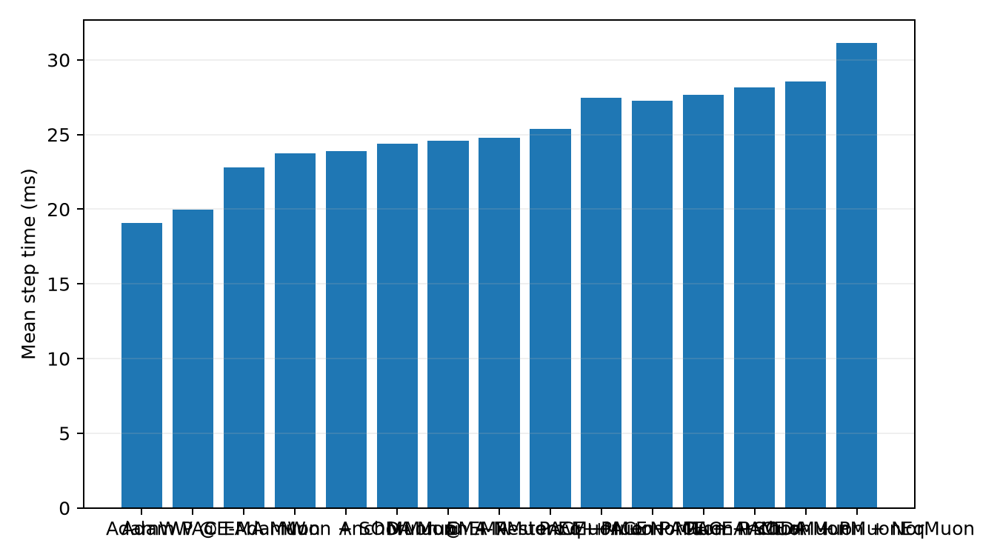
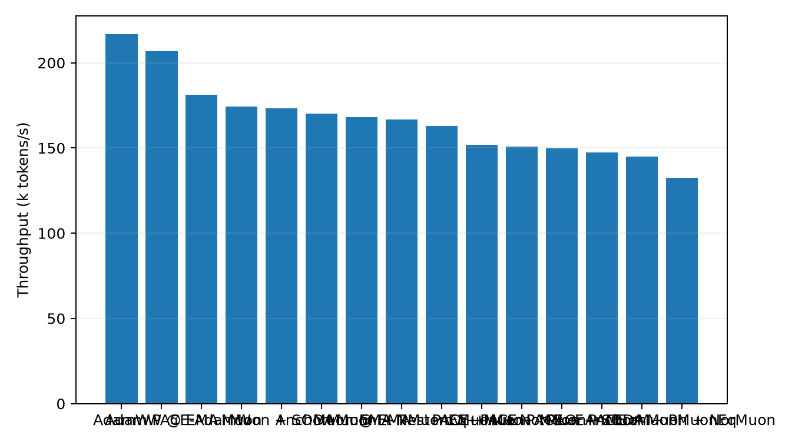

# Tokenized 50M LLM Optimizer Comparison

This benchmark uses real text tokenized with the Hugging Face `gpt2` tokenizer. It is the preferred language-model optimizer transfer check because embeddings, output head, and sequence statistics are closer to a normal BPE/SentencePiece pretraining setup than the older byte-level path.

## Setup

- Dataset: `HuggingFaceFW/fineweb-edu/sample-10BT:train [gpt2]`
- Tokenizer: `gpt2`
- Train tokens cached: 8,000,000
- Validation tokens cached: 524,288
- Model: decoder-only GPT, layers=8, width=512, heads=8, context=256, vocab=50,257
- Trainable parameters: 51045888
- Batch: 16 sequences x 256 tokens
- HPO: 600 steps per candidate, selected by best validation loss
- Final replay: 8000 steps per selected optimizer
- Validation estimate: 16 sequential batches per evaluation point
- Final extra validation: 256 sequential batches
- GPUs: 2 visible, one trial per GPU

## Final Results

| Rank | Optimizer | Selected config | Final val loss | Best val loss | Final token acc | Full val loss | Full token acc | Step time | Throughput |
|---:|---|---|---:|---:|---:|---:|---:|---:|---:|
| 1 | PACE + Muon + PMuonEq | lr=0.0016, wd=0.05, row_gamma=0.35, pmuon_beta=0.9, pace_c=0.003, kappa=0.5 | 4.8270 | 4.8206 | 25.48% | 4.8841 | 25.73% | 28.29 ms | 144.8k tok/s |
| 2 | Muon @ EMA | lr=0.0016, wd=0.05, pace_c=0, kappa=0.5 | 4.8338 | 4.8220 | 25.49% | 4.8867 | 25.73% | 24.38 ms | 168.0k tok/s |
| 3 | PACE + Muon | lr=0.0016, wd=0.05, pace_c=0.001, kappa=0.5 | 4.8256 | 4.8202 | 25.46% | 4.8875 | 25.69% | 27.45 ms | 149.2k tok/s |
| 4 | Muon | lr=0.0018, wd=0.05 | 4.8417 | 4.8417 | 25.29% | 4.8973 | 25.57% | 23.49 ms | 174.4k tok/s |
| 5 | PACE + Muon + PMuonEq | lr=0.0016, wd=0.05, row_gamma=0.35, pmuon_beta=0.9, pace_c=0.003, kappa=0.3 | 4.8457 | 4.8457 | 25.33% | 4.8992 | 25.59% | 28.57 ms | 143.4k tok/s |
| 6 | Muon @ EMA | lr=0.0016, wd=0.05, pace_c=0, kappa=0.3 | 4.8511 | 4.8511 | 25.36% | 4.9027 | 25.59% | 24.60 ms | 166.5k tok/s |
| 7 | EMA-Nesterov + Muon | lr=0.0016, wd=0.05, ema_beta=0.1, ema_gamma=0.995 | 4.8570 | 4.8570 | 25.19% | 4.9055 | 25.57% | 25.16 ms | 162.8k tok/s |
| 8 | Muon + PMuonEq | lr=0.0016, wd=0.05, row_gamma=0.55, pmuon_beta=0.9 | 4.8507 | 4.8507 | 25.29% | 4.9066 | 25.59% | 24.55 ms | 166.8k tok/s |
| 9 | Muon + PMuonEq | lr=0.0016, wd=0.05, row_gamma=0.35, pmuon_beta=0.9 | 4.8537 | 4.8537 | 25.35% | 4.9138 | 25.58% | 24.78 ms | 165.3k tok/s |
| 10 | EMA-Nesterov + Muon | lr=0.0014, wd=0.05, ema_beta=0.1, ema_gamma=0.995 | 4.8572 | 4.8572 | 25.32% | 4.9160 | 25.57% | 25.39 ms | 161.3k tok/s |
| 11 | Muon | lr=0.0016, wd=0.05 | 4.8646 | 4.8646 | 25.29% | 4.9161 | 25.53% | 23.72 ms | 172.7k tok/s |
| 12 | PACE + Muon + SODA | lr=0.0016, wd=0.05, soda=0.001, pace_c=0.003, kappa=0.5 | 4.8808 | 4.8555 | 25.21% | 4.9390 | 25.39% | 27.66 ms | 148.1k tok/s |
| 13 | PACE + Muon + SODA | lr=0.0016, wd=0.05, soda=0.003, pace_c=0.003, kappa=0.5 | 4.8819 | 4.8573 | 25.16% | 4.9450 | 25.35% | 27.37 ms | 149.6k tok/s |
| 14 | PACE + Muon | lr=0.0016, wd=0, pace_c=0.001, kappa=0.5 | 4.8867 | 4.8569 | 25.05% | 4.9466 | 25.41% | 26.99 ms | 151.8k tok/s |
| 15 | Muon + SODA | lr=0.0016, wd=0.05, soda=0.01 | 4.9031 | 4.9031 | 24.92% | 4.9660 | 25.19% | 23.87 ms | 171.6k tok/s |
| 16 | Muon + SODA | lr=0.0016, wd=0.05, soda=0.001 | 4.9144 | 4.9144 | 24.92% | 4.9722 | 25.18% | 23.64 ms | 173.3k tok/s |
| 17 | PACE + Muon + NorMuon | lr=0.0016, wd=0.05, normuon_beta2=0.93, pace_c=0.003, kappa=0.5 | 4.9551 | 4.9533 | 25.66% | 5.0205 | 26.04% | 31.11 ms | 131.6k tok/s |
| 18 | PACE + Muon + NorMuon | lr=0.0016, wd=0.05, normuon_beta2=0.93, pace_c=0.003, kappa=0.3 | 4.9689 | 4.9689 | 25.65% | 5.0372 | 25.98% | 30.93 ms | 132.4k tok/s |
| 19 | Muon + NorMuon | lr=0.0016, wd=0.05, normuon_beta2=0.93 | 4.9825 | 4.9825 | 25.63% | 5.0465 | 25.92% | 27.13 ms | 151.0k tok/s |
| 20 | Muon + NorMuon | lr=0.0016, wd=0.05, normuon_beta2=0.9 | 4.9934 | 4.9934 | 25.57% | 5.0547 | 25.95% | 27.25 ms | 150.3k tok/s |
| 21 | AdamW @ EMA | lr=0.0005, wd=0.05, pace_c=0, kappa=0.3 | 5.0064 | 5.0064 | 24.81% | 5.0836 | 25.07% | 19.96 ms | 205.2k tok/s |
| 22 | AdamW | lr=0.0005, wd=0.05 | 5.0103 | 5.0103 | 24.77% | 5.0874 | 25.05% | 18.90 ms | 216.7k tok/s |
| 23 | AdamW @ EMA | lr=0.0006, wd=0.05, pace_c=0, kappa=0.3 | 5.0264 | 5.0264 | 24.77% | 5.0983 | 25.06% | 19.81 ms | 206.8k tok/s |
| 24 | PACE + AnchorMuon | lr=0.0016, wd=0.05, row_gamma=0, pmuon_beta=0.9, normuon_beta2=0.93, fallback=rms@1x, soda=0.003, pace_c=0.003, kappa=0.3 | 5.0256 | 5.0256 | 25.30% | 5.1002 | 25.61% | 28.14 ms | 145.5k tok/s |
| 25 | AdamW | lr=0.0006, wd=0.05 | 5.0315 | 5.0315 | 24.76% | 5.1026 | 25.06% | 19.07 ms | 214.8k tok/s |
| 26 | AnchorMuon | lr=0.0016, wd=0.05, row_gamma=0, pmuon_beta=0.9, normuon_beta2=0.93, fallback=rms@1x, soda=0.003 | 5.0379 | 5.0379 | 25.34% | 5.1046 | 25.61% | 24.37 ms | 168.1k tok/s |
| 27 | PACE-AdamW | lr=0.0006, wd=0.05, pace_c=0.03, kappa=0.3 | 5.0334 | 5.0334 | 24.66% | 5.1056 | 24.87% | 22.61 ms | 181.1k tok/s |
| 28 | AnchorMuon | lr=0.0016, wd=0.05, row_gamma=0.15, pmuon_beta=0.9, normuon_beta2=0.93, fallback=rms@1x, soda=0.001 | 5.0419 | 5.0419 | 25.28% | 5.1091 | 25.59% | 24.08 ms | 170.1k tok/s |
| 29 | PACE + AnchorMuon | lr=0.0016, wd=0.05, row_gamma=0.15, pmuon_beta=0.9, normuon_beta2=0.93, fallback=rms@1x, soda=0.001, pace_c=0.003, kappa=0.3 | 5.0419 | 5.0419 | 25.31% | 5.1119 | 25.53% | 27.80 ms | 147.4k tok/s |
| 30 | PACE-AdamW | lr=0.0006, wd=0.05, pace_c=0.1, kappa=0.3 | 5.1108 | 5.1108 | 23.93% | 5.1978 | 23.99% | 22.81 ms | 179.5k tok/s |

## Plots

## HPO Candidates

| Family | Trial | LR | Best val loss | Final val loss | Step time |
|---|---|---:|---:|---:|---:|
| adamw | `pace_ref_adamw_lr0.0005` | 0.0005 | 6.3404 | 6.3404 | 19.11 ms |
| adamw | `pace_ref_adamw_lr0.0006` | 0.0006 | 6.3404 | 6.3404 | 18.99 ms |
| adamw | `pace_ref_adamw_lr0.0004` | 0.0004 | 6.3518 | 6.3518 | 18.94 ms |
| anchormuon | `pace_ref_anchor_lr0.0016_rg0.15_soda0.001_flr1_rms` | 0.0016 | 5.9113 | 5.9113 | 24.62 ms |
| anchormuon | `pace_ref_anchor_lr0.0016_rg0_soda0.003_flr1_rms` | 0.0016 | 5.9130 | 5.9130 | 24.32 ms |
| anchormuon | `pace_ref_anchor_lr0.0014_rg0.15_soda0.001_flr1_rms` | 0.0014 | 5.9234 | 5.9234 | 24.60 ms |
| ema_muon | `pace_ref_ema_muon_lr0.0016_b0.1_g0.995` | 0.0016 | 5.9647 | 5.9647 | 25.34 ms |
| ema_muon | `pace_ref_ema_muon_lr0.0014_b0.1_g0.995` | 0.0014 | 5.9795 | 5.9795 | 25.57 ms |
| emaeval_adamw | `pace_emaeval_adamw_lr0.0006_k0.3` | 0.0006 | 6.3414 | 6.3414 | 19.93 ms |
| emaeval_adamw | `pace_emaeval_adamw_lr0.0005_k0.3` | 0.0005 | 6.3416 | 6.3416 | 20.13 ms |
| emaeval_adamw | `pace_emaeval_adamw_lr0.0006_k0.5` | 0.0006 | 6.3431 | 6.3431 | 20.12 ms |
| emaeval_adamw | `pace_emaeval_adamw_lr0.0005_k0.5` | 0.0005 | 6.3434 | 6.3434 | 19.93 ms |
| emaeval_adamw | `pace_emaeval_adamw_lr0.0004_k0.3` | 0.0004 | 6.3530 | 6.3530 | 19.93 ms |
| emaeval_adamw | `pace_emaeval_adamw_lr0.0004_k0.5` | 0.0004 | 6.3550 | 6.3550 | 20.12 ms |
| emaeval_adamw | `pace_emaeval_adamw_lr0.0006_k0.7` | 0.0006 | 6.3571 | 6.3571 | 19.94 ms |
| emaeval_adamw | `pace_emaeval_adamw_lr0.0005_k0.7` | 0.0005 | 6.3599 | 6.3599 | 20.10 ms |
| emaeval_adamw | `pace_emaeval_adamw_lr0.0004_k0.7` | 0.0004 | 6.3734 | 6.3734 | 19.92 ms |
| emaeval_muon | `pace_emaeval_muon_lr0.0016_k0.5` | 0.0016 | 5.9648 | 5.9648 | 24.58 ms |
| emaeval_muon | `pace_emaeval_muon_lr0.0016_k0.3` | 0.0016 | 5.9676 | 5.9676 | 24.84 ms |
| emaeval_muon | `pace_emaeval_muon_lr0.0016_k0.7` | 0.0016 | 5.9704 | 5.9704 | 24.85 ms |
| emaeval_muon | `pace_emaeval_muon_lr0.0014_k0.5` | 0.0014 | 5.9790 | 5.9790 | 24.84 ms |
| emaeval_muon | `pace_emaeval_muon_lr0.0014_k0.3` | 0.0014 | 5.9816 | 5.9816 | 24.56 ms |
| emaeval_muon | `pace_emaeval_muon_lr0.0014_k0.7` | 0.0014 | 5.9852 | 5.9852 | 24.58 ms |
| emaeval_muon | `pace_emaeval_muon_lr0.0012_k0.5` | 0.0012 | 5.9911 | 5.9911 | 24.57 ms |
| emaeval_muon | `pace_emaeval_muon_lr0.0012_k0.3` | 0.0012 | 5.9924 | 5.9924 | 24.83 ms |
| emaeval_muon | `pace_emaeval_muon_lr0.0012_k0.7` | 0.0012 | 6.0010 | 6.0010 | 24.84 ms |
| muon | `pace_ref_muon_lr0.0018` | 0.0018 | 5.9580 | 5.9580 | 23.64 ms |
| muon | `pace_ref_muon_lr0.0016` | 0.0016 | 5.9655 | 5.9655 | 23.83 ms |
| muon | `pace_ref_muon_lr0.0014` | 0.0014 | 5.9797 | 5.9797 | 23.62 ms |
| muon | `pace_ref_muon_lr0.0012` | 0.0012 | 5.9908 | 5.9908 | 23.79 ms |
| muon_normuon | `muon_normuon_lr0.0016_nb0.93` | 0.0016 | 5.9154 | 5.9154 | 27.70 ms |
| muon_normuon | `muon_normuon_lr0.0016_nb0.9` | 0.0016 | 5.9268 | 5.9268 | 27.49 ms |
| muon_normuon | `muon_normuon_lr0.0014_nb0.93` | 0.0014 | 5.9312 | 5.9312 | 27.63 ms |
| muon_normuon | `muon_normuon_lr0.0014_nb0.9` | 0.0014 | 5.9444 | 5.9444 | 27.48 ms |
| muon_normuon | `muon_normuon_lr0.0012_nb0.93` | 0.0012 | 5.9618 | 5.9618 | 27.71 ms |
| muon_normuon | `muon_normuon_lr0.0012_nb0.9` | 0.0012 | 5.9745 | 5.9745 | 27.53 ms |
| muon_pmuoneq | `muon_pmuoneq_lr0.0016_rg0.55` | 0.0016 | 5.9330 | 5.9330 | 25.08 ms |
| muon_pmuoneq | `muon_pmuoneq_lr0.0016_rg0.35` | 0.0016 | 5.9437 | 5.9437 | 24.90 ms |
| muon_pmuoneq | `muon_pmuoneq_lr0.0014_rg0.55` | 0.0014 | 5.9449 | 5.9449 | 25.09 ms |
| muon_pmuoneq | `muon_pmuoneq_lr0.0016_rg0.15` | 0.0016 | 5.9513 | 5.9513 | 25.11 ms |
| muon_pmuoneq | `muon_pmuoneq_lr0.0014_rg0.35` | 0.0014 | 5.9545 | 5.9545 | 24.89 ms |
| muon_pmuoneq | `muon_pmuoneq_lr0.0012_rg0.55` | 0.0012 | 5.9577 | 5.9577 | 25.09 ms |
| muon_pmuoneq | `muon_pmuoneq_lr0.0014_rg0.15` | 0.0014 | 5.9667 | 5.9667 | 25.09 ms |
| muon_pmuoneq | `muon_pmuoneq_lr0.0012_rg0.35` | 0.0012 | 5.9688 | 5.9688 | 24.87 ms |
| muon_pmuoneq | `muon_pmuoneq_lr0.0012_rg0.15` | 0.0012 | 5.9795 | 5.9795 | 25.08 ms |
| muon_soda | `muon_soda_lr0.0016_soda0.001` | 0.0016 | 5.9640 | 5.9640 | 23.93 ms |
| muon_soda | `muon_soda_lr0.0016_soda0.01` | 0.0016 | 5.9642 | 5.9642 | 23.93 ms |
| muon_soda | `muon_soda_lr0.0016_soda0.003` | 0.0016 | 5.9648 | 5.9648 | 24.13 ms |
| muon_soda | `muon_soda_lr0.0014_soda0.001` | 0.0014 | 5.9796 | 5.9796 | 23.92 ms |
| muon_soda | `muon_soda_lr0.0014_soda0.003` | 0.0014 | 5.9798 | 5.9798 | 24.14 ms |
| muon_soda | `muon_soda_lr0.0014_soda0.01` | 0.0014 | 5.9826 | 5.9826 | 23.91 ms |
| muon_soda | `muon_soda_lr0.0012_soda0.003` | 0.0012 | 5.9898 | 5.9898 | 24.13 ms |
| muon_soda | `muon_soda_lr0.0012_soda0.01` | 0.0012 | 5.9912 | 5.9912 | 23.94 ms |
| muon_soda | `muon_soda_lr0.0012_soda0.001` | 0.0012 | 5.9915 | 5.9915 | 23.96 ms |
| pace_adamw | `pace_adamw_lr0.0006_c0.03_k0.3` | 0.0006 | 6.3024 | 6.3024 | 22.80 ms |
| pace_adamw | `pace_adamw_lr0.0006_c0.1_k0.3` | 0.0006 | 6.3093 | 6.3093 | 22.80 ms |
| pace_adamw | `pace_adamw_lr0.0005_c0.01_k0.5_const` | 0.0005 | 6.3147 | 6.3147 | 23.01 ms |
| pace_adamw | `pace_adamw_lr0.0006_c0.03_k0.5` | 0.0006 | 6.3159 | 6.3159 | 23.02 ms |
| pace_adamw | `pace_adamw_lr0.0005_c0.01_k0.3` | 0.0005 | 6.3161 | 6.3161 | 22.82 ms |
| pace_adamw | `pace_adamw_lr0.0005_c0.003_k0.5_const` | 0.0005 | 6.3172 | 6.3172 | 22.80 ms |
| pace_adamw | `pace_adamw_lr0.0006_c0.01_k0.3` | 0.0006 | 6.3172 | 6.3172 | 22.80 ms |
| pace_adamw | `pace_adamw_lr0.0005_c0.03_k0.3` | 0.0005 | 6.3198 | 6.3198 | 22.81 ms |
| pace_adamw | `pace_adamw_lr0.0005_c0.01_k0.5` | 0.0005 | 6.3219 | 6.3219 | 23.01 ms |
| pace_adamw | `pace_adamw_lr0.0005_c0.03_k0.5_const` | 0.0005 | 6.3235 | 6.3235 | 22.78 ms |
| pace_adamw | `pace_adamw_lr0.0006_c0.01_k0.5` | 0.0006 | 6.3242 | 6.3242 | 23.01 ms |
| pace_adamw | `pace_adamw_lr0.0005_c0.003_k0.5` | 0.0005 | 6.3246 | 6.3246 | 23.02 ms |
| pace_adamw | `pace_adamw_lr0.0005_c0.003_k0.3` | 0.0005 | 6.3254 | 6.3254 | 22.80 ms |
| pace_adamw | `pace_adamw_lr0.0005_c0.1_k0.3` | 0.0005 | 6.3300 | 6.3300 | 22.81 ms |
| pace_adamw | `pace_adamw_lr0.0005_c0.03_k0.5` | 0.0005 | 6.3307 | 6.3307 | 23.02 ms |
| pace_adamw | `pace_adamw_lr0.0005_c0.001_k0.3` | 0.0005 | 6.3321 | 6.3321 | 22.81 ms |
| pace_adamw | `pace_adamw_lr0.0005_c0.001_k0.5` | 0.0005 | 6.3356 | 6.3356 | 23.03 ms |
| pace_adamw | `pace_adamw_lr0.0006_c0.001_k0.3` | 0.0006 | 6.3368 | 6.3368 | 22.81 ms |
| pace_adamw | `pace_adamw_lr0.0006_c0.003_k0.3` | 0.0006 | 6.3369 | 6.3369 | 22.80 ms |
| pace_adamw | `pace_adamw_lr0.0006_c0.003_k0.5` | 0.0006 | 6.3396 | 6.3396 | 23.02 ms |
| pace_adamw | `pace_adamw_lr0.0006_c0.001_k0.5` | 0.0006 | 6.3405 | 6.3405 | 23.02 ms |
| pace_adamw | `pace_adamw_lr0.0006_c0.1_k0.5` | 0.0006 | 6.3415 | 6.3415 | 23.01 ms |
| pace_adamw | `pace_adamw_lr0.0004_c0.03_k0.3` | 0.0004 | 6.3456 | 6.3456 | 22.81 ms |
| pace_adamw | `pace_adamw_lr0.0004_c0.01_k0.3` | 0.0004 | 6.3456 | 6.3456 | 22.82 ms |
| pace_adamw | `pace_adamw_lr0.0004_c0.003_k0.3` | 0.0004 | 6.3489 | 6.3489 | 22.81 ms |
| pace_adamw | `pace_adamw_lr0.0004_c0.01_k0.5` | 0.0004 | 6.3502 | 6.3502 | 23.02 ms |
| pace_adamw | `pace_adamw_lr0.0004_c0.001_k0.3` | 0.0004 | 6.3514 | 6.3514 | 22.81 ms |
| pace_adamw | `pace_adamw_lr0.0004_c0.003_k0.5` | 0.0004 | 6.3515 | 6.3515 | 23.01 ms |
| pace_adamw | `pace_adamw_lr0.0004_c0.001_k0.5` | 0.0004 | 6.3540 | 6.3540 | 23.01 ms |
| pace_adamw | `pace_adamw_lr0.0004_c0.1_k0.3` | 0.0004 | 6.3568 | 6.3568 | 22.83 ms |
| pace_adamw | `pace_adamw_lr0.0004_c0.03_k0.5` | 0.0004 | 6.3579 | 6.3579 | 23.03 ms |
| pace_adamw | `pace_adamw_lr0.0005_c0.1_k0.5` | 0.0005 | 6.3581 | 6.3581 | 23.02 ms |
| pace_adamw | `pace_adamw_lr0.0004_c0.1_k0.5` | 0.0004 | 6.3834 | 6.3834 | 23.03 ms |
| pace_anchormuon | `pace_anchor_lr0.0016_rg0.15_soda0.001_flr1_rms_c0.003_k0.3` | 0.0016 | 5.9379 | 5.9379 | 28.14 ms |
| pace_anchormuon | `pace_anchor_lr0.0016_rg0_soda0.003_flr1_rms_c0.003_k0.3` | 0.0016 | 5.9383 | 5.9383 | 28.12 ms |
| pace_anchormuon | `pace_anchor_lr0.0016_rg0_soda0.003_flr1_rms_c0.003_k0.5` | 0.0016 | 5.9410 | 5.9410 | 28.45 ms |
| pace_anchormuon | `pace_anchor_lr0.0016_rg0.15_soda0.001_flr1_rms_c0.003_k0.5` | 0.0016 | 5.9417 | 5.9417 | 28.46 ms |
| pace_anchormuon | `pace_anchor_lr0.0014_rg0.15_soda0.001_flr1_rms_c0.003_k0.3` | 0.0014 | 5.9520 | 5.9520 | 28.14 ms |
| pace_anchormuon | `pace_anchor_lr0.0014_rg0.15_soda0.001_flr1_rms_c0.003_k0.5` | 0.0014 | 5.9561 | 5.9561 | 28.47 ms |
| pace_anchormuon | `pace_anchor_lr0.0016_rg0.15_soda0.001_flr1_rms_c0.01_k0.3` | 0.0016 | 5.9695 | 5.9695 | 28.12 ms |
| pace_anchormuon | `pace_anchor_lr0.0016_rg0_soda0.003_flr1_rms_c0.01_k0.3` | 0.0016 | 5.9721 | 5.9721 | 28.13 ms |
| pace_anchormuon | `pace_anchor_lr0.0016_rg0_soda0.003_flr1_rms_c0.01_k0.5` | 0.0016 | 5.9758 | 5.9758 | 28.44 ms |
| pace_anchormuon | `pace_anchor_lr0.0016_rg0.15_soda0.001_flr1_rms_c0.01_k0.5` | 0.0016 | 5.9763 | 5.9763 | 28.46 ms |
| pace_anchormuon | `pace_anchor_lr0.0014_rg0.15_soda0.001_flr1_rms_c0.01_k0.3` | 0.0014 | 5.9879 | 5.9879 | 28.14 ms |
| pace_anchormuon | `pace_anchor_lr0.0014_rg0.15_soda0.001_flr1_rms_c0.01_k0.5` | 0.0014 | 5.9943 | 5.9943 | 28.47 ms |
| pace_anchormuon | `pace_anchor_lr0.0016_rg0.15_soda0.001_flr1_rms_c0.03_k0.3` | 0.0016 | 6.0181 | 6.0181 | 28.13 ms |
| pace_anchormuon | `pace_anchor_lr0.0016_rg0_soda0.003_flr1_rms_c0.03_k0.3` | 0.0016 | 6.0213 | 6.0213 | 28.13 ms |
| pace_anchormuon | `pace_anchor_lr0.0016_rg0.15_soda0.001_flr1_rms_c0.03_k0.5` | 0.0016 | 6.0332 | 6.0332 | 28.46 ms |
| pace_anchormuon | `pace_anchor_lr0.0016_rg0_soda0.003_flr1_rms_c0.03_k0.5` | 0.0016 | 6.0355 | 6.0355 | 28.46 ms |
| pace_anchormuon | `pace_anchor_lr0.0014_rg0.15_soda0.001_flr1_rms_c0.03_k0.3` | 0.0014 | 6.0421 | 6.0421 | 28.15 ms |
| pace_anchormuon | `pace_anchor_lr0.0014_rg0.15_soda0.001_flr1_rms_c0.03_k0.5` | 0.0014 | 6.0545 | 6.0545 | 28.42 ms |
| pace_muon | `pace_muon_lr0.0016_wd0_c0.001_k0.5` | 0.0016 | 5.9709 | 5.9709 | 27.24 ms |
| pace_muon | `pace_muon_lr0.0016_wd0.05_c0.001_k0.5` | 0.0016 | 5.9720 | 5.9720 | 27.46 ms |
| pace_muon | `pace_muon_lr0.0016_wd0.05_c0.001_k0.3` | 0.0016 | 5.9727 | 5.9727 | 27.71 ms |
| pace_muon | `pace_muon_lr0.0016_wd0_c0.001_k0.3` | 0.0016 | 5.9731 | 5.9731 | 27.48 ms |
| pace_muon | `pace_muon_lr0.0014_wd0.05_c0.01_k0.5_scalar` | 0.0014 | 5.9796 | 5.9796 | 25.49 ms |
| pace_muon | `pace_muon_lr0.0014_wd0.05_c0.03_k0.5_scalar` | 0.0014 | 5.9799 | 5.9799 | 25.49 ms |
| pace_muon | `pace_muon_lr0.0014_wd0.05_c0.003_k0.5_scalar` | 0.0014 | 5.9806 | 5.9806 | 25.50 ms |
| pace_muon | `pace_muon_lr0.0016_wd0.05_c0.003_k0.5` | 0.0016 | 5.9869 | 5.9869 | 27.46 ms |
| pace_muon | `pace_muon_lr0.0016_wd0.05_c0.003_k0.3` | 0.0016 | 5.9870 | 5.9870 | 27.71 ms |
| pace_muon | `pace_muon_lr0.0014_wd0.05_c0.001_k0.5` | 0.0014 | 5.9871 | 5.9871 | 27.47 ms |
| pace_muon | `pace_muon_lr0.0014_wd0_c0.001_k0.5` | 0.0014 | 5.9872 | 5.9872 | 27.23 ms |
| pace_muon | `pace_muon_lr0.0016_wd0_c0.003_k0.5` | 0.0016 | 5.9873 | 5.9873 | 27.23 ms |
| pace_muon | `pace_muon_lr0.0014_wd0.05_c0.001_k0.3` | 0.0014 | 5.9882 | 5.9882 | 27.72 ms |
| pace_muon | `pace_muon_lr0.0016_wd0_c0.003_k0.3` | 0.0016 | 5.9882 | 5.9882 | 27.48 ms |
| pace_muon | `pace_muon_lr0.0014_wd0_c0.001_k0.3` | 0.0014 | 5.9885 | 5.9885 | 27.49 ms |
| pace_muon | `pace_muon_lr0.0014_wd0.05_c0.003_k0.5_const` | 0.0014 | 5.9928 | 5.9928 | 27.70 ms |
| pace_muon | `pace_muon_lr0.0012_wd0.05_c0.001_k0.5` | 0.0012 | 5.9954 | 5.9954 | 27.44 ms |
| pace_muon | `pace_muon_lr0.0012_wd0.05_c0.001_k0.3` | 0.0012 | 5.9969 | 5.9969 | 27.71 ms |
| pace_muon | `pace_muon_lr0.0012_wd0_c0.001_k0.5` | 0.0012 | 5.9975 | 5.9975 | 27.21 ms |
| pace_muon | `pace_muon_lr0.0012_wd0_c0.001_k0.3` | 0.0012 | 5.9977 | 5.9977 | 27.48 ms |
| pace_muon | `pace_muon_lr0.0014_wd0.05_c0.003_k0.5` | 0.0014 | 5.9997 | 5.9997 | 27.45 ms |
| pace_muon | `pace_muon_lr0.0014_wd0.05_c0.003_k0.3` | 0.0014 | 6.0002 | 6.0002 | 27.70 ms |
| pace_muon | `pace_muon_lr0.0014_wd0_c0.003_k0.5` | 0.0014 | 6.0007 | 6.0007 | 27.23 ms |
| pace_muon | `pace_muon_lr0.0014_wd0_c0.003_k0.3` | 0.0014 | 6.0009 | 6.0009 | 27.49 ms |
| pace_muon | `pace_muon_lr0.0012_wd0.05_c0.003_k0.5` | 0.0012 | 6.0076 | 6.0076 | 27.44 ms |
| pace_muon | `pace_muon_lr0.0012_wd0_c0.003_k0.5` | 0.0012 | 6.0089 | 6.0089 | 27.21 ms |
| pace_muon | `pace_muon_lr0.0012_wd0_c0.003_k0.3` | 0.0012 | 6.0094 | 6.0094 | 27.49 ms |
| pace_muon | `pace_muon_lr0.0012_wd0.05_c0.003_k0.3` | 0.0012 | 6.0099 | 6.0099 | 27.72 ms |
| pace_muon | `pace_muon_lr0.0016_wd0.05_c0.01_k0.3` | 0.0016 | 6.0136 | 6.0136 | 27.70 ms |
| pace_muon | `pace_muon_lr0.0016_wd0_c0.01_k0.5` | 0.0016 | 6.0162 | 6.0162 | 27.24 ms |
| pace_muon | `pace_muon_lr0.0016_wd0.05_c0.01_k0.5` | 0.0016 | 6.0173 | 6.0173 | 27.44 ms |
| pace_muon | `pace_muon_lr0.0016_wd0_c0.01_k0.3` | 0.0016 | 6.0195 | 6.0195 | 27.48 ms |
| pace_muon | `pace_muon_lr0.0014_wd0.05_c0.01_k0.5_const` | 0.0014 | 6.0240 | 6.0240 | 27.70 ms |
| pace_muon | `pace_muon_lr0.0014_wd0_c0.01_k0.3` | 0.0014 | 6.0281 | 6.0281 | 27.49 ms |
| pace_muon | `pace_muon_lr0.0014_wd0.05_c0.01_k0.5` | 0.0014 | 6.0285 | 6.0285 | 27.44 ms |
| pace_muon | `pace_muon_lr0.0014_wd0_c0.01_k0.5` | 0.0014 | 6.0286 | 6.0286 | 27.23 ms |
| pace_muon | `pace_muon_lr0.0014_wd0.05_c0.01_k0.3` | 0.0014 | 6.0294 | 6.0294 | 27.70 ms |
| pace_muon | `pace_muon_lr0.0012_wd0.05_c0.01_k0.3` | 0.0012 | 6.0354 | 6.0354 | 27.72 ms |
| pace_muon | `pace_muon_lr0.0012_wd0_c0.01_k0.3` | 0.0012 | 6.0364 | 6.0364 | 27.48 ms |
| pace_muon | `pace_muon_lr0.0012_wd0.05_c0.01_k0.5` | 0.0012 | 6.0369 | 6.0369 | 27.44 ms |
| pace_muon | `pace_muon_lr0.0012_wd0_c0.01_k0.5` | 0.0012 | 6.0375 | 6.0375 | 27.21 ms |
| pace_muon | `pace_muon_lr0.0016_wd0_c0.03_k0.3` | 0.0016 | 6.0712 | 6.0712 | 27.48 ms |
| pace_muon | `pace_muon_lr0.0016_wd0.05_c0.03_k0.3` | 0.0016 | 6.0725 | 6.0725 | 27.71 ms |
| pace_muon | `pace_muon_lr0.0014_wd0_c0.03_k0.3` | 0.0014 | 6.0732 | 6.0732 | 27.50 ms |
| pace_muon | `pace_muon_lr0.0014_wd0.05_c0.03_k0.3` | 0.0014 | 6.0744 | 6.0744 | 27.70 ms |
| pace_muon | `pace_muon_lr0.0016_wd0.05_c0.03_k0.5` | 0.0016 | 6.0756 | 6.0756 | 27.46 ms |
| pace_muon | `pace_muon_lr0.0016_wd0_c0.03_k0.5` | 0.0016 | 6.0779 | 6.0779 | 27.24 ms |
| pace_muon | `pace_muon_lr0.0014_wd0.05_c0.03_k0.5_const` | 0.0014 | 6.0794 | 6.0794 | 27.71 ms |
| pace_muon | `pace_muon_lr0.0014_wd0_c0.03_k0.5` | 0.0014 | 6.0823 | 6.0823 | 27.25 ms |
| pace_muon | `pace_muon_lr0.0012_wd0_c0.03_k0.3` | 0.0012 | 6.0826 | 6.0826 | 27.49 ms |
| pace_muon | `pace_muon_lr0.0014_wd0.05_c0.03_k0.5` | 0.0014 | 6.0828 | 6.0828 | 27.47 ms |
| pace_muon | `pace_muon_lr0.0012_wd0.05_c0.03_k0.3` | 0.0012 | 6.0830 | 6.0830 | 27.71 ms |
| pace_muon | `pace_muon_lr0.0012_wd0_c0.03_k0.5` | 0.0012 | 6.0883 | 6.0883 | 27.23 ms |
| pace_muon | `pace_muon_lr0.0012_wd0.05_c0.03_k0.5` | 0.0012 | 6.0905 | 6.0905 | 27.44 ms |
| pace_muon | `pace_muon_lr0.0016_wd0.05_c0.1_k0.3` | 0.0016 | 6.1703 | 6.1703 | 27.52 ms |
| pace_muon | `pace_muon_lr0.0016_wd0_c0.1_k0.3` | 0.0016 | 6.1712 | 6.1712 | 27.48 ms |
| pace_muon | `pace_muon_lr0.0014_wd0_c0.1_k0.3` | 0.0014 | 6.1770 | 6.1770 | 27.49 ms |
| pace_muon | `pace_muon_lr0.0014_wd0.05_c0.1_k0.3` | 0.0014 | 6.1775 | 6.1775 | 27.70 ms |
| pace_muon | `pace_muon_lr0.0012_wd0.05_c0.1_k0.3` | 0.0012 | 6.1856 | 6.1856 | 27.71 ms |
| pace_muon | `pace_muon_lr0.0012_wd0_c0.1_k0.3` | 0.0012 | 6.1862 | 6.1862 | 27.48 ms |
| pace_muon | `pace_muon_lr0.0014_wd0.05_c0.1_k0.5` | 0.0014 | 6.1974 | 6.1974 | 27.46 ms |
| pace_muon | `pace_muon_lr0.0016_wd0.05_c0.1_k0.5` | 0.0016 | 6.1975 | 6.1975 | 27.73 ms |
| pace_muon | `pace_muon_lr0.0014_wd0_c0.1_k0.5` | 0.0014 | 6.1985 | 6.1985 | 27.24 ms |
| pace_muon | `pace_muon_lr0.0016_wd0_c0.1_k0.5` | 0.0016 | 6.1989 | 6.1989 | 27.25 ms |
| pace_muon | `pace_muon_lr0.0012_wd0_c0.1_k0.5` | 0.0012 | 6.2051 | 6.2051 | 27.23 ms |
| pace_muon | `pace_muon_lr0.0012_wd0.05_c0.1_k0.5` | 0.0012 | 6.2055 | 6.2055 | 27.45 ms |
| pace_muon_normuon | `pace_muon_normuon_lr0.0016_nb0.93_c0.003_k0.3` | 0.0016 | 5.9444 | 5.9444 | 31.17 ms |
| pace_muon_normuon | `pace_muon_normuon_lr0.0016_nb0.93_c0.003_k0.5` | 0.0016 | 5.9469 | 5.9469 | 31.48 ms |
| pace_muon_normuon | `pace_muon_normuon_lr0.0014_nb0.93_c0.003_k0.3` | 0.0014 | 5.9590 | 5.9590 | 31.24 ms |
| pace_muon_normuon | `pace_muon_normuon_lr0.0014_nb0.93_c0.003_k0.5` | 0.0014 | 5.9621 | 5.9621 | 31.46 ms |
| pace_muon_normuon | `pace_muon_normuon_lr0.0016_nb0.93_c0.01_k0.3` | 0.0016 | 5.9772 | 5.9772 | 31.24 ms |
| pace_muon_normuon | `pace_muon_normuon_lr0.0016_nb0.93_c0.01_k0.5` | 0.0016 | 5.9840 | 5.9840 | 31.51 ms |
| pace_muon_normuon | `pace_muon_normuon_lr0.0014_nb0.93_c0.01_k0.3` | 0.0014 | 5.9956 | 5.9956 | 31.20 ms |
| pace_muon_normuon | `pace_muon_normuon_lr0.0014_nb0.93_c0.01_k0.5` | 0.0014 | 6.0016 | 6.0016 | 31.51 ms |
| pace_muon_normuon | `pace_muon_normuon_lr0.0016_nb0.93_c0.03_k0.3` | 0.0016 | 6.0229 | 6.0229 | 31.15 ms |
| pace_muon_normuon | `pace_muon_normuon_lr0.0016_nb0.93_c0.03_k0.5` | 0.0016 | 6.0363 | 6.0363 | 31.35 ms |
| pace_muon_normuon | `pace_muon_normuon_lr0.0014_nb0.93_c0.03_k0.3` | 0.0014 | 6.0486 | 6.0486 | 31.27 ms |
| pace_muon_normuon | `pace_muon_normuon_lr0.0014_nb0.93_c0.03_k0.5` | 0.0014 | 6.0621 | 6.0621 | 31.38 ms |
| pace_muon_pmuoneq | `pace_muon_pmuoneq_lr0.0016_rg0.35_c0.003_k0.5` | 0.0016 | 5.9617 | 5.9617 | 28.61 ms |
| pace_muon_pmuoneq | `pace_muon_pmuoneq_lr0.0016_rg0.35_c0.003_k0.3` | 0.0016 | 5.9653 | 5.9653 | 28.87 ms |
| pace_muon_pmuoneq | `pace_muon_pmuoneq_lr0.0016_rg0.15_c0.003_k0.5` | 0.0016 | 5.9749 | 5.9749 | 28.88 ms |
| pace_muon_pmuoneq | `pace_muon_pmuoneq_lr0.0014_rg0.35_c0.003_k0.3` | 0.0014 | 5.9752 | 5.9752 | 28.88 ms |
| pace_muon_pmuoneq | `pace_muon_pmuoneq_lr0.0014_rg0.35_c0.003_k0.5` | 0.0014 | 5.9755 | 5.9755 | 28.61 ms |
| pace_muon_pmuoneq | `pace_muon_pmuoneq_lr0.0016_rg0.15_c0.003_k0.3` | 0.0016 | 5.9765 | 5.9765 | 28.61 ms |
| pace_muon_pmuoneq | `pace_muon_pmuoneq_lr0.0014_rg0.15_c0.003_k0.5` | 0.0014 | 5.9849 | 5.9849 | 28.88 ms |
| pace_muon_pmuoneq | `pace_muon_pmuoneq_lr0.0014_rg0.15_c0.003_k0.3` | 0.0014 | 5.9879 | 5.9879 | 28.62 ms |
| pace_muon_pmuoneq | `pace_muon_pmuoneq_lr0.0016_rg0.35_c0.01_k0.3` | 0.0016 | 5.9920 | 5.9920 | 28.87 ms |
| pace_muon_pmuoneq | `pace_muon_pmuoneq_lr0.0016_rg0.35_c0.01_k0.5` | 0.0016 | 5.9927 | 5.9927 | 28.61 ms |
| pace_muon_pmuoneq | `pace_muon_pmuoneq_lr0.0016_rg0.15_c0.01_k0.3` | 0.0016 | 5.9995 | 5.9995 | 28.62 ms |
| pace_muon_pmuoneq | `pace_muon_pmuoneq_lr0.0016_rg0.15_c0.01_k0.5` | 0.0016 | 6.0036 | 6.0036 | 28.88 ms |
| pace_muon_pmuoneq | `pace_muon_pmuoneq_lr0.0014_rg0.35_c0.01_k0.5` | 0.0014 | 6.0048 | 6.0048 | 28.61 ms |
| pace_muon_pmuoneq | `pace_muon_pmuoneq_lr0.0014_rg0.35_c0.01_k0.3` | 0.0014 | 6.0048 | 6.0048 | 28.88 ms |
| pace_muon_pmuoneq | `pace_muon_pmuoneq_lr0.0014_rg0.15_c0.01_k0.3` | 0.0014 | 6.0140 | 6.0140 | 28.62 ms |
| pace_muon_pmuoneq | `pace_muon_pmuoneq_lr0.0014_rg0.15_c0.01_k0.5` | 0.0014 | 6.0156 | 6.0156 | 28.87 ms |
| pace_muon_pmuoneq | `pace_muon_pmuoneq_lr0.0016_rg0.35_c0.03_k0.3` | 0.0016 | 6.0429 | 6.0429 | 28.87 ms |
| pace_muon_pmuoneq | `pace_muon_pmuoneq_lr0.0014_rg0.35_c0.03_k0.3` | 0.0014 | 6.0483 | 6.0483 | 28.88 ms |
| pace_muon_pmuoneq | `pace_muon_pmuoneq_lr0.0016_rg0.35_c0.03_k0.5` | 0.0016 | 6.0501 | 6.0501 | 28.60 ms |
| pace_muon_pmuoneq | `pace_muon_pmuoneq_lr0.0014_rg0.35_c0.03_k0.5` | 0.0014 | 6.0548 | 6.0548 | 28.61 ms |
| pace_muon_pmuoneq | `pace_muon_pmuoneq_lr0.0016_rg0.15_c0.03_k0.3` | 0.0016 | 6.0589 | 6.0589 | 28.61 ms |
| pace_muon_pmuoneq | `pace_muon_pmuoneq_lr0.0014_rg0.15_c0.03_k0.3` | 0.0014 | 6.0614 | 6.0614 | 28.63 ms |
| pace_muon_pmuoneq | `pace_muon_pmuoneq_lr0.0016_rg0.15_c0.03_k0.5` | 0.0016 | 6.0626 | 6.0626 | 28.88 ms |
| pace_muon_pmuoneq | `pace_muon_pmuoneq_lr0.0014_rg0.15_c0.03_k0.5` | 0.0014 | 6.0661 | 6.0661 | 28.88 ms |
| pace_muon_soda | `pace_muon_soda_lr0.0016_soda0.003_c0.003_k0.5` | 0.0016 | 5.9833 | 5.9833 | 27.68 ms |
| pace_muon_soda | `pace_muon_soda_lr0.0016_soda0.001_c0.003_k0.5` | 0.0016 | 5.9835 | 5.9835 | 27.91 ms |
| pace_muon_soda | `pace_muon_soda_lr0.0016_soda0.001_c0.003_k0.3` | 0.0016 | 5.9845 | 5.9845 | 27.70 ms |
| pace_muon_soda | `pace_muon_soda_lr0.0016_soda0.003_c0.003_k0.3` | 0.0016 | 5.9871 | 5.9871 | 27.92 ms |
| pace_muon_soda | `pace_muon_soda_lr0.0014_soda0.001_c0.003_k0.5` | 0.0014 | 6.0008 | 6.0008 | 27.92 ms |
| pace_muon_soda | `pace_muon_soda_lr0.0014_soda0.003_c0.003_k0.5` | 0.0014 | 6.0008 | 6.0008 | 27.68 ms |
| pace_muon_soda | `pace_muon_soda_lr0.0014_soda0.003_c0.003_k0.3` | 0.0014 | 6.0010 | 6.0010 | 27.92 ms |
| pace_muon_soda | `pace_muon_soda_lr0.0014_soda0.001_c0.003_k0.3` | 0.0014 | 6.0012 | 6.0012 | 27.68 ms |
| pace_muon_soda | `pace_muon_soda_lr0.0016_soda0.001_c0.01_k0.3` | 0.0016 | 6.0170 | 6.0170 | 27.71 ms |
| pace_muon_soda | `pace_muon_soda_lr0.0016_soda0.003_c0.01_k0.3` | 0.0016 | 6.0172 | 6.0172 | 27.91 ms |
| pace_muon_soda | `pace_muon_soda_lr0.0016_soda0.003_c0.01_k0.5` | 0.0016 | 6.0182 | 6.0182 | 27.70 ms |
| pace_muon_soda | `pace_muon_soda_lr0.0016_soda0.001_c0.01_k0.5` | 0.0016 | 6.0207 | 6.0207 | 27.91 ms |
| pace_muon_soda | `pace_muon_soda_lr0.0014_soda0.001_c0.01_k0.3` | 0.0014 | 6.0273 | 6.0273 | 27.68 ms |
| pace_muon_soda | `pace_muon_soda_lr0.0014_soda0.003_c0.01_k0.3` | 0.0014 | 6.0289 | 6.0289 | 27.92 ms |
| pace_muon_soda | `pace_muon_soda_lr0.0014_soda0.003_c0.01_k0.5` | 0.0014 | 6.0289 | 6.0289 | 27.68 ms |
| pace_muon_soda | `pace_muon_soda_lr0.0014_soda0.001_c0.01_k0.5` | 0.0014 | 6.0296 | 6.0296 | 27.92 ms |
| pace_muon_soda | `pace_muon_soda_lr0.0016_soda0.001_c0.03_k0.3` | 0.0016 | 6.0728 | 6.0728 | 27.67 ms |
| pace_muon_soda | `pace_muon_soda_lr0.0016_soda0.003_c0.03_k0.3` | 0.0016 | 6.0733 | 6.0733 | 27.93 ms |
| pace_muon_soda | `pace_muon_soda_lr0.0014_soda0.003_c0.03_k0.3` | 0.0014 | 6.0742 | 6.0742 | 27.92 ms |
| pace_muon_soda | `pace_muon_soda_lr0.0014_soda0.001_c0.03_k0.3` | 0.0014 | 6.0742 | 6.0742 | 27.68 ms |
| pace_muon_soda | `pace_muon_soda_lr0.0016_soda0.001_c0.03_k0.5` | 0.0016 | 6.0768 | 6.0768 | 27.92 ms |
| pace_muon_soda | `pace_muon_soda_lr0.0016_soda0.003_c0.03_k0.5` | 0.0016 | 6.0783 | 6.0783 | 27.66 ms |
| pace_muon_soda | `pace_muon_soda_lr0.0014_soda0.003_c0.03_k0.5` | 0.0014 | 6.0811 | 6.0811 | 27.68 ms |
| pace_muon_soda | `pace_muon_soda_lr0.0014_soda0.001_c0.03_k0.5` | 0.0014 | 6.0834 | 6.0834 | 27.92 ms |
