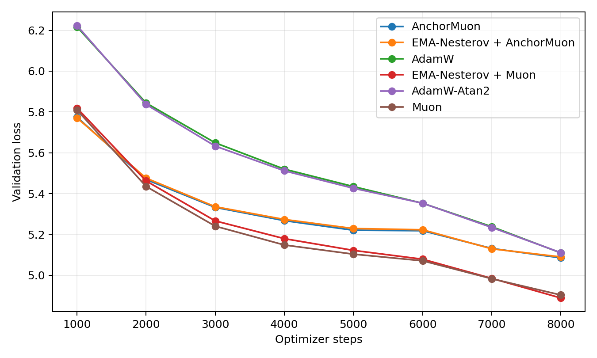
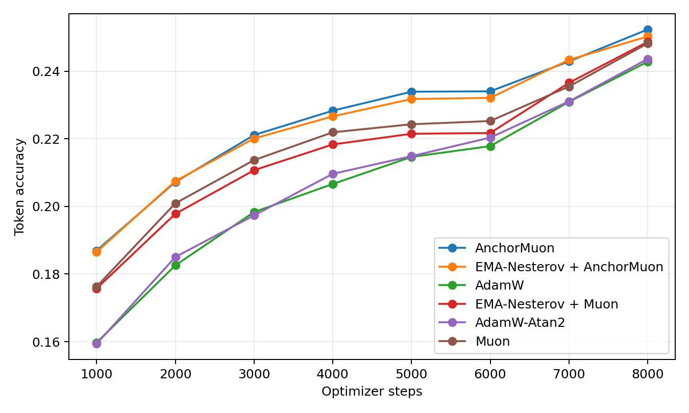
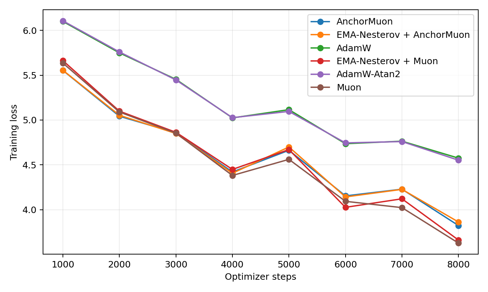
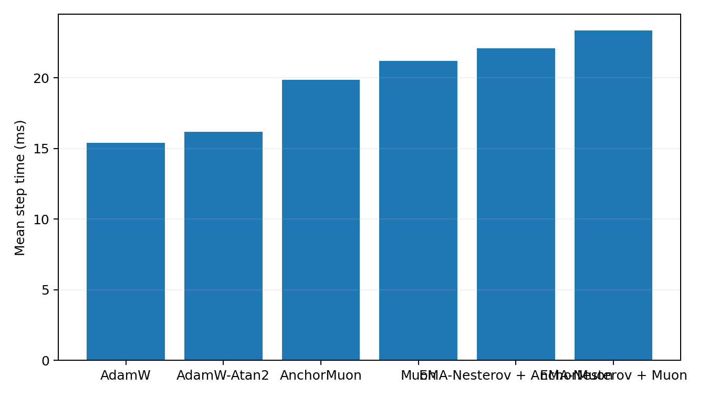
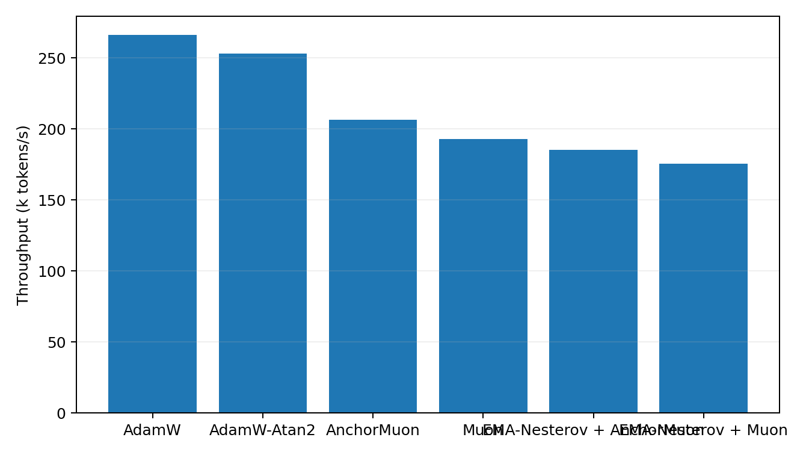

# Tokenized 50M LLM Optimizer Comparison

This benchmark uses real text tokenized with the Hugging Face `gpt2` tokenizer. It is the preferred language-model optimizer transfer check because embeddings, output head, and sequence statistics are closer to a normal BPE/SentencePiece pretraining setup than the older byte-level path.

## Setup

- Dataset: `HuggingFaceFW/fineweb-edu/sample-10BT:train [gpt2]`
- Tokenizer: `gpt2`
- Train tokens cached: 8,000,000
- Validation tokens cached: 524,288
- Model: decoder-only GPT, layers=8, width=512, heads=8, context=256, vocab=50,257
- Trainable parameters: 51045888
- Batch: 16 sequences x 256 tokens
- HPO: skipped; selected from prior hpo_summary.csv
- Final replay: 8000 steps per selected optimizer
- Validation estimate: 16 sequential batches per evaluation point
- Final extra validation: 256 sequential batches
- GPUs: 2 visible, one trial per GPU

## Final Results

| Rank | Optimizer | Selected config | Final val loss | Best val loss | Final token acc | Full val loss | Full token acc | Step time | Throughput |
|---:|---|---|---:|---:|---:|---:|---:|---:|---:|
| 1 | EMA-Nesterov + Muon | lr=0.0016, wd=0.05, ema_beta=0.1, ema_gamma=0.995 | 4.8886 | 4.8886 | 24.87% | 4.9585 | 24.82% | 23.34 ms | 175.5k tok/s |
| 2 | Muon | lr=0.0012, wd=0.05 | 4.9033 | 4.9033 | 24.82% | 4.9737 | 24.74% | 21.20 ms | 193.2k tok/s |
| 3 | AnchorMuon | lr=0.0016, wd=0.05, row_gamma=0.15, pmuon_beta=0.9, normuon_beta2=0.93, fallback=rms@1x, soda=0.001 | 5.0852 | 5.0852 | 25.23% | 5.1607 | 24.91% | 19.85 ms | 206.4k tok/s |
| 4 | EMA-Nesterov + AnchorMuon | lr=0.0016, wd=0.05, row_gamma=0, pmuon_beta=0.9, normuon_beta2=0.93, fallback=rms@1x, soda=0.003, ema_beta=0.3, ema_gamma=0.995 | 5.0899 | 5.0899 | 25.03% | 5.1684 | 24.81% | 22.09 ms | 185.4k tok/s |
| 5 | AdamW | lr=0.0005, wd=0.05 | 5.1095 | 5.1095 | 24.28% | 5.1510 | 24.22% | 15.39 ms | 266.1k tok/s |
| 6 | AdamW-Atan2 | lr=0.0005, wd=0.05 | 5.1107 | 5.1107 | 24.36% | 5.1509 | 24.24% | 16.19 ms | 253.0k tok/s |

## Plots

## HPO Candidates

| Family | Trial | LR | Best val loss | Final val loss | Step time |
|---|---|---:|---:|---:|---:|
| adamatan2 | `plateau_ema_anchor_ref_adamatan2_lr0.0005` | 0.0005 | 5.4296 | 5.3954 | 16.22 ms |
| adamw | `plateau_ema_anchor_ref_adamw_lr0.0005` | 0.0005 | 5.4321 | 5.4002 | 15.41 ms |
| anchormuon | `plateau_ema_anchor_ref_anchor_lr0.0016_rg0.15_soda0.001_flr1_rms` | 0.0016 | 5.1451 | 5.0961 | 19.99 ms |
| ema_anchormuon | `plateau_ema_anchor_base_lr0.0016_rg0_soda0.003_flr1_rms_b0.3_g0.995_w0.2_r0.1` | 0.0016 | 5.1468 | 5.0891 | 22.16 ms |
| ema_muon | `plateau_ema_anchor_ref_ema_muon_lr0.0016_b0.1_g0.995` | 0.0016 | 5.0126 | 4.9633 | 23.46 ms |
| muon | `plateau_ema_anchor_ref_muon_lr0.0012` | 0.0012 | 5.0114 | 4.9602 | 21.25 ms |
