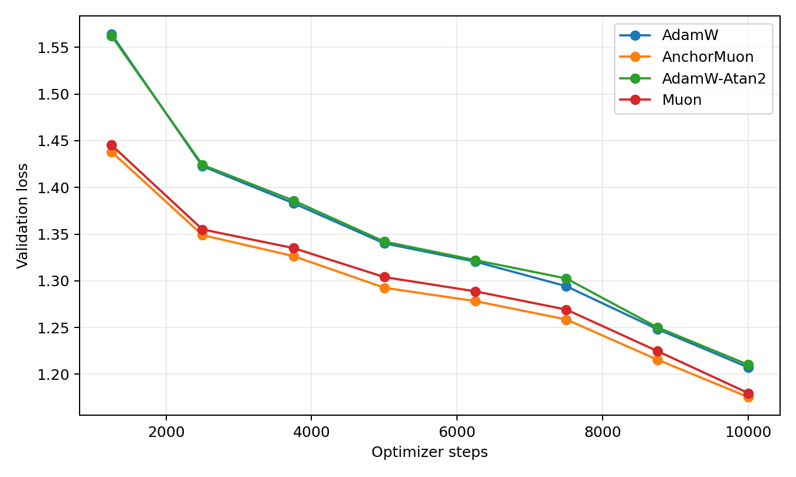
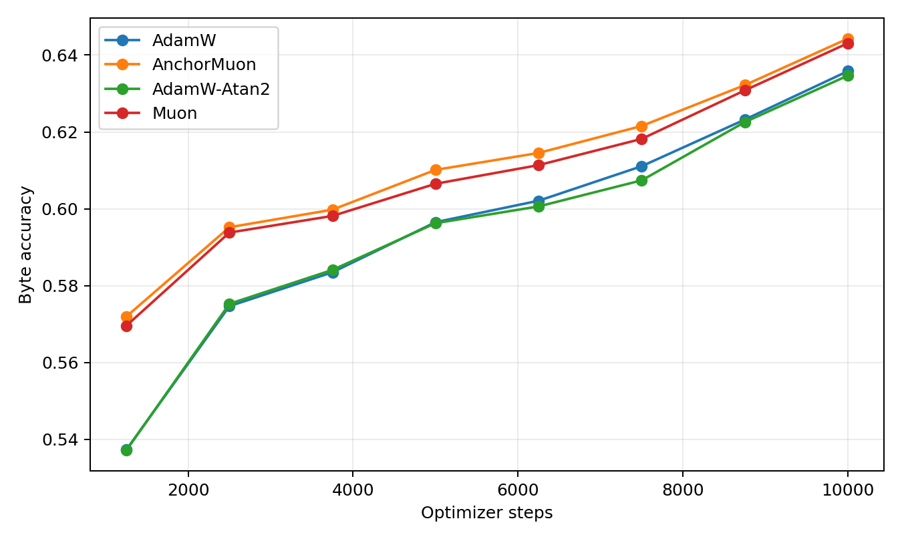
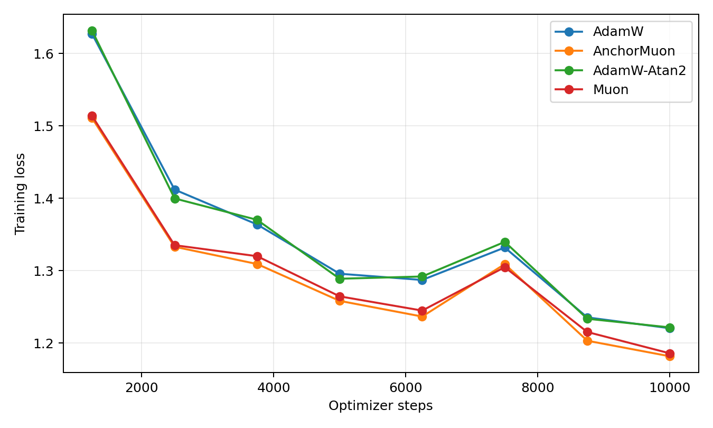
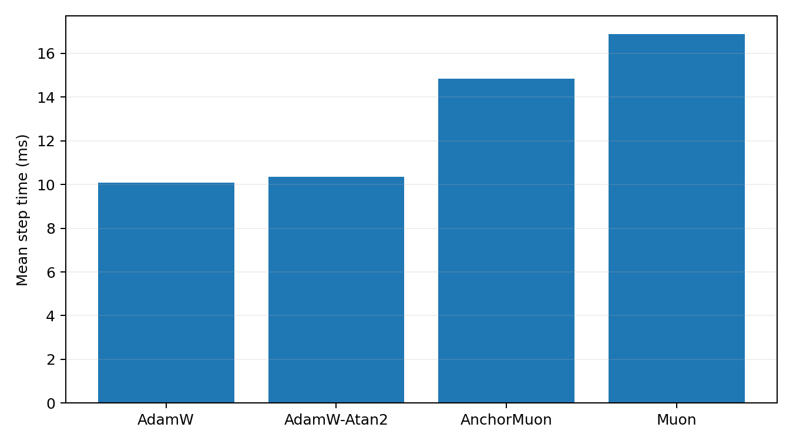
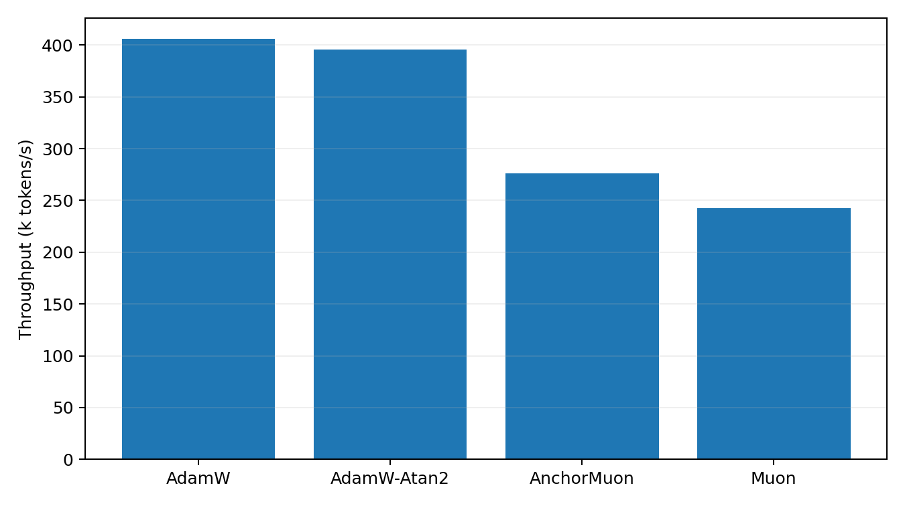

# Byte-Level 50M LLM Optimizer Comparison

This benchmark uses real text encoded as UTF-8 bytes. It is byte-level rather than BPE-tokenized, so the numbers should not be compared to standard word/BPE perplexities. It is still a real text next-byte language-model optimizer comparison.

## Setup

- Dataset: `HuggingFaceFW/fineweb-edu/sample-10BT:train`
- Train bytes cached: 268,435,456
- Validation bytes cached: 4,194,304
- Model: decoder-only GPT, layers=10, width=640, heads=10, context=128, byte vocab=256
- Trainable parameters: 49424640
- Batch: 32 sequences x 128 bytes
- HPO: 1600 steps per candidate, selected by best validation loss
- Final replay: 10000 steps per selected optimizer
- Validation estimate: 32 random batches per evaluation point
- GPUs: 2 visible, one trial per GPU

## Final Results

| Rank | Optimizer | Selected config | Final val loss | Best val loss | Final byte acc | Step time | Throughput |
|---:|---|---|---:|---:|---:|---:|---:|
| 1 | AnchorMuon | lr=0.0012, wd=0.05, row_gamma=0.45, pmuon_beta=0.9, normuon_beta2=0.93, fallback=rms@1x, soda=0.003 | 1.1755 | 1.1755 | 64.43% | 14.84 ms | 276.0k byte/s |
| 2 | Muon | lr=0.0011, wd=0.05 | 1.1798 | 1.1798 | 64.31% | 16.87 ms | 242.7k byte/s |
| 3 | AdamW | lr=0.0004, wd=0.05 | 1.2073 | 1.2073 | 63.58% | 10.09 ms | 405.8k byte/s |
| 4 | AdamW-Atan2 | lr=0.0004, wd=0.05 | 1.2101 | 1.2101 | 63.47% | 10.35 ms | 395.7k byte/s |

## Plots

## HPO Candidates

| Family | Trial | LR | Best val loss | Final val loss | Step time |
|---|---|---:|---:|---:|---:|
| adamatan2 | `fineweb_adamatan2_lr0.0004` | 0.0004 | 1.4419 | 1.4419 | 10.24 ms |
| adamatan2 | `fineweb_adamatan2_lr0.0005` | 0.0005 | 1.4453 | 1.4453 | 10.29 ms |
| adamatan2 | `fineweb_adamatan2_lr0.0003` | 0.0003 | 1.4486 | 1.4486 | 10.21 ms |
| adamatan2 | `fineweb_adamatan2_lr0.0002` | 0.0002 | 1.4854 | 1.4854 | 10.18 ms |
| adamw | `fineweb_adamw_lr0.0004` | 0.0004 | 1.4420 | 1.4420 | 9.96 ms |
| adamw | `fineweb_adamw_lr0.0005` | 0.0005 | 1.4460 | 1.4460 | 9.98 ms |
| adamw | `fineweb_adamw_lr0.0003` | 0.0003 | 1.4471 | 1.4471 | 9.93 ms |
| adamw | `fineweb_adamw_lr0.0002` | 0.0002 | 1.4821 | 1.4821 | 9.93 ms |
| anchormuon | `fineweb_anchor_lr0.0012_rg0.45_soda0.003_pb0.9_nb0.93_flr1_rms` | 0.0012 | 1.3442 | 1.3442 | 14.95 ms |
| anchormuon | `fineweb_anchor_lr0.001_rg0.55_soda0.003_pb0.9_nb0.93_flr0.5_atan2` | 0.001 | 1.3442 | 1.3442 | 15.35 ms |
| anchormuon | `fineweb_anchor_lr0.0012_rg0.55_soda0.003_pb0.9_nb0.93_flr1_rms` | 0.0012 | 1.3443 | 1.3443 | 15.14 ms |
| anchormuon | `fineweb_anchor_lr0.0012_rg0.55_soda0.003_pb0.9_nb0.93_flr1_atan2` | 0.0012 | 1.3443 | 1.3443 | 15.34 ms |
| anchormuon | `fineweb_anchor_lr0.0012_rg0.45_soda0.003_pb0.9_nb0.93_flr0.75_rms` | 0.0012 | 1.3443 | 1.3443 | 15.12 ms |
| anchormuon | `fineweb_anchor_lr0.0012_rg0.25_soda0.003_pb0.9_nb0.93_flr0.5_atan2` | 0.0012 | 1.3443 | 1.3443 | 15.33 ms |
| anchormuon | `fineweb_anchor_lr0.001_rg0.45_soda0.01_pb0.9_nb0.93_flr0.5_atan2` | 0.001 | 1.3444 | 1.3444 | 15.49 ms |
| anchormuon | `fineweb_anchor_lr0.0012_rg0.55_soda0.003_pb0.9_nb0.95_flr0.5_atan2` | 0.0012 | 1.3444 | 1.3444 | 15.35 ms |
| anchormuon | `fineweb_anchor_lr0.0012_rg0.45_soda0.003_pb0.9_nb0.93_flr0.75_atan2` | 0.0012 | 1.3444 | 1.3444 | 15.35 ms |
| anchormuon | `fineweb_anchor_lr0.001_rg0.45_soda0.003_pb0.9_nb0.93_flr0.5_atan2` | 0.001 | 1.3444 | 1.3444 | 15.34 ms |
| anchormuon | `fineweb_anchor_lr0.0012_rg0_soda0.003_pb0.9_nb0.93_flr0.5_atan2` | 0.0012 | 1.3445 | 1.3445 | 15.48 ms |
| anchormuon | `fineweb_anchor_lr0.0012_rg0.45_soda0.003_pb0.9_nb0.93_flr0.25_atan2` | 0.0012 | 1.3445 | 1.3445 | 15.50 ms |
| anchormuon | `fineweb_anchor_lr0.0012_rg0.55_soda0.003_pb0.9_nb0.93_flr0.75_atan2` | 0.0012 | 1.3446 | 1.3446 | 15.49 ms |
| anchormuon | `fineweb_anchor_lr0.0012_rg0.55_soda0.003_pb0.98_nb0.93_flr0.5_atan2` | 0.0012 | 1.3446 | 1.3446 | 15.52 ms |
| anchormuon | `fineweb_anchor_lr0.0012_rg0.45_soda0.003_pb0.95_nb0.9_flr0.5_atan2` | 0.0012 | 1.3446 | 1.3446 | 15.34 ms |
| anchormuon | `fineweb_anchor_lr0.0012_rg0.45_soda0.003_pb0.9_nb0.93_flr0.5_rms` | 0.0012 | 1.3447 | 1.3447 | 14.97 ms |
| anchormuon | `fineweb_anchor_lr0.0012_rg0.55_soda0.003_pb0.95_nb0.95_flr0.5_atan2` | 0.0012 | 1.3447 | 1.3447 | 15.51 ms |
| anchormuon | `fineweb_anchor_lr0.0012_rg0.65_soda0.003_pb0.9_nb0.93_flr0.5_atan2` | 0.0012 | 1.3448 | 1.3448 | 15.34 ms |
| anchormuon | `fineweb_anchor_lr0.0012_rg0.55_soda0.003_pb0.85_nb0.95_flr0.5_atan2` | 0.0012 | 1.3448 | 1.3448 | 15.35 ms |
| anchormuon | `fineweb_anchor_lr0.0012_rg0.45_soda0.003_pb0.95_nb0.95_flr0.5_atan2` | 0.0012 | 1.3448 | 1.3448 | 15.34 ms |
| anchormuon | `fineweb_anchor_lr0.0012_rg0.25_soda0.001_pb0.9_nb0.93_flr0.5_atan2` | 0.0012 | 1.3449 | 1.3449 | 15.49 ms |
| anchormuon | `fineweb_anchor_lr0.0012_rg0.55_soda0.003_pb0.9_nb0.93_flr0.25_rms` | 0.0012 | 1.3449 | 1.3449 | 15.08 ms |
| anchormuon | `fineweb_anchor_lr0.0012_rg0.45_soda0.003_pb0.9_nb0.93_flr0.25_adamc` | 0.0012 | 1.3449 | 1.3449 | 15.52 ms |
| anchormuon | `fineweb_anchor_lr0.0012_rg0.55_soda0.01_pb0.9_nb0.93_flr0.5_atan2` | 0.0012 | 1.3450 | 1.3450 | 15.48 ms |
| anchormuon | `fineweb_anchor_lr0.0012_rg0.45_soda0.003_pb0.9_nb0.9_flr0.5_atan2` | 0.0012 | 1.3450 | 1.3450 | 15.36 ms |
| anchormuon | `fineweb_anchor_lr0.001_rg0.55_soda0.01_pb0.9_nb0.93_flr0.5_atan2` | 0.001 | 1.3450 | 1.3450 | 15.52 ms |
| anchormuon | `fineweb_anchor_lr0.001_rg0.55_soda0.001_pb0.9_nb0.93_flr0.5_atan2` | 0.001 | 1.3450 | 1.3450 | 15.50 ms |
| anchormuon | `fineweb_anchor_lr0.00135_rg0.45_soda0.003_pb0.85_nb0.9_flr0.5_atan2` | 0.00135 | 1.3451 | 1.3451 | 15.51 ms |
| anchormuon | `fineweb_anchor_lr0.0012_rg0.55_soda0.03_pb0.9_nb0.93_flr0.5_atan2` | 0.0012 | 1.3451 | 1.3451 | 15.35 ms |
| anchormuon | `fineweb_anchor_lr0.0012_rg0.55_soda0.003_pb0.9_nb0.93_flr0.25_atan2` | 0.0012 | 1.3451 | 1.3451 | 15.34 ms |
| anchormuon | `fineweb_anchor_lr0.0012_rg0.65_soda0.03_pb0.9_nb0.93_flr0.5_atan2` | 0.0012 | 1.3451 | 1.3451 | 15.32 ms |
| anchormuon | `fineweb_anchor_lr0.0012_rg0.65_soda0.001_pb0.9_nb0.93_flr0.5_atan2` | 0.0012 | 1.3451 | 1.3451 | 15.51 ms |
| anchormuon | `fineweb_anchor_lr0.0012_rg0.45_soda0.003_pb0.98_nb0.95_flr0.5_atan2` | 0.0012 | 1.3451 | 1.3451 | 15.58 ms |
| anchormuon | `fineweb_anchor_lr0.0012_rg0.45_soda0.003_pb0.95_nb0.93_flr0.5_atan2` | 0.0012 | 1.3452 | 1.3452 | 15.51 ms |
| anchormuon | `fineweb_anchor_lr0.0012_rg0.45_soda0.003_pb0.9_nb0.93_flr0.75_adamc` | 0.0012 | 1.3452 | 1.3452 | 15.34 ms |
| anchormuon | `fineweb_anchor_lr0.0012_rg0.55_soda0.003_pb0.9_nb0.93_flr0.5_atan2` | 0.0012 | 1.3452 | 1.3452 | 15.31 ms |
| anchormuon | `fineweb_anchor_lr0.0012_rg0.65_soda0.01_pb0.9_nb0.93_flr0.5_atan2` | 0.0012 | 1.3452 | 1.3452 | 15.47 ms |
| anchormuon | `fineweb_anchor_lr0.0012_rg0.55_soda0.003_pb0.85_nb0.9_flr0.5_atan2` | 0.0012 | 1.3452 | 1.3452 | 15.39 ms |
| anchormuon | `fineweb_anchor_lr0.001_rg0.25_soda0.03_pb0.9_nb0.93_flr0.5_atan2` | 0.001 | 1.3453 | 1.3453 | 15.29 ms |
| anchormuon | `fineweb_anchor_lr0.0012_rg0.55_soda0.003_pb0.95_nb0.93_flr0.5_atan2` | 0.0012 | 1.3453 | 1.3453 | 15.35 ms |
| anchormuon | `fineweb_anchor_lr0.0012_rg0.45_soda0.003_pb0.85_nb0.93_flr0.5_atan2` | 0.0012 | 1.3453 | 1.3453 | 15.34 ms |
| anchormuon | `fineweb_anchor_lr0.0011_rg0_soda0.003_pb0.9_nb0.93_flr0.5_atan2` | 0.0011 | 1.3453 | 1.3453 | 15.33 ms |
| anchormuon | `fineweb_anchor_lr0.00135_rg0.55_soda0.003_pb0.9_nb0.93_flr1_adamc` | 0.00135 | 1.3453 | 1.3453 | 15.36 ms |
| anchormuon | `fineweb_anchor_lr0.0012_rg0.45_soda0.003_pb0.85_nb0.95_flr0.5_atan2` | 0.0012 | 1.3453 | 1.3453 | 15.52 ms |
| anchormuon | `fineweb_anchor_lr0.00135_rg0_soda0.003_pb0.9_nb0.93_flr0.5_atan2` | 0.00135 | 1.3453 | 1.3453 | 15.32 ms |
| anchormuon | `fineweb_anchor_lr0.0012_rg0.55_soda0.003_pb0.9_nb0.9_flr0.5_atan2` | 0.0012 | 1.3453 | 1.3453 | 15.50 ms |
| anchormuon | `fineweb_anchor_lr0.0011_rg0_soda0.01_pb0.9_nb0.93_flr0.5_atan2` | 0.0011 | 1.3454 | 1.3454 | 15.51 ms |
| anchormuon | `fineweb_anchor_lr0.0012_rg0.55_soda0.003_pb0.95_nb0.9_flr0.5_atan2` | 0.0012 | 1.3454 | 1.3454 | 15.52 ms |
| anchormuon | `fineweb_anchor_lr0.0011_rg0_soda0.001_pb0.9_nb0.93_flr0.5_atan2` | 0.0011 | 1.3454 | 1.3454 | 15.49 ms |
| anchormuon | `fineweb_anchor_lr0.0012_rg0_soda0.001_pb0.9_nb0.93_flr0.5_atan2` | 0.0012 | 1.3454 | 1.3454 | 15.33 ms |
| anchormuon | `fineweb_anchor_lr0.00135_rg0.55_soda0.003_pb0.9_nb0.93_flr0.75_rms` | 0.00135 | 1.3454 | 1.3454 | 14.96 ms |
| anchormuon | `fineweb_anchor_lr0.0012_rg0.55_soda0.001_pb0.9_nb0.93_flr0.5_atan2` | 0.0012 | 1.3454 | 1.3454 | 15.52 ms |
| anchormuon | `fineweb_anchor_lr0.00135_rg0.55_soda0.003_pb0.9_nb0.9_flr0.5_atan2` | 0.00135 | 1.3454 | 1.3454 | 15.50 ms |
| anchormuon | `fineweb_anchor_lr0.0012_rg0.45_soda0.003_pb0.9_nb0.93_flr0.5_atan2` | 0.0012 | 1.3454 | 1.3454 | 15.33 ms |
| anchormuon | `fineweb_anchor_lr0.0012_rg0.45_soda0.003_pb0.9_nb0.93_flr0.5_adamc` | 0.0012 | 1.3454 | 1.3454 | 15.48 ms |
| anchormuon | `fineweb_anchor_lr0.001_rg0.25_soda0.01_pb0.9_nb0.93_flr0.5_atan2` | 0.001 | 1.3455 | 1.3455 | 15.48 ms |
| anchormuon | `fineweb_anchor_lr0.001_rg0.45_soda0.001_pb0.9_nb0.93_flr0.5_atan2` | 0.001 | 1.3456 | 1.3456 | 15.48 ms |
| anchormuon | `fineweb_anchor_lr0.00135_rg0.55_soda0.003_pb0.9_nb0.93_flr0.75_atan2` | 0.00135 | 1.3456 | 1.3456 | 15.51 ms |
| anchormuon | `fineweb_anchor_lr0.00135_rg0.45_soda0.003_pb0.9_nb0.93_flr0.75_rms` | 0.00135 | 1.3456 | 1.3456 | 15.10 ms |
| anchormuon | `fineweb_anchor_lr0.0012_rg0.45_soda0.003_pb0.9_nb0.93_flr1_atan2` | 0.0012 | 1.3456 | 1.3456 | 15.50 ms |
| anchormuon | `fineweb_anchor_lr0.0012_rg0.55_soda0.003_pb0.9_nb0.93_flr0.5_adamc` | 0.0012 | 1.3456 | 1.3456 | 15.31 ms |
| anchormuon | `fineweb_anchor_lr0.001_rg0.65_soda0.03_pb0.9_nb0.93_flr0.5_atan2` | 0.001 | 1.3456 | 1.3456 | 15.35 ms |
| anchormuon | `fineweb_anchor_lr0.0012_rg0.45_soda0.003_pb0.9_nb0.95_flr0.5_atan2` | 0.0012 | 1.3456 | 1.3456 | 15.55 ms |
| anchormuon | `fineweb_anchor_lr0.001_rg0.65_soda0.001_pb0.9_nb0.93_flr0.5_atan2` | 0.001 | 1.3456 | 1.3456 | 15.52 ms |
| anchormuon | `fineweb_anchor_lr0.00135_rg0.55_soda0.003_pb0.95_nb0.93_flr0.5_atan2` | 0.00135 | 1.3457 | 1.3457 | 15.37 ms |
| anchormuon | `fineweb_anchor_lr0.0015_rg0.45_soda0.003_pb0.9_nb0.93_flr1_atan2` | 0.0015 | 1.3457 | 1.3457 | 15.51 ms |
| anchormuon | `fineweb_anchor_lr0.001_rg0.25_soda0.001_pb0.9_nb0.93_flr0.5_atan2` | 0.001 | 1.3457 | 1.3457 | 15.46 ms |
| anchormuon | `fineweb_anchor_lr0.0012_rg0.55_soda0.003_pb0.85_nb0.93_flr0.5_atan2` | 0.0012 | 1.3457 | 1.3457 | 15.52 ms |
| anchormuon | `fineweb_anchor_lr0.00135_rg0.45_soda0.003_pb0.95_nb0.93_flr0.5_atan2` | 0.00135 | 1.3457 | 1.3457 | 15.52 ms |
| anchormuon | `fineweb_anchor_lr0.00135_rg0.45_soda0.003_pb0.9_nb0.93_flr0.5_adamc` | 0.00135 | 1.3457 | 1.3457 | 15.50 ms |
| anchormuon | `fineweb_anchor_lr0.00135_rg0.45_soda0.03_pb0.9_nb0.93_flr0.5_atan2` | 0.00135 | 1.3457 | 1.3457 | 15.34 ms |
| anchormuon | `fineweb_anchor_lr0.0012_rg0.55_soda0.003_pb0.9_nb0.93_flr0.75_rms` | 0.0012 | 1.3457 | 1.3457 | 14.95 ms |
| anchormuon | `fineweb_anchor_lr0.0012_rg0.25_soda0.03_pb0.9_nb0.93_flr0.5_atan2` | 0.0012 | 1.3457 | 1.3457 | 15.31 ms |
| anchormuon | `fineweb_anchor_lr0.0012_rg0.45_soda0.003_pb0.9_nb0.93_flr0.25_rms` | 0.0012 | 1.3458 | 1.3458 | 14.94 ms |
| anchormuon | `fineweb_anchor_lr0.0012_rg0.55_soda0.003_pb0.9_nb0.93_flr1_adamc` | 0.0012 | 1.3458 | 1.3458 | 15.33 ms |
| anchormuon | `fineweb_anchor_lr0.00135_rg0.45_soda0.003_pb0.98_nb0.9_flr0.5_atan2` | 0.00135 | 1.3458 | 1.3458 | 15.51 ms |
| anchormuon | `fineweb_anchor_lr0.00135_rg0.45_soda0.003_pb0.9_nb0.93_flr1_atan2` | 0.00135 | 1.3458 | 1.3458 | 15.51 ms |
| anchormuon | `fineweb_anchor_lr0.0012_rg0_soda0.01_pb0.9_nb0.93_flr0.5_atan2` | 0.0012 | 1.3458 | 1.3458 | 15.30 ms |
| anchormuon | `fineweb_anchor_lr0.0012_rg0.25_soda0.01_pb0.9_nb0.93_flr0.5_atan2` | 0.0012 | 1.3458 | 1.3458 | 15.51 ms |
| anchormuon | `fineweb_anchor_lr0.00135_rg0.55_soda0.003_pb0.98_nb0.93_flr0.5_atan2` | 0.00135 | 1.3459 | 1.3459 | 15.52 ms |
| anchormuon | `fineweb_anchor_lr0.0012_rg0.45_soda0.003_pb0.9_nb0.93_flr1_adamc` | 0.0012 | 1.3459 | 1.3459 | 15.47 ms |
| anchormuon | `fineweb_anchor_lr0.001_rg0.55_soda0.03_pb0.9_nb0.93_flr0.5_atan2` | 0.001 | 1.3459 | 1.3459 | 15.32 ms |
| anchormuon | `fineweb_anchor_lr0.001_rg0.65_soda0.003_pb0.9_nb0.93_flr0.5_atan2` | 0.001 | 1.3459 | 1.3459 | 15.31 ms |
| anchormuon | `fineweb_anchor_lr0.001_rg0.65_soda0.01_pb0.9_nb0.93_flr0.5_atan2` | 0.001 | 1.3460 | 1.3460 | 15.48 ms |
| anchormuon | `fineweb_anchor_lr0.00135_rg0.45_soda0.003_pb0.9_nb0.9_flr0.5_atan2` | 0.00135 | 1.3460 | 1.3460 | 15.33 ms |
| anchormuon | `fineweb_anchor_lr0.0012_rg0.45_soda0.003_pb0.85_nb0.9_flr0.5_atan2` | 0.0012 | 1.3460 | 1.3460 | 15.54 ms |
| anchormuon | `fineweb_anchor_lr0.001_rg0.45_soda0.03_pb0.9_nb0.93_flr0.5_atan2` | 0.001 | 1.3460 | 1.3460 | 15.33 ms |
| anchormuon | `fineweb_anchor_lr0.00135_rg0.55_soda0.001_pb0.9_nb0.93_flr0.5_atan2` | 0.00135 | 1.3461 | 1.3461 | 15.51 ms |
| anchormuon | `fineweb_anchor_lr0.00135_rg0.65_soda0.003_pb0.9_nb0.93_flr0.5_atan2` | 0.00135 | 1.3461 | 1.3461 | 15.33 ms |
| anchormuon | `fineweb_anchor_lr0.00135_rg0.65_soda0.01_pb0.9_nb0.93_flr0.5_atan2` | 0.00135 | 1.3461 | 1.3461 | 15.51 ms |
| anchormuon | `fineweb_anchor_lr0.00135_rg0.55_soda0.003_pb0.9_nb0.93_flr0.25_rms` | 0.00135 | 1.3461 | 1.3461 | 15.11 ms |
| anchormuon | `fineweb_anchor_lr0.0012_rg0.45_soda0.003_pb0.98_nb0.9_flr0.5_atan2` | 0.0012 | 1.3461 | 1.3461 | 15.53 ms |
| anchormuon | `fineweb_anchor_lr0.0012_rg0.55_soda0.003_pb0.9_nb0.93_flr0.75_adamc` | 0.0012 | 1.3461 | 1.3461 | 15.51 ms |
| anchormuon | `fineweb_anchor_lr0.00135_rg0.45_soda0.003_pb0.9_nb0.95_flr0.5_atan2` | 0.00135 | 1.3461 | 1.3461 | 15.53 ms |
| anchormuon | `fineweb_anchor_lr0.00135_rg0.45_soda0.003_pb0.9_nb0.93_flr1_rms` | 0.00135 | 1.3462 | 1.3462 | 14.95 ms |
| anchormuon | `fineweb_anchor_lr0.0012_rg0.45_soda0.01_pb0.9_nb0.93_flr0.5_atan2` | 0.0012 | 1.3462 | 1.3462 | 15.51 ms |
| anchormuon | `fineweb_anchor_lr0.00135_rg0_soda0.01_pb0.9_nb0.93_flr0.5_atan2` | 0.00135 | 1.3462 | 1.3462 | 15.48 ms |
| anchormuon | `fineweb_anchor_lr0.001_rg0.25_soda0.003_pb0.9_nb0.93_flr0.5_atan2` | 0.001 | 1.3462 | 1.3462 | 15.35 ms |
| anchormuon | `fineweb_anchor_lr0.00135_rg0.55_soda0.003_pb0.85_nb0.93_flr0.5_atan2` | 0.00135 | 1.3462 | 1.3462 | 15.52 ms |
| anchormuon | `fineweb_anchor_lr0.0012_rg0.45_soda0.003_pb0.98_nb0.93_flr0.5_atan2` | 0.0012 | 1.3462 | 1.3462 | 15.44 ms |
| anchormuon | `fineweb_anchor_lr0.0012_rg0.45_soda0.03_pb0.9_nb0.93_flr0.5_atan2` | 0.0012 | 1.3462 | 1.3462 | 15.36 ms |
| anchormuon | `fineweb_anchor_lr0.0012_rg0.45_soda0.001_pb0.9_nb0.93_flr0.5_atan2` | 0.0012 | 1.3462 | 1.3462 | 15.48 ms |
| anchormuon | `fineweb_anchor_lr0.00135_rg0.55_soda0.003_pb0.9_nb0.93_flr1_rms` | 0.00135 | 1.3463 | 1.3463 | 15.13 ms |
| anchormuon | `fineweb_anchor_lr0.00135_rg0.65_soda0.001_pb0.9_nb0.93_flr0.5_atan2` | 0.00135 | 1.3463 | 1.3463 | 15.48 ms |
| anchormuon | `fineweb_anchor_lr0.0015_rg0.55_soda0.003_pb0.9_nb0.93_flr1_atan2` | 0.0015 | 1.3463 | 1.3463 | 15.35 ms |
| anchormuon | `fineweb_anchor_lr0.0012_rg0.55_soda0.003_pb0.98_nb0.95_flr0.5_atan2` | 0.0012 | 1.3464 | 1.3464 | 15.36 ms |
| anchormuon | `fineweb_anchor_lr0.00135_rg0.55_soda0.003_pb0.9_nb0.93_flr0.75_adamc` | 0.00135 | 1.3464 | 1.3464 | 15.52 ms |
| anchormuon | `fineweb_anchor_lr0.00135_rg0.55_soda0.003_pb0.98_nb0.9_flr0.5_atan2` | 0.00135 | 1.3464 | 1.3464 | 15.36 ms |
| anchormuon | `fineweb_anchor_lr0.00135_rg0.55_soda0.003_pb0.9_nb0.93_flr1_atan2` | 0.00135 | 1.3464 | 1.3464 | 15.34 ms |
| anchormuon | `fineweb_anchor_lr0.00135_rg0.25_soda0.001_pb0.9_nb0.93_flr0.5_atan2` | 0.00135 | 1.3464 | 1.3464 | 15.52 ms |
| anchormuon | `fineweb_anchor_lr0.00135_rg0.25_soda0.03_pb0.9_nb0.93_flr0.5_atan2` | 0.00135 | 1.3464 | 1.3464 | 15.34 ms |
| anchormuon | `fineweb_anchor_lr0.00135_rg0.45_soda0.003_pb0.9_nb0.93_flr0.25_rms` | 0.00135 | 1.3465 | 1.3465 | 14.96 ms |
| anchormuon | `fineweb_anchor_lr0.00135_rg0.45_soda0.003_pb0.9_nb0.93_flr0.5_atan2` | 0.00135 | 1.3465 | 1.3465 | 15.34 ms |
| anchormuon | `fineweb_anchor_lr0.00135_rg0_soda0.001_pb0.9_nb0.93_flr0.5_atan2` | 0.00135 | 1.3465 | 1.3465 | 15.48 ms |
| anchormuon | `fineweb_anchor_lr0.00135_rg0.45_soda0.003_pb0.9_nb0.93_flr0.75_adamc` | 0.00135 | 1.3466 | 1.3466 | 15.34 ms |
| anchormuon | `fineweb_anchor_lr0.00135_rg0.55_soda0.003_pb0.9_nb0.93_flr0.25_adamc` | 0.00135 | 1.3466 | 1.3466 | 15.35 ms |
| anchormuon | `fineweb_anchor_lr0.0012_rg0.55_soda0.003_pb0.9_nb0.93_flr0.5_rms` | 0.0012 | 1.3466 | 1.3466 | 15.09 ms |
| anchormuon | `fineweb_anchor_lr0.00135_rg0.55_soda0.003_pb0.85_nb0.95_flr0.5_atan2` | 0.00135 | 1.3466 | 1.3466 | 15.33 ms |
| anchormuon | `fineweb_anchor_lr0.00135_rg0.45_soda0.001_pb0.9_nb0.93_flr0.5_atan2` | 0.00135 | 1.3466 | 1.3466 | 15.53 ms |
| anchormuon | `fineweb_anchor_lr0.0012_rg0.55_soda0.003_pb0.9_nb0.93_flr0.25_adamc` | 0.0012 | 1.3466 | 1.3466 | 15.36 ms |
| anchormuon | `fineweb_anchor_lr0.00135_rg0.55_soda0.003_pb0.95_nb0.9_flr0.5_atan2` | 0.00135 | 1.3466 | 1.3466 | 15.53 ms |
| anchormuon | `fineweb_anchor_lr0.0015_rg0.45_soda0.003_pb0.98_nb0.93_flr0.5_atan2` | 0.0015 | 1.3466 | 1.3466 | 15.33 ms |
| anchormuon | `fineweb_anchor_lr0.0015_rg0.55_soda0.003_pb0.9_nb0.9_flr0.5_atan2` | 0.0015 | 1.3466 | 1.3466 | 15.55 ms |
| anchormuon | `fineweb_anchor_lr0.00135_rg0.45_soda0.003_pb0.95_nb0.9_flr0.5_atan2` | 0.00135 | 1.3466 | 1.3466 | 15.39 ms |
| anchormuon | `fineweb_anchor_lr0.0012_rg0.55_soda0.003_pb0.98_nb0.9_flr0.5_atan2` | 0.0012 | 1.3466 | 1.3466 | 15.37 ms |
| anchormuon | `fineweb_anchor_lr0.0015_rg0_soda0.003_pb0.9_nb0.93_flr0.5_atan2` | 0.0015 | 1.3466 | 1.3466 | 15.48 ms |
| anchormuon | `fineweb_anchor_lr0.00135_rg0.55_soda0.003_pb0.98_nb0.95_flr0.5_atan2` | 0.00135 | 1.3466 | 1.3466 | 15.34 ms |
| anchormuon | `fineweb_anchor_lr0.0015_rg0.45_soda0.003_pb0.9_nb0.93_flr0.75_atan2` | 0.0015 | 1.3466 | 1.3466 | 15.39 ms |
| anchormuon | `fineweb_anchor_lr0.0015_rg0.55_soda0.003_pb0.9_nb0.93_flr1_rms` | 0.0015 | 1.3467 | 1.3467 | 15.14 ms |
| anchormuon | `fineweb_anchor_lr0.00135_rg0.45_soda0.003_pb0.9_nb0.93_flr0.25_adamc` | 0.00135 | 1.3467 | 1.3467 | 15.50 ms |
| anchormuon | `fineweb_anchor_lr0.00135_rg0.55_soda0.003_pb0.95_nb0.95_flr0.5_atan2` | 0.00135 | 1.3467 | 1.3467 | 15.52 ms |
| anchormuon | `fineweb_anchor_lr0.0015_rg0.45_soda0.003_pb0.85_nb0.9_flr0.5_atan2` | 0.0015 | 1.3468 | 1.3468 | 15.50 ms |
| anchormuon | `fineweb_anchor_lr0.00135_rg0.55_soda0.003_pb0.9_nb0.93_flr0.5_adamc` | 0.00135 | 1.3468 | 1.3468 | 15.36 ms |
| anchormuon | `fineweb_anchor_lr0.0015_rg0.55_soda0.003_pb0.9_nb0.93_flr1_adamc` | 0.0015 | 1.3468 | 1.3468 | 15.36 ms |
| anchormuon | `fineweb_anchor_lr0.00135_rg0.45_soda0.003_pb0.9_nb0.93_flr0.25_atan2` | 0.00135 | 1.3468 | 1.3468 | 15.48 ms |
| anchormuon | `fineweb_anchor_lr0.00135_rg0.55_soda0.003_pb0.9_nb0.93_flr0.5_rms` | 0.00135 | 1.3469 | 1.3469 | 15.15 ms |
| anchormuon | `fineweb_anchor_lr0.00135_rg0.55_soda0.003_pb0.85_nb0.9_flr0.5_atan2` | 0.00135 | 1.3469 | 1.3469 | 15.34 ms |
| anchormuon | `fineweb_anchor_lr0.00135_rg0.25_soda0.003_pb0.9_nb0.93_flr0.5_atan2` | 0.00135 | 1.3469 | 1.3469 | 15.32 ms |
| anchormuon | `fineweb_anchor_lr0.00135_rg0.45_soda0.003_pb0.9_nb0.93_flr0.75_atan2` | 0.00135 | 1.3470 | 1.3470 | 15.34 ms |
| anchormuon | `fineweb_anchor_lr0.00135_rg0.55_soda0.03_pb0.9_nb0.93_flr0.5_atan2` | 0.00135 | 1.3470 | 1.3470 | 15.33 ms |
| anchormuon | `fineweb_anchor_lr0.00135_rg0.45_soda0.003_pb0.98_nb0.95_flr0.5_atan2` | 0.00135 | 1.3470 | 1.3470 | 15.51 ms |
| anchormuon | `fineweb_anchor_lr0.00135_rg0.45_soda0.01_pb0.9_nb0.93_flr0.5_atan2` | 0.00135 | 1.3470 | 1.3470 | 15.52 ms |
| anchormuon | `fineweb_anchor_lr0.0015_rg0.45_soda0.003_pb0.9_nb0.93_flr0.5_rms` | 0.0015 | 1.3470 | 1.3470 | 14.97 ms |
| anchormuon | `fineweb_anchor_lr0.00135_rg0.65_soda0.03_pb0.9_nb0.93_flr0.5_atan2` | 0.00135 | 1.3471 | 1.3471 | 15.33 ms |
| anchormuon | `fineweb_anchor_lr0.00135_rg0.45_soda0.003_pb0.9_nb0.93_flr1_adamc` | 0.00135 | 1.3471 | 1.3471 | 15.53 ms |
| anchormuon | `fineweb_anchor_lr0.0015_rg0_soda0.001_pb0.9_nb0.93_flr0.5_atan2` | 0.0015 | 1.3471 | 1.3471 | 15.32 ms |
| anchormuon | `fineweb_anchor_lr0.0015_rg0.65_soda0.003_pb0.9_nb0.93_flr0.5_atan2` | 0.0015 | 1.3471 | 1.3471 | 15.33 ms |
| anchormuon | `fineweb_anchor_lr0.0015_rg0.45_soda0.003_pb0.9_nb0.93_flr1_rms` | 0.0015 | 1.3472 | 1.3472 | 14.96 ms |
| anchormuon | `fineweb_anchor_lr0.0015_rg0.55_soda0.01_pb0.9_nb0.93_flr0.5_atan2` | 0.0015 | 1.3472 | 1.3472 | 15.49 ms |
| anchormuon | `fineweb_anchor_lr0.0015_rg0.55_soda0.003_pb0.95_nb0.9_flr0.5_atan2` | 0.0015 | 1.3472 | 1.3472 | 15.53 ms |
| anchormuon | `fineweb_anchor_lr0.0015_rg0.55_soda0.003_pb0.9_nb0.95_flr0.5_atan2` | 0.0015 | 1.3473 | 1.3473 | 15.35 ms |
| anchormuon | `fineweb_anchor_lr0.0015_rg0.25_soda0.03_pb0.9_nb0.93_flr0.5_atan2` | 0.0015 | 1.3473 | 1.3473 | 15.32 ms |
| anchormuon | `fineweb_anchor_lr0.00135_rg0.55_soda0.003_pb0.9_nb0.93_flr0.25_atan2` | 0.00135 | 1.3473 | 1.3473 | 15.35 ms |
| anchormuon | `fineweb_anchor_lr0.00135_rg0.45_soda0.003_pb0.85_nb0.95_flr0.5_atan2` | 0.00135 | 1.3473 | 1.3473 | 15.50 ms |
| anchormuon | `fineweb_anchor_lr0.0015_rg0.45_soda0.003_pb0.9_nb0.93_flr1_adamc` | 0.0015 | 1.3474 | 1.3474 | 15.50 ms |
| anchormuon | `fineweb_anchor_lr0.0015_rg0.45_soda0.003_pb0.95_nb0.93_flr0.5_atan2` | 0.0015 | 1.3474 | 1.3474 | 15.52 ms |
| anchormuon | `fineweb_anchor_lr0.00135_rg0.45_soda0.003_pb0.85_nb0.93_flr0.5_atan2` | 0.00135 | 1.3474 | 1.3474 | 15.36 ms |
| anchormuon | `fineweb_anchor_lr0.00165_rg0.55_soda0.03_pb0.9_nb0.93_flr0.5_atan2` | 0.00165 | 1.3474 | 1.3474 | 15.34 ms |
| anchormuon | `fineweb_anchor_lr0.0015_rg0.55_soda0.003_pb0.9_nb0.93_flr0.25_atan2` | 0.0015 | 1.3475 | 1.3475 | 15.34 ms |
| anchormuon | `fineweb_anchor_lr0.0015_rg0.45_soda0.003_pb0.9_nb0.93_flr0.25_rms` | 0.0015 | 1.3475 | 1.3475 | 14.97 ms |
| anchormuon | `fineweb_anchor_lr0.00135_rg0.25_soda0.01_pb0.9_nb0.93_flr0.5_atan2` | 0.00135 | 1.3475 | 1.3475 | 15.50 ms |
| anchormuon | `fineweb_anchor_lr0.0015_rg0.45_soda0.003_pb0.95_nb0.95_flr0.5_atan2` | 0.0015 | 1.3476 | 1.3476 | 15.37 ms |
| anchormuon | `fineweb_anchor_lr0.0015_rg0.45_soda0.001_pb0.9_nb0.93_flr0.5_atan2` | 0.0015 | 1.3476 | 1.3476 | 15.53 ms |
| anchormuon | `fineweb_anchor_lr0.0015_rg0.55_soda0.03_pb0.9_nb0.93_flr0.5_atan2` | 0.0015 | 1.3476 | 1.3476 | 15.33 ms |
| anchormuon | `fineweb_anchor_lr0.0015_rg0.45_soda0.003_pb0.9_nb0.93_flr0.75_rms` | 0.0015 | 1.3476 | 1.3476 | 15.17 ms |
| anchormuon | `fineweb_anchor_lr0.0015_rg0.45_soda0.03_pb0.9_nb0.93_flr0.5_atan2` | 0.0015 | 1.3476 | 1.3476 | 15.37 ms |
| anchormuon | `fineweb_anchor_lr0.00135_rg0.45_soda0.003_pb0.98_nb0.93_flr0.5_atan2` | 0.00135 | 1.3476 | 1.3476 | 15.34 ms |
| anchormuon | `fineweb_anchor_lr0.0015_rg0.55_soda0.003_pb0.95_nb0.93_flr0.5_atan2` | 0.0015 | 1.3477 | 1.3477 | 15.35 ms |
| anchormuon | `fineweb_anchor_lr0.0015_rg0.55_soda0.003_pb0.9_nb0.93_flr0.5_atan2` | 0.0015 | 1.3477 | 1.3477 | 15.33 ms |
| anchormuon | `fineweb_anchor_lr0.0015_rg0.25_soda0.001_pb0.9_nb0.93_flr0.5_atan2` | 0.0015 | 1.3477 | 1.3477 | 15.49 ms |
| anchormuon | `fineweb_anchor_lr0.00135_rg0.45_soda0.003_pb0.9_nb0.93_flr0.5_rms` | 0.00135 | 1.3477 | 1.3477 | 14.96 ms |
| anchormuon | `fineweb_anchor_lr0.00135_rg0.55_soda0.01_pb0.9_nb0.93_flr0.5_atan2` | 0.00135 | 1.3477 | 1.3477 | 15.49 ms |
| anchormuon | `fineweb_anchor_lr0.0015_rg0.55_soda0.003_pb0.98_nb0.95_flr0.5_atan2` | 0.0015 | 1.3477 | 1.3477 | 15.31 ms |
| anchormuon | `fineweb_anchor_lr0.00135_rg0.55_soda0.003_pb0.9_nb0.93_flr0.5_atan2` | 0.00135 | 1.3477 | 1.3477 | 15.37 ms |
| anchormuon | `fineweb_anchor_lr0.0015_rg0.45_soda0.003_pb0.9_nb0.93_flr0.75_adamc` | 0.0015 | 1.3477 | 1.3477 | 15.35 ms |
| anchormuon | `fineweb_anchor_lr0.00135_rg0.45_soda0.003_pb0.95_nb0.95_flr0.5_atan2` | 0.00135 | 1.3477 | 1.3477 | 15.34 ms |
| anchormuon | `fineweb_anchor_lr0.0015_rg0.25_soda0.01_pb0.9_nb0.93_flr0.5_atan2` | 0.0015 | 1.3478 | 1.3478 | 15.48 ms |
| anchormuon | `fineweb_anchor_lr0.0015_rg0.55_soda0.003_pb0.9_nb0.93_flr0.25_adamc` | 0.0015 | 1.3478 | 1.3478 | 15.37 ms |
| anchormuon | `fineweb_anchor_lr0.0015_rg0.25_soda0.003_pb0.9_nb0.93_flr0.5_atan2` | 0.0015 | 1.3479 | 1.3479 | 15.33 ms |
| anchormuon | `fineweb_anchor_lr0.0015_rg0.65_soda0.01_pb0.9_nb0.93_flr0.5_atan2` | 0.0015 | 1.3479 | 1.3479 | 15.52 ms |
| anchormuon | `fineweb_anchor_lr0.0015_rg0.55_soda0.003_pb0.85_nb0.9_flr0.5_atan2` | 0.0015 | 1.3479 | 1.3479 | 15.35 ms |
| anchormuon | `fineweb_anchor_lr0.0015_rg0.45_soda0.01_pb0.9_nb0.93_flr0.5_atan2` | 0.0015 | 1.3479 | 1.3479 | 15.50 ms |
| anchormuon | `fineweb_anchor_lr0.0015_rg0.45_soda0.003_pb0.98_nb0.9_flr0.5_atan2` | 0.0015 | 1.3479 | 1.3479 | 15.55 ms |
| anchormuon | `fineweb_anchor_lr0.0015_rg0.55_soda0.003_pb0.98_nb0.93_flr0.5_atan2` | 0.0015 | 1.3480 | 1.3480 | 15.53 ms |
| anchormuon | `fineweb_anchor_lr0.0015_rg0.45_soda0.003_pb0.85_nb0.95_flr0.5_atan2` | 0.0015 | 1.3480 | 1.3480 | 15.54 ms |
| anchormuon | `fineweb_anchor_lr0.00165_rg0.65_soda0.003_pb0.9_nb0.93_flr0.5_atan2` | 0.00165 | 1.3480 | 1.3480 | 15.32 ms |
| anchormuon | `fineweb_anchor_lr0.0015_rg0.55_soda0.003_pb0.9_nb0.93_flr0.5_adamc` | 0.0015 | 1.3481 | 1.3481 | 15.37 ms |
| anchormuon | `fineweb_anchor_lr0.0015_rg0_soda0.01_pb0.9_nb0.93_flr0.5_atan2` | 0.0015 | 1.3481 | 1.3481 | 15.30 ms |
| anchormuon | `fineweb_anchor_lr0.0015_rg0.45_soda0.003_pb0.9_nb0.93_flr0.25_atan2` | 0.0015 | 1.3481 | 1.3481 | 15.53 ms |
| anchormuon | `fineweb_anchor_lr0.0015_rg0.45_soda0.003_pb0.9_nb0.93_flr0.5_atan2` | 0.0015 | 1.3482 | 1.3482 | 15.34 ms |
| anchormuon | `fineweb_anchor_lr0.0015_rg0.55_soda0.003_pb0.9_nb0.93_flr0.75_atan2` | 0.0015 | 1.3482 | 1.3482 | 15.53 ms |
| anchormuon | `fineweb_anchor_lr0.0015_rg0.55_soda0.003_pb0.9_nb0.93_flr0.75_rms` | 0.0015 | 1.3483 | 1.3483 | 14.95 ms |
| anchormuon | `fineweb_anchor_lr0.0015_rg0.45_soda0.003_pb0.9_nb0.95_flr0.5_atan2` | 0.0015 | 1.3483 | 1.3483 | 15.52 ms |
| anchormuon | `fineweb_anchor_lr0.0015_rg0.45_soda0.003_pb0.9_nb0.93_flr0.25_adamc` | 0.0015 | 1.3483 | 1.3483 | 15.51 ms |
| anchormuon | `fineweb_anchor_lr0.0015_rg0.55_soda0.003_pb0.85_nb0.93_flr0.5_atan2` | 0.0015 | 1.3484 | 1.3484 | 15.56 ms |
| anchormuon | `fineweb_anchor_lr0.0015_rg0.65_soda0.001_pb0.9_nb0.93_flr0.5_atan2` | 0.0015 | 1.3484 | 1.3484 | 15.52 ms |
| anchormuon | `fineweb_anchor_lr0.0015_rg0.55_soda0.003_pb0.85_nb0.95_flr0.5_atan2` | 0.0015 | 1.3485 | 1.3485 | 15.35 ms |
| anchormuon | `fineweb_anchor_lr0.0015_rg0.55_soda0.003_pb0.9_nb0.93_flr0.75_adamc` | 0.0015 | 1.3485 | 1.3485 | 15.50 ms |
| anchormuon | `fineweb_anchor_lr0.0015_rg0.55_soda0.003_pb0.98_nb0.9_flr0.5_atan2` | 0.0015 | 1.3485 | 1.3485 | 15.40 ms |
| anchormuon | `fineweb_anchor_lr0.00165_rg0.45_soda0.01_pb0.9_nb0.93_flr0.5_atan2` | 0.00165 | 1.3486 | 1.3486 | 15.49 ms |
| anchormuon | `fineweb_anchor_lr0.0015_rg0.65_soda0.03_pb0.9_nb0.93_flr0.5_atan2` | 0.0015 | 1.3486 | 1.3486 | 15.35 ms |
| anchormuon | `fineweb_anchor_lr0.0015_rg0.55_soda0.003_pb0.9_nb0.93_flr0.5_rms` | 0.0015 | 1.3486 | 1.3486 | 15.12 ms |
| anchormuon | `fineweb_anchor_lr0.00135_rg0.55_soda0.003_pb0.9_nb0.95_flr0.5_atan2` | 0.00135 | 1.3486 | 1.3486 | 15.35 ms |
| anchormuon | `fineweb_anchor_lr0.0015_rg0.45_soda0.003_pb0.9_nb0.93_flr0.5_adamc` | 0.0015 | 1.3487 | 1.3487 | 15.53 ms |
| anchormuon | `fineweb_anchor_lr0.00165_rg0.55_soda0.01_pb0.9_nb0.93_flr0.5_atan2` | 0.00165 | 1.3487 | 1.3487 | 15.51 ms |
| anchormuon | `fineweb_anchor_lr0.0015_rg0.45_soda0.003_pb0.9_nb0.9_flr0.5_atan2` | 0.0015 | 1.3487 | 1.3487 | 15.39 ms |
| anchormuon | `fineweb_anchor_lr0.0015_rg0.55_soda0.003_pb0.95_nb0.95_flr0.5_atan2` | 0.0015 | 1.3488 | 1.3488 | 15.51 ms |
| anchormuon | `fineweb_anchor_lr0.00165_rg0.55_soda0.001_pb0.9_nb0.93_flr0.5_atan2` | 0.00165 | 1.3488 | 1.3488 | 15.51 ms |
| anchormuon | `fineweb_anchor_lr0.0015_rg0.45_soda0.003_pb0.85_nb0.93_flr0.5_atan2` | 0.0015 | 1.3488 | 1.3488 | 15.35 ms |
| anchormuon | `fineweb_anchor_lr0.0015_rg0.45_soda0.003_pb0.98_nb0.95_flr0.5_atan2` | 0.0015 | 1.3489 | 1.3489 | 15.56 ms |
| anchormuon | `fineweb_anchor_lr0.0015_rg0.55_soda0.001_pb0.9_nb0.93_flr0.5_atan2` | 0.0015 | 1.3490 | 1.3490 | 15.50 ms |
| anchormuon | `fineweb_anchor_lr0.0015_rg0.55_soda0.003_pb0.9_nb0.93_flr0.25_rms` | 0.0015 | 1.3490 | 1.3490 | 15.11 ms |
| anchormuon | `fineweb_anchor_lr0.00165_rg0.55_soda0.003_pb0.9_nb0.93_flr0.5_atan2` | 0.00165 | 1.3491 | 1.3491 | 15.39 ms |
| anchormuon | `fineweb_anchor_lr0.00165_rg0.25_soda0.01_pb0.9_nb0.93_flr0.5_atan2` | 0.00165 | 1.3491 | 1.3491 | 15.52 ms |
| anchormuon | `fineweb_anchor_lr0.0015_rg0.45_soda0.003_pb0.95_nb0.9_flr0.5_atan2` | 0.0015 | 1.3491 | 1.3491 | 15.40 ms |
| anchormuon | `fineweb_anchor_lr0.00165_rg0.45_soda0.003_pb0.9_nb0.93_flr0.5_atan2` | 0.00165 | 1.3492 | 1.3492 | 15.34 ms |
| anchormuon | `fineweb_anchor_lr0.00165_rg0.65_soda0.001_pb0.9_nb0.93_flr0.5_atan2` | 0.00165 | 1.3494 | 1.3494 | 15.49 ms |
| anchormuon | `fineweb_anchor_lr0.00165_rg0.45_soda0.001_pb0.9_nb0.93_flr0.5_atan2` | 0.00165 | 1.3495 | 1.3495 | 15.48 ms |
| anchormuon | `fineweb_anchor_lr0.00165_rg0.65_soda0.03_pb0.9_nb0.93_flr0.5_atan2` | 0.00165 | 1.3496 | 1.3496 | 15.34 ms |
| anchormuon | `fineweb_anchor_lr0.00165_rg0.25_soda0.003_pb0.9_nb0.93_flr0.5_atan2` | 0.00165 | 1.3497 | 1.3497 | 15.33 ms |
| anchormuon | `fineweb_anchor_lr0.00165_rg0.25_soda0.001_pb0.9_nb0.93_flr0.5_atan2` | 0.00165 | 1.3499 | 1.3499 | 15.52 ms |
| anchormuon | `fineweb_anchor_lr0.00165_rg0.45_soda0.03_pb0.9_nb0.93_flr0.5_atan2` | 0.00165 | 1.3499 | 1.3499 | 15.33 ms |
| anchormuon | `fineweb_anchor_lr0.00165_rg0.25_soda0.03_pb0.9_nb0.93_flr0.5_atan2` | 0.00165 | 1.3500 | 1.3500 | 15.32 ms |
| anchormuon | `fineweb_anchor_lr0.00165_rg0.65_soda0.01_pb0.9_nb0.93_flr0.5_atan2` | 0.00165 | 1.3500 | 1.3500 | 15.53 ms |
| anchormuon | `fineweb_anchor_lr0.0018_rg0.55_soda0.003_pb0.9_nb0.93_flr0.5_atan2` | 0.0018 | 1.3514 | 1.3514 | 15.32 ms |
| anchormuon | `fineweb_anchor_lr0.0018_rg0.55_soda0.001_pb0.9_nb0.93_flr0.5_atan2` | 0.0018 | 1.3524 | 1.3524 | 15.49 ms |
| anchormuon | `fineweb_anchor_lr0.0018_rg0.45_soda0.03_pb0.9_nb0.93_flr0.5_atan2` | 0.0018 | 1.3526 | 1.3526 | 15.33 ms |
| anchormuon | `fineweb_anchor_lr0.0018_rg0.45_soda0.01_pb0.9_nb0.93_flr0.5_atan2` | 0.0018 | 1.3527 | 1.3527 | 15.50 ms |
| anchormuon | `fineweb_anchor_lr0.0018_rg0.45_soda0.001_pb0.9_nb0.93_flr0.5_atan2` | 0.0018 | 1.3528 | 1.3528 | 15.54 ms |
| anchormuon | `fineweb_anchor_lr0.0018_rg0.25_soda0.03_pb0.9_nb0.93_flr0.5_atan2` | 0.0018 | 1.3531 | 1.3531 | 15.34 ms |
| anchormuon | `fineweb_anchor_lr0.0018_rg0.25_soda0.01_pb0.9_nb0.93_flr0.5_atan2` | 0.0018 | 1.3532 | 1.3532 | 15.49 ms |
| anchormuon | `fineweb_anchor_lr0.0018_rg0.25_soda0.003_pb0.9_nb0.93_flr0.5_atan2` | 0.0018 | 1.3532 | 1.3532 | 15.33 ms |
| anchormuon | `fineweb_anchor_lr0.0018_rg0.65_soda0.001_pb0.9_nb0.93_flr0.5_atan2` | 0.0018 | 1.3536 | 1.3536 | 15.49 ms |
| anchormuon | `fineweb_anchor_lr0.0018_rg0.45_soda0.003_pb0.9_nb0.93_flr0.5_atan2` | 0.0018 | 1.3536 | 1.3536 | 15.33 ms |
| anchormuon | `fineweb_anchor_lr0.0018_rg0.55_soda0.01_pb0.9_nb0.93_flr0.5_atan2` | 0.0018 | 1.3537 | 1.3537 | 15.55 ms |
| anchormuon | `fineweb_anchor_lr0.0018_rg0.55_soda0.03_pb0.9_nb0.93_flr0.5_atan2` | 0.0018 | 1.3537 | 1.3537 | 15.33 ms |
| anchormuon | `fineweb_anchor_lr0.0018_rg0.65_soda0.01_pb0.9_nb0.93_flr0.5_atan2` | 0.0018 | 1.3537 | 1.3537 | 15.52 ms |
| anchormuon | `fineweb_anchor_lr0.0018_rg0.25_soda0.001_pb0.9_nb0.93_flr0.5_atan2` | 0.0018 | 1.3541 | 1.3541 | 15.50 ms |
| anchormuon | `fineweb_anchor_lr0.0018_rg0.65_soda0.003_pb0.9_nb0.93_flr0.5_atan2` | 0.0018 | 1.3541 | 1.3541 | 15.32 ms |
| anchormuon | `fineweb_anchor_lr0.0018_rg0.65_soda0.03_pb0.9_nb0.93_flr0.5_atan2` | 0.0018 | 1.3548 | 1.3548 | 15.36 ms |
| muon | `fineweb_muon_lr0.0011` | 0.0011 | 1.3481 | 1.3481 | 16.92 ms |
| muon | `fineweb_muon_lr0.0013` | 0.0013 | 1.3489 | 1.3489 | 16.94 ms |
| muon | `fineweb_muon_lr0.0014` | 0.0014 | 1.3500 | 1.3500 | 17.10 ms |
| muon | `fineweb_muon_lr0.001` | 0.001 | 1.3500 | 1.3500 | 17.02 ms |
| muon | `fineweb_muon_lr0.0012` | 0.0012 | 1.3501 | 1.3501 | 17.08 ms |
| muon | `fineweb_muon_lr0.0009` | 0.0009 | 1.3509 | 1.3509 | 16.88 ms |
| muon | `fineweb_muon_lr0.0015` | 0.0015 | 1.3528 | 1.3528 | 16.95 ms |
