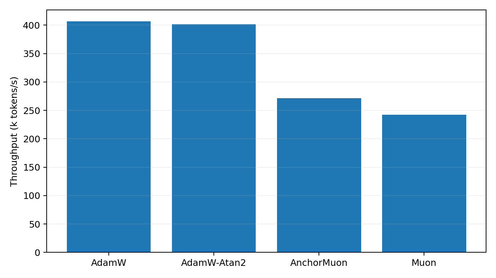

# Byte-Level 50M LLM Optimizer Comparison

This benchmark uses real text encoded as UTF-8 bytes. It is byte-level rather than BPE-tokenized, so the numbers should not be compared to standard word/BPE perplexities. It is still a real text next-byte language-model optimizer comparison.

## Setup

- Dataset: `HuggingFaceFW/fineweb-edu/sample-10BT:train`
- Train bytes cached: 268,435,456
- Validation bytes cached: 4,194,304
- Model: decoder-only GPT, layers=10, width=640, heads=10, context=128, byte vocab=256
- Trainable parameters: 49424640
- Batch: 32 sequences x 128 bytes
- HPO: skipped; fixed preset configs replayed directly
- Final replay: 10000 steps per selected optimizer
- Validation estimate: 32 random batches per evaluation point
- GPUs: 2 visible, one trial per GPU

## Final Results

| Rank | Optimizer | Selected config | Final val loss | Best val loss | Final byte acc | Step time | Throughput |
|---:|---|---|---:|---:|---:|---:|---:|
| 1 | Muon | lr=0.0012, wd=0.05 | 1.1696 | 1.1696 | 64.56% | 16.89 ms | 242.5k byte/s |
| 2 | AnchorMuon | lr=0.0015, wd=0.05, row_gamma=0.55, pmuon_beta=0.9, normuon_beta2=0.93, fallback=atan2@0.5x, soda=0.01 | 1.1791 | 1.1791 | 64.34% | 15.11 ms | 271.1k byte/s |
| 3 | AdamW | lr=0.0003, wd=0.05 | 1.1981 | 1.1981 | 63.85% | 10.08 ms | 406.5k byte/s |
| 4 | AdamW-Atan2 | lr=0.0003, wd=0.05 | 1.1991 | 1.1991 | 63.78% | 10.20 ms | 401.4k byte/s |

## Plots

