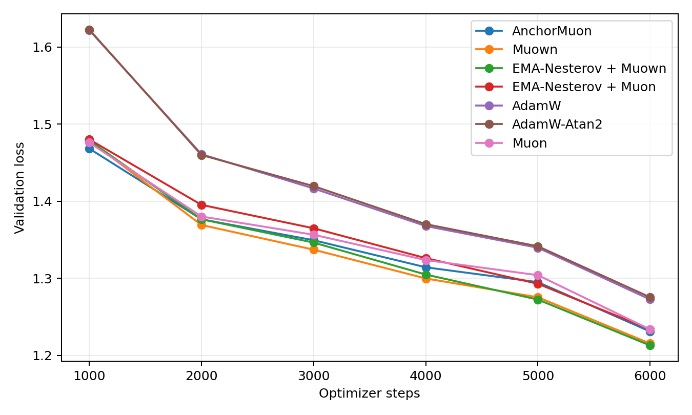
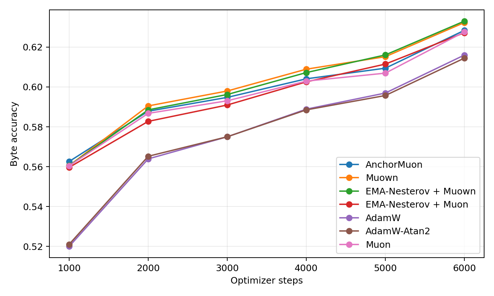
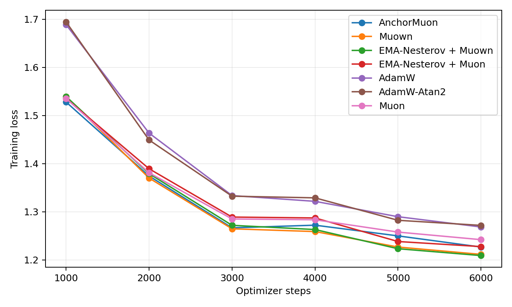
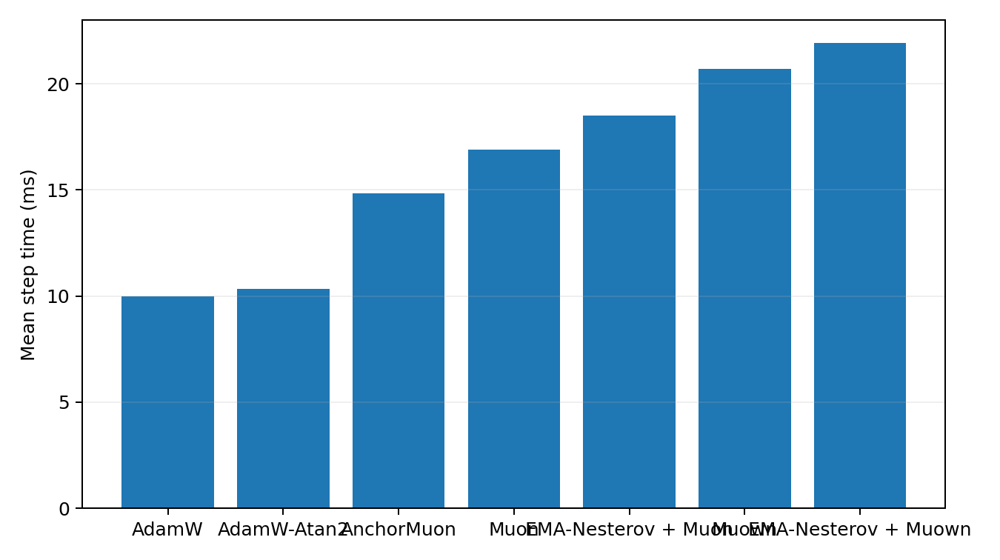
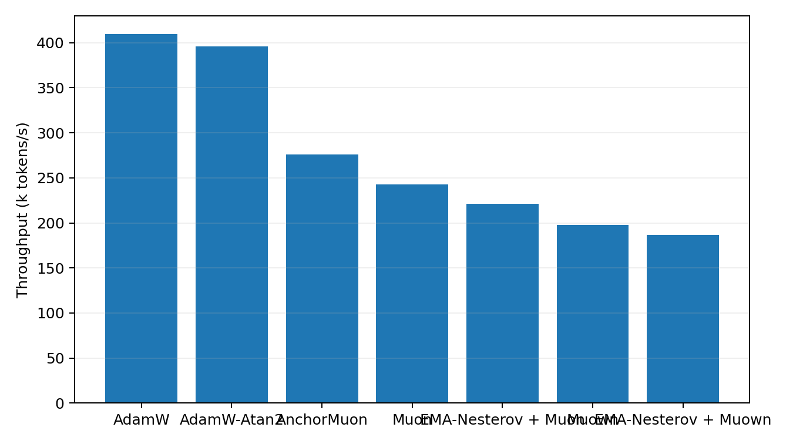

# Byte-Level 50M LLM Optimizer Comparison

This benchmark uses real text encoded as UTF-8 bytes. It is byte-level rather than BPE-tokenized, so the numbers should not be compared to standard word/BPE perplexities. It is still a real text next-byte language-model optimizer comparison.

## Setup

- Dataset: `HuggingFaceFW/fineweb-edu/sample-10BT:train`
- Train bytes cached: 268,435,456
- Validation bytes cached: 4,194,304
- Model: decoder-only GPT, layers=10, width=640, heads=10, context=128, byte vocab=256
- Trainable parameters: 49424640
- Batch: 32 sequences x 128 bytes
- HPO: 1200 steps per candidate, selected by best validation loss
- Final replay: 6000 steps per selected optimizer
- Validation estimate: 32 random batches per evaluation point
- GPUs: 2 visible, one trial per GPU

## Final Results

| Rank | Optimizer | Selected config | Final val loss | Best val loss | Final byte acc | Step time | Throughput |
|---:|---|---|---:|---:|---:|---:|---:|
| 1 | EMA-Nesterov + Muown | lr=0.0016, wd=0, ema_beta=0.3, ema_gamma=0.995 | 1.2131 | 1.2131 | 63.30% | 21.91 ms | 187.0k byte/s |
| 2 | Muown | lr=0.0016, wd=0 | 1.2156 | 1.2156 | 63.23% | 20.69 ms | 198.0k byte/s |
| 3 | AnchorMuon | lr=0.0012, wd=0.05, row_gamma=0.45, pmuon_beta=0.9, normuon_beta2=0.93, fallback=rms@1x, soda=0.003 | 1.2312 | 1.2312 | 62.84% | 14.83 ms | 276.2k byte/s |
| 4 | Muon | lr=0.0011, wd=0.05 | 1.2338 | 1.2338 | 62.76% | 16.89 ms | 242.5k byte/s |
| 5 | EMA-Nesterov + Muon | lr=0.001, wd=0.05, ema_beta=0.5, ema_gamma=0.995 | 1.2340 | 1.2340 | 62.72% | 18.51 ms | 221.3k byte/s |
| 6 | AdamW | lr=0.0004, wd=0.05 | 1.2727 | 1.2727 | 61.60% | 10.00 ms | 409.4k byte/s |
| 7 | AdamW-Atan2 | lr=0.0004, wd=0.05 | 1.2756 | 1.2756 | 61.44% | 10.35 ms | 395.7k byte/s |

## Plots

## HPO Candidates

| Family | Trial | LR | Best val loss | Final val loss | Step time |
|---|---|---:|---:|---:|---:|
| adamatan2 | `fineweb_adamatan2_lr0.0004` | 0.0004 | 1.5106 | 1.5106 | 10.29 ms |
| adamatan2 | `fineweb_adamatan2_lr0.0005` | 0.0005 | 1.5145 | 1.5145 | 10.32 ms |
| adamatan2 | `fineweb_adamatan2_lr0.0003` | 0.0003 | 1.5225 | 1.5225 | 10.26 ms |
| adamw | `fineweb_adamw_lr0.0004` | 0.0004 | 1.5102 | 1.5102 | 9.98 ms |
| adamw | `fineweb_adamw_lr0.0005` | 0.0005 | 1.5134 | 1.5134 | 9.98 ms |
| adamw | `fineweb_adamw_lr0.0003` | 0.0003 | 1.5197 | 1.5197 | 9.99 ms |
| anchormuon | `fineweb_anchor_best_lr0.0012_rg0.45_soda0.003_pb0.9_nb0.93_flr1_rms` | 0.0012 | 1.3897 | 1.3897 | 14.83 ms |
| ema_muon | `fineweb_ema_muon_lr0.001_b0.5_g0.995` | 0.001 | 1.3898 | 1.3898 | 18.49 ms |
| ema_muon | `fineweb_ema_muon_lr0.0011_b0.5_g0.995` | 0.0011 | 1.3909 | 1.3909 | 18.48 ms |
| ema_muon | `fineweb_ema_muon_lr0.0011_b0.3_g0.995` | 0.0011 | 1.3910 | 1.3910 | 18.49 ms |
| ema_muon | `fineweb_ema_muon_lr0.0011_b0.3_g0.99` | 0.0011 | 1.3911 | 1.3911 | 18.67 ms |
| ema_muon | `fineweb_ema_muon_lr0.0012_b0.5_g0.995` | 0.0012 | 1.3913 | 1.3913 | 18.50 ms |
| ema_muon | `fineweb_ema_muon_lr0.0012_b0.3_g0.99` | 0.0012 | 1.3914 | 1.3914 | 18.72 ms |
| ema_muon | `fineweb_ema_muon_lr0.0012_b0.3_g0.995` | 0.0012 | 1.3916 | 1.3916 | 18.54 ms |
| ema_muon | `fineweb_ema_muon_lr0.001_b0.3_g0.995` | 0.001 | 1.3923 | 1.3923 | 18.53 ms |
| ema_muon | `fineweb_ema_muon_lr0.001_b0.3_g0.99` | 0.001 | 1.3925 | 1.3925 | 18.72 ms |
| ema_muon | `fineweb_ema_muon_lr0.0011_b0.5_g0.99` | 0.0011 | 1.3925 | 1.3925 | 18.67 ms |
| ema_muon | `fineweb_ema_muon_lr0.0011_b0.1_g0.99` | 0.0011 | 1.3927 | 1.3927 | 18.69 ms |
| ema_muon | `fineweb_ema_muon_lr0.0011_b0.1_g0.995` | 0.0011 | 1.3928 | 1.3928 | 18.49 ms |
| ema_muon | `fineweb_ema_muon_lr0.001_b0.5_g0.99` | 0.001 | 1.3929 | 1.3929 | 18.67 ms |
| ema_muon | `fineweb_ema_muon_lr0.0012_b0.1_g0.995` | 0.0012 | 1.3932 | 1.3932 | 18.49 ms |
| ema_muon | `fineweb_ema_muon_lr0.0012_b0.5_g0.99` | 0.0012 | 1.3933 | 1.3933 | 18.68 ms |
| ema_muon | `fineweb_ema_muon_lr0.0012_b0.1_g0.99` | 0.0012 | 1.3935 | 1.3935 | 18.70 ms |
| ema_muon | `fineweb_ema_muon_lr0.001_b0.1_g0.99` | 0.001 | 1.3943 | 1.3943 | 18.68 ms |
| ema_muon | `fineweb_ema_muon_lr0.001_b0.1_g0.995` | 0.001 | 1.3949 | 1.3949 | 18.56 ms |
| ema_muown | `fineweb_ema_muown_lr0.0016_wd0_b0.3_g0.995` | 0.0016 | 1.3939 | 1.3939 | 22.15 ms |
| ema_muown | `fineweb_ema_muown_lr0.0016_wd0_b0.3_g0.99` | 0.0016 | 1.3946 | 1.3946 | 22.37 ms |
| ema_muown | `fineweb_ema_muown_lr0.0013_wd0_b0.3_g0.995` | 0.0013 | 1.3963 | 1.3963 | 22.07 ms |
| ema_muown | `fineweb_ema_muown_lr0.0016_wd0_b0.1_g0.995` | 0.0016 | 1.3964 | 1.3964 | 22.34 ms |
| ema_muown | `fineweb_ema_muown_lr0.0016_wd0_b0.1_g0.99` | 0.0016 | 1.3967 | 1.3967 | 22.30 ms |
| ema_muown | `fineweb_ema_muown_lr0.0011_wd0_b0.3_g0.99` | 0.0011 | 1.3970 | 1.3970 | 22.27 ms |
| ema_muown | `fineweb_ema_muown_lr0.0011_wd0_b0.3_g0.995` | 0.0011 | 1.3971 | 1.3971 | 22.32 ms |
| ema_muown | `fineweb_ema_muown_lr0.0013_wd0_b0.3_g0.99` | 0.0013 | 1.3978 | 1.3978 | 22.35 ms |
| ema_muown | `fineweb_ema_muown_lr0.0013_wd0_b0.1_g0.99` | 0.0013 | 1.3990 | 1.3990 | 22.39 ms |
| ema_muown | `fineweb_ema_muown_lr0.0011_wd0_b0.1_g0.99` | 0.0011 | 1.3994 | 1.3994 | 22.28 ms |
| ema_muown | `fineweb_ema_muown_lr0.0013_wd0_b0.1_g0.995` | 0.0013 | 1.4000 | 1.4000 | 22.13 ms |
| ema_muown | `fineweb_ema_muown_lr0.0011_wd0_b0.1_g0.995` | 0.0011 | 1.4003 | 1.4003 | 22.11 ms |
| ema_muown | `fineweb_ema_muown_lr0.0011_wd0.01_b0.1_g0.995` | 0.0011 | 1.4210 | 1.4210 | 22.67 ms |
| ema_muown | `fineweb_ema_muown_lr0.0011_wd0.01_b0.1_g0.99` | 0.0011 | 1.4215 | 1.4215 | 22.80 ms |
| ema_muown | `fineweb_ema_muown_lr0.0011_wd0.01_b0.3_g0.99` | 0.0011 | 1.4219 | 1.4219 | 22.80 ms |
| ema_muown | `fineweb_ema_muown_lr0.0011_wd0.01_b0.3_g0.995` | 0.0011 | 1.4222 | 1.4222 | 22.79 ms |
| ema_muown | `fineweb_ema_muown_lr0.0013_wd0.01_b0.1_g0.99` | 0.0013 | 1.4288 | 1.4288 | 22.87 ms |
| ema_muown | `fineweb_ema_muown_lr0.0013_wd0.01_b0.3_g0.995` | 0.0013 | 1.4303 | 1.4303 | 22.80 ms |
| ema_muown | `fineweb_ema_muown_lr0.0013_wd0.01_b0.3_g0.99` | 0.0013 | 1.4308 | 1.4308 | 23.06 ms |
| ema_muown | `fineweb_ema_muown_lr0.0013_wd0.01_b0.1_g0.995` | 0.0013 | 1.4310 | 1.4310 | 22.78 ms |
| ema_muown | `fineweb_ema_muown_lr0.0016_wd0.01_b0.1_g0.995` | 0.0016 | 1.4452 | 1.4452 | 22.58 ms |
| ema_muown | `fineweb_ema_muown_lr0.0016_wd0.01_b0.1_g0.99` | 0.0016 | 1.4457 | 1.4457 | 22.93 ms |
| ema_muown | `fineweb_ema_muown_lr0.0016_wd0.01_b0.3_g0.995` | 0.0016 | 1.4479 | 1.4479 | 22.55 ms |
| ema_muown | `fineweb_ema_muown_lr0.0016_wd0.01_b0.3_g0.99` | 0.0016 | 1.4484 | 1.4484 | 22.93 ms |
| muon | `fineweb_muon_lr0.0011` | 0.0011 | 1.3944 | 1.3944 | 17.04 ms |
| muon | `fineweb_muon_lr0.00135` | 0.00135 | 1.3950 | 1.3950 | 17.09 ms |
| muon | `fineweb_muon_lr0.0012` | 0.0012 | 1.3954 | 1.3954 | 16.92 ms |
| muon | `fineweb_muon_lr0.001` | 0.001 | 1.3959 | 1.3959 | 16.90 ms |
| muown | `fineweb_muown_lr0.0016_wd0` | 0.0016 | 1.3976 | 1.3976 | 21.04 ms |
| muown | `fineweb_muown_lr0.002_wd0` | 0.002 | 1.3977 | 1.3977 | 20.56 ms |
| muown | `fineweb_muown_lr0.0011_wd0` | 0.0011 | 1.4014 | 1.4014 | 20.82 ms |
| muown | `fineweb_muown_lr0.0013_wd0` | 0.0013 | 1.4018 | 1.4018 | 20.56 ms |
| muown | `fineweb_muown_lr0.0009_wd0` | 0.0009 | 1.4045 | 1.4045 | 20.69 ms |
| muown | `fineweb_muown_lr0.0009_wd0.01` | 0.0009 | 1.4210 | 1.4210 | 21.48 ms |
| muown | `fineweb_muown_lr0.0011_wd0.01` | 0.0011 | 1.4218 | 1.4218 | 21.18 ms |
| muown | `fineweb_muown_lr0.0009_wd0.05` | 0.0009 | 1.4221 | 1.4221 | 21.12 ms |
| muown | `fineweb_muown_lr0.0011_wd0.05` | 0.0011 | 1.4259 | 1.4259 | 21.32 ms |
| muown | `fineweb_muown_lr0.0013_wd0.01` | 0.0013 | 1.4292 | 1.4292 | 21.38 ms |
| muown | `fineweb_muown_lr0.0013_wd0.05` | 0.0013 | 1.4334 | 1.4334 | 21.10 ms |
| muown | `fineweb_muown_lr0.0016_wd0.01` | 0.0016 | 1.4453 | 1.4453 | 21.26 ms |
| muown | `fineweb_muown_lr0.0016_wd0.05` | 0.0016 | 1.4493 | 1.4493 | 21.40 ms |
| muown | `fineweb_muown_lr0.002_wd0.01` | 0.002 | 1.4639 | 1.4639 | 21.37 ms |
| muown | `fineweb_muown_lr0.002_wd0.05` | 0.002 | 1.4713 | 1.4713 | 21.17 ms |
