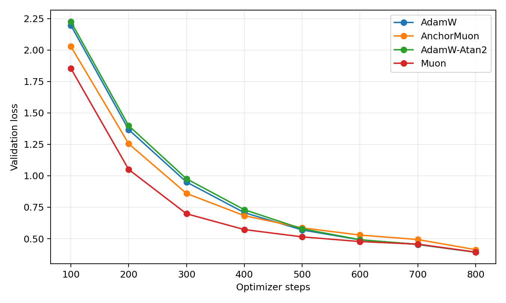
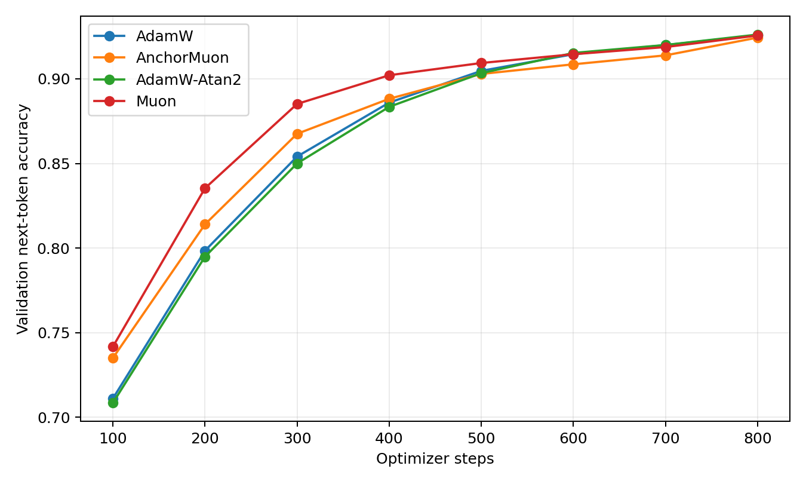
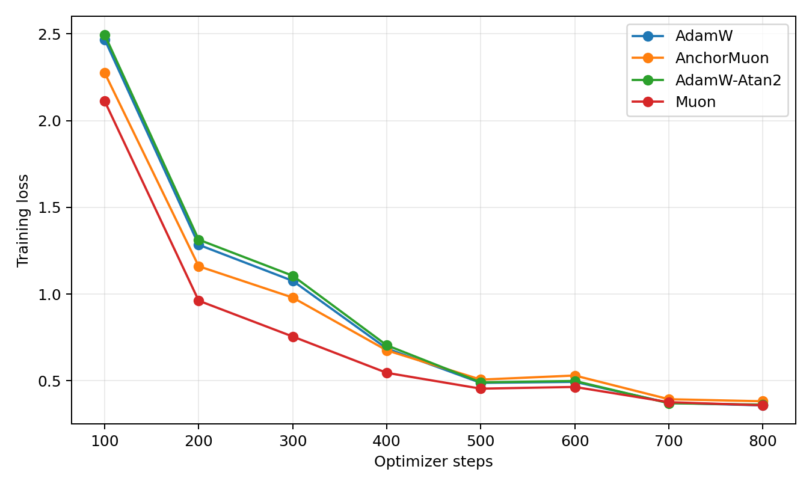
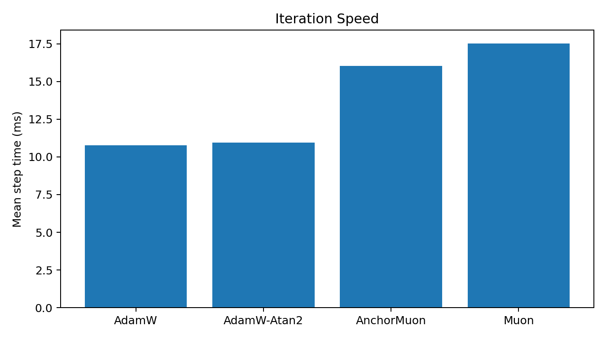
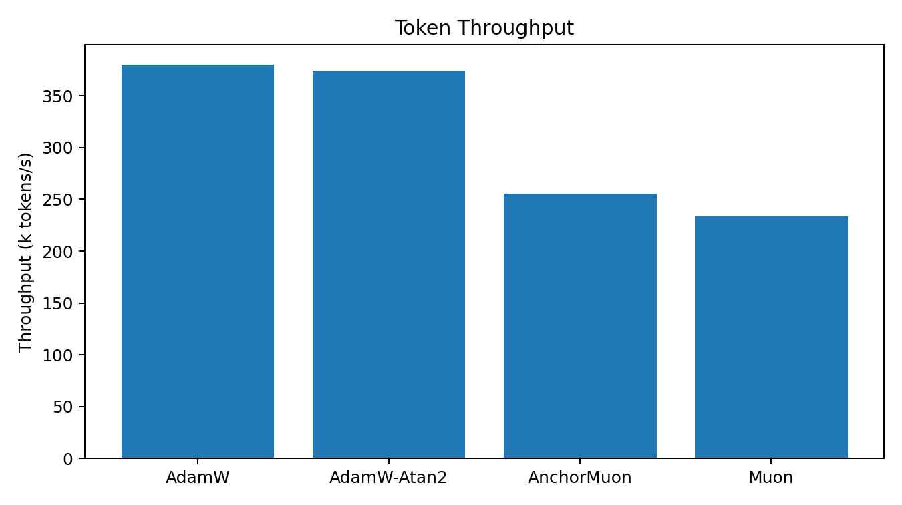

# Synthetic 50M LLM Optimizer Comparison

This is a download-free proxy benchmark: a decoder-only transformer trains on a deterministic repeated-motif token stream and validates on a held-out stream from the same motif bank. It measures next-token loss, next-token accuracy, and synchronized iteration speed. It is useful for optimizer smoke/proxy behavior, not a claim about natural-language pretraining.

## Setup

- Model: decoder-only GPT, layers=10, width=640, heads=10, context=128, vocab=4096
- Trainable parameters: 51882240
- Batch: 32 sequences x 128 tokens
- HPO: 800 steps per candidate, selected by best validation loss
- Final replay: 800 steps per selected optimizer
- GPUs: 2 visible, one trial per GPU

## Final Results

| Rank | Optimizer | Selected config | Final val loss | Best val loss | Final val acc | Step time | Throughput |
|---:|---|---|---:|---:|---:|---:|---:|
| 1 | AdamW-Atan2 | lr=0.0005, wd=0.05 | 0.3922 | 0.3922 | 92.62% | 10.95 ms | 374.2k tok/s |
| 2 | AdamW | lr=0.0005, wd=0.05 | 0.3924 | 0.3924 | 92.58% | 10.78 ms | 380.0k tok/s |
| 3 | Muon | lr=0.001, wd=0.05 | 0.3934 | 0.3934 | 92.56% | 17.53 ms | 233.7k tok/s |
| 4 | AnchorMuon | lr=0.001, wd=0.05, row_gamma=0.25, fallback_lr_mult=0.5 | 0.4123 | 0.4123 | 92.44% | 16.03 ms | 255.6k tok/s |

## Plots

## HPO Candidates

| Family | Trial | LR | Best val loss | Final val loss | Step time |
|---|---|---:|---:|---:|---:|
| adamatan2 | `adamatan2_lr0.0005` | 0.0005 | 0.3922 | 0.3922 | 10.80 ms |
| adamatan2 | `adamatan2_lr0.001` | 0.001 | 0.3966 | 0.3966 | 10.81 ms |
| adamatan2 | `adamatan2_lr0.0015` | 0.0015 | 0.4072 | 0.4072 | 10.84 ms |
| adamatan2 | `adamatan2_lr0.002` | 0.002 | 0.4758 | 0.4758 | 10.86 ms |
| adamw | `adamw_lr0.0005` | 0.0005 | 0.3924 | 0.3924 | 10.50 ms |
| adamw | `adamw_lr0.001` | 0.001 | 0.3984 | 0.3984 | 10.52 ms |
| adamw | `adamw_lr0.0015` | 0.0015 | 0.4125 | 0.4125 | 10.53 ms |
| adamw | `adamw_lr0.002` | 0.002 | 0.4936 | 0.4936 | 10.54 ms |
| anchormuon | `anchormuon_lr0.001_rg0.25_flr0.5` | 0.001 | 0.4123 | 0.4123 | 15.94 ms |
| anchormuon | `anchormuon_lr0.001_rg0.35_flr0.5` | 0.001 | 0.4132 | 0.4132 | 16.14 ms |
| anchormuon | `anchormuon_lr0.002_rg0.35_flr0.5` | 0.002 | 0.4240 | 0.4240 | 16.17 ms |
| anchormuon | `anchormuon_lr0.002_rg0.25_flr0.5` | 0.002 | 0.4243 | 0.4243 | 15.96 ms |
| anchormuon | `anchormuon_lr0.003_rg0.35_flr0.5` | 0.003 | 0.4390 | 0.4390 | 16.23 ms |
| anchormuon | `anchormuon_lr0.003_rg0.25_flr0.5` | 0.003 | 0.4400 | 0.4400 | 15.98 ms |
| anchormuon | `anchormuon_lr0.004_rg0.25_flr0.5` | 0.004 | 0.4441 | 0.4441 | 15.99 ms |
| anchormuon | `anchormuon_lr0.004_rg0.35_flr0.5` | 0.004 | 0.4470 | 0.4470 | 16.15 ms |
| muon | `muon_lr0.001` | 0.001 | 0.3934 | 0.3934 | 17.47 ms |
| muon | `muon_lr0.002` | 0.002 | 0.4079 | 0.4079 | 17.70 ms |
| muon | `muon_lr0.004` | 0.004 | 0.4082 | 0.4082 | 17.73 ms |
| muon | `muon_lr0.003` | 0.003 | 0.4116 | 0.4116 | 17.49 ms |
