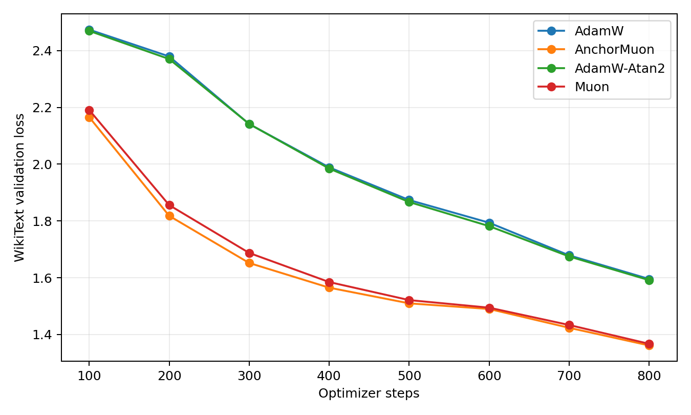
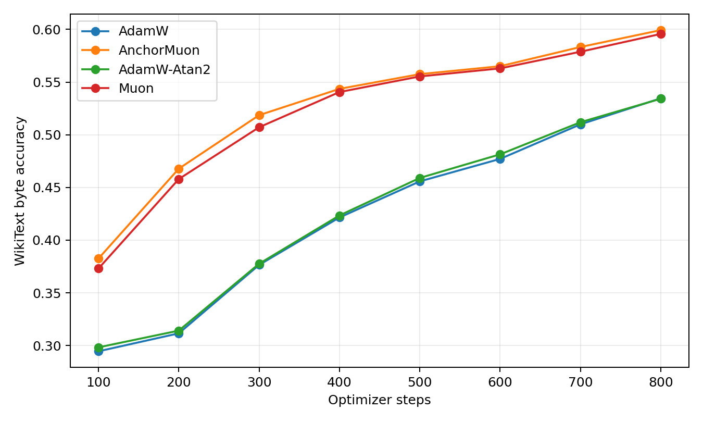
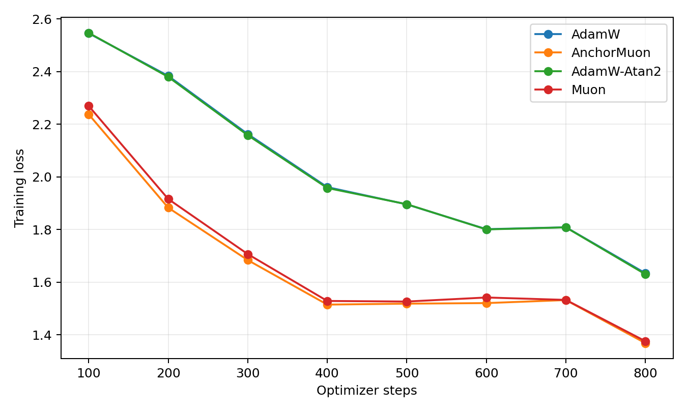
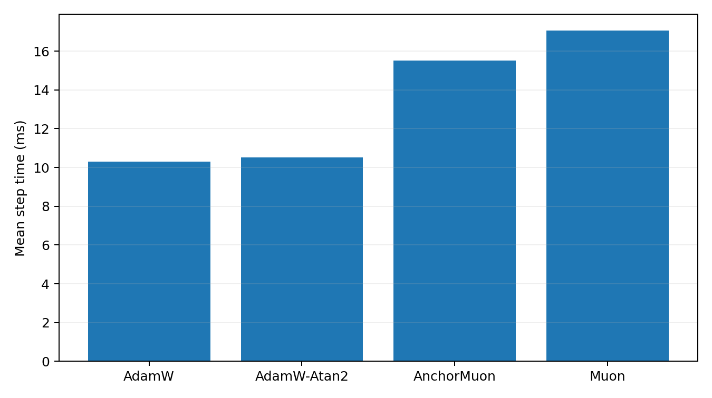
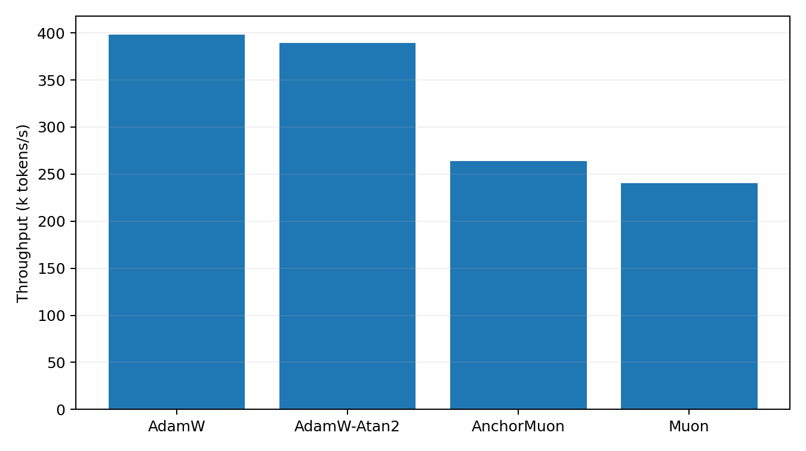

# WikiText 50M LLM Optimizer Comparison

This benchmark uses actual WikiText raw text encoded as UTF-8 bytes. It is byte-level rather than BPE-tokenized, so the numbers should not be compared to standard word/BPE WikiText perplexities. It is still a real text next-byte language-model optimizer comparison.

## Setup

- Dataset: `wikitext-103-raw-v1`
- Train bytes cached: 32,000,000
- Validation bytes cached: 1,148,008
- Model: decoder-only GPT, layers=10, width=640, heads=10, context=128, byte vocab=256
- Trainable parameters: 49424640
- Batch: 32 sequences x 128 bytes
- HPO: 800 steps per candidate, selected by best validation loss
- Final replay: 800 steps per selected optimizer
- GPUs: 2 visible, one trial per GPU

## Final Results

| Rank | Optimizer | Selected config | Final val loss | Best val loss | Final byte acc | Step time | Throughput |
|---:|---|---|---:|---:|---:|---:|---:|
| 1 | AnchorMuon | lr=0.00175, wd=0.05, row_gamma=0.45, pmuon_beta=0.9, normuon_beta2=0.93, fallback=atan2@0.5x, soda=0.1 | 1.3614 | 1.3614 | 59.93% | 15.52 ms | 263.9k byte/s |
| 2 | Muon | lr=0.0015, wd=0.05 | 1.3672 | 1.3672 | 59.57% | 17.05 ms | 240.2k byte/s |
| 3 | AdamW-Atan2 | lr=0.0003, wd=0.05 | 1.5914 | 1.5914 | 53.42% | 10.52 ms | 389.2k byte/s |
| 4 | AdamW | lr=0.0003, wd=0.05 | 1.5955 | 1.5955 | 53.46% | 10.29 ms | 398.0k byte/s |

## Plots

## HPO Candidates

| Family | Trial | LR | Best val loss | Final val loss | Step time |
|---|---|---:|---:|---:|---:|
| adamatan2 | `adamatan2_lr0.0003` | 0.0003 | 1.5914 | 1.5914 | 10.38 ms |
| adamatan2 | `adamatan2_lr0.0005` | 0.0005 | 1.6614 | 1.6614 | 10.41 ms |
| adamatan2 | `adamatan2_lr0.0008` | 0.0008 | 1.7582 | 1.7582 | 10.45 ms |
| adamatan2 | `adamatan2_lr0.001` | 0.001 | 1.7923 | 1.7923 | 10.46 ms |
| adamw | `adamw_lr0.0003` | 0.0003 | 1.5955 | 1.5955 | 10.05 ms |
| adamw | `adamw_lr0.0005` | 0.0005 | 1.6616 | 1.6616 | 10.06 ms |
| adamw | `adamw_lr0.0008` | 0.0008 | 1.7552 | 1.7552 | 10.09 ms |
| adamw | `adamw_lr0.001` | 0.001 | 1.8853 | 1.8853 | 10.08 ms |
| anchormuon | `anchor_lr0.00175_rg0.45_soda0.1_pb0.9_nb0.93_flr0.5_atan2` | 0.00175 | 1.3614 | 1.3614 | 15.54 ms |
| anchormuon | `anchor_lr0.002_rg0.35_soda0.1_pb0.9_nb0.93_flr0.5_atan2` | 0.002 | 1.3625 | 1.3625 | 15.52 ms |
| anchormuon | `anchor_lr0.002_rg0.25_soda0.1_pb0.9_nb0.93_flr0.5_atan2` | 0.002 | 1.3626 | 1.3626 | 15.68 ms |
| anchormuon | `anchor_lr0.00175_rg0.35_soda0.1_pb0.9_nb0.93_flr0.5_atan2` | 0.00175 | 1.3636 | 1.3636 | 15.65 ms |
| anchormuon | `anchor_lr0.00175_rg0.25_soda0.1_pb0.9_nb0.93_flr0.5_atan2` | 0.00175 | 1.3644 | 1.3644 | 15.48 ms |
| anchormuon | `anchor_lr0.00175_rg0.35_soda0.3_pb0.9_nb0.93_flr0.5_atan2` | 0.00175 | 1.3650 | 1.3650 | 15.53 ms |
| anchormuon | `anchor_lr0.00175_rg0.25_soda0.3_pb0.9_nb0.93_flr0.5_atan2` | 0.00175 | 1.3672 | 1.3672 | 15.66 ms |
| anchormuon | `anchor_lr0.00175_rg0.45_soda0.3_pb0.9_nb0.93_flr0.5_atan2` | 0.00175 | 1.3672 | 1.3672 | 15.67 ms |
| anchormuon | `anchor_lr0.002_rg0.45_soda0.3_pb0.9_nb0.93_flr0.5_atan2` | 0.002 | 1.3676 | 1.3676 | 15.55 ms |
| anchormuon | `anchor_lr0.002_rg0.35_soda0.3_pb0.9_nb0.93_flr0.5_atan2` | 0.002 | 1.3680 | 1.3680 | 15.70 ms |
| anchormuon | `anchor_lr0.002_rg0.45_soda0.1_pb0.9_nb0.93_flr0.5_atan2` | 0.002 | 1.3680 | 1.3680 | 15.67 ms |
| anchormuon | `anchor_lr0.002_rg0.25_soda0.3_pb0.9_nb0.93_flr0.5_atan2` | 0.002 | 1.3684 | 1.3684 | 15.53 ms |
| anchormuon | `anchor_lr0.0025_rg0.45_soda0.3_pb0.9_nb0.93_flr0.5_atan2` | 0.0025 | 1.3727 | 1.3727 | 15.66 ms |
| anchormuon | `anchor_lr0.0025_rg0.25_soda0.1_pb0.9_nb0.93_flr0.5_atan2` | 0.0025 | 1.3736 | 1.3736 | 15.53 ms |
| anchormuon | `anchor_lr0.0025_rg0.35_soda0.3_pb0.9_nb0.93_flr0.5_atan2` | 0.0025 | 1.3743 | 1.3743 | 15.52 ms |
| anchormuon | `anchor_lr0.0025_rg0.35_soda0.1_pb0.9_nb0.93_flr0.5_atan2` | 0.0025 | 1.3753 | 1.3753 | 15.66 ms |
| anchormuon | `anchor_lr0.0025_rg0.45_soda0.1_pb0.9_nb0.93_flr0.5_atan2` | 0.0025 | 1.3757 | 1.3757 | 15.52 ms |
| anchormuon | `anchor_lr0.0025_rg0.25_soda0.3_pb0.9_nb0.93_flr0.5_atan2` | 0.0025 | 1.3768 | 1.3768 | 15.67 ms |
| anchormuon | `anchor_lr0.003_rg0.35_soda0.3_pb0.9_nb0.93_flr0.5_atan2` | 0.003 | 1.3795 | 1.3795 | 15.63 ms |
| anchormuon | `anchor_lr0.003_rg0.25_soda0.3_pb0.9_nb0.93_flr0.5_atan2` | 0.003 | 1.3801 | 1.3801 | 15.51 ms |
| anchormuon | `anchor_lr0.003_rg0.45_soda0.3_pb0.9_nb0.93_flr0.5_atan2` | 0.003 | 1.3809 | 1.3809 | 15.50 ms |
| anchormuon | `anchor_lr0.003_rg0.25_soda0.1_pb0.9_nb0.93_flr0.5_atan2` | 0.003 | 1.3827 | 1.3827 | 15.69 ms |
| anchormuon | `anchor_lr0.0025_rg0.45_soda1_pb0.9_nb0.93_flr0.5_atan2` | 0.0025 | 1.3828 | 1.3828 | 15.53 ms |
| anchormuon | `anchor_lr0.002_rg0.45_soda1_pb0.9_nb0.93_flr0.5_atan2` | 0.002 | 1.3831 | 1.3831 | 15.67 ms |
| anchormuon | `anchor_lr0.002_rg0.25_soda1_pb0.9_nb0.93_flr0.5_atan2` | 0.002 | 1.3847 | 1.3847 | 15.66 ms |
| anchormuon | `anchor_lr0.00175_rg0.35_soda1_pb0.9_nb0.93_flr0.5_atan2` | 0.00175 | 1.3848 | 1.3848 | 15.67 ms |
| anchormuon | `anchor_lr0.003_rg0.45_soda0.1_pb0.9_nb0.93_flr0.5_atan2` | 0.003 | 1.3857 | 1.3857 | 15.71 ms |
| anchormuon | `anchor_lr0.002_rg0.35_soda1_pb0.9_nb0.93_flr0.5_atan2` | 0.002 | 1.3869 | 1.3869 | 15.54 ms |
| anchormuon | `anchor_lr0.0025_rg0.35_soda1_pb0.9_nb0.93_flr0.5_atan2` | 0.0025 | 1.3870 | 1.3870 | 15.65 ms |
| anchormuon | `anchor_lr0.0025_rg0.25_soda1_pb0.9_nb0.93_flr0.5_atan2` | 0.0025 | 1.3870 | 1.3870 | 15.50 ms |
| anchormuon | `anchor_lr0.003_rg0.35_soda0.1_pb0.9_nb0.93_flr0.5_atan2` | 0.003 | 1.3875 | 1.3875 | 15.55 ms |
| anchormuon | `anchor_lr0.00175_rg0.25_soda1_pb0.9_nb0.93_flr0.5_atan2` | 0.00175 | 1.3876 | 1.3876 | 15.51 ms |
| anchormuon | `anchor_lr0.00175_rg0.45_soda1_pb0.9_nb0.93_flr0.5_atan2` | 0.00175 | 1.3881 | 1.3881 | 15.56 ms |
| anchormuon | `anchor_lr0.003_rg0.45_soda1_pb0.9_nb0.93_flr0.5_atan2` | 0.003 | 1.3885 | 1.3885 | 15.68 ms |
| anchormuon | `anchor_lr0.003_rg0.25_soda1_pb0.9_nb0.93_flr0.5_atan2` | 0.003 | 1.3897 | 1.3897 | 15.66 ms |
| anchormuon | `anchor_lr0.003_rg0.35_soda1_pb0.9_nb0.93_flr0.5_atan2` | 0.003 | 1.3897 | 1.3897 | 15.53 ms |
| anchormuon | `anchor_lr0.0015_rg0.15_pb0.9_nb0.93_flr0.5_atan2` | 0.0015 | 1.3916 | 1.3916 | 15.64 ms |
| anchormuon | `anchor_lr0.0015_rg0.35_pb0.9_nb0.93_flr0.5_atan2` | 0.0015 | 1.3916 | 1.3916 | 15.67 ms |
| anchormuon | `anchor_lr0.0015_rg0.25_pb0.9_nb0.93_flr0.5_atan2` | 0.0015 | 1.3925 | 1.3925 | 15.54 ms |
| anchormuon | `anchor_lr0.0015_rg0_pb0.9_nb0.93_flr0.5_atan2` | 0.0015 | 1.3938 | 1.3938 | 15.48 ms |
| anchormuon | `anchor_lr0.00125_rg0.35_pb0.9_nb0.93_flr0.5_atan2` | 0.00125 | 1.3998 | 1.3998 | 15.65 ms |
| anchormuon | `anchor_lr0.00125_rg0.25_pb0.9_nb0.93_flr0.5_atan2` | 0.00125 | 1.4012 | 1.4012 | 15.52 ms |
| anchormuon | `anchor_lr0.00125_rg0.15_pb0.9_nb0.93_flr0.5_atan2` | 0.00125 | 1.4028 | 1.4028 | 15.67 ms |
| anchormuon | `anchor_lr0.00125_rg0_pb0.9_nb0.93_flr0.5_atan2` | 0.00125 | 1.4039 | 1.4039 | 15.52 ms |
| anchormuon | `anchor_lr0.001_rg0.25_pb0.85_nb0.9_flr0.5_atan2` | 0.001 | 1.4093 | 1.4093 | 15.56 ms |
| anchormuon | `anchor_lr0.001_rg0.35_pb0.9_nb0.93_flr0.5_atan2` | 0.001 | 1.4097 | 1.4097 | 15.66 ms |
| anchormuon | `anchor_lr0.001_rg0.15_pb0.9_nb0.93_flr0.5_atan2` | 0.001 | 1.4098 | 1.4098 | 15.64 ms |
| anchormuon | `anchor_lr0.001_rg0.25_pb0.85_nb0.95_flr0.5_atan2` | 0.001 | 1.4108 | 1.4108 | 15.67 ms |
| anchormuon | `anchor_lr0.001_rg0.25_pb0.9_nb0.93_flr1_atan2` | 0.001 | 1.4110 | 1.4110 | 15.54 ms |
| anchormuon | `anchor_lr0.001_rg0.25_pb0.9_nb0.93_flr0.25_rms` | 0.001 | 1.4111 | 1.4111 | 15.24 ms |
| anchormuon | `anchor_lr0.001_rg0.25_pb0.9_nb0.93_flr1_rms` | 0.001 | 1.4113 | 1.4113 | 15.25 ms |
| anchormuon | `anchor_lr0.001_rg0.25_pb0.9_nb0.93_flr0.5_atan2` | 0.001 | 1.4114 | 1.4114 | 15.51 ms |
| anchormuon | `anchor_lr0.001_rg0_pb0.9_nb0.93_flr0.5_atan2` | 0.001 | 1.4115 | 1.4115 | 15.54 ms |
| anchormuon | `anchor_lr0.001_rg0.25_pb0.95_nb0.9_flr0.5_atan2` | 0.001 | 1.4116 | 1.4116 | 15.53 ms |
| anchormuon | `anchor_lr0.001_rg0.25_pb0.95_nb0.95_flr0.5_atan2` | 0.001 | 1.4119 | 1.4119 | 15.65 ms |
| anchormuon | `anchor_lr0.001_rg0.25_pb0.9_nb0.93_flr0.25_atan2` | 0.001 | 1.4125 | 1.4125 | 15.49 ms |
| anchormuon | `anchor_lr0.0008_rg0.25_pb0.9_nb0.93_flr1_rms` | 0.0008 | 1.4215 | 1.4215 | 15.28 ms |
| anchormuon | `anchor_lr0.0008_rg0.25_pb0.9_nb0.93_flr0.5_atan2` | 0.0008 | 1.4217 | 1.4217 | 15.53 ms |
| anchormuon | `anchor_lr0.0008_rg0.25_pb0.95_nb0.9_flr0.5_atan2` | 0.0008 | 1.4217 | 1.4217 | 15.52 ms |
| anchormuon | `anchor_lr0.0008_rg0.25_pb0.9_nb0.93_flr1_atan2` | 0.0008 | 1.4224 | 1.4224 | 15.49 ms |
| anchormuon | `anchor_lr0.0008_rg0.35_pb0.9_nb0.93_flr0.5_atan2` | 0.0008 | 1.4225 | 1.4225 | 15.72 ms |
| anchormuon | `anchor_lr0.0008_rg0.25_pb0.85_nb0.95_flr0.5_atan2` | 0.0008 | 1.4225 | 1.4225 | 15.66 ms |
| anchormuon | `anchor_lr0.0008_rg0.15_pb0.9_nb0.93_flr0.5_atan2` | 0.0008 | 1.4225 | 1.4225 | 15.65 ms |
| anchormuon | `anchor_lr0.0008_rg0.25_pb0.95_nb0.95_flr0.5_atan2` | 0.0008 | 1.4226 | 1.4226 | 15.69 ms |
| anchormuon | `anchor_lr0.0008_rg0.25_pb0.9_nb0.93_flr0.25_rms` | 0.0008 | 1.4233 | 1.4233 | 15.29 ms |
| anchormuon | `anchor_lr0.0008_rg0.25_pb0.9_nb0.93_flr0.25_atan2` | 0.0008 | 1.4238 | 1.4238 | 15.52 ms |
| anchormuon | `anchor_lr0.0008_rg0.25_pb0.85_nb0.9_flr0.5_atan2` | 0.0008 | 1.4239 | 1.4239 | 15.51 ms |
| anchormuon | `anchor_lr0.0008_rg0_pb0.9_nb0.93_flr0.5_atan2` | 0.0008 | 1.4241 | 1.4241 | 15.47 ms |
| anchormuon | `anchor_lr0.0006_rg0.15_pb0.9_nb0.93_flr0.5_atan2` | 0.0006 | 1.4424 | 1.4424 | 15.67 ms |
| anchormuon | `anchor_lr0.0006_rg0.25_pb0.95_nb0.9_flr0.5_atan2` | 0.0006 | 1.4425 | 1.4425 | 15.51 ms |
| anchormuon | `anchor_lr0.0006_rg0.25_pb0.9_nb0.93_flr1_rms` | 0.0006 | 1.4427 | 1.4427 | 15.24 ms |
| anchormuon | `anchor_lr0.0006_rg0.25_pb0.95_nb0.95_flr0.5_atan2` | 0.0006 | 1.4428 | 1.4428 | 15.69 ms |
| anchormuon | `anchor_lr0.0006_rg0_pb0.9_nb0.93_flr0.5_atan2` | 0.0006 | 1.4428 | 1.4428 | 15.53 ms |
| anchormuon | `anchor_lr0.0006_rg0.25_pb0.9_nb0.93_flr1_atan2` | 0.0006 | 1.4431 | 1.4431 | 15.50 ms |
| anchormuon | `anchor_lr0.0006_rg0.35_pb0.9_nb0.93_flr0.5_atan2` | 0.0006 | 1.4432 | 1.4432 | 15.66 ms |
| anchormuon | `anchor_lr0.0006_rg0.25_pb0.9_nb0.93_flr0.25_atan2` | 0.0006 | 1.4432 | 1.4432 | 15.50 ms |
| anchormuon | `anchor_lr0.0006_rg0.25_pb0.9_nb0.93_flr0.5_atan2` | 0.0006 | 1.4433 | 1.4433 | 15.52 ms |
| anchormuon | `anchor_lr0.0006_rg0.25_pb0.85_nb0.95_flr0.5_atan2` | 0.0006 | 1.4435 | 1.4435 | 15.67 ms |
| anchormuon | `anchor_lr0.0006_rg0.25_pb0.85_nb0.9_flr0.5_atan2` | 0.0006 | 1.4440 | 1.4440 | 15.51 ms |
| anchormuon | `anchor_lr0.0006_rg0.25_pb0.9_nb0.93_flr0.25_rms` | 0.0006 | 1.4440 | 1.4440 | 15.29 ms |
| anchormuon | `anchor_lr0.0004_rg0.15_pb0.9_nb0.93_flr0.5_atan2` | 0.0004 | 1.4838 | 1.4838 | 15.62 ms |
| anchormuon | `anchor_lr0.0004_rg0_pb0.9_nb0.93_flr0.5_atan2` | 0.0004 | 1.4840 | 1.4840 | 15.46 ms |
| anchormuon | `anchor_lr0.0004_rg0.35_pb0.9_nb0.93_flr0.5_atan2` | 0.0004 | 1.4840 | 1.4840 | 15.70 ms |
| anchormuon | `anchor_lr0.0004_rg0.25_pb0.9_nb0.93_flr0.5_atan2` | 0.0004 | 1.4842 | 1.4842 | 15.49 ms |
| muon | `muon_lr0.0015` | 0.0015 | 1.3672 | 1.3672 | 17.03 ms |
| muon | `muon_lr0.002` | 0.002 | 1.3731 | 1.3731 | 17.21 ms |
| muon | `muon_lr0.001` | 0.001 | 1.3805 | 1.3805 | 17.19 ms |
| muon | `muon_lr0.0005` | 0.0005 | 1.4156 | 1.4156 | 16.98 ms |
