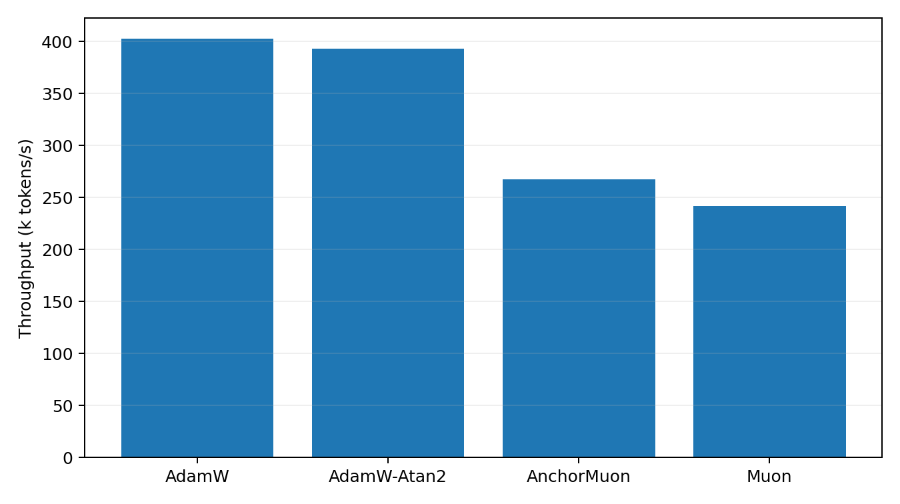

# WikiText 50M LLM Optimizer Comparison

This benchmark uses actual WikiText raw text encoded as UTF-8 bytes. It is byte-level rather than BPE-tokenized, so the numbers should not be compared to standard word/BPE WikiText perplexities. It is still a real text next-byte language-model optimizer comparison.

## Setup

- Dataset: `wikitext-103-raw-v1`
- Train bytes cached: 32,000,000
- Validation bytes cached: 1,148,008
- Model: decoder-only GPT, layers=10, width=640, heads=10, context=128, byte vocab=256
- Trainable parameters: 49424640
- Batch: 32 sequences x 128 bytes
- HPO: 1200 steps per candidate, selected by best validation loss
- Final replay: 1600 steps per selected optimizer
- Validation estimate: 16 random batches per evaluation point
- GPUs: 2 visible, one trial per GPU

## Final Results

| Rank | Optimizer | Selected config | Final val loss | Best val loss | Final byte acc | Step time | Throughput |
|---:|---|---|---:|---:|---:|---:|---:|
| 1 | AnchorMuon | lr=0.0015, wd=0.05, row_gamma=0.55, pmuon_beta=0.9, normuon_beta2=0.93, fallback=atan2@0.5x, soda=0.01 | 1.2473 | 1.2473 | 63.06% | 15.32 ms | 267.3k byte/s |
| 2 | Muon | lr=0.0012, wd=0.05 | 1.2501 | 1.2501 | 62.72% | 16.94 ms | 241.8k byte/s |
| 3 | AdamW-Atan2 | lr=0.0003, wd=0.05 | 1.3552 | 1.3552 | 60.03% | 10.42 ms | 392.9k byte/s |
| 4 | AdamW | lr=0.0003, wd=0.05 | 1.3553 | 1.3553 | 60.12% | 10.18 ms | 402.5k byte/s |

## Plots

## HPO Candidates

| Family | Trial | LR | Best val loss | Final val loss | Step time |
|---|---|---:|---:|---:|---:|
| adamatan2 | `adamatan2_lr0.0003` | 0.0003 | 1.4290 | 1.4290 | 10.44 ms |
| adamatan2 | `adamatan2_lr0.0004` | 0.0004 | 1.4413 | 1.4413 | 10.45 ms |
| adamatan2 | `adamatan2_lr0.0002` | 0.0002 | 1.4601 | 1.4601 | 10.40 ms |
| adamatan2 | `adamatan2_lr0.0005` | 0.0005 | 1.4721 | 1.4721 | 10.47 ms |
| adamatan2 | `adamatan2_lr0.0006` | 0.0006 | 1.5186 | 1.5186 | 10.45 ms |
| adamatan2 | `adamatan2_lr0.0001` | 0.0001 | 1.5903 | 1.5903 | 10.37 ms |
| adamatan2 | `adamatan2_lr0.0008` | 0.0008 | 1.5933 | 1.5933 | 10.45 ms |
| adamatan2 | `adamatan2_lr0.001` | 0.001 | 1.6413 | 1.6413 | 10.46 ms |
| adamw | `adamw_lr0.0003` | 0.0003 | 1.4295 | 1.4295 | 10.05 ms |
| adamw | `adamw_lr0.0004` | 0.0004 | 1.4417 | 1.4417 | 10.06 ms |
| adamw | `adamw_lr0.0002` | 0.0002 | 1.4545 | 1.4545 | 10.02 ms |
| adamw | `adamw_lr0.0005` | 0.0005 | 1.4677 | 1.4677 | 10.06 ms |
| adamw | `adamw_lr0.0006` | 0.0006 | 1.4998 | 1.4998 | 10.06 ms |
| adamw | `adamw_lr0.0001` | 0.0001 | 1.5809 | 1.5809 | 10.01 ms |
| adamw | `adamw_lr0.0008` | 0.0008 | 1.6049 | 1.6049 | 10.07 ms |
| adamw | `adamw_lr0.001` | 0.001 | 1.7504 | 1.7504 | 10.07 ms |
| anchormuon | `anchor_hard_lr0.0015_rg0.55_soda0.01_pb0.9_nb0.93_flr0.5_atan2` | 0.0015 | 1.2778 | 1.2778 | 15.40 ms |
| anchormuon | `anchor_hard_lr0.00165_rg0.45_soda0.1_pb0.9_nb0.93_flr1_atan2` | 0.00165 | 1.2788 | 1.2788 | 15.57 ms |
| anchormuon | `anchor_hard_lr0.00165_rg0.45_soda0.1_pb0.98_nb0.9_flr0.5_atan2` | 0.00165 | 1.2791 | 1.2791 | 15.43 ms |
| anchormuon | `anchor_hard_lr0.00165_rg0.35_soda0.1_pb0.9_nb0.93_flr0.5_atan2` | 0.00165 | 1.2792 | 1.2792 | 15.48 ms |
| anchormuon | `anchor_hard_lr0.0015_rg0.45_soda0.1_pb0.9_nb0.93_flr0.5_atan2` | 0.0015 | 1.2792 | 1.2792 | 15.39 ms |
| anchormuon | `anchor_hard_lr0.00165_rg0.45_soda0.1_pb0.95_nb0.93_flr0.5_atan2` | 0.00165 | 1.2794 | 1.2794 | 15.44 ms |
| anchormuon | `anchor_hard_lr0.00165_rg0.65_soda0.03_pb0.9_nb0.93_flr0.5_atan2` | 0.00165 | 1.2794 | 1.2794 | 15.41 ms |
| anchormuon | `anchor_hard_lr0.0015_rg0.35_soda0.03_pb0.9_nb0.93_flr0.5_atan2` | 0.0015 | 1.2794 | 1.2794 | 15.52 ms |
| anchormuon | `anchor_hard_lr0.0015_rg0.55_soda0.03_pb0.9_nb0.93_flr0.5_atan2` | 0.0015 | 1.2794 | 1.2794 | 15.61 ms |
| anchormuon | `anchor_hard_lr0.00165_rg0.45_soda0.1_pb0.85_nb0.93_flr0.5_atan2` | 0.00165 | 1.2795 | 1.2795 | 15.60 ms |
| anchormuon | `anchor_hard_lr0.00165_rg0.45_soda0.1_pb0.95_nb0.9_flr0.5_atan2` | 0.00165 | 1.2795 | 1.2795 | 15.58 ms |
| anchormuon | `anchor_hard_lr0.00165_rg0.45_soda0.1_pb0.9_nb0.9_flr0.5_atan2` | 0.00165 | 1.2796 | 1.2796 | 15.57 ms |
| anchormuon | `anchor_hard_lr0.00165_rg0.45_soda0.1_pb0.85_nb0.9_flr0.5_atan2` | 0.00165 | 1.2798 | 1.2798 | 15.40 ms |
| anchormuon | `anchor_hard_lr0.00165_rg0.25_soda0.03_pb0.9_nb0.93_flr0.5_atan2` | 0.00165 | 1.2799 | 1.2799 | 15.39 ms |
| anchormuon | `anchor_hard_lr0.0015_rg0.35_soda0.01_pb0.9_nb0.93_flr0.5_atan2` | 0.0015 | 1.2800 | 1.2800 | 15.42 ms |
| anchormuon | `anchor_hard_lr0.00165_rg0.55_soda0.07_pb0.9_nb0.93_flr0.5_atan2` | 0.00165 | 1.2801 | 1.2801 | 15.58 ms |
| anchormuon | `anchor_hard_lr0.0015_rg0.55_soda0.07_pb0.9_nb0.93_flr0.5_atan2` | 0.0015 | 1.2801 | 1.2801 | 15.39 ms |
| anchormuon | `anchor_hard_lr0.00165_rg0.25_soda0.1_pb0.9_nb0.93_flr0.5_atan2` | 0.00165 | 1.2801 | 1.2801 | 15.57 ms |
| anchormuon | `anchor_hard_lr0.00165_rg0.35_soda0.07_pb0.9_nb0.93_flr0.5_atan2` | 0.00165 | 1.2803 | 1.2803 | 15.60 ms |
| anchormuon | `anchor_hard_lr0.00165_rg0.45_soda0.1_pb0.9_nb0.93_flr1_adamc` | 0.00165 | 1.2804 | 1.2804 | 15.55 ms |
| anchormuon | `anchor_hard_lr0.00165_rg0.65_soda0.1_pb0.9_nb0.93_flr0.5_atan2` | 0.00165 | 1.2805 | 1.2805 | 15.41 ms |
| anchormuon | `anchor_hard_lr0.0015_rg0.45_soda0.03_pb0.9_nb0.93_flr0.5_atan2` | 0.0015 | 1.2805 | 1.2805 | 15.39 ms |
| anchormuon | `anchor_hard_lr0.0015_rg0.45_soda0.01_pb0.9_nb0.93_flr0.5_atan2` | 0.0015 | 1.2806 | 1.2806 | 15.58 ms |
| anchormuon | `anchor_hard_lr0.00165_rg0.45_soda0.1_pb0.98_nb0.95_flr0.5_atan2` | 0.00165 | 1.2806 | 1.2806 | 15.39 ms |
| anchormuon | `anchor_hard_lr0.00165_rg0.45_soda0.1_pb0.95_nb0.95_flr0.5_atan2` | 0.00165 | 1.2808 | 1.2808 | 15.56 ms |
| anchormuon | `anchor_hard_lr0.00165_rg0.45_soda0.1_pb0.9_nb0.93_flr0.25_adamc` | 0.00165 | 1.2808 | 1.2808 | 15.56 ms |
| anchormuon | `anchor_hard_lr0.00165_rg0.55_soda0.01_pb0.9_nb0.93_flr0.5_atan2` | 0.00165 | 1.2809 | 1.2809 | 15.58 ms |
| anchormuon | `anchor_hard_lr0.00165_rg0.45_soda0.1_pb0.9_nb0.93_flr0.25_atan2` | 0.00165 | 1.2811 | 1.2811 | 15.55 ms |
| anchormuon | `anchor_hard_lr0.00165_rg0.55_soda0.1_pb0.9_nb0.93_flr0.5_atan2` | 0.00165 | 1.2811 | 1.2811 | 15.40 ms |
| anchormuon | `anchor_hard_lr0.00165_rg0.45_soda0.1_pb0.9_nb0.93_flr0.75_adamc` | 0.00165 | 1.2812 | 1.2812 | 15.40 ms |
| anchormuon | `anchor_hard_lr0.00165_rg0.55_soda0.03_pb0.9_nb0.93_flr0.5_atan2` | 0.00165 | 1.2812 | 1.2812 | 15.40 ms |
| anchormuon | `anchor_hard_lr0.0015_rg0.45_soda0.2_pb0.9_nb0.93_flr0.5_atan2` | 0.0015 | 1.2812 | 1.2812 | 15.56 ms |
| anchormuon | `anchor_hard_lr0.0015_rg0.35_soda0.07_pb0.9_nb0.93_flr0.5_atan2` | 0.0015 | 1.2812 | 1.2812 | 15.37 ms |
| anchormuon | `anchor_hard_lr0.00165_rg0.25_soda0.07_pb0.9_nb0.93_flr0.5_atan2` | 0.00165 | 1.2813 | 1.2813 | 15.44 ms |
| anchormuon | `anchor_hard_lr0.0015_rg0.45_soda0.07_pb0.9_nb0.93_flr0.5_atan2` | 0.0015 | 1.2813 | 1.2813 | 15.56 ms |
| anchormuon | `anchor_hard_lr0.00165_rg0.45_soda0.01_pb0.9_nb0.93_flr0.5_atan2` | 0.00165 | 1.2813 | 1.2813 | 15.53 ms |
| anchormuon | `anchor_hard_lr0.00175_rg0.45_soda0.1_pb0.9_nb0.93_flr1_rms` | 0.00175 | 1.2813 | 1.2813 | 15.17 ms |
| anchormuon | `anchor_hard_lr0.00165_rg0.45_soda0.1_pb0.9_nb0.93_flr0.5_atan2` | 0.00165 | 1.2814 | 1.2814 | 15.56 ms |
| anchormuon | `anchor_hard_lr0.0015_rg0.55_soda0.2_pb0.9_nb0.93_flr0.5_atan2` | 0.0015 | 1.2814 | 1.2814 | 15.45 ms |
| anchormuon | `anchor_hard_lr0.00165_rg0.45_soda0.1_pb0.9_nb0.93_flr0.75_atan2` | 0.00165 | 1.2814 | 1.2814 | 15.46 ms |
| anchormuon | `anchor_hard_lr0.00175_rg0.45_soda0.1_pb0.9_nb0.93_flr1_adamc` | 0.00175 | 1.2816 | 1.2816 | 15.44 ms |
| anchormuon | `anchor_hard_lr0.00165_rg0.45_soda0.07_pb0.9_nb0.93_flr0.5_atan2` | 0.00165 | 1.2816 | 1.2816 | 15.45 ms |
| anchormuon | `anchor_hard_lr0.0019_rg0.35_soda0.01_pb0.9_nb0.93_flr0.5_atan2` | 0.0019 | 1.2816 | 1.2816 | 15.58 ms |
| anchormuon | `anchor_hard_lr0.00165_rg0.45_soda0.1_pb0.9_nb0.95_flr0.5_atan2` | 0.00165 | 1.2816 | 1.2816 | 15.44 ms |
| anchormuon | `anchor_hard_lr0.0015_rg0.55_soda0.1_pb0.9_nb0.93_flr0.5_atan2` | 0.0015 | 1.2816 | 1.2816 | 15.57 ms |
| anchormuon | `anchor_hard_lr0.0015_rg0.35_soda0.1_pb0.9_nb0.93_flr0.5_atan2` | 0.0015 | 1.2817 | 1.2817 | 15.54 ms |
| anchormuon | `anchor_hard_lr0.00175_rg0.45_soda0.1_pb0.9_nb0.93_flr1_atan2` | 0.00175 | 1.2817 | 1.2817 | 15.41 ms |
| anchormuon | `anchor_hard_lr0.00165_rg0.35_soda0.03_pb0.9_nb0.93_flr0.5_atan2` | 0.00165 | 1.2819 | 1.2819 | 15.42 ms |
| anchormuon | `anchor_hard_lr0.00165_rg0.45_soda0.1_pb0.9_nb0.93_flr1_rms` | 0.00165 | 1.2819 | 1.2819 | 15.01 ms |
| anchormuon | `anchor_hard_lr0.00165_rg0.35_soda0.01_pb0.9_nb0.93_flr0.5_atan2` | 0.00165 | 1.2819 | 1.2819 | 15.58 ms |
| anchormuon | `anchor_hard_lr0.00175_rg0.55_soda0.1_pb0.9_nb0.93_flr0.5_atan2` | 0.00175 | 1.2822 | 1.2822 | 15.61 ms |
| anchormuon | `anchor_hard_lr0.00165_rg0.45_soda0.1_pb0.98_nb0.93_flr0.5_atan2` | 0.00165 | 1.2822 | 1.2822 | 15.56 ms |
| anchormuon | `anchor_hard_lr0.00175_rg0.25_soda0.1_pb0.9_nb0.93_flr0.5_atan2` | 0.00175 | 1.2822 | 1.2822 | 15.59 ms |
| anchormuon | `anchor_hard_lr0.00175_rg0.45_soda0.1_pb0.95_nb0.95_flr0.5_atan2` | 0.00175 | 1.2822 | 1.2822 | 15.66 ms |
| anchormuon | `anchor_hard_lr0.00165_rg0.65_soda0.07_pb0.9_nb0.93_flr0.5_atan2` | 0.00165 | 1.2822 | 1.2822 | 15.54 ms |
| anchormuon | `anchor_hard_lr0.00165_rg0.45_soda0.1_pb0.9_nb0.93_flr0.5_rms` | 0.00165 | 1.2822 | 1.2822 | 15.03 ms |
| anchormuon | `anchor_hard_lr0.00165_rg0.55_soda0.2_pb0.9_nb0.93_flr0.5_atan2` | 0.00165 | 1.2823 | 1.2823 | 15.55 ms |
| anchormuon | `anchor_hard_lr0.00165_rg0.45_soda0.03_pb0.9_nb0.93_flr0.5_atan2` | 0.00165 | 1.2823 | 1.2823 | 15.57 ms |
| anchormuon | `anchor_hard_lr0.00175_rg0.45_soda0.1_pb0.85_nb0.95_flr0.5_atan2` | 0.00175 | 1.2824 | 1.2824 | 15.42 ms |
| anchormuon | `anchor_hard_lr0.00175_rg0.45_soda0.1_pb0.9_nb0.9_flr0.5_atan2` | 0.00175 | 1.2824 | 1.2824 | 15.56 ms |
| anchormuon | `anchor_hard_lr0.00175_rg0.35_soda0.2_pb0.9_nb0.93_flr0.5_atan2` | 0.00175 | 1.2824 | 1.2824 | 15.43 ms |
| anchormuon | `anchor_hard_lr0.00165_rg0.45_soda0.1_pb0.85_nb0.95_flr0.5_atan2` | 0.00165 | 1.2824 | 1.2824 | 15.45 ms |
| anchormuon | `anchor_hard_lr0.00165_rg0.45_soda0.1_pb0.9_nb0.93_flr0.5_adamc` | 0.00165 | 1.2825 | 1.2825 | 15.55 ms |
| anchormuon | `anchor_hard_lr0.00175_rg0.35_soda0.01_pb0.9_nb0.93_flr0.5_atan2` | 0.00175 | 1.2827 | 1.2827 | 15.43 ms |
| anchormuon | `anchor_hard_lr0.00175_rg0.45_soda0.1_pb0.9_nb0.93_flr0.75_atan2` | 0.00175 | 1.2827 | 1.2827 | 15.58 ms |
| anchormuon | `anchor_hard_lr0.00175_rg0.45_soda0.1_pb0.85_nb0.93_flr0.5_atan2` | 0.00175 | 1.2827 | 1.2827 | 15.42 ms |
| anchormuon | `anchor_hard_lr0.0019_rg0.45_soda0.1_pb0.9_nb0.93_flr0.75_rms` | 0.0019 | 1.2829 | 1.2829 | 15.20 ms |
| anchormuon | `anchor_hard_lr0.00175_rg0.55_soda0.03_pb0.9_nb0.93_flr0.5_atan2` | 0.00175 | 1.2830 | 1.2830 | 15.57 ms |
| anchormuon | `anchor_hard_lr0.00175_rg0.45_soda0.1_pb0.98_nb0.9_flr0.5_atan2` | 0.00175 | 1.2830 | 1.2830 | 15.39 ms |
| anchormuon | `anchor_hard_lr0.00175_rg0.45_soda0.2_pb0.9_nb0.93_flr0.5_atan2` | 0.00175 | 1.2831 | 1.2831 | 15.62 ms |
| anchormuon | `anchor_hard_lr0.00165_rg0.45_soda0.1_pb0.9_nb0.93_flr0.25_rms` | 0.00165 | 1.2831 | 1.2831 | 15.04 ms |
| anchormuon | `anchor_hard_lr0.00165_rg0.45_soda0.1_pb0.9_nb0.93_flr0.75_rms` | 0.00165 | 1.2831 | 1.2831 | 15.16 ms |
| anchormuon | `anchor_hard_lr0.00175_rg0.35_soda0.07_pb0.9_nb0.93_flr0.5_atan2` | 0.00175 | 1.2832 | 1.2832 | 15.45 ms |
| anchormuon | `anchor_hard_lr0.00175_rg0.45_soda0.1_pb0.9_nb0.93_flr0.75_adamc` | 0.00175 | 1.2832 | 1.2832 | 15.55 ms |
| anchormuon | `anchor_hard_lr0.00175_rg0.45_soda0.1_pb0.95_nb0.9_flr0.5_atan2` | 0.00175 | 1.2834 | 1.2834 | 15.55 ms |
| anchormuon | `anchor_hard_lr0.00175_rg0.45_soda0.1_pb0.9_nb0.93_flr0.75_rms` | 0.00175 | 1.2835 | 1.2835 | 15.01 ms |
| anchormuon | `anchor_hard_lr0.00175_rg0.45_soda0.07_pb0.9_nb0.93_flr0.5_atan2` | 0.00175 | 1.2835 | 1.2835 | 15.56 ms |
| anchormuon | `anchor_hard_lr0.00175_rg0.25_soda0.07_pb0.9_nb0.93_flr0.5_atan2` | 0.00175 | 1.2836 | 1.2836 | 15.44 ms |
| anchormuon | `anchor_hard_lr0.0019_rg0.55_soda0.01_pb0.9_nb0.93_flr0.5_atan2` | 0.0019 | 1.2836 | 1.2836 | 15.43 ms |
| anchormuon | `anchor_hard_lr0.00175_rg0.45_soda0.1_pb0.85_nb0.9_flr0.5_atan2` | 0.00175 | 1.2837 | 1.2837 | 15.59 ms |
| anchormuon | `anchor_hard_lr0.00175_rg0.45_soda0.1_pb0.9_nb0.93_flr0.25_rms` | 0.00175 | 1.2837 | 1.2837 | 15.19 ms |
| anchormuon | `anchor_hard_lr0.00175_rg0.65_soda0.07_pb0.9_nb0.93_flr0.5_atan2` | 0.00175 | 1.2838 | 1.2838 | 15.56 ms |
| anchormuon | `anchor_hard_lr0.00175_rg0.55_soda0.01_pb0.9_nb0.93_flr0.5_atan2` | 0.00175 | 1.2839 | 1.2839 | 15.42 ms |
| anchormuon | `anchor_hard_lr0.00175_rg0.45_soda0.1_pb0.9_nb0.93_flr0.5_atan2` | 0.00175 | 1.2839 | 1.2839 | 15.42 ms |
| anchormuon | `anchor_hard_lr0.0019_rg0.45_soda0.07_pb0.9_nb0.93_flr0.5_atan2` | 0.0019 | 1.2840 | 1.2840 | 15.54 ms |
| anchormuon | `anchor_hard_lr0.00175_rg0.45_soda0.1_pb0.9_nb0.93_flr0.5_rms` | 0.00175 | 1.2840 | 1.2840 | 15.16 ms |
| anchormuon | `anchor_hard_lr0.00175_rg0.35_soda0.03_pb0.9_nb0.93_flr0.5_atan2` | 0.00175 | 1.2840 | 1.2840 | 15.55 ms |
| anchormuon | `anchor_hard_lr0.0015_rg0.35_soda0.2_pb0.9_nb0.93_flr0.5_atan2` | 0.0015 | 1.2840 | 1.2840 | 15.46 ms |
| anchormuon | `anchor_hard_lr0.00175_rg0.45_soda0.1_pb0.9_nb0.93_flr0.25_adamc` | 0.00175 | 1.2840 | 1.2840 | 15.40 ms |
| anchormuon | `anchor_hard_lr0.00175_rg0.45_soda0.1_pb0.95_nb0.93_flr0.5_atan2` | 0.00175 | 1.2842 | 1.2842 | 15.39 ms |
| anchormuon | `anchor_hard_lr0.00165_rg0.45_soda0.2_pb0.9_nb0.93_flr0.5_atan2` | 0.00165 | 1.2842 | 1.2842 | 15.42 ms |
| anchormuon | `anchor_hard_lr0.0019_rg0.35_soda0.03_pb0.9_nb0.93_flr0.5_atan2` | 0.0019 | 1.2842 | 1.2842 | 15.41 ms |
| anchormuon | `anchor_hard_lr0.0019_rg0.45_soda0.1_pb0.9_nb0.93_flr0.25_rms` | 0.0019 | 1.2844 | 1.2844 | 15.01 ms |
| anchormuon | `anchor_hard_lr0.0019_rg0.45_soda0.1_pb0.9_nb0.93_flr1_adamc` | 0.0019 | 1.2844 | 1.2844 | 15.57 ms |
| anchormuon | `anchor_hard_lr0.0019_rg0.45_soda0.1_pb0.95_nb0.9_flr0.5_atan2` | 0.0019 | 1.2844 | 1.2844 | 15.40 ms |
| anchormuon | `anchor_hard_lr0.00175_rg0.45_soda0.1_pb0.98_nb0.93_flr0.5_atan2` | 0.00175 | 1.2844 | 1.2844 | 15.57 ms |
| anchormuon | `anchor_hard_lr0.00175_rg0.25_soda0.03_pb0.9_nb0.93_flr0.5_atan2` | 0.00175 | 1.2844 | 1.2844 | 15.57 ms |
| anchormuon | `anchor_hard_lr0.00175_rg0.55_soda0.2_pb0.9_nb0.93_flr0.5_atan2` | 0.00175 | 1.2845 | 1.2845 | 15.40 ms |
| anchormuon | `anchor_hard_lr0.00165_rg0.35_soda0.2_pb0.9_nb0.93_flr0.5_atan2` | 0.00165 | 1.2845 | 1.2845 | 15.58 ms |
| anchormuon | `anchor_hard_lr0.00175_rg0.65_soda0.1_pb0.9_nb0.93_flr0.5_atan2` | 0.00175 | 1.2845 | 1.2845 | 15.44 ms |
| anchormuon | `anchor_hard_lr0.0019_rg0.45_soda0.1_pb0.9_nb0.93_flr0.5_rms` | 0.0019 | 1.2846 | 1.2846 | 15.04 ms |
| anchormuon | `anchor_hard_lr0.00175_rg0.55_soda0.07_pb0.9_nb0.93_flr0.5_atan2` | 0.00175 | 1.2846 | 1.2846 | 15.41 ms |
| anchormuon | `anchor_hard_lr0.00175_rg0.45_soda0.1_pb0.9_nb0.93_flr0.5_adamc` | 0.00175 | 1.2846 | 1.2846 | 15.41 ms |
| anchormuon | `anchor_hard_lr0.0019_rg0.45_soda0.1_pb0.9_nb0.93_flr0.75_adamc` | 0.0019 | 1.2848 | 1.2848 | 15.39 ms |
| anchormuon | `anchor_hard_lr0.0019_rg0.45_soda0.01_pb0.9_nb0.93_flr0.5_atan2` | 0.0019 | 1.2848 | 1.2848 | 15.55 ms |
| anchormuon | `anchor_hard_lr0.0019_rg0.45_soda0.1_pb0.85_nb0.9_flr0.5_atan2` | 0.0019 | 1.2848 | 1.2848 | 15.58 ms |
| anchormuon | `anchor_hard_lr0.00175_rg0.45_soda0.03_pb0.9_nb0.93_flr0.5_atan2` | 0.00175 | 1.2848 | 1.2848 | 15.41 ms |
| anchormuon | `anchor_hard_lr0.0019_rg0.45_soda0.1_pb0.95_nb0.95_flr0.5_atan2` | 0.0019 | 1.2848 | 1.2848 | 15.40 ms |
| anchormuon | `anchor_hard_lr0.00175_rg0.45_soda0.1_pb0.9_nb0.95_flr0.5_atan2` | 0.00175 | 1.2850 | 1.2850 | 15.39 ms |
| anchormuon | `anchor_hard_lr0.0019_rg0.35_soda0.07_pb0.9_nb0.93_flr0.5_atan2` | 0.0019 | 1.2851 | 1.2851 | 15.59 ms |
| anchormuon | `anchor_hard_lr0.0019_rg0.45_soda0.1_pb0.9_nb0.9_flr0.5_atan2` | 0.0019 | 1.2851 | 1.2851 | 15.41 ms |
| anchormuon | `anchor_hard_lr0.0019_rg0.45_soda0.1_pb0.9_nb0.93_flr0.25_adamc` | 0.0019 | 1.2852 | 1.2852 | 15.59 ms |
| anchormuon | `anchor_hard_lr0.0019_rg0.45_soda0.1_pb0.9_nb0.95_flr0.5_atan2` | 0.0019 | 1.2852 | 1.2852 | 15.55 ms |
| anchormuon | `anchor_hard_lr0.00175_rg0.45_soda0.1_pb0.98_nb0.95_flr0.5_atan2` | 0.00175 | 1.2852 | 1.2852 | 15.41 ms |
| anchormuon | `anchor_hard_lr0.00175_rg0.45_soda0.1_pb0.9_nb0.93_flr0.25_atan2` | 0.00175 | 1.2852 | 1.2852 | 15.43 ms |
| anchormuon | `anchor_hard_lr0.0019_rg0.65_soda0.03_pb0.9_nb0.93_flr0.5_atan2` | 0.0019 | 1.2852 | 1.2852 | 15.42 ms |
| anchormuon | `anchor_hard_lr0.0019_rg0.55_soda0.07_pb0.9_nb0.93_flr0.5_atan2` | 0.0019 | 1.2853 | 1.2853 | 15.42 ms |
| anchormuon | `anchor_hard_lr0.00175_rg0.65_soda0.03_pb0.9_nb0.93_flr0.5_atan2` | 0.00175 | 1.2853 | 1.2853 | 15.42 ms |
| anchormuon | `anchor_hard_lr0.00205_rg0.45_soda0.07_pb0.9_nb0.93_flr0.5_atan2` | 0.00205 | 1.2853 | 1.2853 | 15.45 ms |
| anchormuon | `anchor_hard_lr0.00175_rg0.45_soda0.01_pb0.9_nb0.93_flr0.5_atan2` | 0.00175 | 1.2853 | 1.2853 | 15.56 ms |
| anchormuon | `anchor_hard_lr0.0019_rg0.65_soda0.07_pb0.9_nb0.93_flr0.5_atan2` | 0.0019 | 1.2854 | 1.2854 | 15.58 ms |
| anchormuon | `anchor_hard_lr0.0019_rg0.45_soda0.1_pb0.98_nb0.93_flr0.5_atan2` | 0.0019 | 1.2854 | 1.2854 | 15.40 ms |
| anchormuon | `anchor_hard_lr0.0019_rg0.45_soda0.1_pb0.9_nb0.93_flr1_rms` | 0.0019 | 1.2854 | 1.2854 | 15.01 ms |
| anchormuon | `anchor_hard_lr0.0019_rg0.45_soda0.1_pb0.98_nb0.95_flr0.5_atan2` | 0.0019 | 1.2855 | 1.2855 | 15.54 ms |
| anchormuon | `anchor_hard_lr0.0019_rg0.45_soda0.1_pb0.9_nb0.93_flr0.75_atan2` | 0.0019 | 1.2856 | 1.2856 | 15.41 ms |
| anchormuon | `anchor_hard_lr0.0019_rg0.25_soda0.07_pb0.9_nb0.93_flr0.5_atan2` | 0.0019 | 1.2857 | 1.2857 | 15.44 ms |
| anchormuon | `anchor_hard_lr0.00205_rg0.55_soda0.1_pb0.9_nb0.93_flr0.5_atan2` | 0.00205 | 1.2857 | 1.2857 | 15.40 ms |
| anchormuon | `anchor_hard_lr0.0019_rg0.45_soda0.03_pb0.9_nb0.93_flr0.5_atan2` | 0.0019 | 1.2857 | 1.2857 | 15.39 ms |
| anchormuon | `anchor_hard_lr0.0019_rg0.35_soda0.1_pb0.9_nb0.93_flr0.5_atan2` | 0.0019 | 1.2858 | 1.2858 | 15.45 ms |
| anchormuon | `anchor_hard_lr0.0019_rg0.45_soda0.1_pb0.95_nb0.93_flr0.5_atan2` | 0.0019 | 1.2859 | 1.2859 | 15.56 ms |
| anchormuon | `anchor_hard_lr0.0019_rg0.65_soda0.1_pb0.9_nb0.93_flr0.5_atan2` | 0.0019 | 1.2860 | 1.2860 | 15.42 ms |
| anchormuon | `anchor_hard_lr0.0019_rg0.45_soda0.1_pb0.9_nb0.93_flr0.5_adamc` | 0.0019 | 1.2861 | 1.2861 | 15.56 ms |
| anchormuon | `anchor_hard_lr0.0019_rg0.55_soda0.2_pb0.9_nb0.93_flr0.5_atan2` | 0.0019 | 1.2862 | 1.2862 | 15.44 ms |
| anchormuon | `anchor_hard_lr0.00205_rg0.35_soda0.1_pb0.9_nb0.93_flr0.5_atan2` | 0.00205 | 1.2862 | 1.2862 | 15.40 ms |
| anchormuon | `anchor_hard_lr0.0019_rg0.25_soda0.1_pb0.9_nb0.93_flr0.5_atan2` | 0.0019 | 1.2863 | 1.2863 | 15.57 ms |
| anchormuon | `anchor_hard_lr0.0019_rg0.45_soda0.1_pb0.9_nb0.93_flr0.25_atan2` | 0.0019 | 1.2864 | 1.2864 | 15.63 ms |
| anchormuon | `anchor_hard_lr0.00175_rg0.35_soda0.1_pb0.9_nb0.93_flr0.5_atan2` | 0.00175 | 1.2864 | 1.2864 | 15.59 ms |
| anchormuon | `anchor_hard_lr0.0019_rg0.45_soda0.1_pb0.9_nb0.93_flr1_atan2` | 0.0019 | 1.2865 | 1.2865 | 15.56 ms |
| anchormuon | `anchor_hard_lr0.0019_rg0.55_soda0.1_pb0.9_nb0.93_flr0.5_atan2` | 0.0019 | 1.2865 | 1.2865 | 15.57 ms |
| anchormuon | `anchor_hard_lr0.0019_rg0.45_soda0.2_pb0.9_nb0.93_flr0.5_atan2` | 0.0019 | 1.2866 | 1.2866 | 15.56 ms |
| anchormuon | `anchor_hard_lr0.00205_rg0.35_soda0.07_pb0.9_nb0.93_flr0.5_atan2` | 0.00205 | 1.2868 | 1.2868 | 15.59 ms |
| anchormuon | `anchor_hard_lr0.0019_rg0.35_soda0.2_pb0.9_nb0.93_flr0.5_atan2` | 0.0019 | 1.2868 | 1.2868 | 15.37 ms |
| anchormuon | `anchor_hard_lr0.0019_rg0.25_soda0.03_pb0.9_nb0.93_flr0.5_atan2` | 0.0019 | 1.2868 | 1.2868 | 15.62 ms |
| anchormuon | `anchor_hard_lr0.0019_rg0.45_soda0.1_pb0.85_nb0.93_flr0.5_atan2` | 0.0019 | 1.2870 | 1.2870 | 15.45 ms |
| anchormuon | `anchor_hard_lr0.0019_rg0.45_soda0.1_pb0.9_nb0.93_flr0.5_atan2` | 0.0019 | 1.2871 | 1.2871 | 15.40 ms |
| anchormuon | `anchor_hard_lr0.00205_rg0.45_soda0.1_pb0.9_nb0.93_flr0.5_atan2` | 0.00205 | 1.2871 | 1.2871 | 15.57 ms |
| anchormuon | `anchor_hard_lr0.0019_rg0.45_soda0.1_pb0.98_nb0.9_flr0.5_atan2` | 0.0019 | 1.2871 | 1.2871 | 15.58 ms |
| anchormuon | `anchor_hard_lr0.00205_rg0.55_soda0.01_pb0.9_nb0.93_flr0.5_atan2` | 0.00205 | 1.2872 | 1.2872 | 15.55 ms |
| anchormuon | `anchor_hard_lr0.00205_rg0.35_soda0.2_pb0.9_nb0.93_flr0.5_atan2` | 0.00205 | 1.2872 | 1.2872 | 15.58 ms |
| anchormuon | `anchor_hard_lr0.0019_rg0.45_soda0.1_pb0.85_nb0.95_flr0.5_atan2` | 0.0019 | 1.2874 | 1.2874 | 15.57 ms |
| anchormuon | `anchor_hard_lr0.00205_rg0.55_soda0.2_pb0.9_nb0.93_flr0.5_atan2` | 0.00205 | 1.2876 | 1.2876 | 15.58 ms |
| anchormuon | `anchor_hard_lr0.00205_rg0.55_soda0.03_pb0.9_nb0.93_flr0.5_atan2` | 0.00205 | 1.2879 | 1.2879 | 15.44 ms |
| anchormuon | `anchor_hard_lr0.00205_rg0.55_soda0.07_pb0.9_nb0.93_flr0.5_atan2` | 0.00205 | 1.2880 | 1.2880 | 15.54 ms |
| anchormuon | `anchor_hard_lr0.00205_rg0.35_soda0.01_pb0.9_nb0.93_flr0.5_atan2` | 0.00205 | 1.2881 | 1.2881 | 15.57 ms |
| anchormuon | `anchor_hard_lr0.0019_rg0.55_soda0.03_pb0.9_nb0.93_flr0.5_atan2` | 0.0019 | 1.2882 | 1.2882 | 15.59 ms |
| anchormuon | `anchor_hard_lr0.00205_rg0.45_soda0.2_pb0.9_nb0.93_flr0.5_atan2` | 0.00205 | 1.2882 | 1.2882 | 15.40 ms |
| anchormuon | `anchor_hard_lr0.0022_rg0.35_soda0.2_pb0.9_nb0.93_flr0.5_atan2` | 0.0022 | 1.2884 | 1.2884 | 15.41 ms |
| anchormuon | `anchor_hard_lr0.00205_rg0.45_soda0.03_pb0.9_nb0.93_flr0.5_atan2` | 0.00205 | 1.2889 | 1.2889 | 15.56 ms |
| anchormuon | `anchor_hard_lr0.00205_rg0.35_soda0.03_pb0.9_nb0.93_flr0.5_atan2` | 0.00205 | 1.2891 | 1.2891 | 15.44 ms |
| anchormuon | `anchor_hard_lr0.0022_rg0.55_soda0.2_pb0.9_nb0.93_flr0.5_atan2` | 0.0022 | 1.2895 | 1.2895 | 15.43 ms |
| anchormuon | `anchor_hard_lr0.00205_rg0.45_soda0.01_pb0.9_nb0.93_flr0.5_atan2` | 0.00205 | 1.2905 | 1.2905 | 15.40 ms |
| anchormuon | `anchor_hard_lr0.0022_rg0.55_soda0.1_pb0.9_nb0.93_flr0.5_atan2` | 0.0022 | 1.2907 | 1.2907 | 15.56 ms |
| anchormuon | `anchor_hard_lr0.0022_rg0.45_soda0.2_pb0.9_nb0.93_flr0.5_atan2` | 0.0022 | 1.2907 | 1.2907 | 15.56 ms |
| anchormuon | `anchor_hard_lr0.0022_rg0.45_soda0.1_pb0.9_nb0.93_flr0.5_atan2` | 0.0022 | 1.2911 | 1.2911 | 15.42 ms |
| anchormuon | `anchor_hard_lr0.0022_rg0.45_soda0.07_pb0.9_nb0.93_flr0.5_atan2` | 0.0022 | 1.2912 | 1.2912 | 15.62 ms |
| anchormuon | `anchor_hard_lr0.0022_rg0.55_soda0.01_pb0.9_nb0.93_flr0.5_atan2` | 0.0022 | 1.2914 | 1.2914 | 15.42 ms |
| anchormuon | `anchor_hard_lr0.0022_rg0.35_soda0.07_pb0.9_nb0.93_flr0.5_atan2` | 0.0022 | 1.2918 | 1.2918 | 15.42 ms |
| anchormuon | `anchor_hard_lr0.0022_rg0.35_soda0.01_pb0.9_nb0.93_flr0.5_atan2` | 0.0022 | 1.2919 | 1.2919 | 15.45 ms |
| anchormuon | `anchor_hard_lr0.0022_rg0.55_soda0.07_pb0.9_nb0.93_flr0.5_atan2` | 0.0022 | 1.2920 | 1.2920 | 15.42 ms |
| anchormuon | `anchor_hard_lr0.00235_rg0.45_soda0.2_pb0.9_nb0.93_flr0.5_atan2` | 0.00235 | 1.2922 | 1.2922 | 15.43 ms |
| anchormuon | `anchor_hard_lr0.0022_rg0.55_soda0.03_pb0.9_nb0.93_flr0.5_atan2` | 0.0022 | 1.2922 | 1.2922 | 15.55 ms |
| anchormuon | `anchor_hard_lr0.00235_rg0.35_soda0.07_pb0.9_nb0.93_flr0.5_atan2` | 0.00235 | 1.2924 | 1.2924 | 15.63 ms |
| anchormuon | `anchor_hard_lr0.0022_rg0.35_soda0.1_pb0.9_nb0.93_flr0.5_atan2` | 0.0022 | 1.2928 | 1.2928 | 15.56 ms |
| anchormuon | `anchor_hard_lr0.00235_rg0.45_soda0.07_pb0.9_nb0.93_flr0.5_atan2` | 0.00235 | 1.2929 | 1.2929 | 15.43 ms |
| anchormuon | `anchor_hard_lr0.0022_rg0.35_soda0.03_pb0.9_nb0.93_flr0.5_atan2` | 0.0022 | 1.2932 | 1.2932 | 15.57 ms |
| anchormuon | `anchor_hard_lr0.0022_rg0.45_soda0.03_pb0.9_nb0.93_flr0.5_atan2` | 0.0022 | 1.2935 | 1.2935 | 15.46 ms |
| anchormuon | `anchor_hard_lr0.00235_rg0.45_soda0.03_pb0.9_nb0.93_flr0.5_atan2` | 0.00235 | 1.2937 | 1.2937 | 15.55 ms |
| anchormuon | `anchor_hard_lr0.00235_rg0.55_soda0.2_pb0.9_nb0.93_flr0.5_atan2` | 0.00235 | 1.2938 | 1.2938 | 15.58 ms |
| anchormuon | `anchor_hard_lr0.00235_rg0.35_soda0.2_pb0.9_nb0.93_flr0.5_atan2` | 0.00235 | 1.2940 | 1.2940 | 15.59 ms |
| anchormuon | `anchor_hard_lr0.00235_rg0.55_soda0.07_pb0.9_nb0.93_flr0.5_atan2` | 0.00235 | 1.2943 | 1.2943 | 15.56 ms |
| anchormuon | `anchor_hard_lr0.00235_rg0.35_soda0.1_pb0.9_nb0.93_flr0.5_atan2` | 0.00235 | 1.2947 | 1.2947 | 15.44 ms |
| anchormuon | `anchor_hard_lr0.0022_rg0.45_soda0.01_pb0.9_nb0.93_flr0.5_atan2` | 0.0022 | 1.2948 | 1.2948 | 15.60 ms |
| anchormuon | `anchor_hard_lr0.00235_rg0.55_soda0.1_pb0.9_nb0.93_flr0.5_atan2` | 0.00235 | 1.2952 | 1.2952 | 15.43 ms |
| anchormuon | `anchor_hard_lr0.00235_rg0.35_soda0.03_pb0.9_nb0.93_flr0.5_atan2` | 0.00235 | 1.2953 | 1.2953 | 15.46 ms |
| anchormuon | `anchor_hard_lr0.00235_rg0.45_soda0.01_pb0.9_nb0.93_flr0.5_atan2` | 0.00235 | 1.2954 | 1.2954 | 15.40 ms |
| anchormuon | `anchor_hard_lr0.00235_rg0.45_soda0.1_pb0.9_nb0.93_flr0.5_atan2` | 0.00235 | 1.2955 | 1.2955 | 15.64 ms |
| anchormuon | `anchor_hard_lr0.00235_rg0.55_soda0.03_pb0.9_nb0.93_flr0.5_atan2` | 0.00235 | 1.2964 | 1.2964 | 15.47 ms |
| anchormuon | `anchor_hard_lr0.00235_rg0.35_soda0.01_pb0.9_nb0.93_flr0.5_atan2` | 0.00235 | 1.2972 | 1.2972 | 15.55 ms |
| anchormuon | `anchor_hard_lr0.00235_rg0.55_soda0.01_pb0.9_nb0.93_flr0.5_atan2` | 0.00235 | 1.2981 | 1.2981 | 15.57 ms |
| muon | `muon_lr0.0012` | 0.0012 | 1.2830 | 1.2830 | 17.16 ms |
| muon | `muon_lr0.0014` | 0.0014 | 1.2837 | 1.2837 | 16.99 ms |
| muon | `muon_lr0.001` | 0.001 | 1.2851 | 1.2851 | 16.97 ms |
| muon | `muon_lr0.0016` | 0.0016 | 1.2857 | 1.2857 | 17.00 ms |
| muon | `muon_lr0.0015` | 0.0015 | 1.2863 | 1.2863 | 17.15 ms |
| muon | `muon_lr0.00175` | 0.00175 | 1.2890 | 1.2890 | 17.16 ms |
| muon | `muon_lr0.002` | 0.002 | 1.2915 | 1.2915 | 17.00 ms |
| muon | `muon_lr0.00225` | 0.00225 | 1.3015 | 1.3015 | 17.15 ms |
