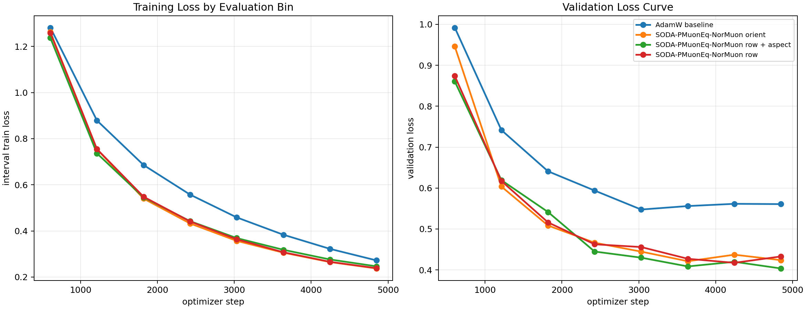
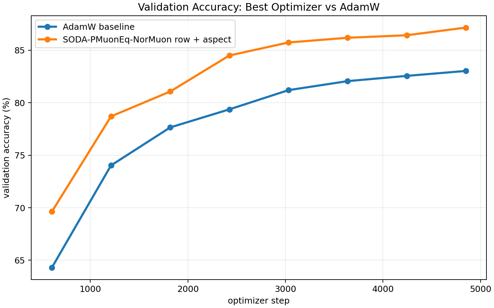
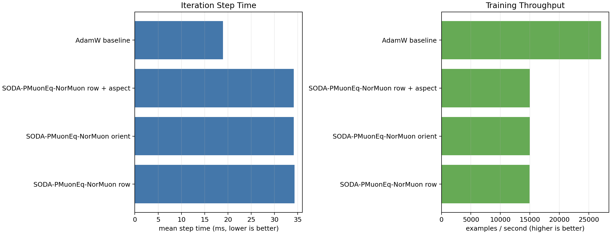

# CIFAR-10 NorMuon Aspect Ablation

Single-GPU trials were launched concurrently across four visible GPUs. All runs used ViT-5 tiny, CIFAR-10, batch size 512, 50 epochs, bf16 autocast, and the same data/evaluation schedule.

Best validation-loss recipe: **SODA-PMuonEq-NorMuon row + aspect**.

| rank | optimizer | best val loss | best val acc | examples/s | mean step ms |
|---:|---|---:|---:|---:|---:|
| 1 | SODA-PMuonEq-NorMuon row + aspect | 0.4036 | 87.16% | 14997 | 34.14 |
| 2 | SODA-PMuonEq-NorMuon row | 0.4174 | 86.43% | 14932 | 34.29 |
| 3 | SODA-PMuonEq-NorMuon orient | 0.4212 | 86.98% | 14990 | 34.16 |
| 4 | AdamW baseline | 0.5476 | 83.03% | 27075 | 18.91 |

## Interpretation

The tuned row-wise NorMuon plus aspect scaling produced the best validation loss and accuracy in this run. Removing the aspect multiplier or switching to orientation-aware row/column NorMuon remained stronger than AdamW, but both were slightly worse on best validation loss.

The optimizer variants cost about 1.8x wall-clock per step compared with AdamW in this small ViT-5 CIFAR-10 setting, so the quality gain is not free. These results are one seed and should be treated as confirmation of the recipe direction, not as a final statistical claim.
