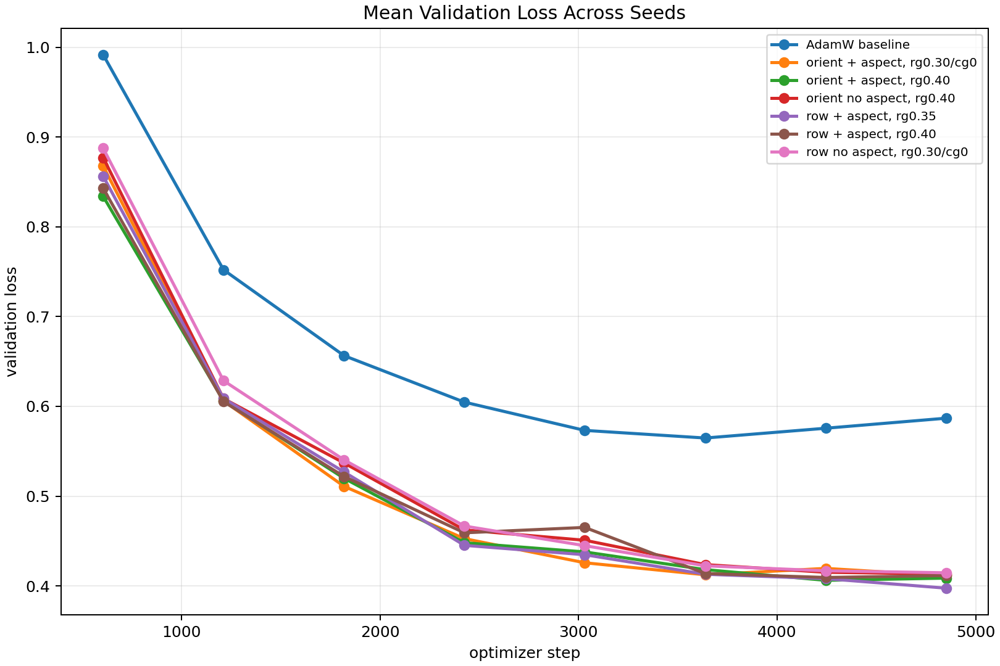
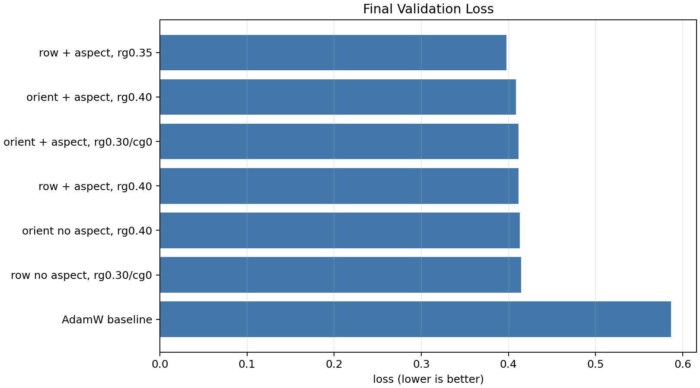
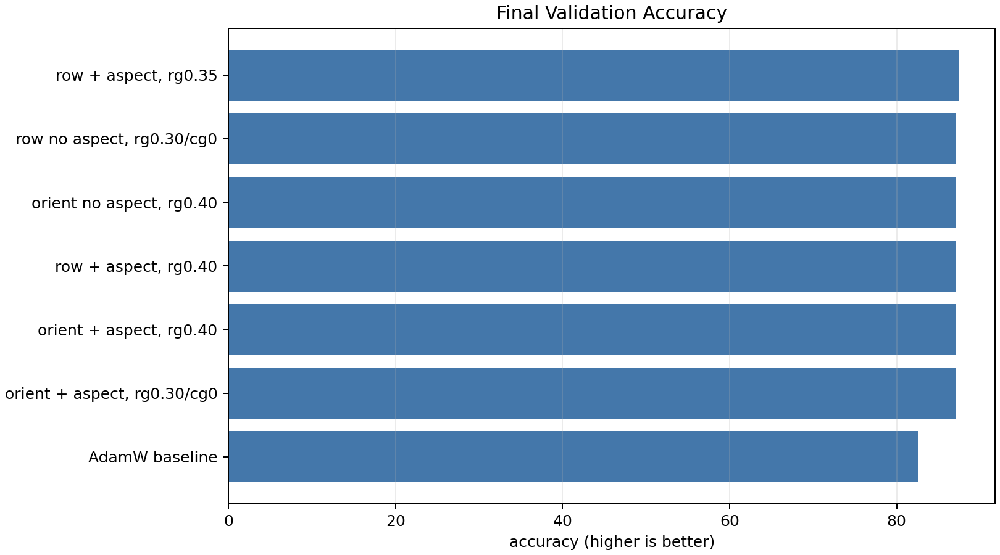
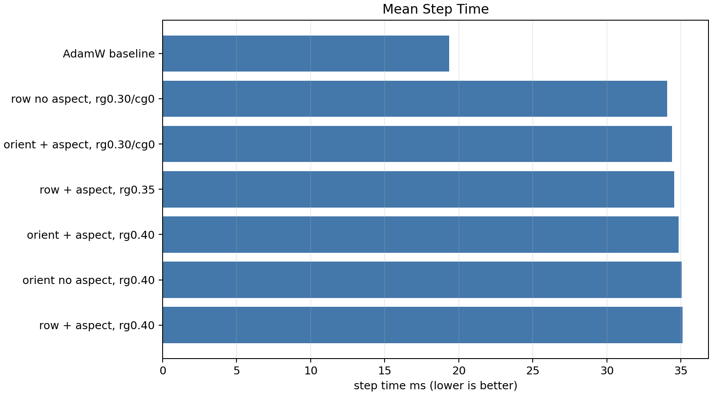

# CIFAR-10 Peer-Feedback Aggregate

ViT-5 tiny / CIFAR-10, 50 epochs, batch size 512, bf16 autocast, one single-GPU trial per visible GPU. The final comparison uses seeds 34000, 456, and 789.

Best mean final validation loss: **row + aspect, rg0.35** (0.3975 +/- 0.0150).
Best mean transient validation loss: **row + aspect, rg0.35** (0.3935 +/- 0.0119).

## Aggregate Table

| rank | optimizer | final val loss | best val loss | final val acc | best val acc | examples/s | step ms |
|---:|---|---:|---:|---:|---:|---:|---:|
| 1 | row + aspect, rg0.35 | 0.3975 +/- 0.0150 | 0.3935 +/- 0.0119 | 87.44% +/- 0.43% | 87.46% +/- 0.41% | 14816 | 34.56 |
| 2 | orient + aspect, rg0.40 | 0.4087 +/- 0.0155 | 0.3988 +/- 0.0033 | 87.04% +/- 0.55% | 87.22% +/- 0.27% | 14689 | 34.86 |
| 3 | orient + aspect, rg0.30/cg0 | 0.4115 +/- 0.0123 | 0.3996 +/- 0.0084 | 87.04% +/- 0.46% | 87.16% +/- 0.29% | 14885 | 34.40 |
| 4 | row + aspect, rg0.40 | 0.4115 +/- 0.0140 | 0.4073 +/- 0.0174 | 87.05% +/- 0.59% | 87.11% +/- 0.59% | 14580 | 35.12 |
| 5 | orient no aspect, rg0.40 | 0.4133 +/- 0.0194 | 0.3978 +/- 0.0099 | 87.05% +/- 0.41% | 87.32% +/- 0.07% | 14602 | 35.06 |
| 6 | row no aspect, rg0.30/cg0 | 0.4146 +/- 0.0166 | 0.4105 +/- 0.0095 | 87.05% +/- 0.66% | 87.12% +/- 0.55% | 15024 | 34.08 |
| 7 | AdamW baseline | 0.5868 +/- 0.0289 | 0.5614 +/- 0.0191 | 82.56% +/- 0.89% | 82.56% +/- 0.89% | 26441 | 19.37 |

## Per-Seed Winners

| seed | best final-loss optimizer | final val loss | best transient optimizer | best val loss |
|---:|---|---:|---|---:|
| 456 | row + aspect, rg0.35 | 0.3804 | row + aspect, rg0.35 | 0.3804 |
| 789 | orient + aspect, rg0.40 | 0.3961 | orient no aspect, rg0.40 | 0.3885 |
| 34000 | orient no aspect, rg0.40 | 0.3969 | orient + aspect, rg0.30/cg0 | 0.3901 |

## Interpretation

The peer-requested orientation plus aspect recipe was a strong early-training candidate, but the three-seed final-loss aggregate favors the row-wise aspect recipe. Orientation/no-aspect won one seed by final loss but also showed the largest late reversal on seed 789.

All SODA-PMuonEq-NorMuon variants beat the tuned AdamW baseline on loss and accuracy. AdamW remains much faster per step, so the optimizer is a quality-first recipe on this small ViT-5 workload rather than a raw-throughput winner.
