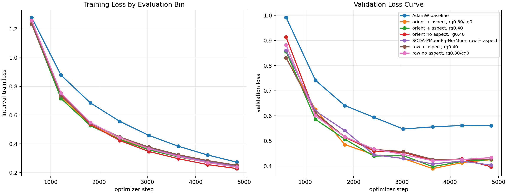
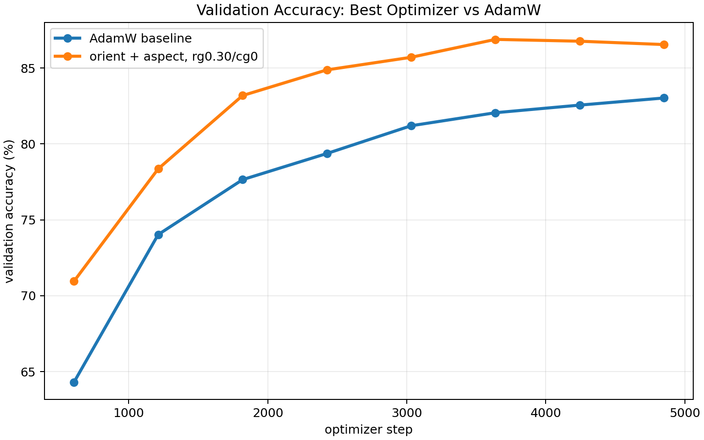
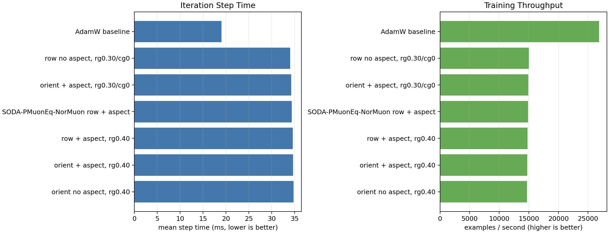

# CIFAR-10 NorMuon Aspect Ablation

Single-GPU trials were launched concurrently across four visible GPUs. All runs used ViT-5 tiny, CIFAR-10, batch size 512, 50 epochs, bf16 autocast, and the same data/evaluation schedule.

Best validation-loss recipe: **orient + aspect, rg0.30/cg0**.

| rank | optimizer | best val loss | final val loss | best val acc | final val acc | examples/s | mean step ms |
|---:|---|---:|---:|---:|---:|---:|---:|
| 1 | orient + aspect, rg0.30/cg0 | 0.3901 | 0.4256 | 86.89% | 86.55% | 14929 | 34.30 |
| 2 | orient no aspect, rg0.40 | 0.3969 | 0.3969 | 87.25% | 87.25% | 14720 | 34.78 |
| 3 | orient + aspect, rg0.40 | 0.3977 | 0.4260 | 86.95% | 86.43% | 14760 | 34.69 |
| 4 | SODA-PMuonEq-NorMuon row + aspect | 0.4036 | 0.4036 | 87.16% | 87.16% | 14880 | 34.41 |
| 5 | row no aspect, rg0.30/cg0 | 0.4214 | 0.4337 | 86.49% | 86.30% | 15030 | 34.06 |
| 6 | row + aspect, rg0.40 | 0.4264 | 0.4276 | 86.48% | 86.48% | 14789 | 34.62 |
| 7 | AdamW baseline | 0.5476 | 0.5608 | 83.03% | 83.03% | 26876 | 19.05 |

## Interpretation

The report ranks by best validation loss and also includes final validation metrics so late-epoch reversals are visible. The aspect multiplier is a real layerwise step-size change, so compare it with LR tuning in mind.

The optimizer variants cost about 1.8x wall-clock per step compared with AdamW in this small ViT-5 CIFAR-10 setting, so the quality gain is not free. These results are one seed and should be treated as confirmation of the recipe direction, not as a final statistical claim.
