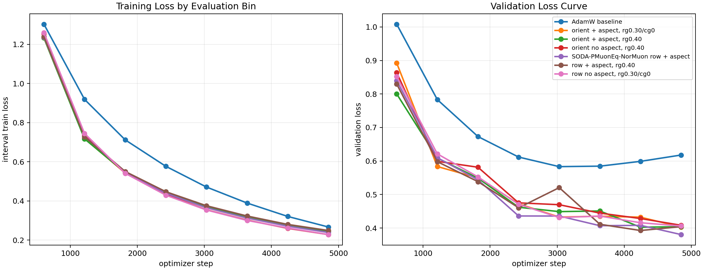
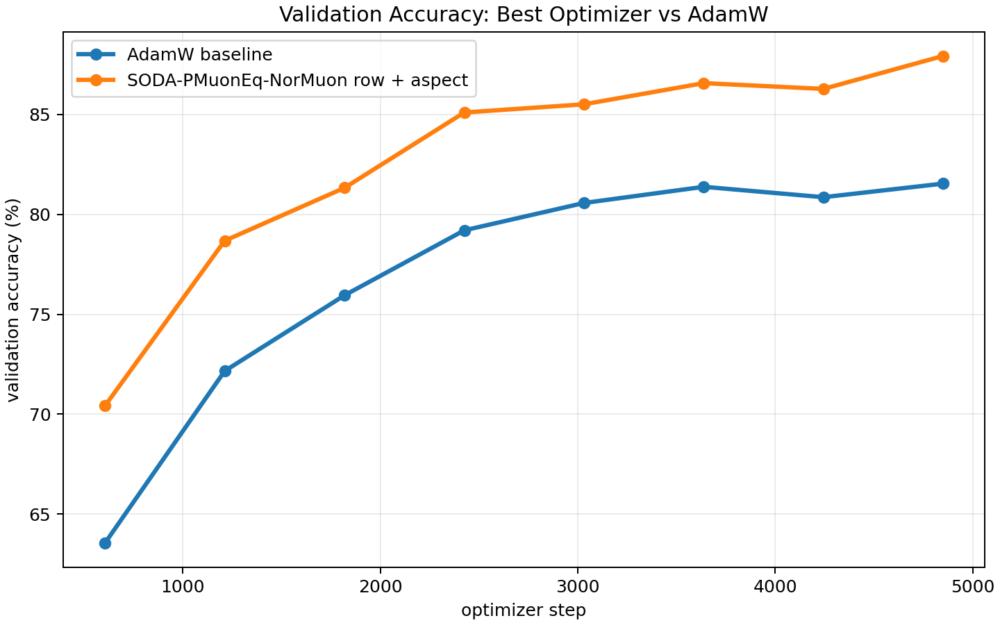
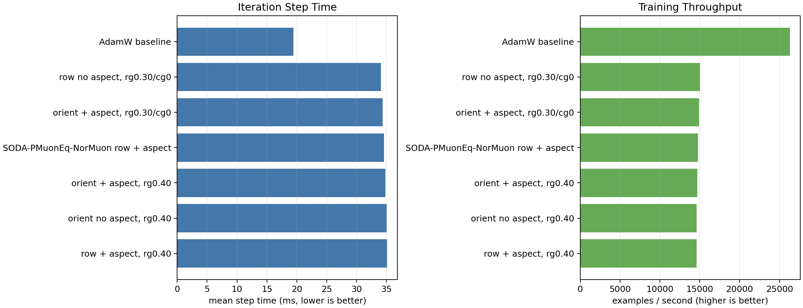

# CIFAR-10 NorMuon Aspect Ablation

Single-GPU trials were launched concurrently across four visible GPUs. All runs used ViT-5 tiny, CIFAR-10, batch size 512, 50 epochs, bf16 autocast, and the same data/evaluation schedule.

Best validation-loss recipe: **SODA-PMuonEq-NorMuon row + aspect**.

| rank | optimizer | best val loss | final val loss | best val acc | final val acc | examples/s | mean step ms |
|---:|---|---:|---:|---:|---:|---:|---:|
| 1 | SODA-PMuonEq-NorMuon row + aspect | 0.3804 | 0.3804 | 87.93% | 87.93% | 14797 | 34.60 |
| 2 | row + aspect, rg0.40 | 0.3925 | 0.4041 | 87.21% | 87.01% | 14588 | 35.10 |
| 3 | orient + aspect, rg0.40 | 0.4024 | 0.4039 | 87.22% | 87.22% | 14695 | 34.84 |
| 4 | orient + aspect, rg0.30/cg0 | 0.4029 | 0.4029 | 87.46% | 87.46% | 14894 | 34.38 |
| 5 | row no aspect, rg0.30/cg0 | 0.4060 | 0.4060 | 87.32% | 87.32% | 15023 | 34.08 |
| 6 | orient no aspect, rg0.40 | 0.4082 | 0.4082 | 87.32% | 87.32% | 14607 | 35.05 |
| 7 | AdamW baseline | 0.5832 | 0.6179 | 81.54% | 81.54% | 26307 | 19.46 |

## Interpretation

The report ranks by best validation loss and also includes final validation metrics so late-epoch reversals are visible. The aspect multiplier is a real layerwise step-size change, so compare it with LR tuning in mind.

The optimizer variants cost about 1.8x wall-clock per step compared with AdamW in this small ViT-5 CIFAR-10 setting, so the quality gain is not free. These results are one seed and should be treated as confirmation of the recipe direction, not as a final statistical claim.
