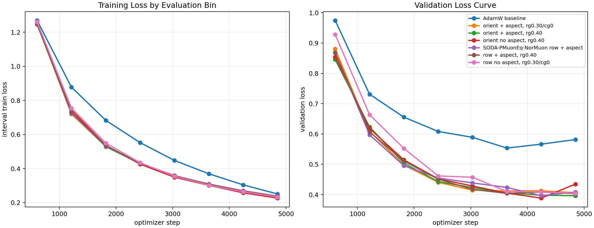
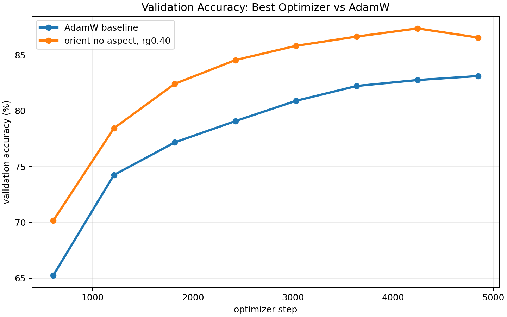
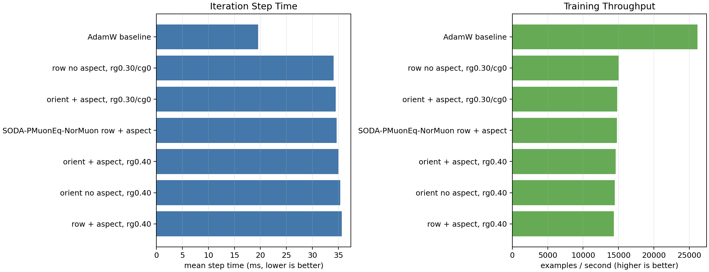

# CIFAR-10 NorMuon Aspect Ablation

Single-GPU trials were launched concurrently across four visible GPUs. All runs used ViT-5 tiny, CIFAR-10, batch size 512, 50 epochs, bf16 autocast, and the same data/evaluation schedule.

Best validation-loss recipe: **orient no aspect, rg0.40**.

| rank | optimizer | best val loss | final val loss | best val acc | final val acc | examples/s | mean step ms |
|---:|---|---:|---:|---:|---:|---:|---:|
| 1 | orient no aspect, rg0.40 | 0.3885 | 0.4348 | 87.39% | 86.57% | 14480 | 35.36 |
| 2 | orient + aspect, rg0.40 | 0.3961 | 0.3961 | 87.48% | 87.48% | 14612 | 35.04 |
| 3 | SODA-PMuonEq-NorMuon row + aspect | 0.3964 | 0.4086 | 87.28% | 87.22% | 14771 | 34.66 |
| 4 | row + aspect, rg0.40 | 0.4029 | 0.4029 | 87.65% | 87.65% | 14362 | 35.65 |
| 5 | row no aspect, rg0.30/cg0 | 0.4041 | 0.4041 | 87.54% | 87.54% | 15019 | 34.09 |
| 6 | orient + aspect, rg0.30/cg0 | 0.4059 | 0.4059 | 87.12% | 87.12% | 14832 | 34.52 |
| 7 | AdamW baseline | 0.5535 | 0.5817 | 83.12% | 83.12% | 26139 | 19.59 |

## Interpretation

The report ranks by best validation loss and also includes final validation metrics so late-epoch reversals are visible. The aspect multiplier is a real layerwise step-size change, so compare it with LR tuning in mind.

The optimizer variants cost about 1.8x wall-clock per step compared with AdamW in this small ViT-5 CIFAR-10 setting, so the quality gain is not free. These results are one seed and should be treated as confirmation of the recipe direction, not as a final statistical claim.
