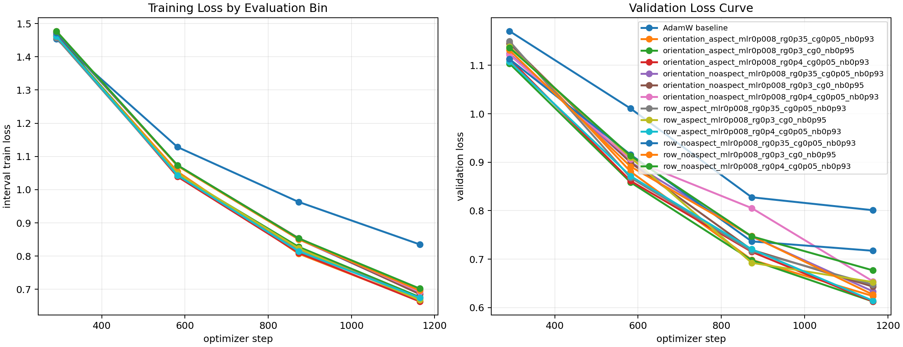
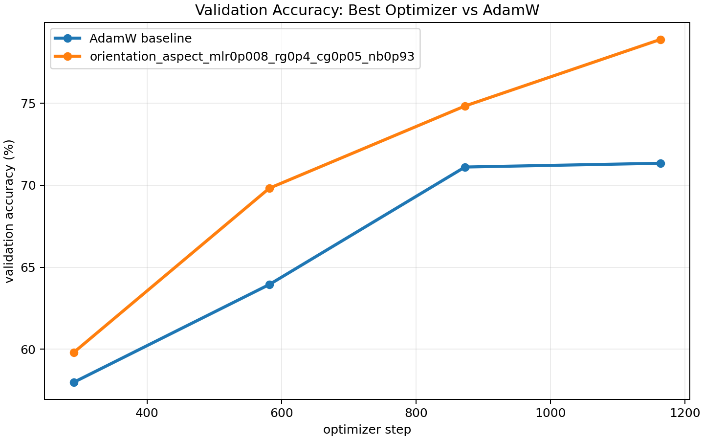
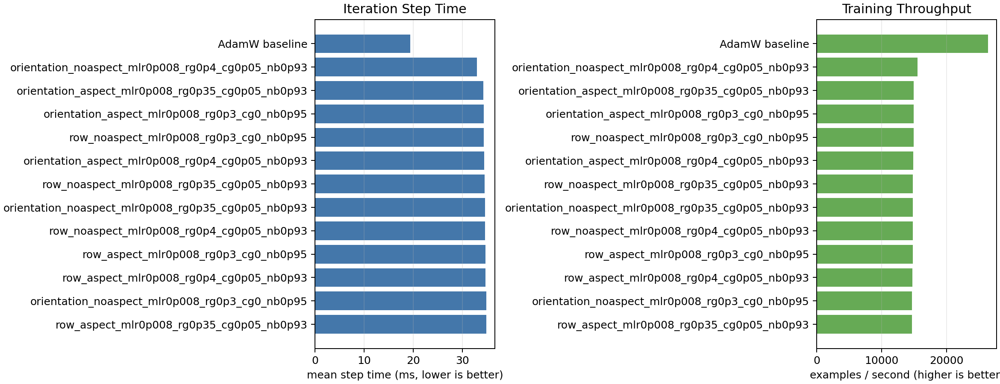

# CIFAR-10 NorMuon Aspect Ablation

Single-GPU trials were launched concurrently across four visible GPUs. All runs used ViT-5 tiny, CIFAR-10, batch size 512, 50 epochs, bf16 autocast, and the same data/evaluation schedule.

Best validation-loss recipe: **orientation_aspect_mlr0p008_rg0p4_cg0p05_nb0p93**.

| rank | optimizer | best val loss | final val loss | best val acc | final val acc | examples/s | mean step ms |
|---:|---|---:|---:|---:|---:|---:|---:|
| 1 | orientation_aspect_mlr0p008_rg0p4_cg0p05_nb0p93 | 0.6127 | 0.6127 | 78.89% | 78.89% | 14884 | 34.40 |
| 2 | orientation_aspect_mlr0p008_rg0p3_cg0_nb0p95 | 0.6128 | 0.6128 | 79.24% | 79.24% | 14924 | 34.31 |
| 3 | row_aspect_mlr0p008_rg0p4_cg0p05_nb0p93 | 0.6144 | 0.6144 | 78.52% | 78.52% | 14764 | 34.68 |
| 4 | orientation_aspect_mlr0p008_rg0p35_cg0p05_nb0p93 | 0.6239 | 0.6239 | 78.09% | 78.09% | 14948 | 34.25 |
| 5 | row_noaspect_mlr0p008_rg0p3_cg0_nb0p95 | 0.6269 | 0.6269 | 78.19% | 78.19% | 14920 | 34.32 |
| 6 | orientation_noaspect_mlr0p008_rg0p35_cg0p05_nb0p93 | 0.6337 | 0.6337 | 77.83% | 77.83% | 14828 | 34.53 |
| 7 | orientation_noaspect_mlr0p008_rg0p3_cg0_nb0p95 | 0.6433 | 0.6433 | 77.72% | 77.72% | 14711 | 34.80 |
| 8 | row_aspect_mlr0p008_rg0p35_cg0p05_nb0p93 | 0.6475 | 0.6475 | 77.70% | 77.70% | 14691 | 34.85 |
| 9 | row_aspect_mlr0p008_rg0p3_cg0_nb0p95 | 0.6528 | 0.6528 | 77.16% | 77.16% | 14787 | 34.62 |
| 10 | orientation_noaspect_mlr0p008_rg0p4_cg0p05_nb0p93 | 0.6544 | 0.6544 | 77.34% | 77.34% | 15536 | 32.96 |
| 11 | row_noaspect_mlr0p008_rg0p4_cg0p05_nb0p93 | 0.6770 | 0.6770 | 76.55% | 76.55% | 14813 | 34.56 |
| 12 | row_noaspect_mlr0p008_rg0p35_cg0p05_nb0p93 | 0.7173 | 0.7173 | 75.07% | 75.07% | 14844 | 34.49 |
| 13 | AdamW baseline | 0.8010 | 0.8010 | 71.34% | 71.34% | 26454 | 19.35 |

## Interpretation

The report ranks by best validation loss and also includes final validation metrics so late-epoch reversals are visible. The aspect multiplier is a real layerwise step-size change, so compare it with LR tuning in mind.

The optimizer variants cost about 1.8x wall-clock per step compared with AdamW in this small ViT-5 CIFAR-10 setting, so the quality gain is not free. These results are one seed and should be treated as confirmation of the recipe direction, not as a final statistical claim.
